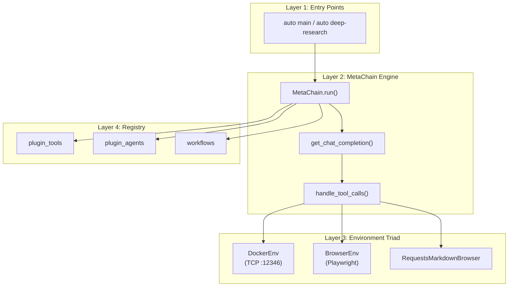
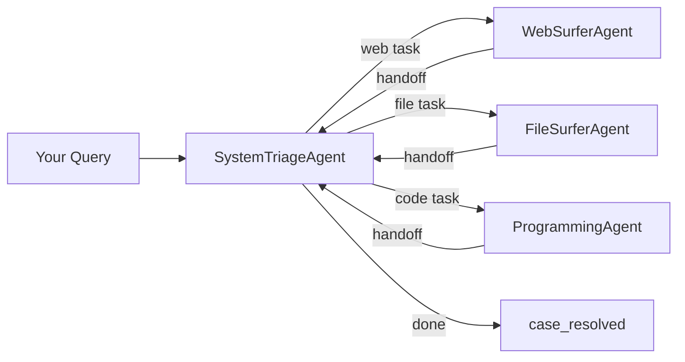

# Chapter 1: Getting Started

## What Problem Does This Solve?

Building multi-agent systems today requires deep framework knowledge: defining agent schemas, wiring tool registries, managing handoffs between agents, handling retries, isolating code execution, and instrumenting everything for debugging. A single research assistant agent can take days to build properly.

AutoAgent (HKUDS, arxiv:2502.05957) solves this by treating agent creation as a **natural language task**. You describe your agent in plain English, and the framework generates the Python code, tool definitions, tests them in Docker, and registers them — all without you writing a line of orchestration code.

The framework ships with three operating modes that cover the most common use cases:

1. **User Mode (Deep Research)** — a general-purpose research assistant that browses the web, reads documents, and writes code
2. **Agent Editor** — creates new custom agents from natural language descriptions
3. **Workflow Editor** — composes async parallel pipelines for batch or recurring tasks

### The MetaChain / AutoAgent Naming Situation

You will encounter this confusion immediately when reading the source code. The project was publicly renamed from **MetaChain** to **AutoAgent** in February 2025. The GitHub repository, README, and pip package are all called `autoagent`. However, the internal Python class, imports, and Docker image still use the original name:

```python
# This is correct — the class is still MetaChain internally
from autoagent import MetaChain

chain = MetaChain(model="gpt-4o")
```

This tutorial uses "AutoAgent" for the product and "MetaChain" for the specific Python class.

---

## Installation

### Prerequisites

| Requirement | Version | Notes |
|-------------|---------|-------|
| Python | 3.10+ | Required for `match` statement patterns |
| Docker | Latest | Required for code execution sandbox |
| Git | Any | For cloning the repo |
| GITHUB_AI_TOKEN | — | Required only for Agent Editor mode |

### Step 1: Clone and Install

```bash
git clone https://github.com/HKUDS/AutoAgent
cd AutoAgent
pip install -e .
```

The `-e` flag installs in editable mode, which is important for local development and for the self-modification workflows in Agent Editor mode (the framework clones its own repo into Docker for meta-programming).

### Step 2: Verify the CLI

```bash
auto --help
```

You should see:

```
Usage: auto [OPTIONS] COMMAND [ARGS]...

Options:
  --help  Show this message and exit.

Commands:
  deep-research  Run a deep research task directly
  main           Start the AutoAgent interactive session
```

The two primary entry points are `auto main` (interactive session with all three modes) and `auto deep-research` (non-interactive single-shot research).

---

## Environment Configuration

AutoAgent uses a `.env` file at the project root. Copy the example:

```bash
cp .env.example .env
```

### Required Variables

```bash
# .env

# Choose at least one LLM provider
OPENAI_API_KEY=sk-...
ANTHROPIC_API_KEY=sk-ant-...
DEEPSEEK_API_KEY=...
GEMINI_API_KEY=...

# Required for Agent Editor (clones AutoAgent repo into Docker)
GITHUB_AI_TOKEN=ghp_...

# Optional: default model override
AUTOAGENT_MODEL=gpt-4o

# Optional: workspace directory (defaults to ./workspace)
WORKSPACE_DIR=./workspace
```

### Model Selection

AutoAgent routes all LLM calls through **LiteLLM 1.55.0**, which supports 100+ providers. The model string follows LiteLLM conventions:

```bash
# OpenAI
AUTOAGENT_MODEL=gpt-4o

# Anthropic
AUTOAGENT_MODEL=claude-3-5-sonnet-20241022

# DeepSeek (uses XML fallback, not function calling)
AUTOAGENT_MODEL=deepseek/deepseek-r1

# Local Ollama
AUTOAGENT_MODEL=ollama/llama3.2
```

Models that do not support native function calling (DeepSeek-R1, LLaMA, Grok, etc.) fall back to an XML-based tool call syntax handled by `fn_call_converter.py`. Chapter 2 covers this in depth.

---

## Architecture Overview

Before running your first task, it helps to understand the four layers:



**Layer 1 (CLI):** `cli.py` uses Click to expose `auto main` and `auto deep-research`. Both read `constant.py` for defaults.

**Layer 2 (MetaChain Engine):** `core.py` contains the main `MetaChain` class. Its `run()` method loops: call the LLM, dispatch tool calls, check for agent handoff signals, repeat until `case_resolved`.

**Layer 3 (Environment Triad):** Three execution environments that tools can use. `DockerEnv` runs Python code in an isolated container via TCP. `BrowserEnv` drives Playwright for web automation. `RequestsMarkdownBrowser` handles file reading and format conversion.

**Layer 4 (Registry):** A singleton that tracks all registered tools, agents, and workflows. Plugin tools are auto-registered with a 12,000-token output cap.

---

## Three Operating Modes in Detail

### Mode 1: User Mode (Deep Research)

This is the default mode when you run `auto main`. It activates the `SystemTriageAgent`, which routes your requests to specialized sub-agents:



Each sub-agent signals completion by calling `case_resolved` or routes to another agent via `transfer_to_X()` functions injected at runtime.

**Example session:**

```
$ auto main

AutoAgent> Research the top 5 Python async frameworks and compare their performance benchmarks. Save results to a report.

[SystemTriageAgent routing to WebSurferAgent]
[WebSurferAgent browsing: asyncio benchmarks 2024...]
[WebSurferAgent browsing: trio vs asyncio performance...]
[SystemTriageAgent routing to FileSurferAgent]
[FileSurferAgent writing report to workspace/async_report.md]
Done. Report saved to workspace/async_report.md
```

### Mode 2: Agent Editor

Activated when your message includes intent to create or modify an agent. The framework detects this and routes to `AgentFormerAgent`, which starts a 4-phase pipeline: NL → XML form → tool generation → agent code → registration.

```
AutoAgent> Create a sales agent that recommends products based on user budget and category preferences
```

Chapter 5 covers this pipeline in full detail.

### Mode 3: Workflow Editor

Activated when your message requests a workflow (batch processing, parallel execution, scheduled runs). Routes to `WorkflowCreatorAgent`, which generates an `EventEngine`-based async pipeline.

```
AutoAgent> Create a workflow that solves 10 math problems in parallel and picks the majority answer
```

Chapter 6 covers the EventEngine architecture.

---

## Your First Research Task

With your `.env` configured, start an interactive session:

```bash
auto main
```

Try this prompt to verify all three environments are working:

```
Research what AutoAgent (HKUDS) is, find the GitHub star count, and write a one-paragraph summary to workspace/autoagent_summary.md
```

This task exercises:
- `WebSurferAgent` (Playwright browser to fetch GitHub)
- `FileSurferAgent` (writing the summary file)
- `SystemTriageAgent` (orchestration between the two)

Expected output flow:

```
[SystemTriageAgent] Analyzing request...
[SystemTriageAgent] Routing to WebSurferAgent for GitHub research
[WebSurferAgent] Navigating to github.com/HKUDS/AutoAgent
[WebSurferAgent] Extracted: 9,116 stars, Python, MIT license
[SystemTriageAgent] Routing to FileSurferAgent for writing
[FileSurferAgent] Writing to workspace/autoagent_summary.md
[SystemTriageAgent] Task complete
```

### Non-Interactive Mode

For scripting and CI use cases:

```bash
auto deep-research "What are the key architectural patterns in AutoAgent? Cite the arxiv paper."
```

This runs a single research task and exits, printing results to stdout.

---

## @mention Syntax for Direct Routing

You can bypass the triage agent and route directly to a specific agent using `@AgentName` syntax:

```
AutoAgent> @WebSurferAgent search for the latest LiteLLM release notes
AutoAgent> @ProgrammingAgent write a Python script to parse CSV files
AutoAgent> @FileSurferAgent summarize all PDFs in workspace/papers/
```

This is useful when you know which capability you need and want to skip triage overhead.

---

## Workspace Directory

All file operations default to `./workspace/`. This directory is:
- Mounted into the Docker container as a shared volume
- The default read/write location for `FileSurferAgent`
- Where generated agent code is stored after Agent Editor runs

```bash
ls workspace/
# agents/          # Generated agent Python files
# tools/           # Generated tool Python files
# workflows/       # Generated workflow files
# reports/         # Research output files
```

---

## Common Setup Issues

| Issue | Cause | Fix |
|-------|-------|-----|
| `auto: command not found` | Package not installed | Run `pip install -e .` from repo root |
| `Docker not available` | Docker not running | Start Docker Desktop or Docker daemon |
| `LiteLLM: No API key` | Missing `.env` entry | Add the key for your chosen provider |
| `Agent Editor fails` | Missing `GITHUB_AI_TOKEN` | Create a GitHub personal access token |
| `TCP connection refused :12346` | Docker container not started | DockerEnv auto-starts; check Docker is running |

---

## Summary

| Concept | Key Point |
|---------|-----------|
| MetaChain vs AutoAgent | Same thing — MetaChain is the internal class name; AutoAgent is the product name since Feb 2025 |
| `auto main` | Interactive session; activates all three modes based on your intent |
| `auto deep-research` | Non-interactive single-shot research task |
| `.env` | Required for all LLM providers; `GITHUB_AI_TOKEN` required only for Agent Editor |
| Three modes | User Mode (research), Agent Editor (create agents), Workflow Editor (async pipelines) |
| Docker | Required for code execution sandbox; auto-started by `DockerEnv` |
| @mention syntax | Routes directly to a named agent, bypassing triage |
| workspace/ | Shared file directory between host and Docker container |

Continue to [Chapter 2: Core Architecture: MetaChain Engine](./02-core-architecture-metachain-engine.md) to understand how the run loop, context variables, and tool dispatch work under the hood.
