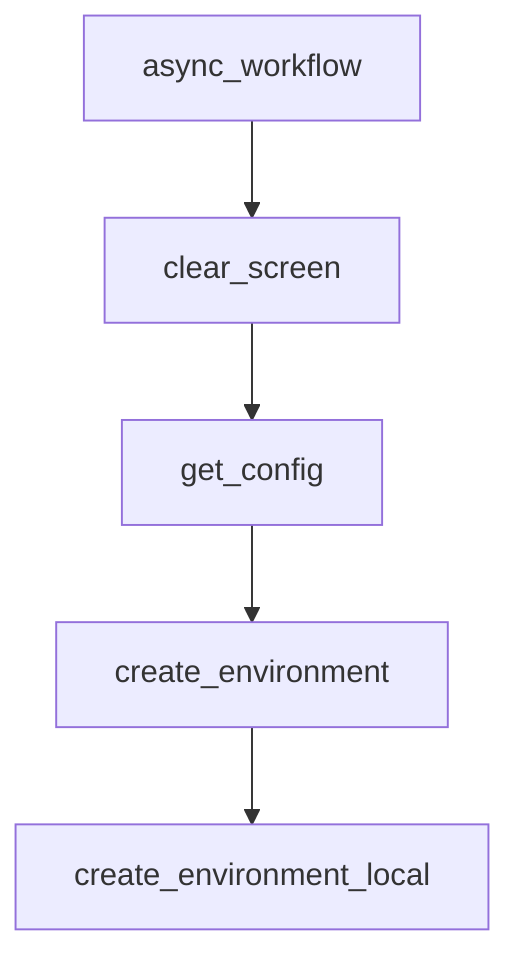

# Chapter 2: Architecture and Interaction Modes

Welcome to **Chapter 2: Architecture and Interaction Modes**. In this part of **AutoAgent Tutorial: Zero-Code Agent Creation and Automated Workflow Orchestration**, you will build an intuitive mental model first, then move into concrete implementation details and practical production tradeoffs.


This chapter explains AutoAgent mode structure and responsibilities.

## Learning Goals

- distinguish user mode vs agent editor vs workflow editor
- choose mode based on task and control requirements
- reason about orchestration boundaries
- reduce mode-selection confusion in teams

## Mode Overview

- user mode for deep research task execution
- agent editor for natural-language agent creation
- workflow editor for multi-agent flow construction

## Source References

- [AutoAgent README: How to Use](https://github.com/HKUDS/AutoAgent/blob/main/README.md)
- [How to Create Agent Docs](https://autoagent-ai.github.io/docs/user-guide-how-to-create-agent)

## Summary

You now can choose the right mode for different AutoAgent task classes.

Next: [Chapter 3: Installation, Environment, and API Setup](03-installation-environment-and-api-setup.md)

## Depth Expansion Playbook

## Source Code Walkthrough

### `autoagent/cli.py`

The `async_workflow` function in [`autoagent/cli.py`](https://github.com/HKUDS/AutoAgent/blob/HEAD/autoagent/cli.py) handles a key part of this chapter's functionality:

```py
def workflow(workflow_name: str, system_input: str):
    """命令行函数的同步包装器"""
    return asyncio.run(async_workflow(workflow_name, system_input))

async def async_workflow(workflow_name: str, system_input: str):
    """异步实现的workflow函数"""
    workflow_module = importlib.import_module(f'autoagent.workflows')
    try:
        workflow_func = getattr(workflow_module, workflow_name)
    except AttributeError:
        raise ValueError(f'Workflow function {workflow_name} not found...')
    
    result = await workflow_func(system_input)  # 使用 await 等待异步函数完成
    debug_print(True, result, title=f'Result of running {workflow_name} workflow', color='pink3')
    return result

def clear_screen():
    console = Console()
    console.print("[bold green]Coming soon...[/bold green]")
    print('\033[u\033[J\033[?25h', end='')  # Restore cursor and clear everything after it, show cursor
def get_config(container_name, port, test_pull_name="main", git_clone=False):
    container_name = container_name
    
    port_info = check_container_ports(container_name)
    if port_info:
        port = port_info[0]
    else:
        # while not check_port_available(port):
        #     port += 1
        # 使用文件锁来确保端口分配的原子性
        import filelock
        lock_file = os.path.join(os.getcwd(), ".port_lock")
```

This function is important because it defines how AutoAgent Tutorial: Zero-Code Agent Creation and Automated Workflow Orchestration implements the patterns covered in this chapter.

### `autoagent/cli.py`

The `clear_screen` function in [`autoagent/cli.py`](https://github.com/HKUDS/AutoAgent/blob/HEAD/autoagent/cli.py) handles a key part of this chapter's functionality:

```py
    return result

def clear_screen():
    console = Console()
    console.print("[bold green]Coming soon...[/bold green]")
    print('\033[u\033[J\033[?25h', end='')  # Restore cursor and clear everything after it, show cursor
def get_config(container_name, port, test_pull_name="main", git_clone=False):
    container_name = container_name
    
    port_info = check_container_ports(container_name)
    if port_info:
        port = port_info[0]
    else:
        # while not check_port_available(port):
        #     port += 1
        # 使用文件锁来确保端口分配的原子性
        import filelock
        lock_file = os.path.join(os.getcwd(), ".port_lock")
        lock = filelock.FileLock(lock_file)
        
        with lock:
            port = port
            while not check_port_available(port):
                port += 1
                print(f'{port} is not available, trying {port+1}')
            # 立即标记该端口为已使用
            with open(os.path.join(os.getcwd(), f".port_{port}"), 'w') as f:
                f.write(container_name)
    local_root = os.path.join(os.getcwd(), f"workspace_meta_showcase", f"showcase_{container_name}")
    os.makedirs(local_root, exist_ok=True)
    docker_config = DockerConfig(
        workplace_name=DOCKER_WORKPLACE_NAME,
```

This function is important because it defines how AutoAgent Tutorial: Zero-Code Agent Creation and Automated Workflow Orchestration implements the patterns covered in this chapter.

### `autoagent/cli.py`

The `get_config` function in [`autoagent/cli.py`](https://github.com/HKUDS/AutoAgent/blob/HEAD/autoagent/cli.py) handles a key part of this chapter's functionality:

```py
    console.print("[bold green]Coming soon...[/bold green]")
    print('\033[u\033[J\033[?25h', end='')  # Restore cursor and clear everything after it, show cursor
def get_config(container_name, port, test_pull_name="main", git_clone=False):
    container_name = container_name
    
    port_info = check_container_ports(container_name)
    if port_info:
        port = port_info[0]
    else:
        # while not check_port_available(port):
        #     port += 1
        # 使用文件锁来确保端口分配的原子性
        import filelock
        lock_file = os.path.join(os.getcwd(), ".port_lock")
        lock = filelock.FileLock(lock_file)
        
        with lock:
            port = port
            while not check_port_available(port):
                port += 1
                print(f'{port} is not available, trying {port+1}')
            # 立即标记该端口为已使用
            with open(os.path.join(os.getcwd(), f".port_{port}"), 'w') as f:
                f.write(container_name)
    local_root = os.path.join(os.getcwd(), f"workspace_meta_showcase", f"showcase_{container_name}")
    os.makedirs(local_root, exist_ok=True)
    docker_config = DockerConfig(
        workplace_name=DOCKER_WORKPLACE_NAME,
        container_name=container_name,
        communication_port=port,
        conda_path='/root/miniconda3',
        local_root=local_root,
```

This function is important because it defines how AutoAgent Tutorial: Zero-Code Agent Creation and Automated Workflow Orchestration implements the patterns covered in this chapter.

### `autoagent/cli.py`

The `create_environment` function in [`autoagent/cli.py`](https://github.com/HKUDS/AutoAgent/blob/HEAD/autoagent/cli.py) handles a key part of this chapter's functionality:

```py
    )
    return docker_config
def create_environment(docker_config: DockerConfig):
    """
    1. create the code environment
    2. create the web environment
    3. create the file environment
    """
    code_env = DockerEnv(docker_config)
    code_env.init_container()
    
    web_env = BrowserEnv(browsergym_eval_env = None, local_root=docker_config.local_root, workplace_name=docker_config.workplace_name)
    file_env = RequestsMarkdownBrowser(viewport_size=1024 * 5, local_root=docker_config.local_root, workplace_name=docker_config.workplace_name, downloads_folder=os.path.join(docker_config.local_root, docker_config.workplace_name, "downloads"))
    
    return code_env, web_env, file_env

def create_environment_local(docker_config: DockerConfig):
    """
    1. create the code environment
    2. create the web environment
    3. create the file environment
    """
    code_env = LocalEnv(docker_config)

    web_env = BrowserEnv(browsergym_eval_env = None, local_root=docker_config.local_root, workplace_name=docker_config.workplace_name)
    file_env = RequestsMarkdownBrowser(viewport_size=1024 * 5, local_root=docker_config.local_root, workplace_name=docker_config.workplace_name, downloads_folder=os.path.join(docker_config.local_root, docker_config.workplace_name, "downloads"))
    
    return code_env, web_env, file_env

def update_guidance(context_variables): 
    console = Console()

```

This function is important because it defines how AutoAgent Tutorial: Zero-Code Agent Creation and Automated Workflow Orchestration implements the patterns covered in this chapter.


## How These Components Connect


