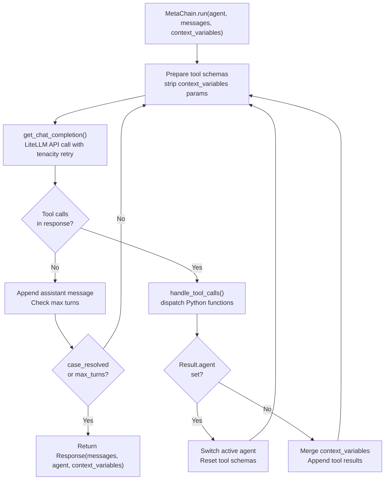
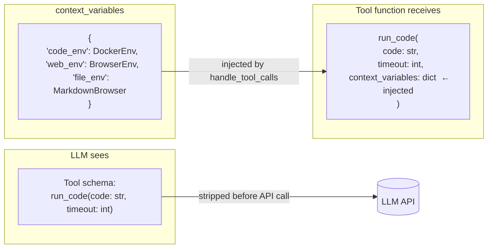
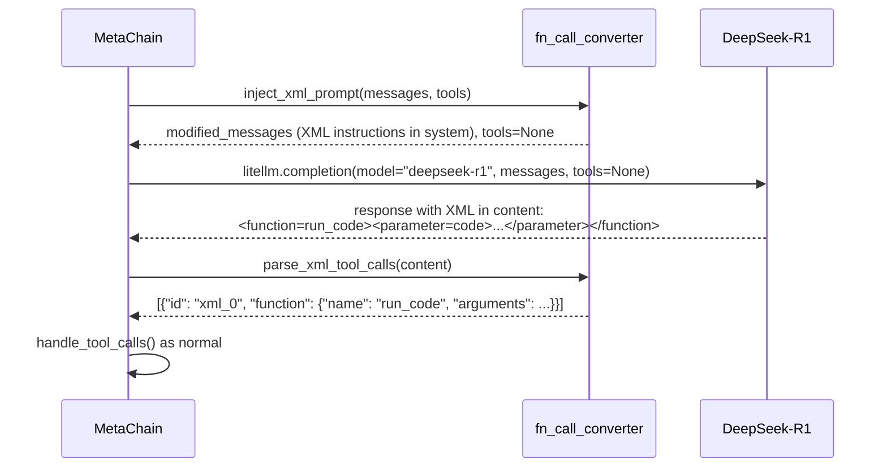

# Chapter 2: Core Architecture: MetaChain Engine

## What Problem Does This Solve?

Multi-agent frameworks face three core engineering problems:

1. **Context pollution** — passing execution environments (Docker connections, browser handles, file paths) to the LLM wastes tokens and confuses tool selection
2. **Model portability** — many capable models (DeepSeek-R1, LLaMA, Grok) don't support native function calling, requiring a fallback path
3. **Retry safety** — LLM APIs are flaky; naively calling them in a loop causes cascading failures

AutoAgent solves all three in `core.py` through the `MetaChain` class: the `context_variables` pattern strips environment handles from schemas, `fn_call_converter.py` provides XML-based tool call syntax for non-FC models, and `tenacity` handles retries with exponential backoff.

---

## Core Data Types (`types.py`)

Everything in AutoAgent is typed with Pydantic v2. The three core types are:

```python
# autoagent/types.py

from pydantic import BaseModel
from typing import Optional, Callable

class Agent(BaseModel):
    """Defines a single agent in the system."""
    name: str = "Agent"
    model: str = "gpt-4o"
    instructions: str | Callable[..., str] = "You are a helpful agent."
    functions: list[Callable] = []          # Tools this agent can call
    tool_choice: str | None = None          # Force a specific tool
    parallel_tool_calls: bool = True        # Allow parallel tool dispatch
    context_variables_description: str = ""

class Response(BaseModel):
    """Returned by MetaChain.run() when a task completes."""
    messages: list[dict] = []              # Full conversation history
    agent: Agent | None = None             # Final active agent
    context_variables: dict = {}           # Final context state

class Result(BaseModel):
    """Returned by tool functions to signal handoff or update context."""
    value: str = ""                        # Message to add to conversation
    agent: Agent | None = None             # If set: hand off to this agent
    context_variables: dict = {}           # Context updates to merge
```

The `Result` type is the key handoff mechanism. When a tool function returns `Result(agent=next_agent)`, the MetaChain engine switches the active agent and continues the loop. This is how `SystemTriageAgent` routes to `WebSurferAgent`:

```python
# In system_triage_agent.py
def transfer_to_websurfer(context_variables: dict) -> Result:
    """Transfer control to WebSurferAgent for web browsing tasks."""
    return Result(
        value="Transferring to WebSurferAgent",
        agent=websurfer_agent  # MetaChain will use this agent next turn
    )
```

---

## The MetaChain Run Loop (`core.py`)



The actual loop in `core.py`:

```python
# autoagent/core.py (simplified)

class MetaChain:
    def run(
        self,
        agent: Agent,
        messages: list[dict],
        context_variables: dict = {},
        max_turns: int = 30,
        execute_tools: bool = True,
    ) -> Response:
        active_agent = agent
        history = copy.deepcopy(messages)
        init_len = len(messages)

        while len(history) - init_len < max_turns:
            # Build tool schemas, stripping context_variables
            tools = [
                function_to_json(f)
                for f in active_agent.functions
            ]

            # Call LLM with retry
            response = self.get_chat_completion(
                agent=active_agent,
                history=history,
                context_variables=context_variables,
                tools=tools,
            )

            message = response.choices[0].message
            history.append(json.loads(message.model_dump_json()))

            if not message.tool_calls or not execute_tools:
                # No tools called — check if we're done
                if "case_resolved" in message.content or "":
                    break
                continue

            # Dispatch tool calls
            tool_results = self.handle_tool_calls(
                message.tool_calls,
                active_agent.functions,
                context_variables,
            )

            history.extend(tool_results.messages)
            context_variables.update(tool_results.context_variables)

            # Check for agent handoff
            if tool_results.agent:
                active_agent = tool_results.agent

        return Response(
            messages=history[init_len:],
            agent=active_agent,
            context_variables=context_variables,
        )
```

---

## The context_variables Pattern

This is the most important architectural pattern in AutoAgent. The `context_variables` dict carries runtime state (Docker connection, browser handle, file paths) to ALL tool functions — without ever appearing in the tool schemas sent to the LLM.



The stripping happens in `function_to_json()` in `util.py`:

```python
# autoagent/util.py

def function_to_json(func: Callable) -> dict:
    """Convert a Python function to a JSON tool schema for the LLM.
    
    Critically: context_variables parameters are excluded from the schema
    so they never appear in the LLM's tool descriptions.
    """
    sig = inspect.signature(func)
    parameters = {}
    required = []

    for name, param in sig.parameters.items():
        if name == "context_variables":
            continue  # ← THE CRITICAL LINE: strip from schema

        param_type = get_type_hint(func, name)
        parameters[name] = {"type": param_type}

        if param.default is inspect.Parameter.empty:
            required.append(name)

    return {
        "type": "function",
        "function": {
            "name": func.__name__,
            "description": func.__doc__ or "",
            "parameters": {
                "type": "object",
                "properties": parameters,
                "required": required,
            },
        },
    }
```

And injection happens in `handle_tool_calls()`:

```python
# autoagent/core.py (simplified)

def handle_tool_calls(
    self,
    tool_calls: list,
    functions: list[Callable],
    context_variables: dict,
) -> Response:
    func_map = {f.__name__: f for f in functions}
    results = []

    for tool_call in tool_calls:
        name = tool_call.function.name
        args = json.loads(tool_call.function.arguments)
        func = func_map[name]

        # Inject context_variables if the function accepts it
        if "context_variables" in inspect.signature(func).parameters:
            args["context_variables"] = context_variables  # ← injection

        raw_result = func(**args)

        # Handle Result objects for agent handoffs
        if isinstance(raw_result, Result):
            result_value = raw_result.value
            if raw_result.agent:
                # Signal agent handoff
                ...
            if raw_result.context_variables:
                context_variables.update(raw_result.context_variables)
        else:
            result_value = str(raw_result)

        results.append({
            "role": "tool",
            "tool_call_id": tool_call.id,
            "content": result_value,
        })

    return Response(messages=results, context_variables=context_variables)
```

This pattern means that **tool functions can access DockerEnv, BrowserEnv, and other stateful objects without the LLM needing to know they exist**. The LLM sees clean, minimal tool schemas; tools get the full execution context.

---

## LiteLLM Integration and Retries

`get_chat_completion()` wraps LiteLLM with tenacity retry logic:

```python
# autoagent/core.py

from tenacity import retry, stop_after_attempt, wait_exponential
import litellm

@retry(
    stop=stop_after_attempt(3),
    wait=wait_exponential(multiplier=1, min=4, max=10),
    reraise=True,
)
def get_chat_completion(
    self,
    agent: Agent,
    history: list[dict],
    context_variables: dict,
    tools: list[dict],
) -> litellm.ModelResponse:
    instructions = (
        agent.instructions(context_variables)
        if callable(agent.instructions)
        else agent.instructions
    )

    messages = [{"role": "system", "content": instructions}] + history

    # Check if model needs XML fallback
    model = agent.model
    if self._needs_xml_fallback(model):
        messages, tools = fn_call_converter.inject_xml_prompt(
            messages, tools
        )
        tools = None  # Don't pass native tools to non-FC models

    return litellm.completion(
        model=model,
        messages=messages,
        tools=tools,
        tool_choice=agent.tool_choice,
        parallel_tool_calls=agent.parallel_tool_calls,
    )
```

---

## Non-FC Model Support (`fn_call_converter.py`)

Models like DeepSeek-R1, LLaMA, and Grok don't support the OpenAI function calling API. AutoAgent handles these through `fn_call_converter.py`, which:

1. Injects XML tool call instructions into the system prompt
2. Parses XML from the model's text response
3. Converts the parsed result back to the standard tool call format

```python
# autoagent/fn_call_converter.py (simplified)

NOT_SUPPORT_FN_CALL = [
    "deepseek/deepseek-r1",
    "deepseek-r1",
    "meta-llama/llama-3",
    "grok",
    # ... etc
]

XML_TOOL_PROMPT = """
You have access to the following tools. To call a tool, use this exact XML format:

<function={tool_name}>
<parameter={param_name}>{value}</parameter>
</function>

Available tools:
{tools_description}
"""

def inject_xml_prompt(
    messages: list[dict],
    tools: list[dict]
) -> tuple[list[dict], None]:
    """Inject XML tool call instructions and return modified messages."""
    tools_desc = format_tools_as_xml_description(tools)
    xml_system = XML_TOOL_PROMPT.format(tools_description=tools_desc)

    # Prepend to system message
    if messages[0]["role"] == "system":
        messages[0]["content"] = xml_system + "\n\n" + messages[0]["content"]
    else:
        messages.insert(0, {"role": "system", "content": xml_system})

    return messages, None  # tools=None: don't send to non-FC API

def parse_xml_tool_calls(content: str) -> list[dict]:
    """Parse XML tool calls from model response text."""
    import re
    tool_calls = []

    pattern = r'<function=(\w+)>(.*?)</function>'
    for match in re.finditer(pattern, content, re.DOTALL):
        tool_name = match.group(1)
        params_text = match.group(2)

        # Parse parameters
        params = {}
        param_pattern = r'<parameter=(\w+)>(.*?)</parameter>'
        for param_match in re.finditer(param_pattern, params_text, re.DOTALL):
            params[param_match.group(1)] = param_match.group(2).strip()

        tool_calls.append({
            "id": f"xml_{len(tool_calls)}",
            "type": "function",
            "function": {
                "name": tool_name,
                "arguments": json.dumps(params),
            }
        })

    return tool_calls
```

The flow for a DeepSeek-R1 request:



This makes AutoAgent model-agnostic: you get identical behavior whether you use GPT-4o with native function calling or DeepSeek-R1 with XML fallback.

---

## LoggerManager

AutoAgent uses a custom `LoggerManager` in `util.py` for structured logging of the run loop. Key log events:

```python
# autoagent/util.py

class LoggerManager:
    def log_tool_call(self, tool_name: str, args: dict) -> None:
        """Log when a tool is dispatched."""
        
    def log_agent_handoff(self, from_agent: str, to_agent: str) -> None:
        """Log when control transfers between agents."""
        
    def log_llm_call(self, model: str, tokens: int) -> None:
        """Log LLM API call with token count."""
        
    def log_retry(self, attempt: int, error: str) -> None:
        """Log retry attempt with error message."""
```

The logger outputs to the console using Rich for colored, structured output. To increase verbosity:

```bash
AUTOAGENT_LOG_LEVEL=DEBUG auto main
```

---

## Turn Limit and Termination Conditions

The run loop terminates under three conditions:

| Condition | Trigger | Source |
|-----------|---------|--------|
| `case_resolved` | Agent calls the `case_resolved` tool or includes the string in its message | All system agents |
| `case_not_resolved` | Agent calls `case_not_resolved` after exhausting options | All system agents |
| `max_turns` exceeded | Loop counter reaches `max_turns` (default 30) | `MetaChain.run()` parameter |

The `case_resolved` and `case_not_resolved` tools are injected into every system agent's function list at startup. They return `Result` objects that signal the loop to terminate.

---

## Summary

| Component | File | Purpose |
|-----------|------|---------|
| `MetaChain` class | `core.py` | Main run loop: LLM call → tool dispatch → handoff |
| `Agent` | `types.py` | Agent definition: name, model, instructions, functions |
| `Response` | `types.py` | Run loop output: messages, final agent, context state |
| `Result` | `types.py` | Tool return value: handoff signal + context updates |
| `function_to_json()` | `util.py` | Converts Python functions to LLM tool schemas (strips context_variables) |
| `handle_tool_calls()` | `core.py` | Dispatches tools, injects context_variables, processes Result |
| `get_chat_completion()` | `core.py` | LiteLLM call with tenacity retry |
| `fn_call_converter.py` | `fn_call_converter.py` | XML fallback for non-FC models |
| `NOT_SUPPORT_FN_CALL` | `fn_call_converter.py` | List of models requiring XML fallback |
| `LoggerManager` | `util.py` | Structured logging for debugging |

Continue to [Chapter 3: The Environment Triad](./03-environment-triad.md) to learn how DockerEnv, BrowserEnv, and RequestsMarkdownBrowser are initialized and used.
