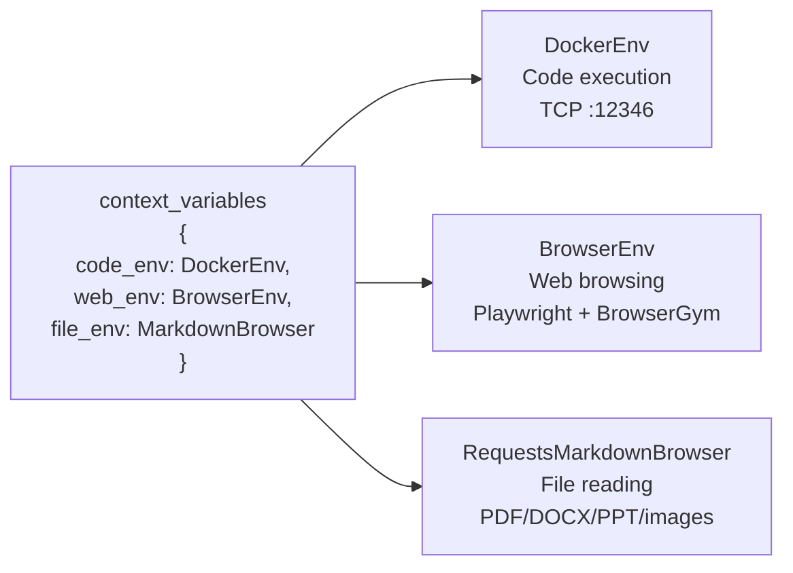
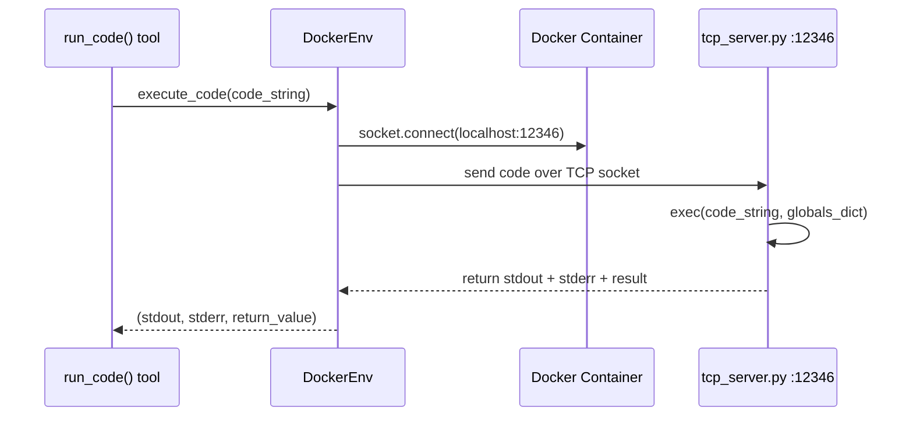
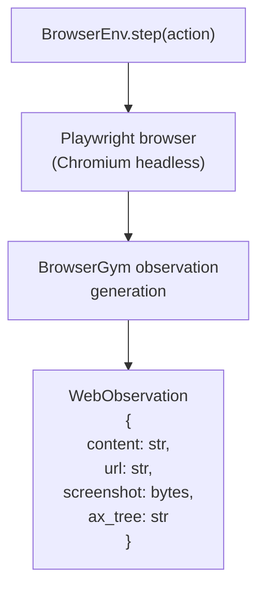
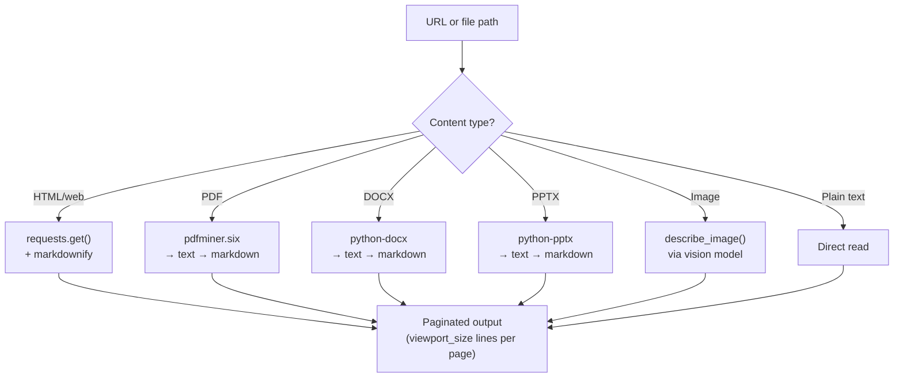

# Chapter 3: The Environment Triad

## What Problem Does This Solve?

Agents that can only call APIs are limited. Real-world tasks require:

- **Executing arbitrary Python code** securely, without risking the host system
- **Browsing the web** with a real browser that renders JavaScript and captures screenshots
- **Reading documents** in any format (PDF, DOCX, PPTX, images) as clean text

AutoAgent provides three purpose-built environments for these three capabilities. They are initialized once at startup, passed through `context_variables` to every tool that needs them, and managed as stateful singletons for the lifetime of the session.



---

## Environment 1: DockerEnv

### Architecture

`DockerEnv` manages a Docker container that runs a persistent TCP server. LLM-generated code is sent to this server as a string, executed inside the container, and the result is returned over the socket. This provides:

- **Isolation**: malicious or buggy code cannot affect the host
- **Persistence**: the container stays running between tool calls, so state (variables, installed packages) accumulates within a session
- **Reproducibility**: the Docker image (`tjbtech1/metachain`) pins all dependencies



### DockerConfig

```python
# autoagent/docker_env.py

from pydantic import BaseModel
import docker
import socket

class DockerConfig(BaseModel):
    image: str = "tjbtech1/metachain"
    container_name: str = "autoagent_sandbox"
    tcp_port: int = 12346
    workspace_mount: str = "./workspace"
    platform: str = "linux/amd64"  # See ARM note below
    timeout: int = 30  # seconds per code execution

class DockerEnv:
    def __init__(self, config: DockerConfig | None = None):
        self.config = config or DockerConfig()
        self.client = docker.from_env()
        self.container = None
        self._socket = None

    def init_container(self) -> None:
        """Pull image if needed, start container, copy tcp_server.py, open socket."""
        # Pull image
        self.client.images.pull(self.config.image)

        # Start container with workspace mount
        self.container = self.client.containers.run(
            self.config.image,
            name=self.config.container_name,
            detach=True,
            platform=self.config.platform,
            ports={f"{self.config.tcp_port}/tcp": self.config.tcp_port},
            volumes={
                self.config.workspace_mount: {
                    "bind": "/workspace",
                    "mode": "rw"
                }
            },
            remove=True,  # Auto-remove when stopped
        )

        # Copy tcp_server.py into container
        self._copy_tcp_server()

        # Start the TCP server inside the container
        self.container.exec_run(
            f"python /tcp_server.py {self.config.tcp_port}",
            detach=True,
        )

        # Connect socket
        self._socket = socket.socket(socket.AF_INET, socket.SOCK_STREAM)
        self._socket.connect(("localhost", self.config.tcp_port))

    def execute_code(self, code: str) -> tuple[str, str, str]:
        """Execute Python code in the container, return (stdout, stderr, result)."""
        payload = json.dumps({"code": code}).encode() + b"\n"
        self._socket.sendall(payload)
        response = self._recv_response()
        return response["stdout"], response["stderr"], response["result"]
```

### TCP Server (`tcp_server.py`)

The TCP server runs inside the Docker container and executes code in a persistent namespace:

```python
# autoagent/tcp_server.py (runs inside Docker)

import socket
import json
import sys
from io import StringIO

# Persistent globals across all code executions in this session
GLOBALS = {}

def handle_client(conn):
    """Handle a single code execution request."""
    data = b""
    while True:
        chunk = conn.recv(4096)
        if not chunk:
            break
        data += chunk
        if data.endswith(b"\n"):
            break

    request = json.loads(data.decode())
    code = request["code"]

    # Capture stdout/stderr
    old_stdout, old_stderr = sys.stdout, sys.stderr
    sys.stdout = stdout_buf = StringIO()
    sys.stderr = stderr_buf = StringIO()

    result = None
    try:
        # exec with persistent globals — state accumulates across calls
        exec(code, GLOBALS)
        result = str(GLOBALS.get("_result", ""))
    except Exception as e:
        result = f"Error: {type(e).__name__}: {e}"
    finally:
        sys.stdout = old_stdout
        sys.stderr = old_stderr

    response = {
        "stdout": stdout_buf.getvalue(),
        "stderr": stderr_buf.getvalue(),
        "result": result,
    }
    conn.sendall(json.dumps(response).encode() + b"\n")
```

### ARM vs AMD64 Note

The `tjbtech1/metachain` image is built for `linux/amd64`. On Apple Silicon (M1/M2/M3) Macs, Docker uses Rosetta 2 emulation automatically, but you may see a warning:

```
WARNING: The requested image's platform (linux/amd64) does not match the detected host platform (linux/arm64/v8)
```

This is expected and does not affect functionality. If you need native ARM performance, you can build the image locally:

```bash
docker build --platform linux/arm64 -t autoagent-local .
# Then update DockerConfig:
config = DockerConfig(image="autoagent-local", platform="linux/arm64")
```

---

## Environment 2: BrowserEnv

### Architecture

`BrowserEnv` wraps Playwright through BrowserGym to provide a full browser automation environment with multimodal observation (screenshot + accessibility tree + page content):



### WebObservation Structure

```python
# autoagent/browser_env.py

from dataclasses import dataclass

@dataclass
class WebObservation:
    """Complete observation from a browser step."""
    content: str        # Markdown-converted page content
    url: str            # Current page URL
    screenshot: bytes   # PNG screenshot for multimodal models
    ax_tree: str        # Accessibility tree (for non-visual navigation)
    error: str = ""     # Error message if action failed

class BrowserEnv:
    def __init__(self):
        self.browser = None
        self.page = None

    def init(self) -> None:
        """Start Playwright and open initial blank page."""
        from playwright.sync_api import sync_playwright
        self._playwright = sync_playwright().start()
        self.browser = self._playwright.chromium.launch(headless=True)
        self.page = self.browser.new_page()

    def navigate(self, url: str) -> WebObservation:
        """Navigate to URL and return full observation."""
        try:
            self.page.goto(url, wait_until="networkidle", timeout=30000)
            return self._get_observation()
        except Exception as e:
            return WebObservation(content="", url=url, screenshot=b"", ax_tree="", error=str(e))

    def click(self, selector: str) -> WebObservation:
        """Click an element and return updated observation."""
        self.page.click(selector)
        self.page.wait_for_load_state("networkidle")
        return self._get_observation()

    def _get_observation(self) -> WebObservation:
        """Capture current page state."""
        screenshot = self.page.screenshot()
        content = self._extract_markdown_content()
        ax_tree = self.page.accessibility.snapshot()
        return WebObservation(
            content=content,
            url=self.page.url,
            screenshot=screenshot,
            ax_tree=str(ax_tree),
        )
```

### Screenshot Loop for Multimodal Models

`WebSurferAgent` uses GPT-4V-style multimodal input to navigate by looking at screenshots:

```python
# In websurfer_agent.py tool function

def browse_web(url: str, context_variables: dict) -> str:
    """Navigate to URL and return page content with screenshot."""
    web_env: BrowserEnv = context_variables["web_env"]
    obs = web_env.navigate(url)

    # For multimodal models, include the screenshot in the message
    return json.dumps({
        "content": obs.content[:4000],  # Truncate for token budget
        "url": obs.url,
        "screenshot_available": len(obs.screenshot) > 0,
        # Screenshot is added separately to message parts for vision models
    })
```

---

## Environment 3: RequestsMarkdownBrowser

### Architecture

`RequestsMarkdownBrowser` reads any file or URL and converts it to paginated Markdown text. It handles format conversion for common document types:



```python
# autoagent/markdown_browser/ (simplified)

class RequestsMarkdownBrowser:
    def __init__(
        self,
        viewport_size: int = 1024,  # Lines per page
        downloads_folder: str = "./workspace/downloads",
    ):
        self.viewport_size = viewport_size
        self.downloads_folder = downloads_folder
        self._pages: list[str] = []
        self._current_page = 0

    def visit_page(self, url_or_path: str) -> str:
        """Load a page and return the first viewport."""
        content = self._fetch_and_convert(url_or_path)
        # Split into viewport-sized pages
        lines = content.split("\n")
        self._pages = [
            "\n".join(lines[i:i + self.viewport_size])
            for i in range(0, len(lines), self.viewport_size)
        ]
        self._current_page = 0
        return self._get_current_page()

    def page_up(self) -> str:
        """Scroll up one viewport."""
        self._current_page = max(0, self._current_page - 1)
        return self._get_current_page()

    def page_down(self) -> str:
        """Scroll down one viewport."""
        self._current_page = min(len(self._pages) - 1, self._current_page + 1)
        return self._get_current_page()

    def _fetch_and_convert(self, url_or_path: str) -> str:
        """Fetch content and convert to Markdown based on file type."""
        if url_or_path.startswith("http"):
            return self._fetch_url(url_or_path)
        
        suffix = Path(url_or_path).suffix.lower()
        if suffix == ".pdf":
            return self._convert_pdf(url_or_path)
        elif suffix == ".docx":
            return self._convert_docx(url_or_path)
        elif suffix == ".pptx":
            return self._convert_pptx(url_or_path)
        elif suffix in [".png", ".jpg", ".jpeg", ".gif", ".webp"]:
            return self._describe_image(url_or_path)
        else:
            return Path(url_or_path).read_text()

    def _get_current_page(self) -> str:
        """Return current page with position indicator."""
        page = self._pages[self._current_page]
        total = len(self._pages)
        current = self._current_page + 1
        return f"[Page {current}/{total}]\n\n{page}"
```

---

## LocalEnv Fallback

For environments where Docker is not available, AutoAgent provides `LocalEnv` as a fallback:

```python
# autoagent/local_env.py

class LocalEnv:
    """Executes code directly on the host (no Docker isolation).
    
    WARNING: This runs code without sandboxing. Use only in trusted
    environments where Docker is not available.
    """

    def execute_code(self, code: str) -> tuple[str, str, str]:
        """Execute Python code in a subprocess."""
        result = subprocess.run(
            [sys.executable, "-c", code],
            capture_output=True,
            text=True,
            timeout=30,
        )
        return result.stdout, result.stderr, ""
```

`LocalEnv` is NOT recommended for production use. The Docker sandbox is always preferred because it prevents code escaping the agent execution context.

---

## The `with_env()` Decorator Pattern

Tools that need environments are decorated with `with_env()` to bind the environment from `context_variables`:

```python
# Pattern from the codebase

def with_env(env_key: str):
    """Decorator that extracts an environment from context_variables."""
    def decorator(func):
        @wraps(func)
        def wrapper(*args, context_variables: dict = {}, **kwargs):
            env = context_variables.get(env_key)
            if env is None:
                raise RuntimeError(f"Environment '{env_key}' not found in context_variables")
            return func(*args, env=env, **kwargs)
        return wrapper
    return decorator

# Usage:
@with_env("code_env")
def run_python_code(code: str, timeout: int = 30, env: DockerEnv = None) -> str:
    """Run Python code in the Docker sandbox."""
    stdout, stderr, result = env.execute_code(code)
    output = stdout
    if stderr:
        output += f"\nSTDERR: {stderr}"
    return output
```

This pattern keeps tool function signatures clean while ensuring environment access is safe and declarative.

---

## Environment Initialization in Practice

At session startup, `cli.py` initializes all three environments and stores them in the `context_variables` dict that gets passed to `MetaChain.run()`:

```python
# autoagent/cli.py (simplified)

@click.command()
def main():
    # Initialize environments
    docker_config = DockerConfig()
    code_env = DockerEnv(docker_config)
    code_env.init_container()

    web_env = BrowserEnv()
    web_env.init()

    file_env = RequestsMarkdownBrowser()

    # Pack into context_variables
    context_variables = {
        "code_env": code_env,
        "web_env": web_env,
        "file_env": file_env,
        "workspace": docker_config.workspace_mount,
    }

    # Start MetaChain with the system triage agent
    chain = MetaChain(model=os.getenv("AUTOAGENT_MODEL", "gpt-4o"))
    
    while True:
        user_input = input("AutoAgent> ")
        response = chain.run(
            agent=system_triage_agent,
            messages=[{"role": "user", "content": user_input}],
            context_variables=context_variables,
        )
        print(response.messages[-1]["content"])
```

---

## Summary

| Environment | File | Protocol | Use Case |
|-------------|------|----------|----------|
| `DockerEnv` | `docker_env.py` | TCP socket :12346 | Isolated Python code execution |
| `BrowserEnv` | `browser_env.py` | Playwright API | Web browsing with screenshot + AXTree |
| `RequestsMarkdownBrowser` | `markdown_browser/` | HTTP/file read | Document reading with format conversion |
| `LocalEnv` | `local_env.py` | subprocess | Fallback when Docker unavailable (unsafe) |
| `DockerConfig` | `docker_env.py` | Pydantic model | Docker container configuration |
| `WebObservation` | `browser_env.py` | Dataclass | Browser state: content + URL + screenshot + AXTree |
| TCP server | `tcp_server.py` | Runs in container | Persistent Python namespace for code execution |

Continue to [Chapter 4: User Mode: Deep Research System](./04-user-mode-deep-research.md) to see how SystemTriageAgent orchestrates these environments through specialized sub-agents.
