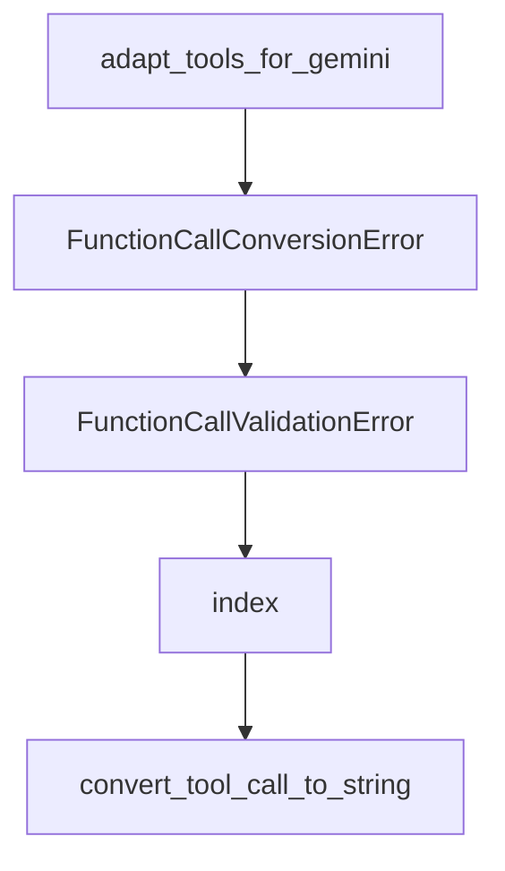

# Chapter 3: Installation, Environment, and API Setup

Welcome to **Chapter 3: Installation, Environment, and API Setup**. In this part of **AutoAgent Tutorial: Zero-Code Agent Creation and Automated Workflow Orchestration**, you will build an intuitive mental model first, then move into concrete implementation details and practical production tradeoffs.


This chapter covers environment setup and provider credential strategy.

## Learning Goals

- configure required and optional provider keys correctly
- prepare container/runtime assumptions safely
- align `.env` configuration with team operations
- avoid provider mismatch and startup failures

## Setup Checklist

- install Docker/runtime prerequisites
- configure only required keys for chosen providers
- validate model/provider mapping before full runs

## Source References

- [AutoAgent README: API Keys Setup](https://github.com/HKUDS/AutoAgent/blob/main/README.md)
- [Installation Docs](https://autoagent-ai.github.io/docs/get-started-installation)

## Summary

You now have a stable environment and provider setup baseline.

Next: [Chapter 4: Agent and Workflow Creation Patterns](04-agent-and-workflow-creation-patterns.md)

## Depth Expansion Playbook

## Source Code Walkthrough

### `autoagent/core.py`

The `adapt_tools_for_gemini` function in [`autoagent/core.py`](https://github.com/HKUDS/AutoAgent/blob/HEAD/autoagent/core.py) handles a key part of this chapter's functionality:

```py
logger = LoggerManager.get_logger()

def adapt_tools_for_gemini(tools):
    """为 Gemini 模型适配工具定义，确保所有 OBJECT 类型参数都有非空的 properties"""
    if tools is None:
        return None
        
    adapted_tools = []
    for tool in tools:
        adapted_tool = copy.deepcopy(tool)
        
        # 检查参数
        if "parameters" in adapted_tool["function"]:
            params = adapted_tool["function"]["parameters"]
            
            # 处理顶层参数
            if params.get("type") == "object":
                if "properties" not in params or not params["properties"]:
                    params["properties"] = {
                        "dummy": {
                            "type": "string",
                            "description": "Dummy property for Gemini compatibility"
                        }
                    }
            
            # 处理嵌套参数
            if "properties" in params:
                for prop_name, prop in params["properties"].items():
                    if isinstance(prop, dict) and prop.get("type") == "object":
                        if "properties" not in prop or not prop["properties"]:
                            prop["properties"] = {
                                "dummy": {
```

This function is important because it defines how AutoAgent Tutorial: Zero-Code Agent Creation and Automated Workflow Orchestration implements the patterns covered in this chapter.

### `autoagent/fn_call_converter.py`

The `FunctionCallConversionError` class in [`autoagent/fn_call_converter.py`](https://github.com/HKUDS/AutoAgent/blob/HEAD/autoagent/fn_call_converter.py) handles a key part of this chapter's functionality:

```py
from litellm import ChatCompletionToolParam

class FunctionCallConversionError(Exception):
    """Exception raised when FunctionCallingConverter failed to convert a non-function call message to a function call message.

    This typically happens when there's a malformed message (e.g., missing <function=...> tags). But not due to LLM output.
    """

    def __init__(self, message):
        super().__init__(message)

class FunctionCallValidationError(Exception):
    """Exception raised when FunctionCallingConverter failed to validate a function call message.

    This typically happens when the LLM outputs unrecognized function call / parameter names / values.
    """

    def __init__(self, message):
        super().__init__(message)

# Inspired by: https://docs.together.ai/docs/llama-3-function-calling#function-calling-w-llama-31-70b
SYSTEM_PROMPT_SUFFIX_TEMPLATE = """
You have access to the following functions:

{description}

If you choose to call a function ONLY reply in the following format with NO suffix:

<function=example_function_name>
<parameter=example_parameter_1>value_1</parameter>
<parameter=example_parameter_2>
This is the value for the second parameter
```

This class is important because it defines how AutoAgent Tutorial: Zero-Code Agent Creation and Automated Workflow Orchestration implements the patterns covered in this chapter.

### `autoagent/fn_call_converter.py`

The `FunctionCallValidationError` class in [`autoagent/fn_call_converter.py`](https://github.com/HKUDS/AutoAgent/blob/HEAD/autoagent/fn_call_converter.py) handles a key part of this chapter's functionality:

```py
        super().__init__(message)

class FunctionCallValidationError(Exception):
    """Exception raised when FunctionCallingConverter failed to validate a function call message.

    This typically happens when the LLM outputs unrecognized function call / parameter names / values.
    """

    def __init__(self, message):
        super().__init__(message)

# Inspired by: https://docs.together.ai/docs/llama-3-function-calling#function-calling-w-llama-31-70b
SYSTEM_PROMPT_SUFFIX_TEMPLATE = """
You have access to the following functions:

{description}

If you choose to call a function ONLY reply in the following format with NO suffix:

<function=example_function_name>
<parameter=example_parameter_1>value_1</parameter>
<parameter=example_parameter_2>
This is the value for the second parameter
that can span
multiple lines
</parameter>
</function>

<IMPORTANT>
Reminder:
- Function calls MUST follow the specified format, start with <function= and end with </function>
- Required parameters MUST be specified
```

This class is important because it defines how AutoAgent Tutorial: Zero-Code Agent Creation and Automated Workflow Orchestration implements the patterns covered in this chapter.

### `autoagent/fn_call_converter.py`

The `index` function in [`autoagent/fn_call_converter.py`](https://github.com/HKUDS/AutoAgent/blob/HEAD/autoagent/fn_call_converter.py) handles a key part of this chapter's functionality:

```py

@app.route('/')
def index():
    numbers = list(range(1, 11))
    return str(numbers)

if __name__ == '__main__':
    app.run(port=5000)
</parameter>
</function>

USER: EXECUTION RESULT of [str_replace_editor]:
File created successfully at: /workspace/app.py

ASSISTANT: I have created a Python file `app.py` that will display a list of numbers from 1 to 10 when you run it. Let me run the Python file for you:
<function=execute_bash>
<parameter=command>
python3 app.py > server.log 2>&1 &
</parameter>
</function>

USER: EXECUTION RESULT of [execute_bash]:
[1] 121
[1]+  Exit 1                  python3 app.py > server.log 2>&1

ASSISTANT: Looks like the server is running with PID 121 then crashed. Let me check the server log:
<function=execute_bash>
<parameter=command>
cat server.log
</parameter>
</function>

```

This function is important because it defines how AutoAgent Tutorial: Zero-Code Agent Creation and Automated Workflow Orchestration implements the patterns covered in this chapter.


## How These Components Connect


