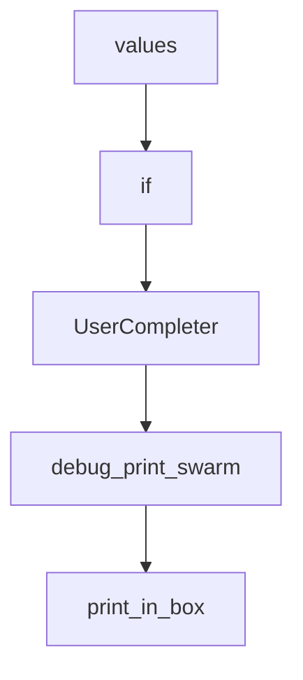

# Chapter 4: Agent and Workflow Creation Patterns

Welcome to **Chapter 4: Agent and Workflow Creation Patterns**. In this part of **AutoAgent Tutorial: Zero-Code Agent Creation and Automated Workflow Orchestration**, you will build an intuitive mental model first, then move into concrete implementation details and practical production tradeoffs.


This chapter focuses on effective natural-language prompts for agent and workflow generation.

## Learning Goals

- write clearer creation prompts for better outputs
- separate capability requirements from implementation details
- iterate profile/tool/workflow outputs with intent clarity
- avoid over-specified or under-specified requests

## Creation Strategy

- define goal, constraints, and success criteria first
- iterate in small prompt revisions
- validate generated agents on representative tasks

## Source References

- [User Guide: Create Agent](https://autoagent-ai.github.io/docs/user-guide-how-to-create-agent)
- [Developer Guide: Build Project](https://github.com/HKUDS/AutoAgent/blob/main/docs/docs/Dev-Guideline/dev-guide-build-your-project.md)

## Summary

You now have prompt patterns for more reliable AutoAgent creation flows.

Next: [Chapter 5: Tooling, Python API, and Custom Extensions](05-tooling-python-api-and-custom-extensions.md)

## Depth Expansion Playbook

## Source Code Walkthrough

### `autoagent/fn_call_converter.py`

The `values` interface in [`autoagent/fn_call_converter.py`](https://github.com/HKUDS/AutoAgent/blob/HEAD/autoagent/fn_call_converter.py) handles a key part of this chapter's functionality:

```py
    """Exception raised when FunctionCallingConverter failed to validate a function call message.

    This typically happens when the LLM outputs unrecognized function call / parameter names / values.
    """

    def __init__(self, message):
        super().__init__(message)

# Inspired by: https://docs.together.ai/docs/llama-3-function-calling#function-calling-w-llama-31-70b
SYSTEM_PROMPT_SUFFIX_TEMPLATE = """
You have access to the following functions:

{description}

If you choose to call a function ONLY reply in the following format with NO suffix:

<function=example_function_name>
<parameter=example_parameter_1>value_1</parameter>
<parameter=example_parameter_2>
This is the value for the second parameter
that can span
multiple lines
</parameter>
</function>

<IMPORTANT>
Reminder:
- Function calls MUST follow the specified format, start with <function= and end with </function>
- Required parameters MUST be specified
- Only call one function at a time
- You may provide optional reasoning for your function call in natural language BEFORE the function call, but NOT after.
- If there is no function call available, answer the question like normal with your current knowledge and do not tell the user about function calls
```

This interface is important because it defines how AutoAgent Tutorial: Zero-Code Agent Creation and Automated Workflow Orchestration implements the patterns covered in this chapter.

### `autoagent/util.py`

The `if` class in [`autoagent/util.py`](https://github.com/HKUDS/AutoAgent/blob/HEAD/autoagent/util.py) handles a key part of this chapter's functionality:

```py
from prompt_toolkit.styles import Style
def debug_print_swarm(debug: bool, *args: str) -> None:
    if not debug:
        return
    timestamp = datetime.now().strftime("%Y-%m-%d %H:%M:%S")
    message = " ".join(map(str, args))
    print(f"\033[97m[\033[90m{timestamp}\033[97m]\033[90m {message}\033[0m")
def print_in_box(text: str, console: Optional[Console] = None, title: str = "", color: str = "white") -> None:
    """
    Print the text in a box.
    :param text: the text to print.
    :param console: the console to print the text.
    :param title: the title of the box.
    :param color: the border color.
    :return:
    """
    console = console or Console()

    # panel = Panel(text, title=title, border_style=color, expand=True, highlight=True)
    # console.print(panel)
    console.print('_'*20 + title + '_'*20, style=f"bold {color}")
    console.print(text, highlight=True, emoji=True)
    


def debug_print(debug: bool, *args: str, **kwargs: dict) -> None:
    if not debug:
        return
    timestamp = datetime.now().strftime("%Y-%m-%d %H:%M:%S")
    message = "\n".join(map(str, args))
    color = kwargs.get("color", "white")
    title = kwargs.get("title", "")
```

This class is important because it defines how AutoAgent Tutorial: Zero-Code Agent Creation and Automated Workflow Orchestration implements the patterns covered in this chapter.

### `autoagent/util.py`

The `UserCompleter` class in [`autoagent/util.py`](https://github.com/HKUDS/AutoAgent/blob/HEAD/autoagent/util.py) handles a key part of this chapter's functionality:

```py


class UserCompleter(Completer):

    def __init__(self, users: List[str]):
        super().__init__()
        self.users = users
    def get_completions(self, document, complete_event):
        word = document.get_word_before_cursor()
        
        if word.startswith('@'):
            prefix = word[1:]  # 去掉@
            for user in self.users:
                if user.startswith(prefix):
                    yield Completion(
                        user,
                        start_position=-len(prefix),
                        style='fg:blue bold'  # 蓝色加粗
                    )
def pretty_print_messages(message, **kwargs) -> None:
    # for message in messages:
    if message["role"] != "assistant" and message["role"] != "tool":
        return
    console = Console()
    if message["role"] == "tool":
        console.print("[bold blue]tool execution:[/bold blue]", end=" ")
        console.print(f"[bold purple]{message['name']}[/bold purple], result: {message['content']}")
        log_path = kwargs.get("log_path", None)
        if log_path:
            with open(log_path, 'a') as file:
                file.write(f"tool execution: {message['name']}, result: {message['content']}\n")
        return
```

This class is important because it defines how AutoAgent Tutorial: Zero-Code Agent Creation and Automated Workflow Orchestration implements the patterns covered in this chapter.

### `autoagent/util.py`

The `debug_print_swarm` function in [`autoagent/util.py`](https://github.com/HKUDS/AutoAgent/blob/HEAD/autoagent/util.py) handles a key part of this chapter's functionality:

```py
from prompt_toolkit.formatted_text import HTML
from prompt_toolkit.styles import Style
def debug_print_swarm(debug: bool, *args: str) -> None:
    if not debug:
        return
    timestamp = datetime.now().strftime("%Y-%m-%d %H:%M:%S")
    message = " ".join(map(str, args))
    print(f"\033[97m[\033[90m{timestamp}\033[97m]\033[90m {message}\033[0m")
def print_in_box(text: str, console: Optional[Console] = None, title: str = "", color: str = "white") -> None:
    """
    Print the text in a box.
    :param text: the text to print.
    :param console: the console to print the text.
    :param title: the title of the box.
    :param color: the border color.
    :return:
    """
    console = console or Console()

    # panel = Panel(text, title=title, border_style=color, expand=True, highlight=True)
    # console.print(panel)
    console.print('_'*20 + title + '_'*20, style=f"bold {color}")
    console.print(text, highlight=True, emoji=True)
    


def debug_print(debug: bool, *args: str, **kwargs: dict) -> None:
    if not debug:
        return
    timestamp = datetime.now().strftime("%Y-%m-%d %H:%M:%S")
    message = "\n".join(map(str, args))
    color = kwargs.get("color", "white")
```

This function is important because it defines how AutoAgent Tutorial: Zero-Code Agent Creation and Automated Workflow Orchestration implements the patterns covered in this chapter.


## How These Components Connect


