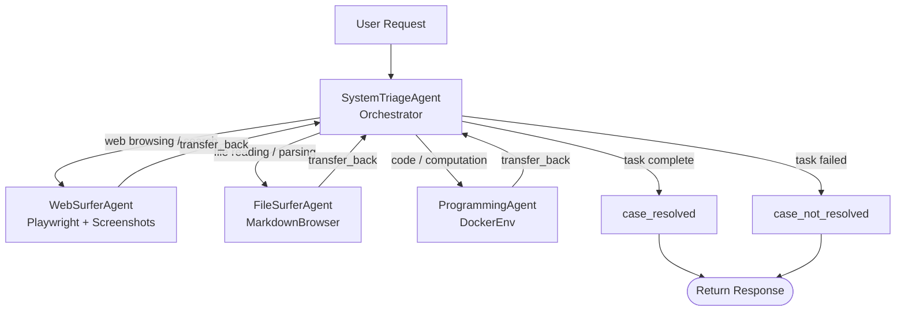
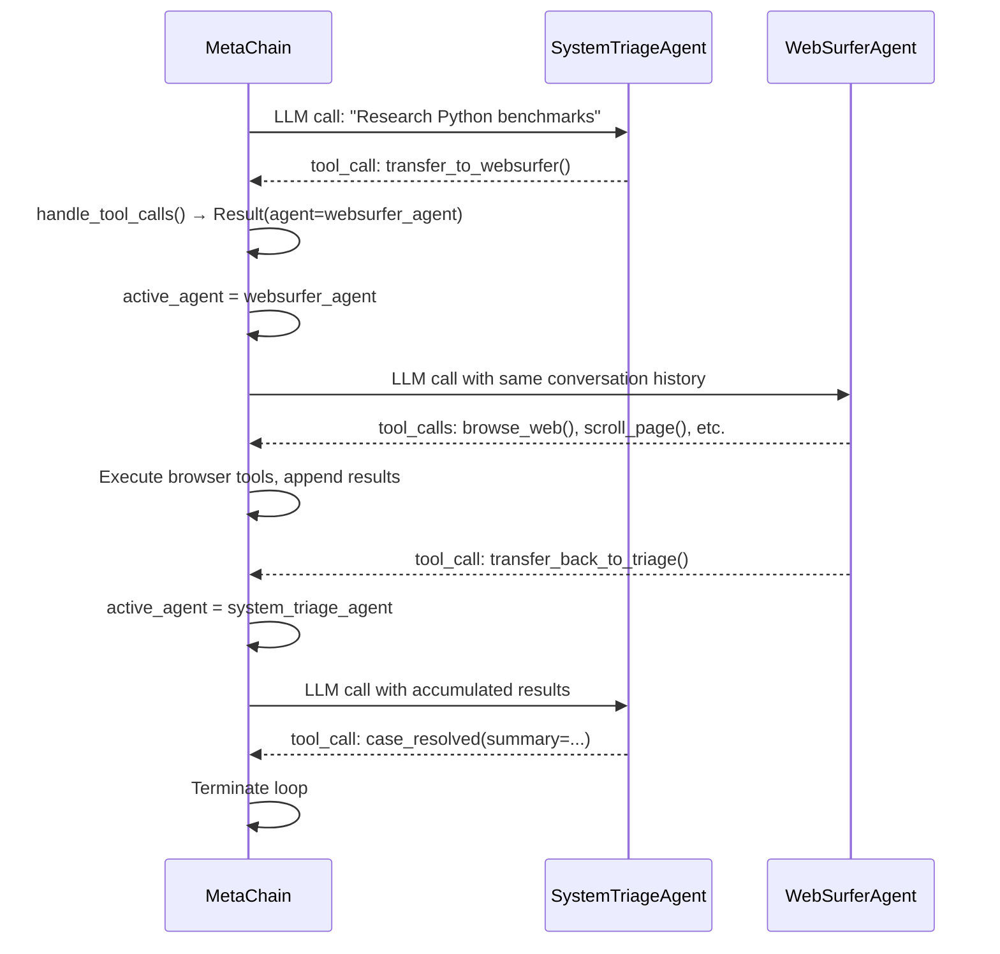

# Chapter 4: User Mode: Deep Research System

## What Problem Does This Solve?

General-purpose research tasks don't fit neatly into a single tool. A question like "What is the latest Python performance benchmark and how does it compare to the 2023 results?" requires:

1. Web search and browsing to find current benchmarks
2. Document reading to parse PDFs or DOCX files
3. Code execution to run statistical comparisons
4. File writing to save the final report

A single agent trying to do all of this becomes confused about which tool to use when. AutoAgent solves this with a **triage + specialist** architecture: `SystemTriageAgent` handles routing, and four specialist agents each do one thing well.

---

## The Agent Graph



Each specialist agent has access only to the tools it needs. This keeps tool schemas small and reduces LLM confusion about which tool to call.

---

## SystemTriageAgent (`system_triage_agent.py`)

### Role

`SystemTriageAgent` is the entry point for all User Mode interactions. It:

1. Analyzes the user's request
2. Decides which specialist(s) are needed
3. Transfers control via `transfer_to_X()` functions
4. Receives results back and synthesizes a final answer
5. Calls `case_resolved` when the task is complete

### Transfer Functions

The transfer functions are injected into `SystemTriageAgent`'s function list at initialization:

```python
# autoagent/system_triage_agent.py

from autoagent.types import Agent, Result

def transfer_to_websurfer(context_variables: dict) -> Result:
    """Transfer to WebSurferAgent for web browsing and search tasks.
    
    Use when: the task requires browsing websites, searching the web,
    or extracting information from online sources.
    """
    return Result(
        value="Transferring to WebSurferAgent for web research",
        agent=websurfer_agent,
    )

def transfer_to_filesurfer(context_variables: dict) -> Result:
    """Transfer to FileSurferAgent for reading local files and documents.
    
    Use when: the task involves reading PDFs, DOCX, or other local files.
    """
    return Result(
        value="Transferring to FileSurferAgent for document reading",
        agent=filesurfer_agent,
    )

def transfer_to_programming(context_variables: dict) -> Result:
    """Transfer to ProgrammingAgent for code execution and data analysis.
    
    Use when: the task requires writing or running Python code.
    """
    return Result(
        value="Transferring to ProgrammingAgent",
        agent=programming_agent,
    )

def case_resolved(context_variables: dict, summary: str) -> Result:
    """Signal that the task has been successfully completed."""
    return Result(value=f"CASE_RESOLVED: {summary}")

def case_not_resolved(context_variables: dict, reason: str) -> Result:
    """Signal that the task could not be completed."""
    return Result(value=f"CASE_NOT_RESOLVED: {reason}")

system_triage_agent = Agent(
    name="SystemTriageAgent",
    model="gpt-4o",
    instructions="""You are a research coordinator. Analyze user requests and
    route them to the appropriate specialist. After the specialist completes
    their work, synthesize the results and call case_resolved with a summary.
    
    Always route to specialists rather than attempting the task directly.
    """,
    functions=[
        transfer_to_websurfer,
        transfer_to_filesurfer,
        transfer_to_programming,
        case_resolved,
        case_not_resolved,
    ],
)
```

### Handoff Flow in Detail

When `SystemTriageAgent` calls `transfer_to_websurfer()`, the `MetaChain` run loop detects the `Result.agent` field and switches the active agent:



The key insight: the conversation history persists across handoffs. When control returns to `SystemTriageAgent`, it sees all the messages from `WebSurferAgent`'s work and can synthesize them.

---

## WebSurferAgent (`websurfer_agent.py`)

### Capabilities

`WebSurferAgent` controls the `BrowserEnv` (Playwright) to navigate websites and extract information:

```python
# autoagent/websurfer_agent.py (tool functions)

def browse_web(url: str, context_variables: dict) -> str:
    """Navigate to a URL and return page content with screenshot reference."""
    web_env: BrowserEnv = context_variables["web_env"]
    obs = web_env.navigate(url)
    return f"URL: {obs.url}\n\nContent:\n{obs.content[:4000]}"

def search_web(query: str, context_variables: dict) -> str:
    """Search the web using the browser."""
    web_env: BrowserEnv = context_variables["web_env"]
    search_url = f"https://www.google.com/search?q={quote(query)}"
    obs = web_env.navigate(search_url)
    return obs.content[:4000]

def scroll_down(context_variables: dict) -> str:
    """Scroll down on the current page."""
    web_env: BrowserEnv = context_variables["web_env"]
    web_env.page.keyboard.press("PageDown")
    obs = web_env._get_observation()
    return obs.content[:2000]

def click_element(selector: str, context_variables: dict) -> str:
    """Click an element on the current page."""
    web_env: BrowserEnv = context_variables["web_env"]
    obs = web_env.click(selector)
    return obs.content[:2000]

def transfer_back_to_triage(context_variables: dict, summary: str) -> Result:
    """Return to SystemTriageAgent with research results."""
    return Result(
        value=f"WebSurfer completed: {summary}",
        agent=system_triage_agent,
    )
```

### Multimodal Screenshot Loop

For visual navigation tasks, `WebSurferAgent` uses GPT-4V-style message construction:

```python
# autoagent/websurfer_agent.py

def get_visual_observation(context_variables: dict) -> list[dict]:
    """Return current page screenshot as a multimodal message part."""
    web_env: BrowserEnv = context_variables["web_env"]
    obs = web_env._get_observation()

    # Encode screenshot as base64 for vision models
    screenshot_b64 = base64.b64encode(obs.screenshot).decode()

    return [
        {
            "type": "image_url",
            "image_url": {
                "url": f"data:image/png;base64,{screenshot_b64}",
                "detail": "high",
            }
        },
        {
            "type": "text",
            "text": f"Current URL: {obs.url}\n\nPage content summary:\n{obs.content[:1000]}"
        }
    ]
```

This allows `WebSurferAgent` to navigate pages that require visual understanding (CAPTCHA-free sites, pages with complex layouts, image-heavy content).

---

## FileSurferAgent (`filesurfer_agent.py`)

### Capabilities

`FileSurferAgent` uses `RequestsMarkdownBrowser` for document reading and file operations:

```python
# autoagent/filesurfer_agent.py (tool functions)

def read_file(file_path: str, context_variables: dict) -> str:
    """Read a file from the workspace, converting to Markdown."""
    file_env: RequestsMarkdownBrowser = context_variables["file_env"]
    return file_env.visit_page(file_path)

def page_down_file(context_variables: dict) -> str:
    """Scroll to the next page of the current document."""
    file_env: RequestsMarkdownBrowser = context_variables["file_env"]
    return file_env.page_down()

def list_workspace_files(context_variables: dict) -> str:
    """List all files in the workspace directory."""
    workspace = context_variables.get("workspace", "./workspace")
    files = []
    for path in Path(workspace).rglob("*"):
        if path.is_file():
            files.append(str(path.relative_to(workspace)))
    return "\n".join(files)

def write_file(file_path: str, content: str, context_variables: dict) -> str:
    """Write content to a file in the workspace."""
    workspace = context_variables.get("workspace", "./workspace")
    full_path = Path(workspace) / file_path
    full_path.parent.mkdir(parents=True, exist_ok=True)
    full_path.write_text(content)
    return f"Written to {full_path}"
```

### File Upload Workflow

Users can upload files for analysis via the workspace directory:

```bash
# Copy a file into the workspace before starting the session
cp my_research_paper.pdf workspace/

# Then in AutoAgent:
# AutoAgent> Summarize the PDF in workspace/my_research_paper.pdf
```

`FileSurferAgent` uses `RequestsMarkdownBrowser._convert_pdf()` to extract text and then processes it page by page within the LLM's context window.

---

## ProgrammingAgent (`programming_agent.py`)

### Capabilities

`ProgrammingAgent` writes and executes Python code in the Docker sandbox:

```python
# autoagent/programming_agent.py (tool functions)

def execute_python(code: str, context_variables: dict) -> str:
    """Execute Python code in the Docker sandbox.
    
    The sandbox maintains state between calls — variables and imports
    persist within a session.
    """
    code_env: DockerEnv = context_variables["code_env"]
    stdout, stderr, result = code_env.execute_code(code)

    output = ""
    if stdout:
        output += f"STDOUT:\n{stdout}"
    if stderr:
        output += f"\nSTDERR:\n{stderr}"
    if result:
        output += f"\nRESULT: {result}"

    return output or "Code executed successfully (no output)"

def install_package(package: str, context_variables: dict) -> str:
    """Install a Python package in the Docker sandbox."""
    code_env: DockerEnv = context_variables["code_env"]
    install_code = f"import subprocess; subprocess.run(['pip', 'install', '{package}'], capture_output=True)"
    stdout, stderr, _ = code_env.execute_code(install_code)
    return f"Installed {package}"

def list_workspace_contents(context_variables: dict) -> str:
    """List files in the mounted workspace directory."""
    code_env: DockerEnv = context_variables["code_env"]
    stdout, _, _ = code_env.execute_code("import os; print(os.listdir('/workspace'))")
    return stdout
```

### Iterative Code Refinement

When code fails, `ProgrammingAgent` retries with error context in the conversation history:

```
[ProgrammingAgent] Writing code to parse CSV...
[Tool: execute_python] 
  STDERR: ImportError: No module named 'pandas'

[ProgrammingAgent] Need to install pandas first
[Tool: install_package] package=pandas
[Tool: execute_python] (retry with same code)
  STDOUT: Parsed 1000 rows successfully
```

This happens naturally through the conversation history — no special retry logic is needed in the agent code itself.

---

## Direct Agent Routing with @mention

The `@AgentName` syntax in `inner.py` allows bypassing `SystemTriageAgent`:

```python
# autoagent/inner.py (simplified)

def parse_user_input(message: str, registered_agents: dict) -> tuple[Agent, str]:
    """Check if the message starts with @AgentName and route directly."""
    if message.startswith("@"):
        parts = message.split(" ", 1)
        agent_name = parts[0][1:]  # Strip the @
        actual_message = parts[1] if len(parts) > 1 else ""

        if agent_name in registered_agents:
            return registered_agents[agent_name], actual_message

    # Default: route through SystemTriageAgent
    return system_triage_agent, message
```

Examples:

```
# Route directly to WebSurferAgent
AutoAgent> @WebSurferAgent find the latest PyPI release of litellm

# Route directly to ProgrammingAgent
AutoAgent> @ProgrammingAgent run this code: import sys; print(sys.version)

# Route directly to a custom registered agent
AutoAgent> @SalesAgent recommend a product for a $50 budget in electronics
```

---

## GAIA Benchmark Performance

The academic paper (arxiv:2502.05957) evaluates AutoAgent on the GAIA benchmark, which tests general AI assistants on real-world tasks requiring multi-step reasoning across web, file, and code capabilities:

| GAIA Level | Task Type | AutoAgent Performance |
|------------|-----------|----------------------|
| Level 1 | Simple factual lookups | ~85% |
| Level 2 | Multi-step reasoning with tools | ~67% |
| Level 3 | Complex multi-source synthesis | ~40% |

GAIA Level 1 tasks are single-step (e.g., "What is the capital of France?"). Level 3 tasks require chaining 5-10 tool calls across multiple sources with complex reasoning.

The benchmark is run via `evaluation/gaia/run_infer.py` — Chapter 8 covers the evaluation infrastructure in detail.

---

## Summary

| Component | File | Role |
|-----------|------|------|
| `SystemTriageAgent` | `system_triage_agent.py` | Orchestrator: routes to specialists, synthesizes results |
| `WebSurferAgent` | `websurfer_agent.py` | Web browsing via Playwright + multimodal screenshots |
| `FileSurferAgent` | `filesurfer_agent.py` | Document reading via MarkdownBrowser + file writing |
| `ProgrammingAgent` | `programming_agent.py` | Python code execution via DockerEnv |
| `transfer_to_X()` | All agent files | Agent handoff via `Result(agent=next_agent)` |
| `case_resolved` | `system_triage_agent.py` | Task completion signal |
| `case_not_resolved` | `system_triage_agent.py` | Task failure signal |
| `@mention` routing | `inner.py` | Bypass triage, route directly to named agent |
| GAIA benchmark | `evaluation/gaia/` | Multi-level task evaluation (Levels 1-3) |

Continue to [Chapter 5: Agent Editor: From NL to Deployed Agents](./05-agent-editor-nl-to-deployed-agents.md) to learn how the 4-phase pipeline generates, tests, and registers new agents from natural language descriptions.
