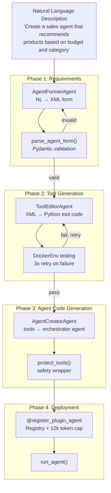
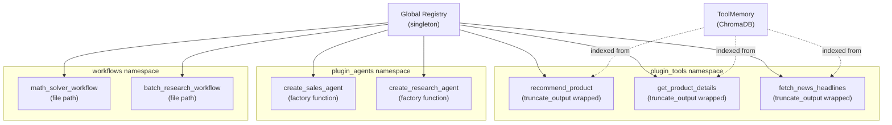

# Chapter 5: Agent Editor: From NL to Deployed Agents

## What Problem Does This Solve?

Writing a production-quality agent requires:
- Defining tool schemas and implementations
- Testing tools in isolation before wiring them to an agent
- Generating correct orchestrator code that routes between tools
- Registering everything in a discoverable registry
- Handling errors and retrying during code generation

The Agent Editor automates this entire pipeline. You write one sentence describing what your agent should do, and AutoAgent generates the full implementation, tests it, and deploys it — ready to use in your next `auto main` session.

---

## The 4-Phase Pipeline



---

## Phase 1: AgentFormerAgent and the XML Form

### Role

`AgentFormerAgent` converts your natural language description into a structured XML form that specifies:
- Agent name and description
- Required tools (new vs existing)
- Tool input/output specifications
- Agent input parameters

### XML Form Schema

```xml
<!-- Example generated by AgentFormerAgent -->
<agents>
  <agent>
    <name>SalesAgent</name>
    <description>Recommends products based on user budget and category preferences</description>
    <tools category="new">
      <tool>
        <name>recommend_product</name>
        <description>Find products matching budget and category criteria</description>
        <inputs>
          <input name="budget" type="float" description="Maximum price in USD"/>
          <input name="category" type="str" description="Product category (electronics, clothing, etc)"/>
          <input name="preferences" type="str" description="Additional user preferences"/>
        </inputs>
        <output>A JSON list of recommended products with name, price, and reason</output>
      </tool>
      <tool>
        <name>get_product_details</name>
        <description>Get detailed information about a specific product</description>
        <inputs>
          <input name="product_name" type="str" description="Product name to look up"/>
        </inputs>
        <output>Detailed product specifications and availability</output>
      </tool>
    </tools>
    <tools category="existing">
      <tool><name>search_web</name></tool>
    </tools>
    <agent_input>
      <key>user_request</key>
      <key>budget</key>
    </agent_input>
  </agent>
</agents>
```

### parse_agent_form() Validation

```python
# autoagent/form_complie.py

from pydantic import BaseModel, validator

class ToolSpec(BaseModel):
    name: str
    description: str
    inputs: list[dict]
    output: str

class AgentSpec(BaseModel):
    name: str
    description: str
    new_tools: list[ToolSpec] = []
    existing_tools: list[str] = []
    agent_input: list[str] = []

    @validator("name")
    def name_must_be_valid_identifier(cls, v):
        if not v.replace("_", "").replace("-", "").isalnum():
            raise ValueError(f"Agent name '{v}' is not a valid Python identifier")
        return v

def parse_agent_form(xml_str: str, max_retries: int = 3) -> AgentSpec:
    """Parse and validate agent XML form with retry logic.
    
    If parsing fails, returns the error for AgentFormerAgent to fix.
    """
    for attempt in range(max_retries):
        try:
            root = ET.fromstring(xml_str)
            agent_elem = root.find("agent")

            spec = AgentSpec(
                name=agent_elem.findtext("name", ""),
                description=agent_elem.findtext("description", ""),
                new_tools=[
                    ToolSpec(
                        name=t.findtext("name", ""),
                        description=t.findtext("description", ""),
                        inputs=[
                            {i.get("name"): {"type": i.get("type"), "description": i.get("description")}}
                            for i in t.findall(".//input")
                        ],
                        output=t.findtext("output", ""),
                    )
                    for t in root.findall(".//tools[@category='new']/tool")
                ],
                existing_tools=[
                    t.findtext("name", "")
                    for t in root.findall(".//tools[@category='existing']/tool")
                ],
                agent_input=[k.text for k in agent_elem.findall(".//key")],
            )
            return spec

        except (ET.ParseError, ValidationError) as e:
            if attempt == max_retries - 1:
                raise
            # Will be fed back to AgentFormerAgent as error context

    raise RuntimeError("Failed to parse agent form after max retries")
```

---

## Phase 2: ToolEditorAgent (`tool_editor.py`)

### Role

`ToolEditorAgent` takes the `AgentSpec` and generates Python code for each new tool, then tests it in Docker. If tests fail, it retries up to 3 times with the error context.

### Tool Code Generation Pattern

```python
# autoagent/tool_editor.py (simplified)

def generate_tool_code(spec: ToolSpec, model: str) -> str:
    """Generate Python tool implementation from a ToolSpec."""
    prompt = f"""Generate a Python function for this tool:

Name: {spec.name}
Description: {spec.description}
Inputs: {json.dumps(spec.inputs, indent=2)}
Expected output: {spec.output}

Requirements:
1. Use @register_plugin_tool decorator
2. Include comprehensive docstring
3. Handle errors gracefully
4. Return a string
"""
    response = litellm.completion(
        model=model,
        messages=[{"role": "user", "content": prompt}],
    )
    return extract_code_block(response.choices[0].message.content)

def test_tool_in_docker(
    tool_code: str,
    code_env: DockerEnv,
    max_retries: int = 3,
) -> tuple[bool, str]:
    """Test generated tool code in Docker, returning (success, error_msg)."""
    for attempt in range(max_retries):
        # Write tool to temp file
        test_code = f"""
{tool_code}

# Basic smoke test
result = {extract_function_name(tool_code)}.__wrapped__()
print(f"Test passed: {{result[:100]}}")
"""
        stdout, stderr, _ = code_env.execute_code(test_code)

        if stderr and "Error" in stderr:
            if attempt < max_retries - 1:
                # Will regenerate with error context
                error_context = stderr
                continue
            return False, stderr

        return True, stdout

    return False, "Max retries exceeded"
```

### Generated Tool Code Pattern

Tools generated by `ToolEditorAgent` follow a consistent pattern:

```python
# Example generated by ToolEditorAgent
# Saved to: workspace/tools/recommend_product.py

from autoagent.registry import register_plugin_tool

@register_plugin_tool
def recommend_product(
    budget: float,
    category: str,
    preferences: str = "",
) -> str:
    """Find products matching budget and category criteria.
    
    Args:
        budget: Maximum price in USD
        category: Product category (electronics, clothing, etc)
        preferences: Additional user preferences
        
    Returns:
        A JSON list of recommended products with name, price, and reason
    """
    # Generated implementation
    import json

    # Simulated product database lookup
    products = search_product_database(category, max_price=budget)

    recommendations = [
        {
            "name": p["name"],
            "price": p["price"],
            "reason": f"Matches your {category} preference within ${budget} budget"
        }
        for p in products[:5]
    ]

    return json.dumps(recommendations, indent=2)
```

The `@register_plugin_tool` decorator automatically:
1. Registers the tool in the global registry under `plugin_tools` namespace
2. Wraps the function with `truncate_output()` to cap output at 12,000 tokens

---

## Phase 3: AgentCreatorAgent (`agent_creator.py`)

### Role

`AgentCreatorAgent` assembles the tested tools into a fully functional orchestrator agent. It generates:
1. A Python agent module with all tool imports
2. Auto-generated `transfer_to_X()` functions for each tool
3. An orchestrator agent that uses the tools
4. Optional sub-agents if the spec requires them

### create_agent() Function

```python
# autoagent/agent_creator.py

def create_agent(spec: AgentSpec, tools: list[Callable]) -> Agent:
    """Create a single-agent that directly calls all provided tools."""
    return Agent(
        name=spec.name,
        model="gpt-4o",
        instructions=f"""You are {spec.name}. {spec.description}
        
You have access to the following tools: {[t.__name__ for t in tools]}

Use them to fulfill user requests. Be concise and accurate.
""",
        functions=tools + [case_resolved, case_not_resolved],
    )

def create_orchestrator_agent(
    spec: AgentSpec,
    sub_agents: list[Agent],
    tools: list[Callable],
) -> Agent:
    """Create an orchestrator agent that routes to sub-agents.
    
    Auto-generates transfer_to_X() functions for each sub-agent.
    """
    transfer_functions = []

    for sub_agent in sub_agents:
        # Dynamically generate transfer function
        def make_transfer(target_agent):
            def transfer(context_variables: dict) -> Result:
                f"""Transfer to {target_agent.name}."""
                return Result(
                    value=f"Transferring to {target_agent.name}",
                    agent=target_agent,
                )
            transfer.__name__ = f"transfer_to_{target_agent.name.lower()}"
            transfer.__doc__ = f"Use when the task requires {target_agent.name} capabilities"
            return transfer

        transfer_functions.append(make_transfer(sub_agent))

    return Agent(
        name=f"{spec.name}Orchestrator",
        model="gpt-4o",
        instructions=f"""You are the orchestrator for {spec.name}.
        
Route tasks to the appropriate sub-agent:
{chr(10).join(f'- {a.name}: {a.instructions[:100]}' for a in sub_agents)}
""",
        functions=transfer_functions + tools + [case_resolved, case_not_resolved],
    )
```

### Generated Agent Code Pattern

The full agent code generated and saved to workspace:

```python
# workspace/agents/sales_agent.py (generated by AgentCreatorAgent)

from autoagent.registry import register_plugin_agent
from autoagent.types import Agent, Result
from workspace.tools.recommend_product import recommend_product
from workspace.tools.get_product_details import get_product_details
from autoagent.tools.search_tools import search_web

def case_resolved(context_variables: dict, summary: str) -> Result:
    return Result(value=f"CASE_RESOLVED: {summary}")

def case_not_resolved(context_variables: dict, reason: str) -> Result:
    return Result(value=f"CASE_NOT_RESOLVED: {reason}")

@register_plugin_agent
def create_sales_agent() -> Agent:
    """Factory function for SalesAgent."""
    return Agent(
        name="SalesAgent",
        model="gpt-4o",
        instructions="""You are SalesAgent. Recommend products based on user budget 
        and category preferences. Use recommend_product to find options, 
        get_product_details for specifics, and search_web for current prices.
        Call case_resolved when you've provided recommendations.""",
        functions=[
            recommend_product,
            get_product_details,
            search_web,
            case_resolved,
            case_not_resolved,
        ],
    )
```

---

## Phase 4: Registry and Deployment

### Registry Namespace Structure



### @register_plugin_agent Decorator

```python
# autoagent/registry.py (decorator behavior)

def register_plugin_agent(factory_func: Callable) -> Callable:
    """Register an agent factory in the global registry.
    
    The factory function is stored, not the agent instance, to allow
    fresh instantiation each time the agent is used.
    """
    _registry["plugin_agents"][factory_func.__name__] = factory_func
    return factory_func
```

### Registry Introspection in Docker

During Agent Editor, the framework queries the registry from inside the Docker container to get the live catalog of available tools:

```python
# autoagent/edit_agents.py

def get_available_tools_catalog(code_env: DockerEnv) -> str:
    """Query the registry from inside Docker for live tool catalog."""
    catalog_code = """
from autoagent.registry import get_registry
registry = get_registry()
tools = list(registry['plugin_tools'].keys())
print('\\n'.join(tools))
"""
    stdout, _, _ = code_env.execute_code(catalog_code)
    return stdout.strip()
```

This ensures `AgentCreatorAgent` knows exactly which tools are available when it decides which existing tools to reuse vs which new ones to generate.

### protect_tools() Safety Wrapper

Before registering generated tools, `protect_tools()` adds safety checks:

```python
# autoagent/edit_tools.py

def protect_tools(tools: list[Callable]) -> list[Callable]:
    """Wrap tools with safety checks before registry insertion.
    
    - Validates tool output is a string
    - Catches and formats exceptions instead of propagating
    - Ensures tools don't modify context_variables unexpectedly
    """
    protected = []
    for tool in tools:
        @wraps(tool)
        def safe_tool(*args, _original=tool, **kwargs):
            try:
                result = _original(*args, **kwargs)
                if not isinstance(result, str):
                    result = str(result)
                return result
            except Exception as e:
                return f"Tool error in {_original.__name__}: {type(e).__name__}: {e}"

        protected.append(safe_tool)
    return protected
```

---

## GITHUB_AI_TOKEN Requirement

The Agent Editor requires a `GITHUB_AI_TOKEN` because it clones the AutoAgent repository into the Docker container for self-modification:

```python
# autoagent/edit_agents.py (simplified)

def setup_self_modification(code_env: DockerEnv, github_token: str) -> bool:
    """Clone AutoAgent repo into Docker for meta-programming capabilities."""
    clone_code = f"""
import subprocess
result = subprocess.run(
    ['git', 'clone', 
     'https://{github_token}@github.com/HKUDS/AutoAgent.git',
     '/autoagent'],
    capture_output=True, text=True
)
print('Clone successful' if result.returncode == 0 else result.stderr)
"""
    stdout, stderr, _ = code_env.execute_code(clone_code)
    return "Clone successful" in stdout
```

Without this token, the Agent Editor will fail with:

```
Error: GITHUB_AI_TOKEN not set. Agent Editor requires GitHub access for self-modification.
Set GITHUB_AI_TOKEN in your .env file to use this feature.
```

---

## Summary

| Component | File | Role |
|-----------|------|------|
| `AgentFormerAgent` | `agent_former.py` | Phase 1: NL → XML agent form |
| `parse_agent_form()` | `form_complie.py` | Phase 1: XML validation with Pydantic + retry |
| `ToolEditorAgent` | `tool_editor.py` | Phase 2: XML → Python tools + Docker testing |
| `AgentCreatorAgent` | `agent_creator.py` | Phase 3: tools → orchestrator agent code |
| `create_agent()` | `agent_creator.py` | Simple agent factory for single-level agents |
| `create_orchestrator_agent()` | `agent_creator.py` | Multi-level agent with auto transfer functions |
| `@register_plugin_agent` | `registry.py` | Phase 4: deploy to registry with factory pattern |
| `protect_tools()` | `edit_tools.py` | Safety wrapper before tool registration |
| `GITHUB_AI_TOKEN` | `.env` | Required for Docker self-modification |
| XML form schema | `form_complie.py` | `<agents><agent><name><tools><agent_input>` |

Continue to [Chapter 6: Workflow Editor: Async Event-Driven Pipelines](./06-workflow-editor-async-pipelines.md) to learn how EventEngine composes async parallel pipelines.
