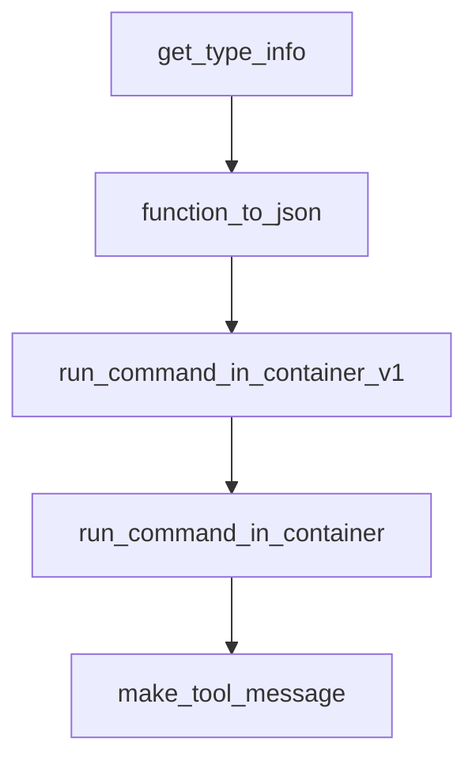

# Chapter 5: Tooling, Python API, and Custom Extensions

Welcome to **Chapter 5: Tooling, Python API, and Custom Extensions**. In this part of **AutoAgent Tutorial: Zero-Code Agent Creation and Automated Workflow Orchestration**, you will build an intuitive mental model first, then move into concrete implementation details and practical production tradeoffs.


This chapter explains extension surfaces for deeper customization.

## Learning Goals

- add custom tools through documented development flows
- use Python integration paths when CLI flows are insufficient
- maintain extension quality and safety
- keep extension logic maintainable under change

## Extension Surfaces

- developer guide for tool creation
- Python documentation entry points
- starter-project patterns for custom workflows

## Source References

- [Create Tools Docs](https://autoagent-ai.github.io/docs/dev-guide-create-tools)
- [Python Docs](https://autoagent-ai.github.io/docs/python)
- [Starter Projects](https://github.com/HKUDS/AutoAgent/tree/main/docs/docs/Starter-Projects)

## Summary

You now have a path for controlled AutoAgent extensibility.

Next: [Chapter 6: CLI Operations and Provider Strategy](06-cli-operations-and-provider-strategy.md)

## Depth Expansion Playbook

## Source Code Walkthrough

### `autoagent/util.py`

The `get_type_info` function in [`autoagent/util.py`](https://github.com/HKUDS/AutoAgent/blob/HEAD/autoagent/util.py) handles a key part of this chapter's functionality:

```py
#     }

def get_type_info(annotation, base_type_map):
    # 处理基本类型
    if annotation in base_type_map:
        return {"type": base_type_map[annotation]}
    
    # 处理typing类型
    origin = get_origin(annotation)
    if origin is not None:
        args = get_args(annotation)
        
        # 处理List类型
        if origin is list or origin is List:
            item_type = args[0]
            return {
                "type": "array",
                "items": get_type_info(item_type, base_type_map)
            }
        
        # 处理Dict类型
        elif origin is dict or origin is Dict:
            key_type, value_type = args
            if key_type != str:
                raise ValueError("Dictionary keys must be strings")
            
            # 如果value_type是TypedDict或Pydantic模型
            if (hasattr(value_type, "__annotations__") or 
                (isinstance(value_type, type) and issubclass(value_type, BaseModel))):
                return get_type_info(value_type, base_type_map)
            
            # 普通Dict类型
```

This function is important because it defines how AutoAgent Tutorial: Zero-Code Agent Creation and Automated Workflow Orchestration implements the patterns covered in this chapter.

### `autoagent/util.py`

The `function_to_json` function in [`autoagent/util.py`](https://github.com/HKUDS/AutoAgent/blob/HEAD/autoagent/util.py) handles a key part of this chapter's functionality:

```py


# def function_to_json(func) -> dict:
#     """
#     Converts a Python function into a JSON-serializable dictionary
#     that describes the function's signature, including its name,
#     description, and parameters.

#     Args:
#         func: The function to be converted.

#     Returns:
#         A dictionary representing the function's signature in JSON format.
#     """
#     type_map = {
#         str: "string",
#         int: "integer",
#         float: "number",
#         bool: "boolean",
#         list: "array",
#         dict: "object",
#         type(None): "null",
#     }

#     try:
#         signature = inspect.signature(func)
#     except ValueError as e:
#         raise ValueError(
#             f"Failed to get signature for function {func.__name__}: {str(e)}"
#         )

#     parameters = {}
```

This function is important because it defines how AutoAgent Tutorial: Zero-Code Agent Creation and Automated Workflow Orchestration implements the patterns covered in this chapter.

### `autoagent/util.py`

The `run_command_in_container_v1` function in [`autoagent/util.py`](https://github.com/HKUDS/AutoAgent/blob/HEAD/autoagent/util.py) handles a key part of this chapter's functionality:

```py
    }

def run_command_in_container_v1(command, stream_callback: Callable = None):
    # TCP parameters
    hostname = 'localhost'
    port = 12345  # TCP port mapped to the container
    buffer_size = 4096

    # Create TCP client
    with socket.socket(socket.AF_INET, socket.SOCK_STREAM) as s:
        s.connect((hostname, port))
        s.sendall(command.encode())
        full_response = b""
        while True:
            chunk = s.recv(buffer_size)
            if not chunk:
                break
            full_response += chunk
            if stream_callback:
                stream_callback(chunk)
            if len(chunk) < buffer_size:
                # If the received data is less than the buffer size, it may have been received
                break
        
        # Decode the complete response
        try:
            decoded_response = full_response.decode('utf-8')
            return json.loads(decoded_response)
        except json.JSONDecodeError as e:
            print(f"JSON parsing error: {e}")
            print(f"Raw response received: {decoded_response}")
            return {"status": -1, "result": "Response parsing error"}
```

This function is important because it defines how AutoAgent Tutorial: Zero-Code Agent Creation and Automated Workflow Orchestration implements the patterns covered in this chapter.

### `autoagent/util.py`

The `run_command_in_container` function in [`autoagent/util.py`](https://github.com/HKUDS/AutoAgent/blob/HEAD/autoagent/util.py) handles a key part of this chapter's functionality:

```py
    }

def run_command_in_container_v1(command, stream_callback: Callable = None):
    # TCP parameters
    hostname = 'localhost'
    port = 12345  # TCP port mapped to the container
    buffer_size = 4096

    # Create TCP client
    with socket.socket(socket.AF_INET, socket.SOCK_STREAM) as s:
        s.connect((hostname, port))
        s.sendall(command.encode())
        full_response = b""
        while True:
            chunk = s.recv(buffer_size)
            if not chunk:
                break
            full_response += chunk
            if stream_callback:
                stream_callback(chunk)
            if len(chunk) < buffer_size:
                # If the received data is less than the buffer size, it may have been received
                break
        
        # Decode the complete response
        try:
            decoded_response = full_response.decode('utf-8')
            return json.loads(decoded_response)
        except json.JSONDecodeError as e:
            print(f"JSON parsing error: {e}")
            print(f"Raw response received: {decoded_response}")
            return {"status": -1, "result": "Response parsing error"}
```

This function is important because it defines how AutoAgent Tutorial: Zero-Code Agent Creation and Automated Workflow Orchestration implements the patterns covered in this chapter.


## How These Components Connect


