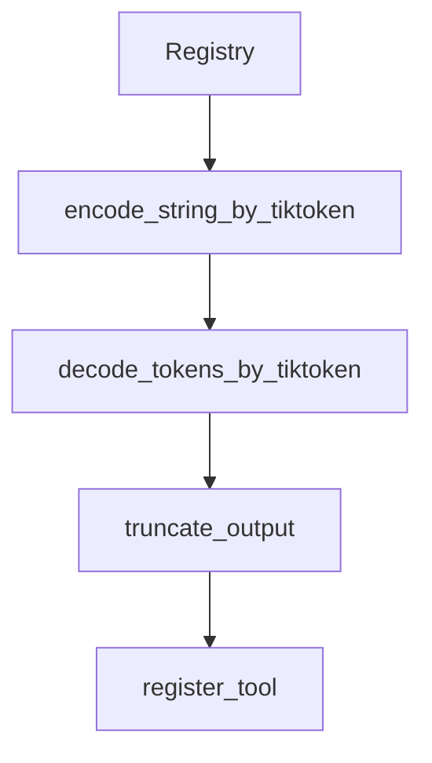

# Chapter 6: CLI Operations and Provider Strategy

Welcome to **Chapter 6: CLI Operations and Provider Strategy**. In this part of **AutoAgent Tutorial: Zero-Code Agent Creation and Automated Workflow Orchestration**, you will build an intuitive mental model first, then move into concrete implementation details and practical production tradeoffs.


This chapter covers operational patterns for running AutoAgent day-to-day.

## Learning Goals

- run CLI commands with consistent parameters
- switch providers intentionally by task profile
- monitor execution reliability across models
- reduce operational surprises in multi-provider runs

## Operational Priorities

- pin preferred completion model per workload class
- document provider fallbacks and failure policy
- keep runtime flags explicit in automation scripts

## Source References

- [AutoAgent README: CLI Mode](https://github.com/HKUDS/AutoAgent/blob/main/README.md)
- [User Guide Daily Tasks](https://github.com/HKUDS/AutoAgent/blob/main/docs/docs/User-Guideline/user-guide-daily-tasks.md)

## Summary

You now have a repeatable operations model for AutoAgent CLI workflows.

Next: [Chapter 7: Benchmarking, Evaluation, and Quality Gates](07-benchmarking-evaluation-and-quality-gates.md)

## Depth Expansion Playbook

## Source Code Walkthrough

### `autoagent/registry.py`

The `Registry` class in [`autoagent/registry.py`](https://github.com/HKUDS/AutoAgent/blob/HEAD/autoagent/registry.py) handles a key part of this chapter's functionality:

```py
            data['func'] = None  # or other default value
        return cls(**data)
class Registry:
    _instance = None
    _registry: Dict[str, Dict[str, Callable]] = {
        "tools": {},
        "agents": {}, 
        "plugin_tools": {}, 
        "plugin_agents": {},
        "workflows": {}
    }
    _registry_info: Dict[str, Dict[str, FunctionInfo]] = {
        "tools": {},
        "agents": {},
        "plugin_tools": {},
        "plugin_agents": {},
        "workflows": {}
    }
    
    def __new__(cls):
        if cls._instance is None:
            cls._instance = super().__new__(cls)
        return cls._instance
    
    def register(self, 
                type: Literal["tool", "agent", "plugin_tool", "plugin_agent", "workflow"],
                name: str = None,
                func_name: str = None):
        """
        统一的注册装饰器
        Args:
            type: 注册类型，"tool" 或 "agent"
```

This class is important because it defines how AutoAgent Tutorial: Zero-Code Agent Creation and Automated Workflow Orchestration implements the patterns covered in this chapter.

### `autoagent/registry.py`

The `encode_string_by_tiktoken` function in [`autoagent/registry.py`](https://github.com/HKUDS/AutoAgent/blob/HEAD/autoagent/registry.py) handles a key part of this chapter's functionality:

```py
MAX_OUTPUT_LENGTH = 12000

def encode_string_by_tiktoken(content: str, model_name: str = "gpt-4o"):
    ENCODER = tiktoken.encoding_for_model(model_name)
    tokens = ENCODER.encode(content)
    return tokens


def decode_tokens_by_tiktoken(tokens: list[int], model_name: str = "gpt-4o"):
    ENCODER = tiktoken.encoding_for_model(model_name)
    content = ENCODER.decode(tokens)
    return content
def truncate_output(output: str, max_length: int = MAX_OUTPUT_LENGTH) -> str:
    """Truncate output if it exceeds max_length"""
    tokens = encode_string_by_tiktoken(output)
    if len(tokens) > max_length:
        return decode_tokens_by_tiktoken(tokens[:max_length]) + f"\n\n[TOOL WARNING] Output truncated, exceeded {max_length} tokens)\n[TOOL SUGGESTION] Maybe this tool with direct output is not an optimal choice, consider save the output to a file in the `workplace/` directory to implement the same functionality."
    return output

@dataclass
class FunctionInfo:
    name: str
    func_name: str
    func: Callable
    args: List[str]
    docstring: Optional[str]
    body: str
    return_type: Optional[str]
    file_path: Optional[str]
    def to_dict(self) -> dict:
        # using asdict, but exclude func field because it cannot be serialized
        d = asdict(self)
```

This function is important because it defines how AutoAgent Tutorial: Zero-Code Agent Creation and Automated Workflow Orchestration implements the patterns covered in this chapter.

### `autoagent/registry.py`

The `decode_tokens_by_tiktoken` function in [`autoagent/registry.py`](https://github.com/HKUDS/AutoAgent/blob/HEAD/autoagent/registry.py) handles a key part of this chapter's functionality:

```py


def decode_tokens_by_tiktoken(tokens: list[int], model_name: str = "gpt-4o"):
    ENCODER = tiktoken.encoding_for_model(model_name)
    content = ENCODER.decode(tokens)
    return content
def truncate_output(output: str, max_length: int = MAX_OUTPUT_LENGTH) -> str:
    """Truncate output if it exceeds max_length"""
    tokens = encode_string_by_tiktoken(output)
    if len(tokens) > max_length:
        return decode_tokens_by_tiktoken(tokens[:max_length]) + f"\n\n[TOOL WARNING] Output truncated, exceeded {max_length} tokens)\n[TOOL SUGGESTION] Maybe this tool with direct output is not an optimal choice, consider save the output to a file in the `workplace/` directory to implement the same functionality."
    return output

@dataclass
class FunctionInfo:
    name: str
    func_name: str
    func: Callable
    args: List[str]
    docstring: Optional[str]
    body: str
    return_type: Optional[str]
    file_path: Optional[str]
    def to_dict(self) -> dict:
        # using asdict, but exclude func field because it cannot be serialized
        d = asdict(self)
        d.pop('func')  # remove func field
        return d
    
    @classmethod
    def from_dict(cls, data: dict) -> 'FunctionInfo':
        # if you need to create an object from a dictionary
```

This function is important because it defines how AutoAgent Tutorial: Zero-Code Agent Creation and Automated Workflow Orchestration implements the patterns covered in this chapter.

### `autoagent/registry.py`

The `truncate_output` function in [`autoagent/registry.py`](https://github.com/HKUDS/AutoAgent/blob/HEAD/autoagent/registry.py) handles a key part of this chapter's functionality:

```py
    content = ENCODER.decode(tokens)
    return content
def truncate_output(output: str, max_length: int = MAX_OUTPUT_LENGTH) -> str:
    """Truncate output if it exceeds max_length"""
    tokens = encode_string_by_tiktoken(output)
    if len(tokens) > max_length:
        return decode_tokens_by_tiktoken(tokens[:max_length]) + f"\n\n[TOOL WARNING] Output truncated, exceeded {max_length} tokens)\n[TOOL SUGGESTION] Maybe this tool with direct output is not an optimal choice, consider save the output to a file in the `workplace/` directory to implement the same functionality."
    return output

@dataclass
class FunctionInfo:
    name: str
    func_name: str
    func: Callable
    args: List[str]
    docstring: Optional[str]
    body: str
    return_type: Optional[str]
    file_path: Optional[str]
    def to_dict(self) -> dict:
        # using asdict, but exclude func field because it cannot be serialized
        d = asdict(self)
        d.pop('func')  # remove func field
        return d
    
    @classmethod
    def from_dict(cls, data: dict) -> 'FunctionInfo':
        # if you need to create an object from a dictionary
        if 'func' not in data:
            data['func'] = None  # or other default value
        return cls(**data)
class Registry:
```

This function is important because it defines how AutoAgent Tutorial: Zero-Code Agent Creation and Automated Workflow Orchestration implements the patterns covered in this chapter.


## How These Components Connect


