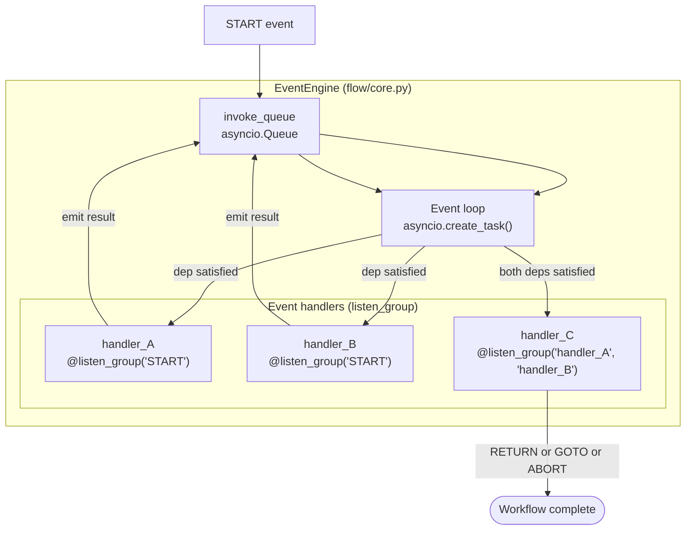
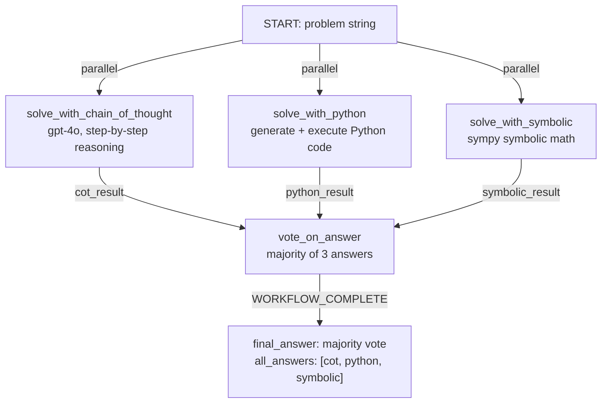

# Chapter 6: Workflow Editor: Async Event-Driven Pipelines

## What Problem Does This Solve?

The MetaChain agent loop is fundamentally sequential: one agent runs, calls tools, gets results, then either hands off or terminates. For many tasks, this is fine. But some tasks need parallelism:

- Solve 10 math problems using 3 different methods simultaneously, then vote on the best answer
- Run web research and document analysis in parallel, then merge results
- Process a batch of inputs concurrently with rate limiting

These patterns require a different execution model. AutoAgent's EventEngine provides this through an **async event-driven pipeline** where handlers declare dependencies and run concurrently when those dependencies are satisfied.

### EventEngine vs Agent Loop

| Dimension | MetaChain Agent Loop | EventEngine Workflow |
|-----------|----------------------|---------------------|
| Execution | Sequential | Async parallel |
| Coordination | Agent handoffs via Result | Event dependencies |
| State | context_variables dict | Event data passed between handlers |
| Best for | Conversational tasks, open-ended research | Batch processing, parallel computation |
| Entry point | `auto main` → `MetaChain.run()` | `run_workflow()` |

---

## EventEngine Architecture



`handler_A` and `handler_B` run in parallel immediately when `START` fires. `handler_C` waits until both complete, then runs on their combined output.

---

## Core Types (`flow/types.py`)

```python
# autoagent/flow/types.py

from enum import Enum
from dataclasses import dataclass
from typing import Any

class ReturnBehavior(Enum):
    """Controls what happens after an event handler returns."""
    RETURN = "return"    # Normal: emit result, continue pipeline
    GOTO = "goto"        # Jump to a specific event handler
    ABORT = "abort"      # Terminate the entire workflow immediately

@dataclass
class BaseEvent:
    """Base class for all events in the EventEngine."""
    name: str             # Event identifier
    data: Any = None      # Payload passed to waiting handlers
    source: str = ""      # Handler that emitted this event

@dataclass
class EventGroup:
    """A named collection of events that a handler listens to."""
    events: list[str]     # Event names this group depends on
    group_name: str = ""  # Optional name for this dependency group

@dataclass
class WorkflowResult:
    """Final result from a completed workflow."""
    output: Any
    events: list[BaseEvent]   # All events that fired
    success: bool = True
    error: str = ""
```

---

## listen_group() Decorator

The `listen_group()` decorator is how handlers declare their event dependencies:

```python
# autoagent/flow/core.py

def listen_group(*event_names: str, max_retries: int = 1):
    """Decorator that registers a function as an event handler.
    
    The function runs when ALL specified events have fired.
    
    Args:
        event_names: Event names this handler depends on
        max_retries: How many times to retry on failure
    """
    def decorator(func):
        func._listen_group = EventGroup(
            events=list(event_names),
            group_name=func.__name__,
        )
        func._max_retries = max_retries
        return func
    return decorator
```

Usage example:

```python
# autoagent/flow/math_solver_workflow_flow.py (example workflow)

from autoagent.flow.core import EventEngineCls, listen_group, GOTO, ABORT
from autoagent.flow.types import BaseEvent, ReturnBehavior

engine = EventEngineCls()

@listen_group("START")
async def solve_with_chain_of_thought(event: BaseEvent) -> BaseEvent:
    """Solve the math problem using chain-of-thought reasoning."""
    problem = event.data["problem"]
    result = await call_llm_cot(problem)
    return BaseEvent(name="cot_result", data={"answer": result, "method": "cot"})

@listen_group("START")
async def solve_with_python(event: BaseEvent) -> BaseEvent:
    """Solve the math problem by generating and running Python code."""
    problem = event.data["problem"]
    code = await generate_math_code(problem)
    result = await execute_in_docker(code)
    return BaseEvent(name="python_result", data={"answer": result, "method": "python"})

@listen_group("START")
async def solve_with_symbolic(event: BaseEvent) -> BaseEvent:
    """Solve the math problem using symbolic math (sympy)."""
    problem = event.data["problem"]
    result = await sympy_solve(problem)
    return BaseEvent(name="symbolic_result", data={"answer": result, "method": "symbolic"})

@listen_group("cot_result", "python_result", "symbolic_result")
async def vote_on_answer(
    cot_event: BaseEvent,
    python_event: BaseEvent,
    symbolic_event: BaseEvent,
) -> BaseEvent:
    """Aggregate three solutions and return the majority answer."""
    answers = [
        cot_event.data["answer"],
        python_event.data["answer"],
        symbolic_event.data["answer"],
    ]
    # Majority vote
    from collections import Counter
    most_common = Counter(answers).most_common(1)[0][0]

    return BaseEvent(
        name="WORKFLOW_COMPLETE",
        data={"final_answer": most_common, "all_answers": answers}
    )
```

The three `@listen_group("START")` handlers run **concurrently** as asyncio tasks. The `vote_on_answer` handler only fires when all three have completed.

---

## EventEngine Core (`flow/core.py`)

```python
# autoagent/flow/core.py (simplified)

import asyncio
from typing import Callable

class EventEngineCls:
    def __init__(self, max_async_events: int = 10):
        self.handlers: dict[frozenset, Callable] = {}
        self.completed_events: dict[str, BaseEvent] = {}
        self.max_async_events = max_async_events
        self._semaphore = asyncio.Semaphore(max_async_events)

    def register(self, func: Callable) -> None:
        """Register a handler by its listen_group dependency set."""
        if hasattr(func, "_listen_group"):
            key = frozenset(func._listen_group.events)
            self.handlers[key] = func

    async def invoke_event(self, event: BaseEvent) -> None:
        """Fire an event and run all handlers whose deps are now satisfied."""
        self.completed_events[event.name] = event

        # Find handlers whose all dependencies are now satisfied
        ready = []
        for dep_set, handler in self.handlers.items():
            if all(dep in self.completed_events for dep in dep_set):
                if handler.__name__ not in self.completed_events:
                    ready.append(handler)

        # Run all ready handlers concurrently
        async def run_handler(h):
            async with self._semaphore:
                deps = [self.completed_events[dep] for dep in h._listen_group.events]
                result = await h(*deps)

                if isinstance(result, tuple) and result[0] == GOTO:
                    # Jump to another handler
                    target = result[1]
                    await self.invoke_event(BaseEvent(name=target))
                elif result == ABORT:
                    # Terminate workflow
                    raise WorkflowAbortError("Workflow aborted by handler")
                else:
                    await self.invoke_event(result)

        await asyncio.gather(*[run_handler(h) for h in ready])

    async def run(self, initial_data: dict) -> WorkflowResult:
        """Start the workflow with a START event."""
        try:
            await self.invoke_event(BaseEvent(name="START", data=initial_data))
            final = self.completed_events.get("WORKFLOW_COMPLETE")
            return WorkflowResult(
                output=final.data if final else None,
                events=list(self.completed_events.values()),
                success=True,
            )
        except WorkflowAbortError as e:
            return WorkflowResult(output=None, events=[], success=False, error=str(e))
```

---

## GOTO and ABORT Behaviors

### GOTO

Jump to a different event handler, bypassing normal dependency resolution:

```python
@listen_group("validation_result")
async def check_answer_quality(event: BaseEvent) -> tuple | BaseEvent:
    """Check if the answer meets quality threshold."""
    answer = event.data["answer"]
    confidence = event.data.get("confidence", 0.0)

    if confidence < 0.7:
        # Not confident enough — retry with a different method
        return (GOTO, "solve_with_python")

    return BaseEvent(name="quality_passed", data=event.data)
```

### ABORT

Terminate the entire workflow immediately:

```python
@listen_group("input_validation")
async def validate_input(event: BaseEvent) -> BaseEvent:
    """Validate workflow input before processing."""
    problem = event.data.get("problem", "")

    if not problem or len(problem) < 5:
        return ABORT  # Terminate workflow, WorkflowResult.success = False

    return BaseEvent(name="START", data=event.data)
```

---

## WorkflowCreatorAgent (`workflow_creator.py`)

`WorkflowCreatorAgent` generates workflow Python files from natural language descriptions, following the same 4-phase pattern as the Agent Editor:

```python
# autoagent/workflow_creator.py

class WorkflowCreatorAgent:
    """Generates EventEngine workflow code from NL descriptions."""

    def generate_workflow(
        self,
        description: str,
        code_env: DockerEnv,
    ) -> str:
        """Full pipeline: NL → workflow spec → Python code → test → register."""

        # Phase 1: Generate workflow spec (event graph)
        spec = self._generate_spec(description)

        # Phase 2: Generate Python code
        code = self._generate_code(spec)

        # Phase 3: Test in Docker
        success, error = self._test_workflow(code, code_env)
        if not success:
            # Retry with error context
            code = self._regenerate_with_error(spec, error)

        # Phase 4: Register
        self._register_workflow(spec.name, code)
        return code

    def _generate_spec(self, description: str) -> WorkflowSpec:
        """Use LLM to convert NL to event graph specification."""
        # Returns WorkflowSpec with handler names and dependencies
        ...
```

### create_workflow() and run_workflow()

```python
# autoagent/edit_workflow.py

def create_workflow(name: str, code: str) -> None:
    """Save workflow code to workspace and register in registry."""
    path = Path(f"workspace/workflows/{name}_flow.py")
    path.parent.mkdir(parents=True, exist_ok=True)
    path.write_text(code)

    # Register in global registry
    registry = get_registry()
    registry["workflows"][name] = path

def run_workflow(name: str, input_data: dict) -> WorkflowResult:
    """Load and execute a registered workflow."""
    registry = get_registry()
    workflow_path = registry["workflows"][name]

    # Dynamically import the workflow module
    spec = importlib.util.spec_from_file_location(name, workflow_path)
    module = importlib.util.module_from_spec(spec)
    spec.loader.exec_module(module)

    # Get the engine instance and run
    engine = module.engine
    return asyncio.run(engine.run(input_data))
```

---

## max_async_events Parallelism Control

The `max_async_events` parameter in `EventEngineCls` controls maximum concurrent event handlers via an asyncio semaphore:

```python
# Conservative: 3 concurrent LLM calls max (respects rate limits)
engine = EventEngineCls(max_async_events=3)

# Aggressive: 20 concurrent handlers (for non-LLM tasks like HTTP requests)
engine = EventEngineCls(max_async_events=20)

# Default: 10 concurrent handlers
engine = EventEngineCls()  # max_async_events=10
```

For workflows that call LLM APIs, keep `max_async_events` low (3-5) to avoid rate limiting. For workflows that do I/O-bound work (HTTP requests, file processing), higher values improve throughput.

---

## The math_solver_workflow Example

The `math_solver_workflow_flow.py` is included in the repository as a reference implementation. Its full flow:



To run it:

```bash
# In AutoAgent CLI:
AutoAgent> Run the math_solver_workflow with problem: "What is the derivative of x^3 + 2x^2 - 5x + 3?"
```

Or programmatically:

```python
from autoagent.edit_workflow import run_workflow

result = run_workflow(
    "math_solver_workflow",
    {"problem": "What is the derivative of x^3 + 2x^2 - 5x + 3?"}
)
print(result.output["final_answer"])  # "3x^2 + 4x - 5"
```

---

## Summary

| Component | File | Role |
|-----------|------|------|
| `EventEngineCls` | `flow/core.py` | Async pipeline executor with dependency resolution |
| `listen_group()` | `flow/core.py` | Decorator to declare handler event dependencies |
| `invoke_event()` | `flow/core.py` | Fire an event and trigger ready handlers concurrently |
| `BaseEvent` | `flow/types.py` | Event with name + data payload |
| `EventGroup` | `flow/types.py` | Named set of event dependencies |
| `ReturnBehavior` | `flow/types.py` | RETURN / GOTO / ABORT flow control |
| `GOTO` | `flow/core.py` | Jump to named handler bypassing dependency resolution |
| `ABORT` | `flow/core.py` | Terminate workflow immediately |
| `max_async_events` | `flow/core.py` | Semaphore for concurrency control |
| `WorkflowCreatorAgent` | `workflow_creator.py` | NL → EventEngine workflow code generator |
| `create_workflow()` | `edit_workflow.py` | Save + register workflow file |
| `run_workflow()` | `edit_workflow.py` | Load + execute a registered workflow |
| `math_solver_workflow_flow.py` | `flow/` | Reference: parallel solving + vote aggregation |

Continue to [Chapter 7: Memory, Tool Retrieval, and Third-Party APIs](./07-memory-tool-retrieval-apis.md) to learn how AutoAgent uses ChromaDB and LLM-based reranking to discover tools from large catalogs.
