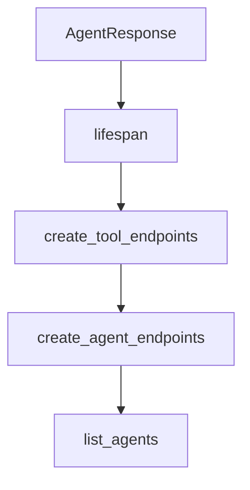

# Chapter 7: Benchmarking, Evaluation, and Quality Gates

Welcome to **Chapter 7: Benchmarking, Evaluation, and Quality Gates**. In this part of **AutoAgent Tutorial: Zero-Code Agent Creation and Automated Workflow Orchestration**, you will build an intuitive mental model first, then move into concrete implementation details and practical production tradeoffs.


This chapter focuses on evaluation rigor for AutoAgent outputs.

## Learning Goals

- align evaluation goals with benchmark constraints
- interpret benchmark claims and reproduction boundaries
- define pass/fail criteria for internal tasks
- prevent quality regressions over iterative updates

## Evaluation Guidance

- benchmark on representative scenarios, not only demos
- include cost/latency/accuracy tradeoff reporting
- gate production rollouts on repeatable evaluation passes

## Source References

- [AutoAgent Paper](https://arxiv.org/abs/2502.05957)
- [GAIA Leaderboard](https://gaia-benchmark-leaderboard.hf.space/)
- [AutoAgent Evaluation Directory](https://github.com/HKUDS/AutoAgent/tree/main/evaluation)

## Summary

You now have an evaluation loop for safer AutoAgent evolution.

Next: [Chapter 8: Contribution Workflow and Production Governance](08-contribution-workflow-and-production-governance.md)

## Depth Expansion Playbook

## Source Code Walkthrough

### `autoagent/server.py`

The `AgentResponse` class in [`autoagent/server.py`](https://github.com/HKUDS/AutoAgent/blob/HEAD/autoagent/server.py) handles a key part of this chapter's functionality:

```py
    content: str

class AgentResponse(BaseModel):
    result: str
    messages: List
    agent_name: str
# 为所有注册的tools创建endpoints
@app.on_event("startup")
def create_tool_endpoints():
    for tool_name, tool_func in registry.tools.items():
        # 创建动态的POST endpoint
        async def create_tool_endpoint(request: ToolRequest, func=tool_func):
            try:
                # 检查必需参数
                sig = inspect.signature(func)
                required_params = {
                    name for name, param in sig.parameters.items()
                    if param.default == inspect.Parameter.empty
                }
                
                # 验证是否提供了所有必需参数
                if not all(param in request.args for param in required_params):
                    missing = required_params - request.args.keys()
                    raise HTTPException(
                        status_code=400,
                        detail=f"Missing required parameters: {missing}"
                    )
                
                result = func(**request.args)
                return {"status": "success", "result": result}
            except Exception as e:
                raise HTTPException(status_code=400, detail=str(e))
```

This class is important because it defines how AutoAgent Tutorial: Zero-Code Agent Creation and Automated Workflow Orchestration implements the patterns covered in this chapter.

### `autoagent/server.py`

The `lifespan` function in [`autoagent/server.py`](https://github.com/HKUDS/AutoAgent/blob/HEAD/autoagent/server.py) handles a key part of this chapter's functionality:

```py
import inspect

# 定义lifespan上下文管理器
@asynccontextmanager
async def lifespan(app: FastAPI):
    # 启动时执行
    await create_agent_endpoints(app)
    yield
    # 关闭时执行
    # 清理代码（如果需要）

app = FastAPI(title="MetaChain API", lifespan=lifespan)

class ToolRequest(BaseModel):
    args: Dict[str, Any]

class AgentRequest(BaseModel):
    model: str
    query: str
    context_variables: Optional[Dict[str, Any]] = {}

class Message(BaseModel):
    role: str
    content: str

class AgentResponse(BaseModel):
    result: str
    messages: List
    agent_name: str
# 为所有注册的tools创建endpoints
@app.on_event("startup")
def create_tool_endpoints():
```

This function is important because it defines how AutoAgent Tutorial: Zero-Code Agent Creation and Automated Workflow Orchestration implements the patterns covered in this chapter.

### `autoagent/server.py`

The `create_tool_endpoints` function in [`autoagent/server.py`](https://github.com/HKUDS/AutoAgent/blob/HEAD/autoagent/server.py) handles a key part of this chapter's functionality:

```py
# 为所有注册的tools创建endpoints
@app.on_event("startup")
def create_tool_endpoints():
    for tool_name, tool_func in registry.tools.items():
        # 创建动态的POST endpoint
        async def create_tool_endpoint(request: ToolRequest, func=tool_func):
            try:
                # 检查必需参数
                sig = inspect.signature(func)
                required_params = {
                    name for name, param in sig.parameters.items()
                    if param.default == inspect.Parameter.empty
                }
                
                # 验证是否提供了所有必需参数
                if not all(param in request.args for param in required_params):
                    missing = required_params - request.args.keys()
                    raise HTTPException(
                        status_code=400,
                        detail=f"Missing required parameters: {missing}"
                    )
                
                result = func(**request.args)
                return {"status": "success", "result": result}
            except Exception as e:
                raise HTTPException(status_code=400, detail=str(e))
        
        # 添加endpoint到FastAPI应用
        endpoint = create_tool_endpoint
        endpoint.__name__ = f"tool_{tool_name}"
        app.post(f"/tools/{tool_name}")(endpoint)
# 重写agent endpoints创建逻辑
```

This function is important because it defines how AutoAgent Tutorial: Zero-Code Agent Creation and Automated Workflow Orchestration implements the patterns covered in this chapter.

### `autoagent/server.py`

The `create_agent_endpoints` function in [`autoagent/server.py`](https://github.com/HKUDS/AutoAgent/blob/HEAD/autoagent/server.py) handles a key part of this chapter's functionality:

```py
async def lifespan(app: FastAPI):
    # 启动时执行
    await create_agent_endpoints(app)
    yield
    # 关闭时执行
    # 清理代码（如果需要）

app = FastAPI(title="MetaChain API", lifespan=lifespan)

class ToolRequest(BaseModel):
    args: Dict[str, Any]

class AgentRequest(BaseModel):
    model: str
    query: str
    context_variables: Optional[Dict[str, Any]] = {}

class Message(BaseModel):
    role: str
    content: str

class AgentResponse(BaseModel):
    result: str
    messages: List
    agent_name: str
# 为所有注册的tools创建endpoints
@app.on_event("startup")
def create_tool_endpoints():
    for tool_name, tool_func in registry.tools.items():
        # 创建动态的POST endpoint
        async def create_tool_endpoint(request: ToolRequest, func=tool_func):
            try:
```

This function is important because it defines how AutoAgent Tutorial: Zero-Code Agent Creation and Automated Workflow Orchestration implements the patterns covered in this chapter.


## How These Components Connect


