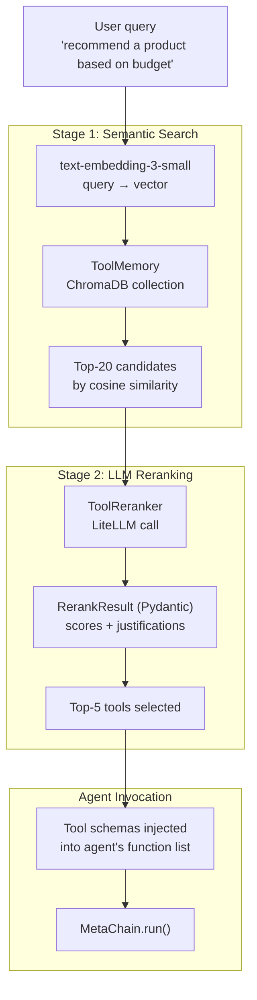
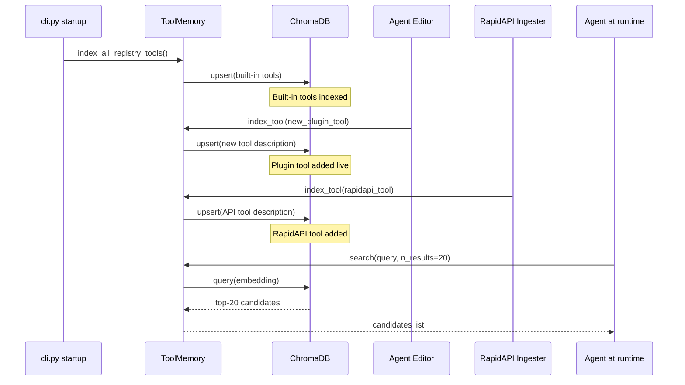

# Chapter 7: Memory, Tool Retrieval, and Third-Party APIs

## What Problem Does This Solve?

A production AutoAgent deployment might have hundreds of registered tools — scraped from RapidAPI, generated by the Agent Editor, or built by contributors. If every tool schema is included in every LLM call:

1. Context window overflows (GPT-4o: 128k tokens; each tool schema: ~200-500 tokens)
2. LLM attention diffuses — too many irrelevant tools confuse tool selection
3. Inference cost scales linearly with tool count even when most tools are irrelevant

AutoAgent solves this with a **two-stage retrieval pipeline**: semantic search (ChromaDB) narrows thousands of tools to ~20 candidates, then LLM-based reranking (ToolReranker) picks the top 5-10 for the actual tool schema list.

---

## The Two-Stage Retrieval Pipeline



---

## ToolMemory (`tool_memory.py`)

### Indexing

```python
# autoagent/tool_memory.py

import chromadb
from chromadb.utils.embedding_functions import OpenAIEmbeddingFunction

class ToolMemory:
    """Semantic search index over tool descriptions using ChromaDB."""

    def __init__(self, collection_name: str = "autoagent_tools"):
        self.client = chromadb.PersistentClient(path="./workspace/.chroma")
        self.embedding_fn = OpenAIEmbeddingFunction(
            api_key=os.getenv("OPENAI_API_KEY"),
            model_name="text-embedding-3-small",
        )
        self.collection = self.client.get_or_create_collection(
            name=collection_name,
            embedding_function=self.embedding_fn,
        )

    def index_tool(self, tool: Callable) -> None:
        """Add a tool to the semantic index."""
        # Create rich description for embedding
        schema = function_to_json(tool)
        description = f"""Tool: {schema['function']['name']}
Description: {schema['function']['description']}
Parameters: {json.dumps(schema['function']['parameters']['properties'], indent=2)}
"""
        self.collection.upsert(
            ids=[tool.__name__],
            documents=[description],
            metadatas=[{"module": tool.__module__, "is_plugin": True}],
        )

    def search(self, query: str, n_results: int = 20) -> list[dict]:
        """Semantic search: return top-n_results tools for the query."""
        results = self.collection.query(
            query_texts=[query],
            n_results=min(n_results, self.collection.count()),
        )

        tools = []
        for i, tool_id in enumerate(results["ids"][0]):
            tools.append({
                "name": tool_id,
                "description": results["documents"][0][i],
                "distance": results["distances"][0][i],
                "metadata": results["metadatas"][0][i],
            })

        return tools  # Sorted by relevance (lower distance = more relevant)

    def index_all_registry_tools(self) -> int:
        """Index all registered plugin tools. Returns count indexed."""
        registry = get_registry()
        count = 0
        for tool_name, tool_func in registry["plugin_tools"].items():
            self.index_tool(tool_func)
            count += 1
        return count
```

### ToolMemory Lifecycle



### When Tools Are Indexed

Tools are indexed at three points:
1. At session startup (`cli.py` calls `tool_memory.index_all_registry_tools()`)
2. After Agent Editor creates a new tool (`ToolEditorAgent` calls `tool_memory.index_tool()`)
3. After RapidAPI ingestion (`process_tool_docs.py` calls `tool_memory.index_tool()` for each ingested tool)

---

## ToolReranker (`tool_retriever.py`)

After semantic search returns 20 candidates, `ToolReranker` uses an LLM call to score each tool's relevance to the current query:

```python
# autoagent/tool_retriever.py

from pydantic import BaseModel

class ToolScore(BaseModel):
    tool_name: str
    relevance_score: float  # 0.0 to 1.0
    justification: str

class RerankResult(BaseModel):
    """Pydantic model for LLM reranking output."""
    scores: list[ToolScore]
    selected_tools: list[str]  # Top-K tool names after reranking

class ToolReranker:
    """LLM-based tool reranker for precision after semantic search recall."""

    def __init__(self, model: str = "gpt-4o-mini", top_k: int = 5):
        self.model = model   # Use a small/fast model for reranking
        self.top_k = top_k

    def rerank(self, query: str, candidates: list[dict]) -> list[str]:
        """Score candidates and return top-k tool names."""
        candidates_text = "\n\n".join([
            f"Tool {i+1}: {c['name']}\n{c['description']}"
            for i, c in enumerate(candidates)
        ])

        prompt = f"""Given this user query:
"{query}"

Score each tool's relevance (0.0-1.0) and select the {self.top_k} most useful tools.

Tools to evaluate:
{candidates_text}

Return a JSON object matching this schema:
{{
  "scores": [
    {{"tool_name": "...", "relevance_score": 0.9, "justification": "..."}}
  ],
  "selected_tools": ["tool1", "tool2", ...]  // top {self.top_k} names
}}"""

        response = litellm.completion(
            model=self.model,
            messages=[{"role": "user", "content": prompt}],
            response_format={"type": "json_object"},
        )

        result = RerankResult.model_validate_json(
            response.choices[0].message.content
        )
        return result.selected_tools[:self.top_k]
```

The key design choice: use `gpt-4o-mini` (fast, cheap) for reranking, not the full `gpt-4o`. Reranking is a classification task that doesn't need the full model's reasoning capability.

---

## RAGMemory and Document Retrieval (`rag_memory.py`)

`RAGMemory` provides semantic search over document chunks for knowledge-intensive tasks:

```python
# autoagent/rag_memory.py

class RAGMemory:
    """Document chunk storage and retrieval using ChromaDB."""

    def __init__(self, collection_name: str = "autoagent_docs"):
        self.client = chromadb.PersistentClient(path="./workspace/.chroma")
        self.embedding_fn = OpenAIEmbeddingFunction(
            api_key=os.getenv("OPENAI_API_KEY"),
            model_name="text-embedding-3-small",
        )
        self.collection = self.client.get_or_create_collection(
            name=collection_name,
            embedding_function=self.embedding_fn,
        )

    def add_document(
        self,
        text: str,
        doc_id: str,
        chunk_size: int = 500,
        overlap: int = 50,
    ) -> int:
        """Chunk a document and add all chunks to the index."""
        chunks = self._chunk_text(text, chunk_size, overlap)
        ids = [f"{doc_id}__chunk_{i}" for i in range(len(chunks))]

        self.collection.upsert(
            ids=ids,
            documents=chunks,
            metadatas=[{"doc_id": doc_id, "chunk_index": i} for i in range(len(chunks))],
        )
        return len(chunks)

    def query(self, query: str, n_results: int = 5) -> list[str]:
        """Return top-n_results relevant chunks."""
        results = self.collection.query(
            query_texts=[query],
            n_results=n_results,
        )
        return results["documents"][0]

    def _chunk_text(self, text: str, chunk_size: int, overlap: int) -> list[str]:
        """Split text into overlapping chunks by word count."""
        words = text.split()
        chunks = []
        for i in range(0, len(words), chunk_size - overlap):
            chunk = " ".join(words[i:i + chunk_size])
            if chunk:
                chunks.append(chunk)
        return chunks
```

### RAG Tools (`rag_tools.py`)

```python
# autoagent/rag_tools.py

from autoagent.registry import register_tool

@register_tool
def rag_search(query: str, context_variables: dict) -> str:
    """Search indexed documents for relevant passages.
    
    Use when you need to find specific information from previously
    loaded documents or knowledge bases.
    """
    rag_memory = context_variables.get("rag_memory")
    if not rag_memory:
        return "RAG memory not initialized. Load documents first."

    chunks = rag_memory.query(query, n_results=5)
    return "\n\n---\n\n".join(chunks)

@register_tool
def add_document_to_rag(
    file_path: str,
    doc_id: str,
    context_variables: dict,
) -> str:
    """Load a document into RAG memory for semantic search."""
    rag_memory = context_variables.get("rag_memory")
    file_env = context_variables.get("file_env")

    content = file_env.visit_page(file_path)
    chunk_count = rag_memory.add_document(content, doc_id)
    return f"Indexed {chunk_count} chunks from {file_path}"
```

---

## CodeMemory (`code_memory.py`)

`CodeMemory` specializes in codebase navigation — indexing source files so agents can find relevant code by describing its function:

```python
# autoagent/code_memory.py

class CodeMemory:
    """Semantic search over source code for codebase navigation tasks."""

    def __init__(self):
        self.client = chromadb.PersistentClient(path="./workspace/.chroma")
        # Use a code-specific embedding model
        self.embedding_fn = OpenAIEmbeddingFunction(
            api_key=os.getenv("OPENAI_API_KEY"),
            model_name="text-embedding-3-small",
        )
        self.collection = self.client.get_or_create_collection(
            name="autoagent_code",
            embedding_function=self.embedding_fn,
        )

    def index_repository(self, repo_path: str) -> int:
        """Index all Python files in a repository."""
        count = 0
        for py_file in Path(repo_path).rglob("*.py"):
            content = py_file.read_text()
            # Index at function/class level for precision
            for chunk in self._extract_code_chunks(content, str(py_file)):
                self.collection.upsert(
                    ids=[chunk["id"]],
                    documents=[chunk["content"]],
                    metadatas=[chunk["metadata"]],
                )
                count += 1
        return count

    def find_relevant_code(self, description: str, n_results: int = 5) -> list[dict]:
        """Find code chunks matching a natural language description."""
        results = self.collection.query(
            query_texts=[description],
            n_results=n_results,
        )
        return [
            {
                "file": results["metadatas"][0][i]["file"],
                "function": results["metadatas"][0][i].get("function", ""),
                "code": results["documents"][0][i],
            }
            for i in range(len(results["ids"][0]))
        ]
```

---

## RapidAPI Ingestion (`process_tool_docs.py`)

AutoAgent can ingest tools from RapidAPI's 50,000+ API catalog:

```python
# autoagent/process_tool_docs.py

class RapidAPIIngester:
    """Ingests RapidAPI tool documentation and generates AutoAgent tools."""

    def __init__(self, rapidapi_key: str):
        self.rapidapi_key = rapidapi_key
        self.headers = {
            "X-RapidAPI-Key": rapidapi_key,
            "X-RapidAPI-Host": "rapidapi.com",
        }

    def ingest_api(
        self,
        api_name: str,
        endpoint_docs: dict,
        tool_memory: ToolMemory,
    ) -> list[Callable]:
        """Convert RapidAPI endpoint documentation to AutoAgent tools."""
        tools = []

        for endpoint_name, endpoint_info in endpoint_docs.items():
            # Generate tool function from API docs
            tool_code = self._generate_tool_code(
                api_name=api_name,
                endpoint_name=endpoint_name,
                endpoint_info=endpoint_info,
            )

            # Execute to get function object
            namespace = {}
            exec(tool_code, namespace)
            tool_func = namespace[endpoint_name.replace("/", "_")]

            # Apply plugin tool decorator (adds 12k token cap)
            tool_func = register_plugin_tool(tool_func)

            # Index in ToolMemory
            tool_memory.index_tool(tool_func)
            tools.append(tool_func)

        return tools

    def _generate_tool_code(
        self,
        api_name: str,
        endpoint_name: str,
        endpoint_info: dict,
    ) -> str:
        """Generate a Python wrapper function for a RapidAPI endpoint."""
        params = endpoint_info.get("parameters", [])
        param_str = ", ".join([
            f"{p['name']}: {p.get('type', 'str')} = None"
            for p in params
        ])

        return f'''
import requests
from autoagent.registry import register_plugin_tool

@register_plugin_tool
def {endpoint_name.replace("/", "_")}({param_str}) -> str:
    """{endpoint_info.get("description", f"Call {api_name} {endpoint_name} endpoint")}"""
    url = "https://rapidapi.com/{api_name}/{endpoint_name}"
    headers = {{
        "X-RapidAPI-Key": os.getenv("RAPIDAPI_KEY"),
        "X-RapidAPI-Host": "{api_name}.rapidapi.com",
    }}
    params = {{{", ".join([f'"{p["name"]}": {p["name"]}' for p in params])}}}
    response = requests.get(url, headers=headers, params=params)
    return response.text
'''
```

---

## The 12,000-Token Output Cap

All plugin tools automatically have their output truncated to 12,000 tokens via the `@register_plugin_tool` decorator:

```python
# autoagent/registry.py

import tiktoken

def truncate_output(output: str, max_tokens: int = 12000) -> str:
    """Truncate output to max_tokens using tiktoken counting."""
    enc = tiktoken.get_encoding("cl100k_base")
    tokens = enc.encode(output)

    if len(tokens) <= max_tokens:
        return output

    truncated = enc.decode(tokens[:max_tokens])
    return truncated + f"\n\n[OUTPUT TRUNCATED: {len(tokens) - max_tokens} tokens omitted]"

def register_plugin_tool(func: Callable) -> Callable:
    """Register a tool in the plugin_tools namespace with output truncation."""
    @wraps(func)
    def wrapped(*args, **kwargs):
        result = func(*args, **kwargs)
        return truncate_output(str(result))

    # Store original for introspection
    wrapped.__wrapped__ = func
    wrapped.__name__ = func.__name__

    # Register in global registry
    _registry["plugin_tools"][func.__name__] = wrapped
    return wrapped
```

The cap prevents runaway LLM costs when tools return large payloads (full web pages, large CSV files, API responses). The built-in `@register_tool` decorator does NOT apply this cap — it's only for plugin tools.

### Token Budget Enforcement

| Decorator | Output Cap | Use Case |
|-----------|-----------|----------|
| `@register_plugin_tool` | 12,000 tokens | User-generated and RapidAPI tools |
| `@register_tool` | None | Built-in system tools (trusted, controlled output) |

---

## GitHub Client (`github_client.py`)

For agent workflows that interact with GitHub:

```python
# autoagent/github_client.py (simplified)

class GitHubClient:
    """Wrapper for common GitHub operations used in research workflows."""

    def __init__(self, token: str):
        from github import Github
        self.gh = Github(token)

    def get_repo_info(self, owner: str, repo: str) -> dict:
        """Get repository metadata including stars, language, license."""
        r = self.gh.get_repo(f"{owner}/{repo}")
        return {
            "name": r.name,
            "stars": r.stargazers_count,
            "language": r.language,
            "license": r.license.name if r.license else "Unknown",
            "description": r.description,
            "last_updated": r.updated_at.isoformat(),
        }

    def search_code(self, query: str, repo: str | None = None) -> list[dict]:
        """Search code across GitHub or within a specific repo."""
        search_query = f"{query} repo:{repo}" if repo else query
        results = self.gh.search_code(search_query)
        return [
            {"path": r.path, "url": r.html_url, "sha": r.sha}
            for r in results[:10]
        ]
```

---

## Summary

| Component | File | Role |
|-----------|------|------|
| `ToolMemory` | `tool_memory.py` | ChromaDB index over tool descriptions |
| `ToolReranker` | `tool_retriever.py` | LLM-based reranking of semantic search candidates |
| `RerankResult` | `tool_retriever.py` | Pydantic model for reranker output |
| `RAGMemory` | `rag_memory.py` | Chunked document index for knowledge retrieval |
| `rag_search()` | `rag_tools.py` | Tool to query RAG memory |
| `CodeMemory` | `code_memory.py` | Codebase semantic search at function/class level |
| `RapidAPIIngester` | `process_tool_docs.py` | Convert RapidAPI docs to AutoAgent tools |
| `truncate_output()` | `registry.py` | Enforce 12k token cap on plugin tool output |
| `@register_plugin_tool` | `registry.py` | Register with 12k cap (user-generated tools) |
| `@register_tool` | `registry.py` | Register without cap (built-in system tools) |
| `GitHubClient` | `github_client.py` | GitHub API operations for research workflows |
| `text-embedding-3-small` | (OpenAI API) | Embedding model for all ChromaDB collections |

Continue to [Chapter 8: Evaluation, Benchmarks, and Contributing](./08-evaluation-benchmarks-contributing.md) to learn how to run GAIA benchmarks, add new evaluation suites, and contribute tools and agents to the ecosystem.
