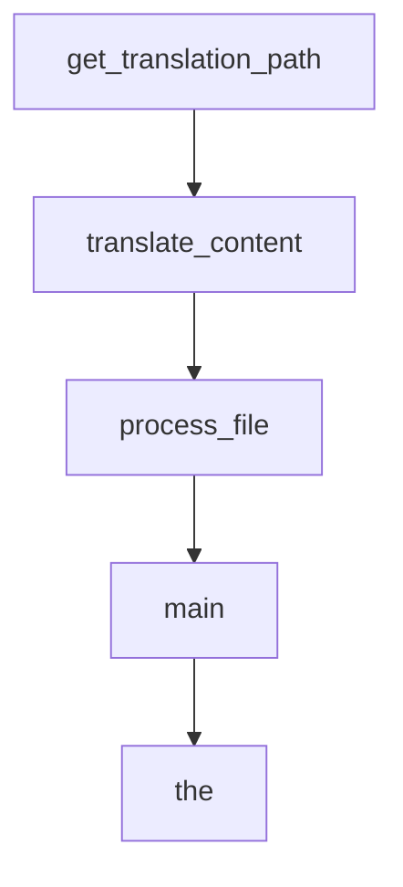

# Chapter 8: Contribution Workflow and Production Governance

Welcome to **Chapter 8: Contribution Workflow and Production Governance**. In this part of **AutoAgent Tutorial: Zero-Code Agent Creation and Automated Workflow Orchestration**, you will build an intuitive mental model first, then move into concrete implementation details and practical production tradeoffs.


This chapter closes with contribution and governance patterns for team adoption.

## Learning Goals

- follow contribution conventions and code quality expectations
- define governance controls for tool-creating agents
- separate experimental and production usage paths
- preserve auditability and rollback capability

## Governance Checklist

- require review gates for generated tool/workflow changes
- track environment and model config per deployment
- enforce secure key handling and runtime isolation

## Source References

- [AutoAgent Repository](https://github.com/HKUDS/AutoAgent)
- [AutoAgent Issues](https://github.com/HKUDS/AutoAgent/issues)
- [Developer Guide: Create Agent](https://github.com/HKUDS/AutoAgent/blob/main/docs/docs/Dev-Guideline/dev-guide-create-agent.md)

## Summary

You now have a full AutoAgent path from quickstart to governed production usage.

Next tutorial: [Beads Tutorial](../beads-tutorial/)

## Depth Expansion Playbook

## Source Code Walkthrough

### `docs/translation_updater.py`

The `get_translation_path` function in [`docs/translation_updater.py`](https://github.com/HKUDS/AutoAgent/blob/HEAD/docs/translation_updater.py) handles a key part of this chapter's functionality:

```py


def get_translation_path(source_path, lang):
    """Get the corresponding translation file path for a source file."""
    relative_path = os.path.relpath(source_path, 'docs/modules')
    return f'docs/i18n/{lang}/docusaurus-plugin-content-docs/current/{relative_path}'


def translate_content(content, target_lang):
    """Translate content using Anthropic's Claude."""
    system_prompt = f'You are a professional translator. Translate the following content into {target_lang}. Preserve all Markdown formatting, code blocks, and front matter. Keep any {} tags and similar intact. Do not translate code examples, URLs, or technical terms.'

    message = client.messages.create(
        model='claude-3-opus-20240229',
        max_tokens=4096,
        temperature=0,
        system=system_prompt,
        messages=[
            {'role': 'user', 'content': f'Please translate this content:\n\n{content}'}
        ],
    )

    return message.content[0].text


def process_file(source_path, lang):
    """Process a single file for translation."""
    # Skip non-markdown files
    if not source_path.endswith(('.md', '.mdx')):
        return

    translation_path = get_translation_path(source_path, lang)
```

This function is important because it defines how AutoAgent Tutorial: Zero-Code Agent Creation and Automated Workflow Orchestration implements the patterns covered in this chapter.

### `docs/translation_updater.py`

The `translate_content` function in [`docs/translation_updater.py`](https://github.com/HKUDS/AutoAgent/blob/HEAD/docs/translation_updater.py) handles a key part of this chapter's functionality:

```py


def translate_content(content, target_lang):
    """Translate content using Anthropic's Claude."""
    system_prompt = f'You are a professional translator. Translate the following content into {target_lang}. Preserve all Markdown formatting, code blocks, and front matter. Keep any {} tags and similar intact. Do not translate code examples, URLs, or technical terms.'

    message = client.messages.create(
        model='claude-3-opus-20240229',
        max_tokens=4096,
        temperature=0,
        system=system_prompt,
        messages=[
            {'role': 'user', 'content': f'Please translate this content:\n\n{content}'}
        ],
    )

    return message.content[0].text


def process_file(source_path, lang):
    """Process a single file for translation."""
    # Skip non-markdown files
    if not source_path.endswith(('.md', '.mdx')):
        return

    translation_path = get_translation_path(source_path, lang)
    os.makedirs(os.path.dirname(translation_path), exist_ok=True)

    # Read source content
    with open(source_path, 'r', encoding='utf-8') as f:
        content = f.read()

```

This function is important because it defines how AutoAgent Tutorial: Zero-Code Agent Creation and Automated Workflow Orchestration implements the patterns covered in this chapter.

### `docs/translation_updater.py`

The `process_file` function in [`docs/translation_updater.py`](https://github.com/HKUDS/AutoAgent/blob/HEAD/docs/translation_updater.py) handles a key part of this chapter's functionality:

```py


def process_file(source_path, lang):
    """Process a single file for translation."""
    # Skip non-markdown files
    if not source_path.endswith(('.md', '.mdx')):
        return

    translation_path = get_translation_path(source_path, lang)
    os.makedirs(os.path.dirname(translation_path), exist_ok=True)

    # Read source content
    with open(source_path, 'r', encoding='utf-8') as f:
        content = f.read()

    # Parse frontmatter if exists
    has_frontmatter = content.startswith('---')
    if has_frontmatter:
        post = frontmatter.loads(content)
        metadata = post.metadata
        content_without_frontmatter = post.content
    else:
        metadata = {}
        content_without_frontmatter = content

    # Translate the content
    print('translating...', source_path, lang)
    translated_content = translate_content(content_without_frontmatter, LANGUAGES[lang])
    print('translation done')

    # Reconstruct the file with frontmatter if it existed
    if has_frontmatter:
```

This function is important because it defines how AutoAgent Tutorial: Zero-Code Agent Creation and Automated Workflow Orchestration implements the patterns covered in this chapter.

### `docs/translation_updater.py`

The `main` function in [`docs/translation_updater.py`](https://github.com/HKUDS/AutoAgent/blob/HEAD/docs/translation_updater.py) handles a key part of this chapter's functionality:

```py


def main():
    previous_hashes = load_file_hashes()

    current_hashes = {}

    # Walk through all files in docs/modules
    for root, _, files in os.walk('docs/modules'):
        for file in files:
            if file.endswith(('.md', '.mdx')):
                filepath = os.path.join(root, file)
                current_hash = get_file_hash(filepath)
                current_hashes[filepath] = current_hash

                # Check if file is new or modified
                if (
                    filepath not in previous_hashes
                    or previous_hashes[filepath] != current_hash
                ):
                    print(f'Change detected in {filepath}')
                    for lang in LANGUAGES:
                        process_file(filepath, lang)

    print('all files up to date, saving hashes')
    save_file_hashes(current_hashes)
    previous_hashes = current_hashes


if __name__ == '__main__':
    main()

```

This function is important because it defines how AutoAgent Tutorial: Zero-Code Agent Creation and Automated Workflow Orchestration implements the patterns covered in this chapter.


## How These Components Connect


