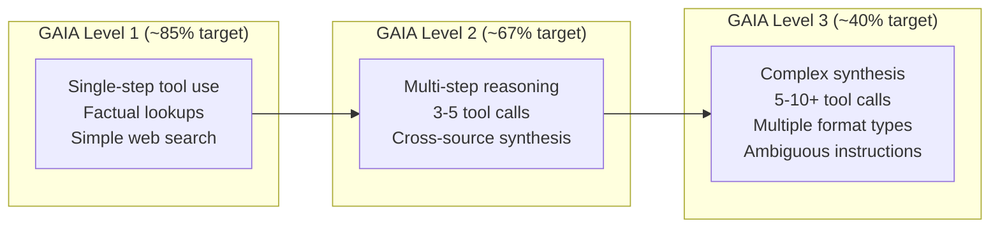
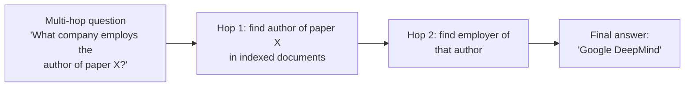
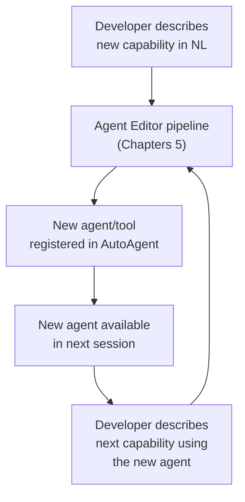

# Chapter 8: Evaluation, Benchmarks, and Contributing

## What Problem Does This Solve?

Agent frameworks are easy to demo but hard to evaluate. A framework that gets 70% of trivial tasks right and fails on complex multi-step reasoning isn't suitable for production. AutoAgent addresses this through three rigorously maintained benchmarks:

- **GAIA** — general AI assistant tasks requiring multi-step tool use (web + files + code)
- **Agentic-RAG** — multi-hop document retrieval and reasoning
- **Math500** — mathematical problem solving with majority-vote verification

Running these benchmarks yourself lets you:
1. Verify that your model/configuration choices maintain baseline performance
2. Measure the impact of custom tools or agent modifications
3. Catch regressions before deploying changes

---

## GAIA Benchmark

### What GAIA Tests

GAIA (General AI Assistants benchmark) measures whether an agent can complete real-world tasks that require tool use, multi-step reasoning, and synthesis across multiple sources.



**Level 1 examples:**
- "What is the capital of the country where the Eiffel Tower is located?"
- "How many Python files are in the AutoAgent repository?"

**Level 2 examples:**
- "Find the 2023 paper on chain-of-thought prompting and summarize its main contributions"
- "Download the latest AutoAgent release, count the test files, and report the result"

**Level 3 examples:**
- "Given this PDF of a scientific paper, identify all datasets mentioned, find the primary one online, download a sample, and compute the mean of column 3"
- "Find all GitHub issues labeled 'bug' in AutoAgent created in the last month, categorize them by component, and write a summary report"

### Running GAIA Evaluation

```bash
cd evaluation/gaia
python run_infer.py \
    --model gpt-4o \
    --max-workers 5 \
    --output results_gpt4o.json \
    --level all
```

Parameters:

| Parameter | Description | Default |
|-----------|-------------|---------|
| `--model` | LiteLLM model string | gpt-4o |
| `--max-workers` | Parallel Docker containers | 5 |
| `--output` | Results JSON file path | results.json |
| `--level` | GAIA level: 1, 2, 3, or all | all |
| `--subset` | Number of tasks to run (for quick tests) | all |

### run_infer.py Architecture

```python
# evaluation/gaia/run_infer.py (simplified)

import filelock
import concurrent.futures
from pathlib import Path

def run_single_task(
    task: dict,
    model: str,
    port: int,
) -> dict:
    """Run a single GAIA task in an isolated Docker container."""
    # Each worker gets its own TCP port to avoid container conflicts
    docker_config = DockerConfig(tcp_port=port, container_name=f"gaia_eval_{port}")
    code_env = DockerEnv(docker_config)
    code_env.init_container()

    web_env = BrowserEnv()
    web_env.init()
    file_env = RequestsMarkdownBrowser()

    context_variables = {
        "code_env": code_env,
        "web_env": web_env,
        "file_env": file_env,
    }

    chain = MetaChain(model=model)
    response = chain.run(
        agent=system_triage_agent,
        messages=[{"role": "user", "content": task["question"]}],
        context_variables=context_variables,
        max_turns=50,  # Higher limit for complex GAIA tasks
    )

    # Extract final answer from response
    final_message = response.messages[-1]["content"]

    # Cleanup
    code_env.container.stop()
    web_env.browser.close()

    return {
        "task_id": task["task_id"],
        "question": task["question"],
        "expected": task["final_answer"],
        "predicted": final_message,
        "level": task["level"],
    }

def run_infer(model: str, max_workers: int, output_path: str):
    """Run all GAIA tasks in parallel with port management."""
    tasks = load_gaia_tasks()  # From HuggingFace datasets
    available_ports = list(range(12346, 12346 + max_workers * 2))
    port_lock = filelock.FileLock("ports.lock")

    results = []

    def get_free_port() -> int:
        """Thread-safe port allocation."""
        with port_lock:
            port = available_ports.pop(0)
            return port

    def return_port(port: int) -> None:
        with port_lock:
            available_ports.append(port)

    with concurrent.futures.ThreadPoolExecutor(max_workers=max_workers) as executor:
        futures = []
        for task in tasks:
            port = get_free_port()
            future = executor.submit(run_single_task, task, model, port)
            future.add_done_callback(lambda f, p=port: return_port(p))
            futures.append(future)

        for future in concurrent.futures.as_completed(futures):
            result = future.result()
            results.append(result)
            print(f"Completed task {result['task_id']}: {result['task_id']}")

    # Save results
    with open(output_path, "w") as f:
        json.dump(results, f, indent=2)

    # Print scores
    scorer = GAIAScorer()
    scores = scorer.score(results)
    print(f"\nGAIA Results:")
    print(f"  Level 1: {scores['level_1']:.1%}")
    print(f"  Level 2: {scores['level_2']:.1%}")
    print(f"  Level 3: {scores['level_3']:.1%}")
    print(f"  Overall: {scores['overall']:.1%}")
```

### Port Management with filelock

Running multiple DockerEnvs simultaneously requires each to use a different TCP port. The `filelock` library provides thread-safe port allocation across workers:

```python
# evaluation/gaia/run_infer.py

import filelock

# Each evaluation run uses a unique port range
BASE_PORT = 12346
port_pool = [BASE_PORT + i * 2 for i in range(max_workers)]
lock = filelock.FileLock("/tmp/autoagent_ports.lock")
```

---

## scorer.py

```python
# evaluation/gaia/scorer.py

class GAIAScorer:
    """Scores GAIA evaluation results against ground truth."""

    def score(self, results: list[dict]) -> dict:
        """Compute accuracy per level and overall."""
        by_level = {1: [], 2: [], 3: []}

        for result in results:
            correct = self._is_correct(
                result["predicted"],
                result["expected"],
            )
            level = result["level"]
            by_level[level].append(correct)

        scores = {}
        for level, is_correct_list in by_level.items():
            if is_correct_list:
                scores[f"level_{level}"] = sum(is_correct_list) / len(is_correct_list)

        all_correct = [c for lst in by_level.values() for c in lst]
        scores["overall"] = sum(all_correct) / len(all_correct) if all_correct else 0.0

        return scores

    def _is_correct(self, predicted: str, expected: str) -> bool:
        """Fuzzy match: normalize and compare answers."""
        pred = self._normalize(predicted)
        exp = self._normalize(expected)

        # Exact match after normalization
        if pred == exp:
            return True

        # Number equivalence (e.g., "42" == "42.0")
        try:
            return float(pred) == float(exp)
        except ValueError:
            pass

        # Substring match for longer answers
        return exp in pred or pred in exp

    def _normalize(self, text: str) -> str:
        """Normalize text for comparison."""
        text = text.lower().strip()
        # Remove common prefixes that agents add
        for prefix in ["the answer is", "final answer:", "answer:"]:
            if text.startswith(prefix):
                text = text[len(prefix):].strip()
        return text
```

---

## Agentic-RAG Evaluation (`evaluation/multihoprag/`)

The Agentic-RAG benchmark tests multi-hop document retrieval — questions that require combining information from multiple documents that individually don't contain the answer.



```bash
cd evaluation/multihoprag
python run_eval.py \
    --model gpt-4o \
    --dataset multihop_rag_v1 \
    --output results_rag.json
```

---

## Math500 with Voting Workflow (`evaluation/math500/`)

Math500 evaluates mathematical problem solving using the `math_solver_workflow` (3-method parallel voting):

```bash
cd evaluation/math500
python run_eval.py \
    --workflow math_solver_workflow \
    --output results_math.json
```

The workflow runs each of the 500 problems through the `math_solver_workflow_flow.py` (see Chapter 6) with 3-way majority voting between chain-of-thought, Python execution, and symbolic math methods.

---

## Adding a New Benchmark

To add a benchmark to AutoAgent's evaluation suite:

### Step 1: Create the directory structure

```
evaluation/
  my_benchmark/
    __init__.py
    run_eval.py       # Main evaluation script
    scorer.py         # Task-specific scoring logic
    README.md         # Benchmark description and results
    data/             # Test cases (or link to HuggingFace dataset)
```

### Step 2: Implement run_eval.py

```python
# evaluation/my_benchmark/run_eval.py

import argparse
from autoagent.core import MetaChain
from autoagent.docker_env import DockerEnv, DockerConfig
from autoagent.browser_env import BrowserEnv
from autoagent.markdown_browser import RequestsMarkdownBrowser

def run_task(task: dict, model: str, port: int) -> dict:
    """Run a single benchmark task."""
    # Standard environment setup (same as GAIA)
    code_env = DockerEnv(DockerConfig(tcp_port=port))
    code_env.init_container()
    
    context_variables = {
        "code_env": code_env,
        "web_env": BrowserEnv(),
        "file_env": RequestsMarkdownBrowser(),
    }

    chain = MetaChain(model=model)
    response = chain.run(
        agent=system_triage_agent,
        messages=[{"role": "user", "content": task["question"]}],
        context_variables=context_variables,
    )

    return {
        "task_id": task["id"],
        "predicted": response.messages[-1]["content"],
        "expected": task["answer"],
    }

if __name__ == "__main__":
    parser = argparse.ArgumentParser()
    parser.add_argument("--model", default="gpt-4o")
    parser.add_argument("--output", default="results.json")
    args = parser.parse_args()
    # ... run tasks and score
```

---

## Contributing Tools

### @register_tool vs @register_plugin_tool

The choice of decorator determines whether your tool gets the 12,000-token output cap:

```python
# For built-in system tools: no output cap
# Use when: output is always bounded and controlled
from autoagent.registry import register_tool

@register_tool
def get_current_time() -> str:
    """Return the current UTC time as ISO 8601 string."""
    from datetime import datetime, timezone
    return datetime.now(timezone.utc).isoformat()

# For user/plugin tools: automatic 12k token cap
# Use when: output could be unbounded (web pages, API responses, files)
from autoagent.registry import register_plugin_tool

@register_plugin_tool
def fetch_news_headlines(topic: str, count: int = 10) -> str:
    """Fetch the latest news headlines for a topic.
    
    Args:
        topic: Search topic for news
        count: Number of headlines to return (default 10)
        
    Returns:
        JSON list of headlines with title, source, and URL
    """
    # Implementation that could return large amounts of text
    ...
```

### Contribution Checklist

For tools:
- [ ] Use `@register_plugin_tool` for any tool with potentially large output
- [ ] Write a comprehensive docstring (becomes the LLM's tool description)
- [ ] Include type annotations for all parameters (used in tool schema generation)
- [ ] Handle exceptions gracefully — return error strings, don't raise
- [ ] Test with `DockerEnv.execute_code()` for any code execution tools
- [ ] Add to `autoagent/tools/` directory

For agents:
- [ ] Use `@register_plugin_agent` with a factory function pattern
- [ ] Include `case_resolved` and `case_not_resolved` in the function list
- [ ] Write a clear `instructions` string that describes when to use each tool
- [ ] Add transfer-back functions to return to the calling agent
- [ ] Save to `autoagent/agents/` directory

---

## The Self-Developing Loop

AutoAgent's most ambitious feature is that it can extend itself: the Agent Editor uses AutoAgent to create new agents for AutoAgent. This creates a compounding development loop:



In practice, this means:
1. You describe a new tool (e.g., "a tool that searches academic papers on arXiv")
2. Agent Editor generates, tests, and registers it
3. In the next session, `SystemTriageAgent` can use it immediately via ToolMemory discovery
4. You can then describe a more complex agent that uses arXiv search plus web browsing plus PDF analysis

The GITHUB_AI_TOKEN requirement enables this: the Docker container clones the AutoAgent repo to understand the full codebase when generating new code that integrates with the existing architecture.

---

## Roadmap

Based on the paper (arxiv:2502.05957) and repository issues, upcoming evaluation and integration targets include:

| Target | Description | Status |
|--------|-------------|--------|
| SWE-bench | Software engineering task evaluation | Planned |
| WebArena | Full web browser automation benchmark | Planned |
| E2B sandbox | Alternative to Docker for code execution | Planned |
| Composio | Third-party tool integration platform | Planned |
| WebArena | Complex multi-step web navigation | Planned |
| HumanEval | Python code generation benchmark | Planned |

Contributing to these evaluations is the highest-impact contribution path: implementing a new benchmark runner that demonstrates AutoAgent's strengths on an established evaluation suite.

---

## Summary

| Component | File | Role |
|-----------|------|------|
| `run_infer.py` | `evaluation/gaia/` | Parallel GAIA evaluation with Docker + filelock |
| `scorer.py` | `evaluation/gaia/` | Fuzzy answer matching and accuracy by level |
| `run_eval.py` | `evaluation/multihoprag/` | Agentic-RAG multi-hop evaluation |
| `run_eval.py` | `evaluation/math500/` | Math500 with voting workflow |
| `filelock` | `evaluation/gaia/` | Thread-safe port pool for parallel workers |
| `@register_tool` | `registry.py` | Built-in tool registration (no output cap) |
| `@register_plugin_tool` | `registry.py` | Plugin tool registration (12k token cap) |
| `@register_plugin_agent` | `registry.py` | Agent factory registration |
| GAIA Level 1/2/3 | Benchmark | Progressive difficulty: 85% / 67% / 40% targets |
| Self-developing loop | Agent Editor | AutoAgent extends AutoAgent using Agent Editor |

This chapter completes the AutoAgent tutorial. The full architecture picture — MetaChain engine (Chapter 2), environment triad (Chapter 3), deep research system (Chapter 4), agent editor (Chapter 5), workflow editor (Chapter 6), memory and retrieval (Chapter 7), and evaluation (Chapter 8) — gives you everything needed to deploy, extend, and contribute to AutoAgent in production.
