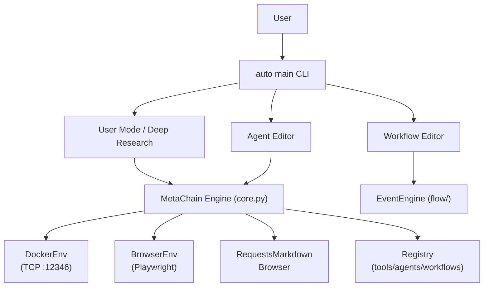

# AutoAgent Tutorial

AutoAgent (formerly MetaChain) is a **zero-code autonomous agent framework** from HKUDS that lets you describe agents in plain English and have them generated, tested, and deployed automatically. With 9,116 GitHub stars and an academic paper (arxiv:2502.05957), it represents a significant step toward democratizing multi-agent system development.

## What You Will Learn

This tutorial walks through AutoAgent from first install to production-grade multi-agent pipelines. By the end, you will understand how the MetaChain engine works under the hood, how all three operating modes fit together, and how to extend the framework with your own tools, agents, and workflows.

## Who This Tutorial Is For

- Developers who want to build research or automation agents without writing orchestration boilerplate
- ML engineers evaluating AutoAgent for benchmarks (GAIA, Math500, Agentic-RAG)
- Contributors looking to add tools, agents, or new evaluation suites to the ecosystem

## Naming Note

The internal codebase uses the class name **MetaChain** throughout — the project was publicly renamed from MetaChain to AutoAgent in February 2025. You will see `from autoagent import MetaChain` and `MetaChain.run()` in all source files. This tutorial uses "AutoAgent" when referring to the product and "MetaChain" when referring to the specific class or import.

## Three Operating Modes

| Mode | Entry Point | Best For |
|------|-------------|----------|
| User Mode (Deep Research) | `auto main` | Open-ended research, file analysis, web browsing |
| Agent Editor | `auto main` → "create agent" | Generating new agents from NL descriptions |
| Workflow Editor | `auto main` → "create workflow" | Composing async parallel pipelines |

## Tutorial Chapters

1. [Getting Started](./01-getting-started.md) — Install, .env setup, first research task, three-mode overview
2. [Core Architecture: MetaChain Engine](./02-core-architecture-metachain-engine.md) — Agent/Response/Result types, run loop, context_variables, non-FC XML fallback
3. [The Environment Triad](./03-environment-triad.md) — DockerEnv TCP server, BrowserEnv Playwright, RequestsMarkdownBrowser
4. [User Mode: Deep Research System](./04-user-mode-deep-research.md) — SystemTriageAgent, agent handoff, multimodal web surfing, GAIA benchmark
5. [Agent Editor: From NL to Deployed Agents](./05-agent-editor-nl-to-deployed-agents.md) — 4-phase pipeline, XML form schema, ToolEditorAgent, AgentCreatorAgent
6. [Workflow Editor: Async Event-Driven Pipelines](./06-workflow-editor-async-pipelines.md) — EventEngine, listen_group(), GOTO/ABORT, parallel execution
7. [Memory, Tool Retrieval, and Third-Party APIs](./07-memory-tool-retrieval-apis.md) — ChromaDB ToolMemory, LLM reranker, RapidAPI ingestion, token budget
8. [Evaluation, Benchmarks, and Contributing](./08-evaluation-benchmarks-contributing.md) — GAIA, Math500, Agentic-RAG, adding benchmarks, contributing tools/agents

## Architecture at a Glance



## Quick Start

```bash
git clone https://github.com/HKUDS/AutoAgent
cd AutoAgent
pip install -e .

# Set up .env with your provider keys
cp .env.example .env
# Edit .env: OPENAI_API_KEY, ANTHROPIC_API_KEY, etc.

auto main
```

## Key Technical Facts

| Property | Value |
|----------|-------|
| Language | Python 3.10+ |
| License | MIT |
| LLM routing | LiteLLM 1.55.0 (100+ providers) |
| Code isolation | Docker (tjbtech1/metachain image, TCP port 12346) |
| Memory/retrieval | ChromaDB + sentence-transformers |
| Browser automation | Playwright + BrowserGym |
| Stars | 9,116 |
| Paper | arxiv:2502.05957 |

## Sources

- [GitHub Repository](https://github.com/HKUDS/AutoAgent)
- [Academic Paper](https://arxiv.org/abs/2502.05957)

## Navigation

- [Start Here: Chapter 1: Getting Started](01-getting-started.md)
- [Back to Main Catalog](../../README.md)
