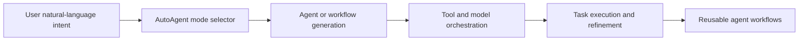

# AutoAgent Tutorial: Zero-Code Agent Creation and Automated Workflow Orchestration

> Learn how to use `HKUDS/AutoAgent` to create and orchestrate LLM agents through natural-language workflows, with support for CLI operations, tool creation, and benchmark-oriented evaluation.

## Why This Track Matters

AutoAgent targets zero-code agent building via natural language and automated orchestration, making it useful for teams exploring dynamic agent creation without deep framework coding.

This track focuses on:

- launching AutoAgent quickly in CLI mode
- understanding user/agent-editor/workflow-editor modes
- configuring tools and model providers safely
- evaluating planning workflows and governance controls

## Current Snapshot (Verified February 12, 2026)

- repository: [`HKUDS/AutoAgent`](https://github.com/HKUDS/AutoAgent)
- stars: about **8.6k**
- latest release: **none tagged** (rolling `main`)
- recent activity: updates on **October 16, 2025**
- project positioning: natural-language-driven agent and workflow creation framework

## Mental Model

## Chapter Guide

| Chapter | Key Question | Outcome |
|:--------|:-------------|:--------|
| [01 - Getting Started](01-getting-started.md) | How do I install and run AutoAgent quickly? | Working baseline |
| [02 - Architecture and Interaction Modes](02-architecture-and-interaction-modes.md) | How do user/agent/workflow modes differ? | Strong usage model |
| [03 - Installation, Environment, and API Setup](03-installation-environment-and-api-setup.md) | How do I configure runtime and model access safely? | Stable setup baseline |
| [04 - Agent and Workflow Creation Patterns](04-agent-and-workflow-creation-patterns.md) | How do I create agents and workflows with NL prompts? | Better creation discipline |
| [05 - Tooling, Python API, and Custom Extensions](05-tooling-python-api-and-custom-extensions.md) | How do I extend AutoAgent behavior programmatically? | Extensibility baseline |
| [06 - CLI Operations and Provider Strategy](06-cli-operations-and-provider-strategy.md) | How do I run reliable daily operations across model providers? | Operational reliability |
| [07 - Benchmarking, Evaluation, and Quality Gates](07-benchmarking-evaluation-and-quality-gates.md) | How do I evaluate AutoAgent output quality? | Evaluation discipline |
| [08 - Contribution Workflow and Production Governance](08-contribution-workflow-and-production-governance.md) | How do teams adopt and govern AutoAgent safely? | Governance runbook |

## What You Will Learn

- how to operate AutoAgent across its core interaction modes
- how to configure providers and runtime settings for stable execution
- how to extend workflows with custom tools and Python interfaces
- how to evaluate and govern AutoAgent usage in team settings

## Source References

- [AutoAgent Repository](https://github.com/HKUDS/AutoAgent)
- [AutoAgent README](https://github.com/HKUDS/AutoAgent/blob/main/README.md)
- [AutoAgent Documentation](https://autoagent-ai.github.io/docs)
- [Quickstart Docs](https://autoagent-ai.github.io/docs/get-started-quickstart)
- [Create Tools Docs](https://autoagent-ai.github.io/docs/dev-guide-create-tools)

## Related Tutorials

- [Mini-SWE-Agent Tutorial](../mini-swe-agent-tutorial/)
- [Qwen-Agent Tutorial](../qwen-agent-tutorial/)
- [MCP Servers Tutorial](../mcp-servers-tutorial/)
- [LangGraph Tutorial](../langgraph-tutorial/)

---

Start with [Chapter 1: Getting Started](01-getting-started.md).
