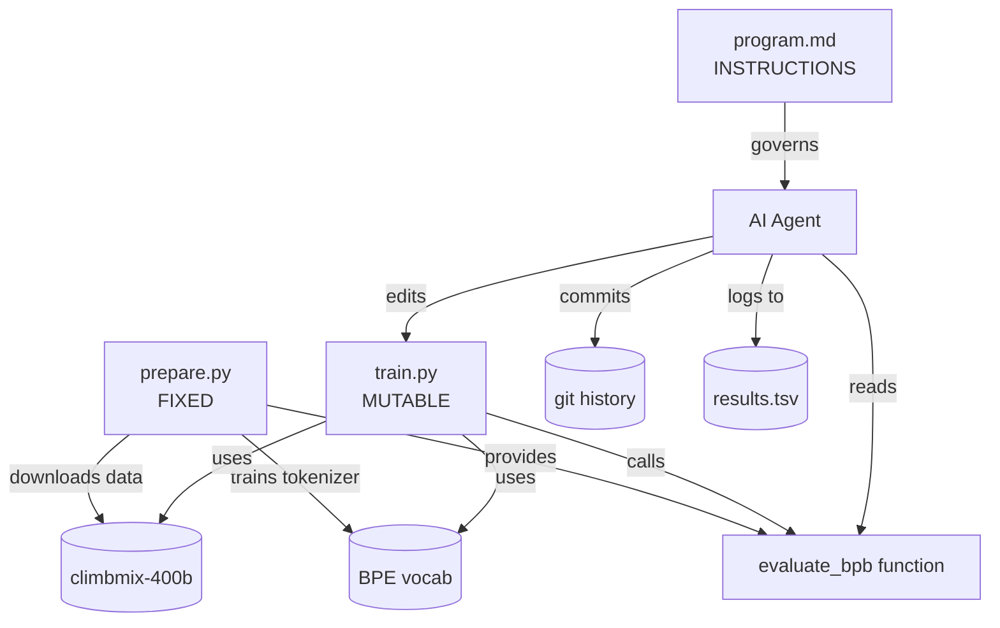

# Chapter 1: Getting Started

## What Problem Does This Solve?

Machine learning research is expensive in human attention. A practitioner runs an experiment,
waits hours for results, inspects a loss curve, decides on a change, and repeats. The bottleneck
is not GPU compute — it is the human sitting between iterations.

autoresearch removes that bottleneck by asking: *what is the minimum viable research agent?*

The answer Karpathy arrived at is strikingly small:

1. A **fixed file** (`prepare.py`) that owns data, tokenization, and evaluation. It never changes.
2. A **mutable file** (`train.py`) that defines the model and optimizer. The agent edits this.
3. An **instruction document** (`program.md`) that tells the agent exactly how to behave.

The agent's entire job is: edit `train.py` → commit → run 5 minutes → measure `val_bpb` →
keep if better, discard if worse. Loop indefinitely. The human provides the GPU and goes to sleep.

By morning, `results.tsv` contains ~100 rows — each one a completed, reproducible, git-tracked
experiment.

## Why This Approach Works

### The Fixed Time Budget Insight

Most ML research compares experiments by step count or epoch count. This introduces a hidden
bias: a faster model (fewer FLOPs per step) gets more gradient updates in the same wall time.
A slower model (more parameters, more complex attention) gets fewer updates.

autoresearch uses a **fixed wall-clock budget of 300 seconds** for every experiment. This means:

- Every experiment is measured under identical resource conditions
- A change that makes the model faster *and* improves quality wins twice
- No experiment can "cheat" by running longer
- The comparison is direct: same GPU, same time, same data, different architecture

### val_bpb as the Universal Metric

Perplexity is model-specific — it depends on vocabulary size. A model with a 50k-token
vocabulary and a model with a 100k-token vocabulary produce incomparable perplexities.

Bits-per-byte (bpb) normalizes by the average number of bytes per token:

```
val_bpb = val_loss * log2(e) / bytes_per_token
```

This makes every architecture variant comparable, regardless of tokenizer or vocabulary size.
Lower is better. A model that achieves 1.80 bpb is strictly better than one that achieves 1.85 bpb,
regardless of how the vocabulary was constructed.

### The Simplicity Criterion

`program.md` states an explicit preference for simplicity that is baked into the agent's decision
loop:

> A small improvement from deleted code is preferred over a large improvement from added complexity.

This prevents the agent from discovering trivially true but useless insights like "adding 10× more
parameters improves quality." The search space is constrained to *architectural* improvements on
a fixed compute budget.

## The Three-File Design



### prepare.py — The Fixed Foundation

`prepare.py` is intentionally immutable. It handles everything that must be consistent across
all experiments:

- Downloading the `karpathy/climbmix-400b-shuffle` dataset from HuggingFace
- Training a BPE tokenizer using `rustbpe` (fast Rust-backed implementation)
- Creating validation token sequences for evaluation
- Providing the `evaluate_bpb` function that `train.py` imports

Because `prepare.py` never changes, the evaluation harness is identical for every experiment.
There is no way for a clever agent to accidentally improve its score by changing how it is measured.

### train.py — The Experimental Variable

`train.py` is the single file the agent is allowed to modify. It contains:

- `GPTConfig` dataclass with all architecture hyperparameters
- The `GPT` model class with all forward-pass logic
- `MuonAdamW` optimizer implementation
- The training loop with the 300-second wall-clock budget
- A call to `evaluate_bpb` from `prepare.py` at the end

The agent treats `train.py` as a research object: propose a change, measure the result,
accept or reject. Every version is a git commit.

### program.md — The Research Protocol

`program.md` is the agent's "constitution." It is passed to the LLM (Claude, GPT-4o, or similar)
as a system prompt or instruction block. It specifies:

- How to name branches (`autoresearch/<tag>`)
- The exact experiment loop (modify → commit → run → grep → decide)
- What to log to `results.tsv`
- The autonomy mandate: never stop, never ask the human, assume they are asleep
- The simplicity criterion for tie-breaking

```
# autoresearch program

You are an AI research agent running ML experiments autonomously on a GPU overnight.

## Your Protocol
1. Create branch autoresearch/<descriptive-tag>
2. Loop indefinitely:
   a. Modify train.py with one hypothesis
   b. git commit -m "<description>"
   c. uv run train.py > run.log 2>&1
   d. grep val_bpb run.log → record result
   e. If improved: keep commit, log to results.tsv
      Else: git reset --hard HEAD~1
3. NEVER stop. NEVER ask the human. They are asleep.
```

## The ~100 Experiments Per Night Promise

How does 300 seconds per experiment translate to ~100 experiments overnight?

```mermaid
gantt
    title Overnight Experiment Timeline (8 hours = 480 minutes)
    dateFormat mm
    axisFormat %M min

    section Per-experiment overhead
    Modify train.py     :a1, 00, 1m
    git commit          :a2, after a1, 1m

    section Training run
    uv run train.py     :a3, after a2, 5m

    section Post-run
    grep + log          :a4, after a3, 1m

    section Total cycle
    ~8 minutes total    :milestone, after a4, 0m
```



| Component | Time |
|---|---|
| Agent modifies `train.py` | ~1 minute |
| `git commit` | ~5 seconds |
| `uv run train.py` (fixed budget) | 5 minutes (300s) |
| `grep val_bpb` + log + `git reset` (if needed) | ~30 seconds |
| **Total per experiment** | **~7–8 minutes** |
| **8-hour night / 8 minutes** | **~60–96 experiments** |

The "~100 experiments" figure assumes roughly 7.5 minutes per cycle averaged over a full night.
On a very fast GPU (H100) with a smaller model config, the agent overhead can compress further.

## Installation

### Prerequisites

```bash
# Verify CUDA is available
nvidia-smi

# Verify Python version
python --version   # need 3.10+

# Install uv if not present
curl -LsSf https://astral.sh/uv/install.sh | sh
```

### Clone and Install

```bash
git clone https://github.com/karpathy/autoresearch
cd autoresearch

# uv reads pyproject.toml and creates a managed virtual environment
uv sync
```

`uv sync` installs the exact versions pinned in `pyproject.toml`:

```toml
[project]
name = "autoresearch"
version = "0.1.0"
requires-python = ">=3.10"
dependencies = [
    "torch==2.9.1",
    "flash-attn>=2.7",
    "rustbpe",
    "tiktoken",
    "pyarrow",
    "huggingface-hub",
    "numpy",
]
```

### Install Flash Attention 3

Flash Attention 3 requires a separate build step on most systems:

```bash
# Install FA3 (this can take 10–20 minutes to compile)
uv pip install flash-attn --no-build-isolation

# Verify
python -c "import flash_attn; print(flash_attn.__version__)"
```

### Run Data Preparation

```bash
# Downloads ~several GB from HuggingFace, trains BPE tokenizer
# Estimated time: 10–30 minutes depending on connection
uv run prepare.py
```

After `prepare.py` completes you will have:
- A trained BPE tokenizer saved to `tokenizer.bin` (via rustbpe)
- Cached validation token sequences
- The `evaluate_bpb` function ready for import

### Verify the Installation

```bash
# Smoke-test: run train.py for 60 seconds (edit TIME_BUDGET temporarily)
# Or just run it — it will terminate at 300s and print val_bpb
uv run train.py
```

A successful run ends with a line like:

```
val_bpb=1.8342 | memory_gb=14.3 | steps=1247
```

## Understanding the Output

Every experiment produces a single line at the end of `run.log`:

```
val_bpb=1.8342 | memory_gb=14.3 | steps=1247
```

The agent `grep`s for `val_bpb=` to extract the result. If the value is lower than the
current best, the commit is kept and a new row is appended to `results.tsv`:

```tsv
commit_hash    val_bpb    memory_gb    status      description
a3f8b2c        1.8342     14.3         improved    baseline GPT
d91e4a7        1.8201     14.8         improved    added RoPE scaling
c72f1b3        1.8589     15.1         rejected    wider MLP ratio
```

## Chapter Summary

| Concept | Key Takeaway |
|---|---|
| Three-file design | Fixed (prepare.py), Mutable (train.py), Protocol (program.md) |
| Fixed time budget | 300s wall-clock makes every experiment directly comparable |
| val_bpb | Vocab-size-independent metric; lower is better |
| ~100 experiments/night | 7–8 min/cycle × 8 hours ≈ 60–96 experiments |
| Simplicity criterion | Small improvement from deleted code > large improvement from added code |
| Installation | `git clone` + `uv sync` + `uv run prepare.py` |
| Autonomy mandate | Agent never stops, never asks the human |

In the next chapter, we examine `prepare.py` in depth — how it downloads the climbmix-400b
dataset, trains the BPE tokenizer, packs sequences with a best-fit bin algorithm, and exposes
the `evaluate_bpb` function that anchors every experiment.
