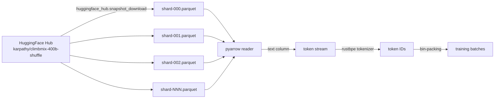
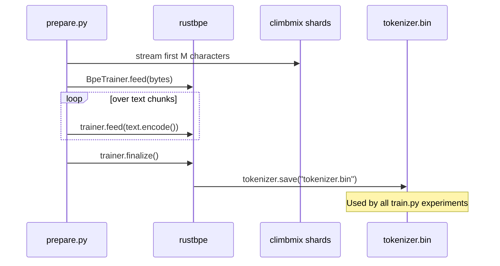
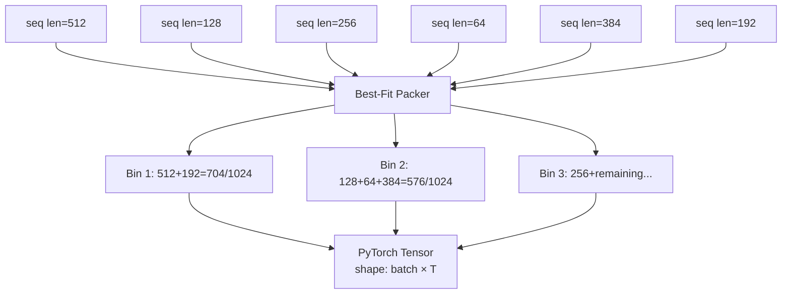
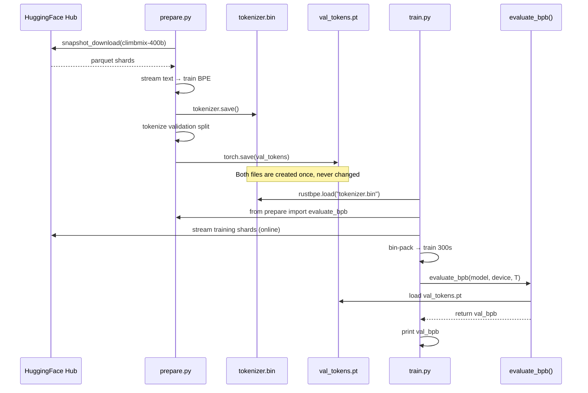

# Chapter 2: Data Preparation and the Training Environment

## What Problem Does This Solve?

A research agent that can modify its own evaluation criterion can accidentally cheat. If the
same file that defines the experiment also defines the scoring, nothing stops a gradient-following
process (human or machine) from discovering that "changing the eval harness" is a valid
optimization strategy.

autoresearch prevents this by isolating all data and evaluation logic in `prepare.py`, which is
explicitly marked as FIXED in `program.md`. The agent's instructions include:

> `prepare.py` is read-only. You may never modify it.

This separation creates a reproducible, tamper-proof evaluation environment. Every experiment
in the 8-hour night is scored by the exact same code against the exact same validation data.

## The climbmix-400b Dataset

autoresearch uses `karpathy/climbmix-400b-shuffle` hosted on HuggingFace. This is a 400-billion-token
mixture of text data, distributed as parquet shards, pre-shuffled so that any prefix is a
reasonable training sample.



### Why Parquet Shards?

Parquet is columnar, compressed, and efficiently streamable. For a 400B token dataset:

- **Streaming access**: `pyarrow` reads parquet row groups on demand without loading the full file
- **Reproducibility**: the shuffle is baked into the shard order; same shard order = same data order
- **Portability**: parquet is language-agnostic — the same shards can be used from Python, Rust, or Julia

### Dataset Statistics

| Property | Value |
|---|---|
| Total tokens | ~400 billion |
| Distribution format | parquet shards |
| Shuffle | Pre-shuffled (baked in) |
| Text column | `text` |
| Hosting | HuggingFace Hub |
| Download size | ~several hundred GB |

In practice, `prepare.py` does not download the entire dataset. It streams enough shards to
build the tokenizer vocabulary and cache the validation split, then streams during training.

## BPE Tokenizer Training with rustbpe

autoresearch uses `rustbpe` — a Rust-backed Python library — for BPE tokenizer training. This
is significantly faster than the pure-Python alternatives.

```python
# From prepare.py (simplified)
import rustbpe

def train_tokenizer(text_iterator, vocab_size=50257):
    """Train a BPE tokenizer on the first N tokens of the dataset."""
    trainer = rustbpe.BpeTrainer(vocab_size=vocab_size)
    for text in text_iterator:
        trainer.feed(text.encode("utf-8"))
    tokenizer = trainer.finalize()
    tokenizer.save("tokenizer.bin")
    return tokenizer
```

### Why rustbpe Instead of tiktoken?

`tiktoken` is used at *inference* time for its speed. `rustbpe` is used at *training* time
because it allows training new vocabularies. The two are interoperable: once trained, the
`rustbpe` vocabulary can be loaded and used by either library.



### BPE Algorithm in Brief

Byte Pair Encoding merges the most frequent adjacent byte pair repeatedly until the vocabulary
reaches the target size. The result is a vocabulary that:

- Has good coverage of common English words as single tokens
- Falls back gracefully to sub-word and byte-level pieces for rare words
- Handles code, numbers, and multilingual text without special cases

The resulting `tokenizer.bin` is loaded by `train.py` at startup:

```python
# From train.py
import rustbpe
tokenizer = rustbpe.load("tokenizer.bin")
encode = tokenizer.encode  # bytes -> list[int]
decode = tokenizer.decode  # list[int] -> bytes
```

## The Best-Fit Bin-Packing Dataloader

Standard dataloaders pad short sequences to the maximum length in the batch, wasting GPU
memory and compute. autoresearch uses **best-fit bin packing** to achieve near-100%
utilization with zero padding.

### The Problem with Padding

Consider a batch of 4 sequences with lengths [512, 128, 256, 64] and a target batch length of 1024:

```
Padded approach:
[seq1: 512 tokens][PAD: 512 tokens]   → 50% waste
[seq2: 128 tokens][PAD: 896 tokens]   → 87.5% waste
[seq3: 256 tokens][PAD: 768 tokens]   → 75% waste
[seq4:  64 tokens][PAD: 960 tokens]   → 93.75% waste
Average utilization: ~34%
```

### The Bin-Packing Solution

Best-fit bin packing treats each sequence as an item and each "bin" as a row of exactly
`T` (context length) tokens. Items are packed into bins so that no bin exceeds `T` tokens,
and the fill rate approaches 100%:

```
Packed approach (T=1024, BOS-aligned):
[BOS][seq2: 128][BOS][seq4: 64][BOS][seq3: 256][BOS][seq1: 512]  → 960/1024 ≈ 93.75%
```

```python
# From prepare.py (simplified bin-packing logic)
from collections import deque

def pack_sequences(sequences, T):
    """
    Best-fit bin packing: pack variable-length sequences into rows of exactly T tokens.
    Each sequence is prepended with BOS. No padding is used.
    Returns a 2D array of shape (num_rows, T).
    """
    bins = []           # list of (current_fill, [tokens])
    BOS = tokenizer.bos_token_id

    for seq in sequences:
        tokens = [BOS] + encode(seq)
        n = len(tokens)
        if n > T:
            # Truncate long sequences to T
            tokens = tokens[:T]
            n = T

        # Find the best-fit bin (tightest fit without overflow)
        best_bin = None
        best_remaining = T + 1
        for i, (fill, _) in enumerate(bins):
            remaining = T - fill
            if remaining >= n and remaining < best_remaining:
                best_bin = i
                best_remaining = remaining

        if best_bin is None:
            # No existing bin fits; open a new bin
            new_bin = [0] * T  # will be filled
            bins.append([n, tokens])
        else:
            fill, existing = bins[best_bin]
            existing.extend(tokens)
            bins[best_bin][0] += n

    # Pad only the last partial bin if necessary, then stack
    rows = []
    for fill, tokens in bins:
        if fill < T:
            tokens.extend([0] * (T - fill))  # minimal padding at end only
        rows.append(tokens[:T])
    return rows
```



### Why BOS-Alignment Matters

By prepending each document with a Beginning-Of-Sequence token, the model always sees
a clean document boundary. This means:

1. The model learns document-level context correctly — it knows when a new document starts
2. The first token of each document has a known prior state (fresh BOS context)
3. Cross-document attention does not "leak" from the end of one document to the start of another

Without BOS alignment, naively concatenated documents can confuse the model about
document boundaries, potentially hurting coherence learning.

## The evaluate_bpb Function

The `evaluate_bpb` function is the evaluation harness that every experiment uses identically.
It runs the model in `torch.no_grad()` mode on a fixed held-out validation set and computes
bits-per-byte.

```python
# From prepare.py
import math
import torch

# Validation data is prepared once and cached
VAL_TOKENS = None  # loaded lazily

def evaluate_bpb(model, device, T, batch_size=8):
    """
    Evaluate the model on the held-out validation set.
    Returns val_bpb (bits per byte), vocab-size independent.
    """
    global VAL_TOKENS
    if VAL_TOKENS is None:
        VAL_TOKENS = load_validation_tokens()  # cached from prepare step

    model.eval()
    total_loss = 0.0
    total_tokens = 0

    with torch.no_grad():
        for i in range(0, len(VAL_TOKENS) - T, T * batch_size):
            # Build batch
            x = VAL_TOKENS[i : i + T * batch_size].view(batch_size, T).to(device)
            y = VAL_TOKENS[i + 1 : i + 1 + T * batch_size].view(batch_size, T).to(device)

            logits = model(x)  # (B, T, V)
            loss = F.cross_entropy(
                logits.view(-1, logits.size(-1)),
                y.view(-1),
                reduction="sum"
            )
            total_loss += loss.item()
            total_tokens += y.numel()

    val_loss = total_loss / total_tokens  # nats per token
    # Convert to bits per byte
    bytes_per_token = estimate_bytes_per_token(VAL_TOKENS)
    val_bpb = val_loss / math.log(2) / bytes_per_token
    return val_bpb
```

### The bpb Conversion Formula

The conversion from cross-entropy loss (nats per token) to bits-per-byte involves two steps:

```
val_loss (nats/token) × log2(e) = val_loss (bits/token)
val_loss (bits/token) / bytes_per_token = val_bpb (bits/byte)
```

Where `bytes_per_token` is the empirical average from the validation set:

```python
def estimate_bytes_per_token(tokens):
    """Decode a sample of tokens and measure average bytes/token."""
    sample = tokens[:100_000].tolist()
    text = tokenizer.decode(sample)
    return len(text.encode("utf-8")) / len(sample)
```

For the climbmix BPE tokenizer, this is typically around 3.5–4.5 bytes per token for English text.

## Data Flow Summary



## Environment Variables and Configuration

`prepare.py` respects a small set of environment variables:

| Variable | Default | Purpose |
|---|---|---|
| `DATA_DIR` | `./data` | Where to cache downloaded shards |
| `VOCAB_SIZE` | `50257` | BPE vocabulary size |
| `VAL_TOKENS` | `1_000_000` | Number of tokens in validation set |
| `HF_TOKEN` | `None` | HuggingFace token for private datasets |
| `NUM_PROC` | `4` | Parallel workers for parquet reading |

## Chapter Summary

| Component | Role | Key Detail |
|---|---|---|
| climbmix-400b | Training data | 400B tokens, parquet shards, pre-shuffled |
| rustbpe | Tokenizer training | Fast Rust BPE, saves to tokenizer.bin |
| Best-fit bin packing | Dataloader | ~100% GPU utilization, zero padding |
| BOS alignment | Document boundary | Each doc starts with BOS token |
| evaluate_bpb | Eval harness | Fixed, tamper-proof, vocab-size-independent |
| val_bpb formula | Metric | nats/token × log2(e) / bytes_per_token |

In the next chapter, we examine the GPT architecture defined in `train.py` — including
GQA, RoPE positional encoding, QK-norm, sliding window attention, Value Residual, and
the residual scaling mechanism that makes the model robust to depth.
