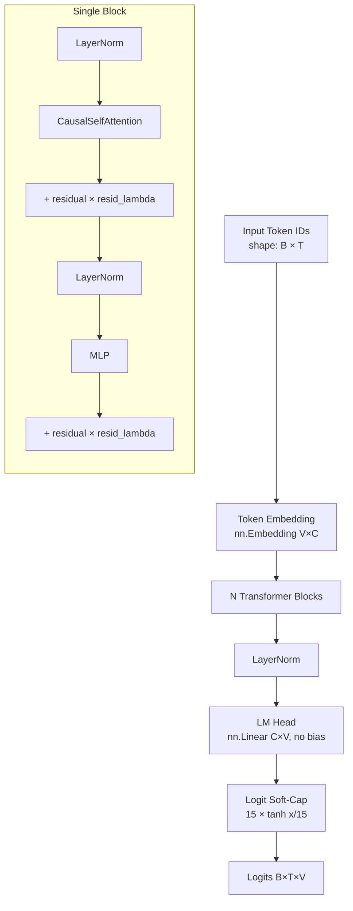
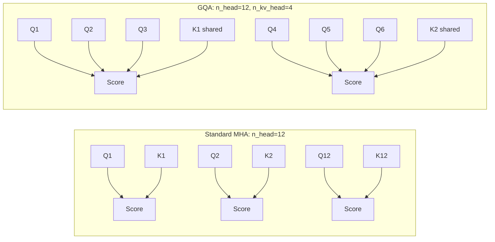
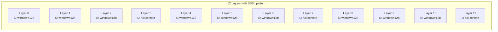
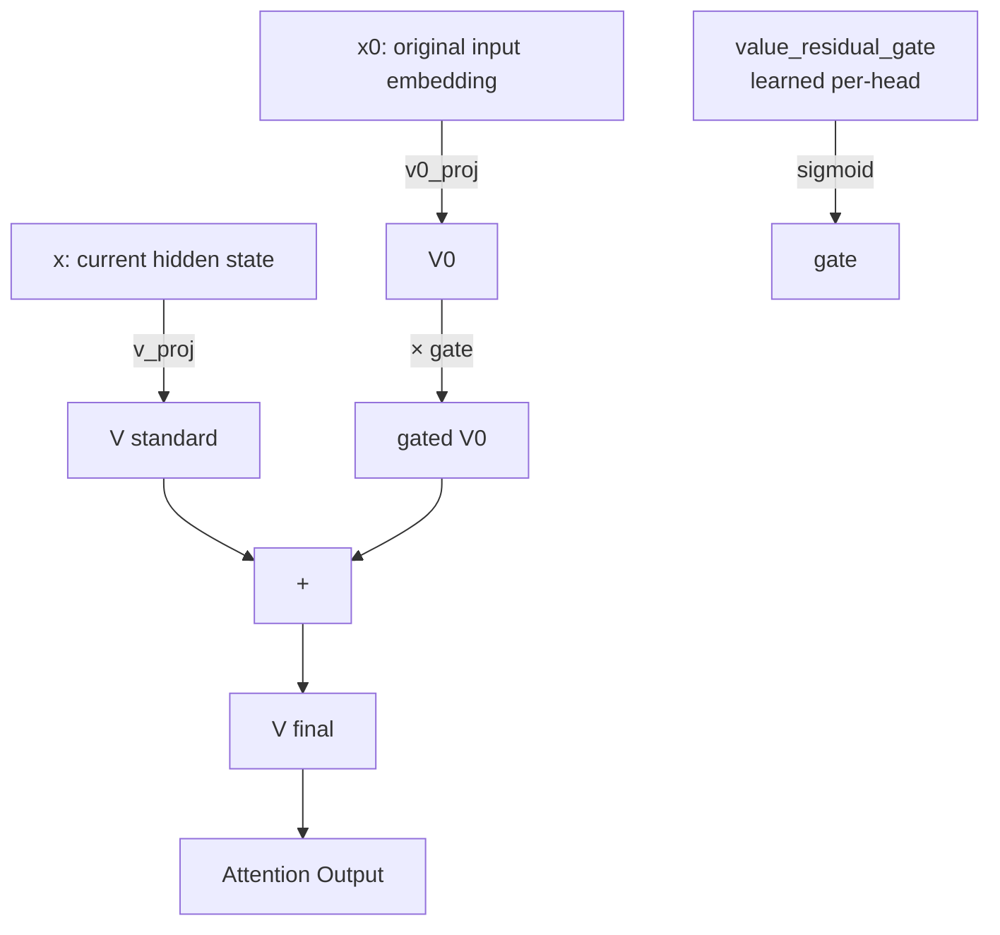
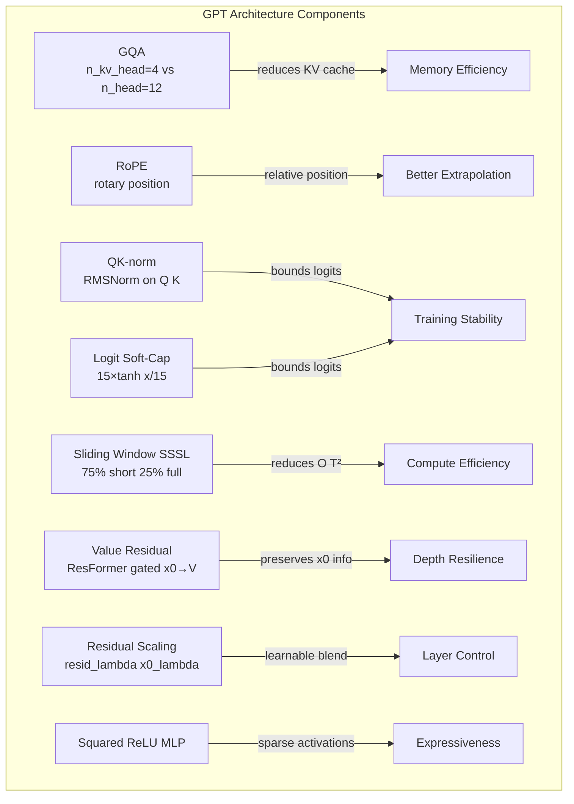

# Chapter 3: GPT Architecture

## What Problem Does This Solve?

The baseline `train.py` in autoresearch is not a vanilla GPT-2 clone. It incorporates
multiple improvements from the 2022–2025 literature into a single coherent architecture
that serves as the *starting point* for the agent's experiments.

The design goal: a model that is already reasonably strong, so the agent spends its budget
exploring *marginal improvements* rather than rediscovering well-known basics.

At the same time, the architecture is kept simple enough that it fits in ~500 lines of Python,
and any individual component can be replaced or removed in a single edit.

## GPTConfig

All architectural hyperparameters live in a single dataclass:

```python
from dataclasses import dataclass

@dataclass
class GPTConfig:
    # Vocabulary and context
    vocab_size: int = 50257
    block_size: int = 1024          # context length T

    # Transformer dimensions
    n_layer: int = 12
    n_head: int = 12
    n_kv_head: int = 4              # GQA: fewer KV heads than Q heads
    n_embd: int = 768

    # Sliding window attention
    WINDOW_PATTERN: str = "SSSL"    # S=short window, L=full context
    SHORT_WINDOW: int = 128         # tokens in short window

    # Value Residual (ResFormer)
    use_value_residual: bool = True

    # Regularization
    dropout: float = 0.0            # disabled during agent experiments

    # Logit capping
    logit_softcap: float = 15.0

    # MLP
    use_squared_relu: bool = True
```

The agent can change any of these fields to propose an architectural hypothesis.
A typical experiment modifies one or two fields and measures the effect.

## Architecture Overview



## Grouped Query Attention (GQA)

Standard multi-head attention creates `n_head` query, key, and value projections.
GQA reduces memory by using fewer KV heads — typically `n_kv_head = n_head / G` for
some group size `G`.

```python
class CausalSelfAttention(nn.Module):
    def __init__(self, config):
        super().__init__()
        self.n_head = config.n_head
        self.n_kv_head = config.n_kv_head
        self.n_embd = config.n_embd
        assert config.n_head % config.n_kv_head == 0
        self.head_dim = config.n_embd // config.n_head

        # Q projects to n_head * head_dim
        self.q_proj = nn.Linear(config.n_embd, config.n_head * self.head_dim, bias=False)
        # K, V project to n_kv_head * head_dim (fewer heads)
        self.k_proj = nn.Linear(config.n_embd, config.n_kv_head * self.head_dim, bias=False)
        self.v_proj = nn.Linear(config.n_embd, config.n_kv_head * self.head_dim, bias=False)
        self.out_proj = nn.Linear(config.n_embd, config.n_embd, bias=False)

        # QK-norm: normalize Q and K before dot product
        self.q_norm = nn.RMSNorm(self.head_dim)
        self.k_norm = nn.RMSNorm(self.head_dim)
```

### Why GQA?



With `n_head=12, n_kv_head=4`, GQA uses:
- 12 Q projections (unchanged)
- 4 K projections (3× fewer than MHA)
- 4 V projections (3× fewer than MHA)

KV cache memory is reduced by 3×. At a 1024-token context this is modest, but for longer
contexts (4k–128k tokens) the savings become significant.

## RoPE Positional Encoding

Rotary Position Embedding (RoPE) encodes position by rotating the Q and K vectors in
complex space before the attention dot product. Unlike learned positional embeddings,
RoPE:

1. Requires no learned parameters
2. Extrapolates gracefully to longer sequences than seen during training
3. Encodes *relative* position implicitly — the dot product between rotated Q at position i
   and rotated K at position j depends only on (i - j)

```python
def apply_rope(x, cos, sin):
    """
    Apply rotary position embedding.
    x: (B, n_head, T, head_dim)
    cos, sin: (T, head_dim/2) precomputed rotation tables
    """
    B, H, T, D = x.shape
    x1, x2 = x[..., :D//2], x[..., D//2:]
    # Rotate: [x1, x2] -> [x1*cos - x2*sin, x1*sin + x2*cos]
    return torch.cat([
        x1 * cos - x2 * sin,
        x1 * sin + x2 * cos
    ], dim=-1)

def precompute_rope_tables(head_dim, max_seq_len, theta=10000.0):
    """Precompute cos/sin tables for RoPE."""
    freq = 1.0 / (theta ** (torch.arange(0, head_dim, 2).float() / head_dim))
    t = torch.arange(max_seq_len)
    freqs = torch.outer(t, freq)          # (T, head_dim/2)
    cos = torch.cos(freqs)
    sin = torch.sin(freqs)
    return cos, sin
```

RoPE is applied to Q and K *after* QK-norm and *before* the attention dot product.

## QK-Norm

QK-norm applies RMSNorm to the Q and K vectors before the attention score computation:

```python
# In CausalSelfAttention.forward():
q = self.q_norm(q)  # (B, n_head, T, head_dim)
k = self.k_norm(k)  # (B, n_kv_head, T, head_dim)

# Then apply RoPE
q = apply_rope(q, cos, sin)
k = apply_rope(k, cos, sin)
```

Without QK-norm, attention logits can grow with depth in deep networks, causing unstable
gradients. QK-norm ensures the pre-softmax logits remain bounded regardless of depth,
allowing the use of larger learning rates and enabling training with fewer warmup steps.

## Sliding Window Attention

The `WINDOW_PATTERN` field defines a repeating pattern of attention spans across layers.

```
WINDOW_PATTERN = "SSSL"
```

This pattern repeats across all `n_layer` layers:
- `S` layers use short-window attention (only the last `SHORT_WINDOW=128` tokens)
- `L` layers use full causal attention (all preceding tokens up to `block_size`)

```python
def get_window_for_layer(layer_idx, pattern="SSSL", short_window=128, T=1024):
    """Return the attention window size for a given layer index."""
    char = pattern[layer_idx % len(pattern)]
    if char == "S":
        return short_window
    else:  # "L"
        return T  # full context
```



### Why Sliding Window?

Full causal attention is O(T²) in memory and compute. For T=1024, this is manageable.
For T=8192 or longer, it becomes a bottleneck.

The SSSL pattern provides a practical compromise:
- 75% of layers handle only local context (128 tokens) — very fast
- 25% of layers have full global context — captures long-range dependencies
- Overall compute is closer to O(T × SHORT_WINDOW) than O(T²)

For the 1024-token default context, the benefit is modest. But the pattern was chosen to
be extensible: as the agent experiments with longer contexts, the sliding window layers
become increasingly important.

## Flash Attention 3

All attention computation routes through Flash Attention 3, which fuses the
softmax, mask, and matrix multiply into a single CUDA kernel:

```python
from flash_attn import flash_attn_varlen_func

# In CausalSelfAttention.forward():
# For S (short window) layers, we pass a window_size argument
attn_output = flash_attn_varlen_func(
    q, k, v,
    cu_seqlens_q=cu_seqlens,
    cu_seqlens_k=cu_seqlens,
    max_seqlen_q=T,
    max_seqlen_k=T,
    causal=True,
    window_size=(config.SHORT_WINDOW, 0) if is_short_layer else (-1, 0),
)
```

Flash Attention 3 on H100 achieves near-peak memory bandwidth utilization by:
1. Tiling Q, K, V to fit in SRAM
2. Never materializing the full O(T²) attention matrix
3. Fusing all operations (QK matmul, softmax, V matmul) into one kernel pass

## Value Residual (ResFormer)

Value Residual is a technique from the ResFormer paper (2024). Instead of computing
V from the current layer's hidden states alone, alternating layers add a gated contribution
from the original input embedding (x0):

```python
class CausalSelfAttention(nn.Module):
    def __init__(self, config, layer_idx):
        super().__init__()
        # ...
        self.use_value_residual = config.use_value_residual and (layer_idx % 2 == 1)
        if self.use_value_residual:
            # Learnable per-head gate for the value residual contribution
            self.value_residual_gate = nn.Parameter(
                torch.zeros(config.n_kv_head, config.n_embd // config.n_head)
            )
            self.v0_proj = nn.Linear(config.n_embd, config.n_kv_head * head_dim, bias=False)

    def forward(self, x, x0, cos, sin):
        # Standard V from current hidden states
        v = self.v_proj(x).view(B, T, self.n_kv_head, self.head_dim).transpose(1, 2)

        if self.use_value_residual:
            # Gated V from original input embedding x0
            v0 = self.v0_proj(x0).view(B, T, self.n_kv_head, self.head_dim).transpose(1, 2)
            gate = torch.sigmoid(self.value_residual_gate)  # (n_kv_head, head_dim)
            v = v + gate * v0  # broadcast over B, T

        # ... rest of attention
```



Value Residual helps with the *residual forgetting* problem: in deep networks, the original
input information can be progressively overwritten by each layer's transformation. By providing
a direct path from x0 to V in every other layer, the model can always recover low-level
token identity information.

## Residual Scaling

Each block applies learnable scalars to the residual connection:

```python
class Block(nn.Module):
    def __init__(self, config, layer_idx):
        super().__init__()
        self.ln1 = nn.RMSNorm(config.n_embd)
        self.attn = CausalSelfAttention(config, layer_idx)
        self.ln2 = nn.RMSNorm(config.n_embd)
        self.mlp = MLP(config)

        # Per-layer learnable residual scales (initialized to 1.0)
        self.resid_lambda = nn.Parameter(torch.ones(1))
        self.x0_lambda = nn.Parameter(torch.ones(1))

    def forward(self, x, x0, cos, sin):
        # Attention sub-block with scaled residual
        x = x * self.resid_lambda + self.attn(self.ln1(x), x0, cos, sin)
        # MLP sub-block with scaled residual
        x = x * self.resid_lambda + self.mlp(self.ln2(x))
        return x
```

This technique, related to "residual rescaling" from PaLM and Gemma, allows the network
to learn the optimal blend of identity (passing information forward) versus transformation
(applying the block's function) at each layer.

## MLP with Squared ReLU

The MLP uses a gated architecture with squared ReLU:

```python
class MLP(nn.Module):
    def __init__(self, config):
        super().__init__()
        hidden = 4 * config.n_embd
        self.fc1 = nn.Linear(config.n_embd, hidden, bias=False)
        self.fc2 = nn.Linear(config.n_embd, hidden, bias=False)  # gate
        self.proj = nn.Linear(hidden, config.n_embd, bias=False)
        self.use_squared_relu = config.use_squared_relu

    def forward(self, x):
        if self.use_squared_relu:
            # Squared ReLU gated MLP
            return self.proj(F.relu(self.fc1(x)) ** 2 * self.fc2(x))
        else:
            # Standard SwiGLU
            return self.proj(F.silu(self.fc1(x)) * self.fc2(x))
```

Squared ReLU (`relu(x)²`) provides stronger gradients for large positive activations
and completely zeros out negative activations, creating sparser representations than
GELU or SiLU.

## Logit Soft-Capping

The final logits are passed through a soft-cap before cross-entropy:

```python
# In GPT.forward():
logits = self.lm_head(x)  # (B, T, V)
cap = self.config.logit_softcap
logits = cap * torch.tanh(logits / cap)  # soft-cap at ±15
```

This prevents any single logit from growing arbitrarily large, which can destabilize
training when combined with aggressive learning rates or poorly initialized weights.
The tanh function is smooth and differentiable, so gradients flow through the cap normally.

## Component Summary



## Chapter Summary

| Component | Config Field | Key Benefit |
|---|---|---|
| GQA | `n_kv_head=4` | 3× KV cache reduction vs MHA |
| RoPE | built-in | Relative position, no learned params |
| QK-norm | automatic | Stable training at depth |
| Sliding window | `WINDOW_PATTERN="SSSL"` | 75% layers use local O(T·W) attention |
| Flash Attention 3 | automatic | Near-peak SRAM utilization |
| Value Residual | `use_value_residual=True` | Preserves x0 through depth |
| Residual scaling | `resid_lambda`, `x0_lambda` | Per-layer blend control |
| Logit soft-cap | `logit_softcap=15.0` | Prevents extreme logit growth |
| Squared ReLU | `use_squared_relu=True` | Sparse activations, strong gradients |

In the next chapter, we examine MuonAdamW — the hybrid optimizer that applies Polar Express
orthogonalization to 2D weight matrices while falling back to AdamW for embeddings and scalars.
