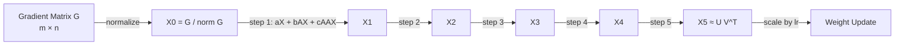
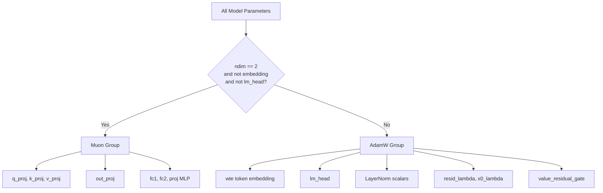
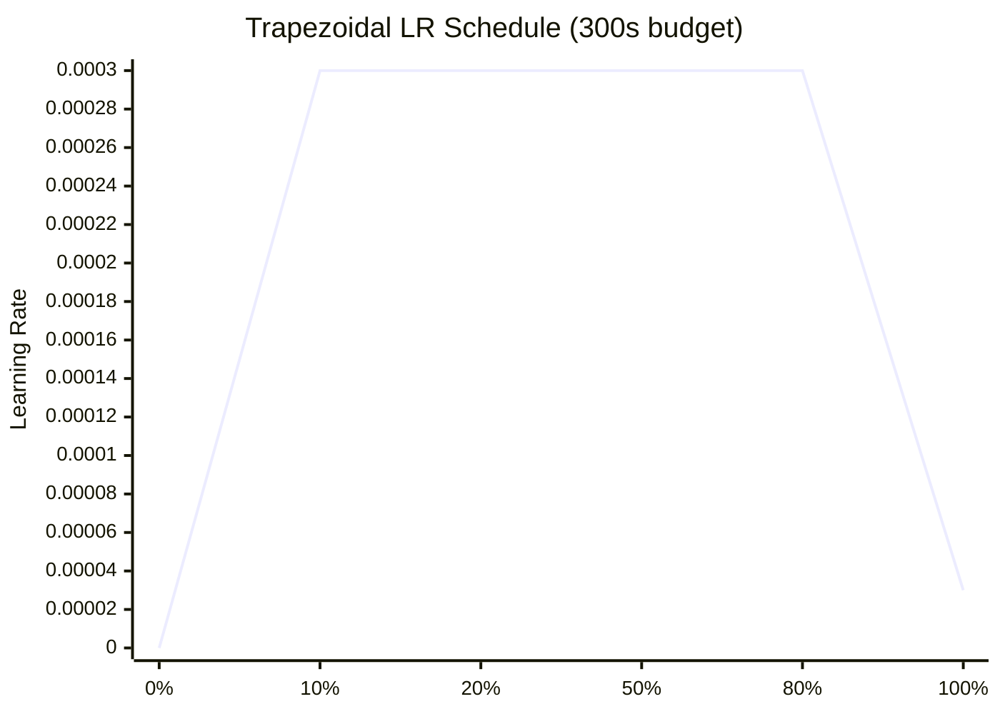

# Chapter 4: The MuonAdamW Optimizer

## What Problem Does This Solve?

Standard AdamW applies the same update rule to every parameter: maintain per-parameter
first and second moment estimates, normalize by the second moment, apply weight decay.
This works well for arbitrary tensors but ignores the *geometric structure* of weight matrices.

A weight matrix `W ∈ R^(m×n)` lives in a structured space. The gradient `G` points in the
direction of steepest loss descent, but the optimal step along the loss surface for a matrix
may not align with the raw gradient direction. Specifically, the gradient does not respect
the constraint that the updated matrix should have "similarly-sized" singular values — a
property that prevents some weights from growing dominant while others shrink.

**Muon** (Momentum + Orthogonalization) addresses this by projecting the gradient (or
momentum) onto the Stiefel manifold — the space of matrices with orthonormal columns.
The resulting update has all singular values equal to 1, which means every direction in
the weight matrix space receives equal update magnitude.

**MuonAdamW** combines this with AdamW for parameters that do not have matrix geometry
(embeddings, biases, layer norm scalars, the LM head).

## The Muon Update Rule

Muon's update rule is:

```
m_t = β * m_{t-1} + G_t           (Nesterov momentum buffer)
m̃_t = β * m_t + G_t              (Nesterov lookahead)
W_t+1 = W_t - lr * orthogonalize(m̃_t)
```

The key step is `orthogonalize(m̃_t)`: project the momentum matrix onto the nearest
orthogonal matrix (in Frobenius norm). This is a polar decomposition:

```
M = U Σ V^T   (SVD)
orthogonalize(M) = U V^T           (zero out singular values, set all to 1)
```

Computing exact SVD every step is O(mn·min(m,n)) — expensive. Polar Express approximates
it with a fast 5-step polynomial.

## Polar Express: Newton-Schulz Orthogonalization

The polar decomposition can be approximated iteratively using the Newton-Schulz iteration.
Starting from `X_0 = M / ||M||_F`, repeat:

```
X_{k+1} = X_k * (3I - X_k^T X_k) / 2
```

This converges to the orthogonal factor `U V^T` when the singular values of `X_0` are in (0, √3).

autoresearch uses a **degree-5 polynomial variant** that converges in exactly 5 steps for
well-conditioned matrices:

```python
@torch.compile(fullgraph=True)
def zeropower_via_newtonschulz5(G, steps=5):
    """
    Polar Express: Newton-Schulz orthogonalization in 5 steps.
    Returns the orthogonal factor of G (approx U V^T from G = U Σ V^T).
    """
    assert G.ndim >= 2
    a, b, c = (3.4445, -4.7750, 2.0315)  # polynomial coefficients for 5 steps
    X = G.bfloat16()
    # Normalize to place singular values in convergence basin
    X = X / (X.norm() + 1e-7)
    # Iterate the degree-5 polynomial
    if G.size(0) > G.size(1):
        X = X.T
    for _ in range(steps):
        A = X @ X.T
        B = b * A + c * A @ A
        X = a * X + B @ X
    if G.size(0) > G.size(1):
        X = X.T
    return X.to(G.dtype)
```



### Why 5 Steps?

The coefficients `(a=3.4445, b=-4.7750, c=2.0315)` were chosen so that the polynomial
`p(σ) = aσ + bσ³ + cσ⁵` approximates `1/σ` for singular values in [0.1, 1.0] after
5 iterations. This is a minimax polynomial optimization problem — the coefficients minimize
the worst-case error over the target interval.

5 steps is sufficient because:
1. The normalization step places all singular values in [0.5, 1.5] approximately
2. The polynomial converges quadratically after the first step
3. After 5 steps, the approximation error is < 0.1% for well-conditioned matrices

### bfloat16 and fullgraph Compilation

Two implementation details are critical for performance:

```python
X = G.bfloat16()  # cast to bf16 before iterations
```

The Newton-Schulz iterations involve matrix multiplications that are much faster in bf16
than float32, especially on H100 (which has dedicated bf16 tensor cores). The final result
is cast back to the original dtype.

```python
@torch.compile(fullgraph=True)
def zeropower_via_newtonschulz5(G, steps=5):
```

`fullgraph=True` tells `torch.compile` to compile the entire function into a single CUDA
graph with no Python fallback points. This eliminates Python interpreter overhead and allows
the compiler to fuse the matrix multiplications across steps.

## NorMuon: Normalized Muon

NorMuon normalizes the Muon update so that its RMS equals the learning rate:

```python
def normalize_muon_update(update, lr):
    """
    Scale the orthogonalized update so its RMS equals lr.
    This makes the effective learning rate invariant to matrix shape.
    """
    # RMS of a m×n orthogonal matrix is 1/sqrt(min(m,n))
    scale = lr / (update.norm(dim=-1, keepdim=True) / update.size(-1) ** 0.5 + 1e-8)
    return update * scale
```

Without normalization, the effective learning rate depends on `min(m, n)` — a 4096×4096
matrix would receive a different effective update magnitude than a 768×3072 matrix.
NorMuon ensures every parameter group trains at the same effective rate.

## The Full Muon Step

```python
@torch.compile(fullgraph=True)
def muon_step(params, grads, momentum_buffers, lr, momentum=0.95, weight_decay=0.0):
    """
    Muon update for 2D weight matrices.
    All operations are @torch.compile(fullgraph=True) for performance.
    """
    for p, g, buf in zip(params, grads, momentum_buffers):
        # Nesterov momentum
        buf.mul_(momentum).add_(g)
        nesterov_g = buf.mul(momentum).add_(g)  # lookahead

        # Polar Express orthogonalization
        update = zeropower_via_newtonschulz5(nesterov_g)

        # NorMuon normalization
        update = normalize_muon_update(update, lr)

        # Optional weight decay (applied before update)
        if weight_decay > 0:
            p.data.mul_(1 - lr * weight_decay)

        # Apply update
        p.data.add_(update, alpha=-1.0)
```

## The AdamW Step

For non-matrix parameters, standard AdamW is used:

```python
@torch.compile(fullgraph=True)
def adamw_step(params, grads, exp_avgs, exp_avg_sqs, step, lr,
               betas=(0.9, 0.95), eps=1e-8, weight_decay=0.1):
    """
    AdamW update for embeddings, LM head, scalars.
    """
    beta1, beta2 = betas
    # Bias correction
    bc1 = 1 - beta1 ** step
    bc2 = 1 - beta2 ** step

    for p, g, m, v in zip(params, grads, exp_avgs, exp_avg_sqs):
        m.lerp_(g, 1 - beta1)               # EMA of gradient
        v.lerp_(g.square(), 1 - beta2)       # EMA of squared gradient

        step_size = lr / bc1
        denom = (v.sqrt() / bc2 ** 0.5).add_(eps)

        # Weight decay (decoupled, applied to weight not gradient)
        p.data.mul_(1 - lr * weight_decay)

        # Parameter update
        p.data.addcdiv_(m, denom, value=-step_size)
```

## Parameter Dispatch: Who Gets Muon vs AdamW?

```python
class MuonAdamW(torch.optim.Optimizer):
    def __init__(self, model, lr=3e-4, weight_decay=0.1):
        # Separate parameters by geometry
        muon_params = []    # 2D weight matrices
        adamw_params = []   # everything else

        for name, param in model.named_parameters():
            if param.requires_grad:
                if param.ndim == 2 and 'embedding' not in name and 'lm_head' not in name:
                    muon_params.append(param)
                else:
                    adamw_params.append(param)

        param_groups = [
            {'params': muon_params,  'optimizer': 'muon',  'lr': lr},
            {'params': adamw_params, 'optimizer': 'adamw', 'lr': lr},
        ]
        super().__init__(param_groups, defaults={'lr': lr})
```



### Why Exclude Embeddings and LM Head from Muon?

The embedding matrix `wte ∈ R^(V×C)` and LM head `∈ R^(C×V)` are 2D but conceptually
different from attention projections:

1. **Embedding rows are independent.** Row i of `wte` is the representation of token i.
   Orthogonalizing across rows would mix token representations, destroying the learned
   semantic structure.

2. **LM head is tied to vocabulary.** Its rows correspond to output logits for each token.
   Orthogonalization would equalize the "importance" of all vocabulary entries, fighting
   against the natural Zipf-law distribution of token frequencies.

3. **Scalars and vectors have no matrix geometry.** LayerNorm scales, residual lambdas,
   and the value residual gate are 1D or scalar — SVD is undefined for them.

## Learning Rate Schedule: Trapezoidal (Warmup-Flat-Warmdown)

```python
def get_lr(step, total_steps, max_lr=3e-4, min_lr=3e-5,
           warmup_frac=0.1, warmdown_frac=0.2):
    """
    Trapezoidal LR schedule:
    - Warmup: 0 → max_lr over first 10% of steps
    - Flat: max_lr for middle 70% of steps
    - Warmdown: max_lr → min_lr over last 20% of steps
    """
    warmup_steps = int(total_steps * warmup_frac)
    warmdown_steps = int(total_steps * warmdown_frac)
    flat_steps = total_steps - warmup_steps - warmdown_steps

    if step < warmup_steps:
        return max_lr * step / warmup_steps
    elif step < warmup_steps + flat_steps:
        return max_lr
    else:
        decay_step = step - warmup_steps - flat_steps
        return min_lr + (max_lr - min_lr) * (1 - decay_step / warmdown_steps)
```



The trapezoidal schedule is well-suited to the fixed time budget because:

1. **Warmup** allows Adam moment estimates to stabilize before taking large steps
2. **Flat phase** provides the bulk of learning at maximum rate
3. **Warmdown** enables final convergence — studies show warmdown disproportionately
   improves final loss relative to its training cost

Since every experiment has the same `TIME_BUDGET=300s`, the total step count varies between
experiments (faster models take more steps). The LR schedule adapts to this by using
fractional step positions, not absolute step numbers.

## Fast-Fail on NaN or Loss > 100

The training loop includes an early-exit to prevent the agent from wasting its full 5-minute
budget on a clearly broken run:

```python
# In the training loop
if loss.isnan() or loss.item() > 100.0:
    print("FAST_FAIL: loss is NaN or > 100, aborting")
    sys.exit(1)
```

When `train.py` exits with code 1, the agent treats the run as a failed experiment and
proceeds to `git reset --hard HEAD~1` without logging to `results.tsv`.

## Both Steps Are @torch.compile

Both `muon_step` and `adamw_step` are decorated with `@torch.compile(fullgraph=True)`.
This means:

1. On the first call, PyTorch traces the function and compiles it to an optimized CUDA graph
2. On subsequent calls, the compiled graph is replayed with zero Python overhead
3. `fullgraph=True` ensures the entire function compiles — no Python fallbacks

The compilation adds ~30–60 seconds of overhead on the first iteration but provides
5–15% throughput improvement for all subsequent steps. For a 300-second budget,
this tradeoff is clearly beneficial.

## Chapter Summary

| Component | Mechanism | Key Benefit |
|---|---|---|
| Muon | Nesterov + orthogonalization via Newton-Schulz | Equalized update magnitude across matrix directions |
| Polar Express | 5-step Newton-Schulz polynomial | O(mn) cost, no SVD, 5× faster than exact polar |
| NorMuon | RMS normalization of update | Shape-invariant effective learning rate |
| AdamW dispatch | Applied to embeddings, LM head, scalars | Correct semantics for non-matrix parameters |
| Trapezoidal LR | Warmup → flat → warmdown | Works with step-count-varying experiments |
| Fast-fail | Exit on NaN or loss > 100 | Saves budget on broken runs |
| @torch.compile | Both muon_step and adamw_step | ~10% throughput gain after first iteration |

In the next chapter, we examine the training loop itself — gradient accumulation,
garbage collection freezing, MFU tracking, and how the fixed 300-second wall-clock
budget is enforced.
