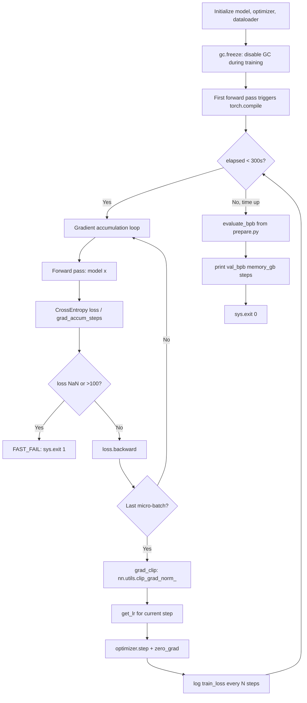
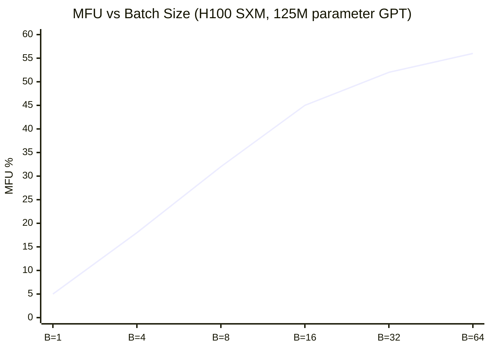

# Chapter 5: The Training Loop and Fixed Time Budget

## What Problem Does This Solve?

Comparing ML experiments fairly is harder than it looks. Common comparison axes:

- **Same number of steps**: disadvantages models that do more work per step (e.g., larger attention)
- **Same number of epochs**: disadvantages experiments on different sequence lengths
- **Same loss threshold**: favors lucky random seeds and initialization

autoresearch uses **same wall-clock time** (300 seconds). This is the fairest comparison
for a system where the GPU is the fixed resource. Two models that both ran for exactly
5 minutes on the same GPU with the same data can be compared directly, regardless of
their architecture.

The insight: if model A achieves lower val_bpb in 300 seconds than model B, then model A
is a strictly better use of the GPU's compute budget.

## The Fixed Time Budget

```python
# Top-level constant in train.py — the agent is not allowed to change this
TIME_BUDGET = 300  # seconds of wall-clock training time
```

The enforcement is straightforward: check `time.time()` after every micro-batch and break
if the budget is exceeded.

```python
import time

train_start = time.time()

for step in range(MAX_STEPS):  # MAX_STEPS is large enough to never be reached
    # ... gradient accumulation micro-batches ...

    # Time check after optimizer step
    elapsed = time.time() - train_start
    if elapsed >= TIME_BUDGET:
        break

# After loop: elapsed is approximately TIME_BUDGET
total_steps = step + 1
```

`MAX_STEPS` is set to a large sentinel (e.g., 1_000_000) that will never be reached in
practice. The loop exits on the time condition, not the step condition. This means:

- A fast model (small attention, few parameters) will complete more steps in 300s
- A slow model (large attention, many parameters) will complete fewer steps
- Both are evaluated at the same wall-clock elapsed time

## Training Loop Architecture



## Gradient Accumulation

Gradient accumulation simulates a large batch size by splitting a logical batch into
`GRAD_ACCUM_STEPS` micro-batches, accumulating gradients across all of them before
taking a single optimizer step.

```python
BATCH_SIZE = 512          # tokens per logical batch
GRAD_ACCUM_STEPS = 4      # micro-batches per optimizer step
MICRO_BATCH_TOKENS = BATCH_SIZE // GRAD_ACCUM_STEPS  # 128 tokens per micro-batch

optimizer.zero_grad()
for micro_step in range(GRAD_ACCUM_STEPS):
    x, y = next(dataloader)  # (B, T) next micro-batch
    # Use autocast for bf16 mixed precision
    with torch.autocast(device_type='cuda', dtype=torch.bfloat16):
        logits = model(x)
        loss = F.cross_entropy(logits.view(-1, V), y.view(-1))

    # Normalize loss by accumulation steps
    (loss / GRAD_ACCUM_STEPS).backward()

# After all micro-batches: take optimizer step
torch.nn.utils.clip_grad_norm_(model.parameters(), max_norm=1.0)
optimizer.step()
```

### Why Accumulate?

The H100 has 80 GB of HBM, but the peak compute utilization is achieved with specific
batch shapes. Gradient accumulation allows:

1. **Larger logical batch sizes** than fit in a single forward pass
2. **Stable gradient estimates** from more diverse data
3. **Flexible batch size tuning** without changing physical memory layout

## Garbage Collection Freeze

Python's garbage collector can interrupt CUDA operations at unpredictable intervals,
causing brief GPU stalls. These stalls are particularly harmful during the 300-second
budget because they appear as "dead time" — the budget clock ticks but no GPU work happens.

```python
import gc

# Before training loop: freeze GC
gc.collect()   # final manual collection
gc.freeze()    # freeze all current objects — GC won't scan them

# After training loop (for correctness, though we're about to exit anyway)
gc.unfreeze()
gc.collect()
```

`gc.freeze()` moves all currently reachable objects from the "young" and "old" generations
to a "permanent" generation that the GC never scans. Because the model, optimizer states,
and data buffers are all allocated before `gc.freeze()`, they are excluded from GC traversal.
Only objects allocated *during* the training loop (loss tensors, gradient tensors, etc.)
remain in the scanned generations — but these are short-lived and collected quickly.

The result is that Python's GC effectively does nothing during training, eliminating
a source of non-deterministic latency.

## Mixed Precision: bfloat16

All forward passes run in bfloat16:

```python
with torch.autocast(device_type='cuda', dtype=torch.bfloat16):
    logits = model(x)
    loss = F.cross_entropy(...)
```

bfloat16 vs float16 vs float32:

| Format | Exponent bits | Mantissa bits | Key property |
|---|---|---|---|
| float32 | 8 | 23 | Full precision |
| float16 | 5 | 10 | Small range, numerically fragile |
| bfloat16 | 8 | 7 | Same range as float32, less precision |

bfloat16's 8-bit exponent means it can represent the same range of values as float32.
This is critical for transformer training where gradient magnitudes span many orders of
magnitude. float16's 5-bit exponent causes overflow and underflow issues that require
loss scaling — bfloat16 does not.

Model parameters are stored in float32 for optimizer stability. The `torch.autocast`
context manager automatically casts inputs and outputs to bf16 for the forward pass
without changing the stored parameter dtype.

## MFU (Model FLOP Utilization)

MFU measures how efficiently the GPU's theoretical peak FLOP/s is being used:

```python
def compute_mfu(model, batch_tokens_per_sec, device):
    """
    Estimate MFU based on the standard transformer FLOP formula.

    For a transformer: ~6 * N * T FLOPs per token for forward+backward
    Where N = number of parameters, T = sequence length.
    """
    N = sum(p.numel() for p in model.parameters())
    flops_per_token = 6 * N  # approximate: 2 per matmul, 3 for backward

    achieved_flops = flops_per_token * batch_tokens_per_sec

    # H100 SXM bf16 peak: ~1979 TFLOP/s
    H100_BF16_PEAK = 1979e12
    mfu = achieved_flops / H100_BF16_PEAK
    return mfu
```



Typical MFU values with autoresearch on H100:
- Small model (125M params): ~45–55% MFU
- Medium model (350M params): ~50–60% MFU

The training loop logs MFU every 100 steps so the agent can observe compute efficiency trends.

## The Dataloader

The dataloader streams parquet shards from the climbmix dataset and uses the best-fit
bin-packing algorithm (from `prepare.py`) to create training batches:

```python
from prepare import get_batch, pack_sequences

class StreamingDataloader:
    def __init__(self, shard_paths, tokenizer, T, batch_size):
        self.shards = iter(shard_paths)
        self.tokenizer = tokenizer
        self.T = T
        self.batch_size = batch_size
        self.buffer = deque()
        self._fill_buffer()

    def _fill_buffer(self):
        """Load next shard and tokenize into buffer."""
        shard = next(self.shards)
        table = pq.read_table(shard, columns=['text'])
        texts = table['text'].to_pylist()
        packed = pack_sequences(texts, self.T)
        self.buffer.extend(packed)

    def __next__(self):
        if len(self.buffer) < self.batch_size:
            self._fill_buffer()
        rows = [self.buffer.popleft() for _ in range(self.batch_size)]
        x = torch.tensor(rows, dtype=torch.long)  # (B, T)
        y = torch.roll(x, -1, dims=1)             # shifted by 1 for next-token prediction
        y[:, -1] = -100  # ignore index for last position (no target)
        return x.cuda(), y.cuda()
```

The dataloader is designed to keep the GPU fed: it always has at least `batch_size` packed
rows ready, refilling from the next shard when the buffer runs low.

## Training Metrics and Logging

The training loop logs to stdout at regular intervals:

```python
LOG_INTERVAL = 50  # steps between log lines

if step % LOG_INTERVAL == 0:
    elapsed = time.time() - train_start
    tokens_per_sec = step * BATCH_SIZE / elapsed
    mfu = compute_mfu(model, tokens_per_sec, device)
    print(
        f"step={step:6d} | loss={train_loss:.4f} | "
        f"tok/s={tokens_per_sec:.0f} | mfu={mfu:.1%} | "
        f"elapsed={elapsed:.0f}s"
    )
```

Sample output during training:

```
step=    50 | loss=6.2341 | tok/s=142500 | mfu=48.3% | elapsed=18s
step=   100 | loss=5.8901 | tok/s=143200 | mfu=48.5% | elapsed=36s
step=   200 | loss=4.9234 | tok/s=143800 | mfu=48.7% | elapsed=71s
step=   500 | loss=3.8821 | tok/s=144100 | mfu=48.8% | elapsed=177s
step=   850 | loss=3.4210 | tok/s=144300 | mfu=48.9% | elapsed=300s
val_bpb=1.8342 | memory_gb=14.3 | steps=850
```

The final line is what the agent greps for. The format is precisely specified in `program.md`
so the agent can reliably extract it with a simple pattern:

```bash
grep "val_bpb=" run.log | tail -1
```

## Memory Reporting

The final output includes `memory_gb` — peak GPU memory in gigabytes:

```python
memory_gb = torch.cuda.max_memory_allocated() / 1e9
print(f"val_bpb={val_bpb:.4f} | memory_gb={memory_gb:.1f} | steps={total_steps}")
```

This serves two purposes:
1. The agent can check whether a change approached the GPU's memory limit
2. The researcher reviewing `results.tsv` can compare memory efficiency across experiments

A change that improves val_bpb but uses 2× more memory may not be desirable — the agent
can be instructed to reject improvements that exceed a memory threshold.

## The evaluate_bpb Call

At the end of training, the model is evaluated using the function from `prepare.py`:

```python
from prepare import evaluate_bpb

# After training loop exits:
model.eval()
val_bpb = evaluate_bpb(
    model=model,
    device=device,
    T=config.block_size,
    batch_size=8
)
```

The evaluation uses:
- `torch.no_grad()` — no gradients, faster inference
- The fixed validation set cached by `prepare.py`
- The same `block_size=T` as training

Because `evaluate_bpb` is imported from the immutable `prepare.py`, the agent cannot
accidentally change the evaluation. Even if `train.py` is heavily modified, the evaluation
protocol remains identical.

## Full Timing Breakdown

```mermaid
gantt
    title Wall-Clock Time Breakdown (300s total, H100)
    dateFormat ss
    axisFormat %Ss

    section Startup
    Model init + param count     :a1, 0, 2s
    Tokenizer load               :a2, after a1, 1s
    First batch (compile trigger):a3, after a2, 25s

    section Training
    Steps 1-850 (warm)           :a4, after a3, 272s

    section Evaluation
    evaluate_bpb on val set      :a5, after a4, 8s

    section Output
    Print results + exit         :a6, after a5, 1s
```



The `torch.compile` overhead (~25 seconds on the first call) is baked into the 300-second
budget. This means:

- Experiments with simpler computation graphs compile faster and get more training steps
- Experiments with complex new operations compile slower and get fewer steps
- This is intentional: compilation time is part of the "cost" of a complex architecture

## Chapter Summary

| Component | Implementation | Key Detail |
|---|---|---|
| TIME_BUDGET | `time.time()` check after each step | 300s wall-clock, not step count |
| Gradient accumulation | 4 micro-batches per optimizer step | Simulates larger logical batch |
| GC freeze | `gc.freeze()` before loop | Eliminates GC pauses during training |
| Mixed precision | `torch.autocast` bf16 | Safe range (8-bit exponent), no loss scaling |
| MFU tracking | 6N × tokens/s / peak FLOP/s | Reported every 50 steps |
| Fast-fail | `sys.exit(1)` on NaN or loss > 100 | Saves budget on broken runs |
| evaluate_bpb | Imported from prepare.py | Tamper-proof, fixed validation set |
| Output format | `val_bpb=X.XXXX \| memory_gb=XX.X \| steps=NNNN` | Agent greps this line |

In the next chapter, we examine `program.md` — the agent's "research org code" that
defines the experiment loop, git discipline, logging protocol, and the autonomy mandate
that keeps it running all night without human supervision.
