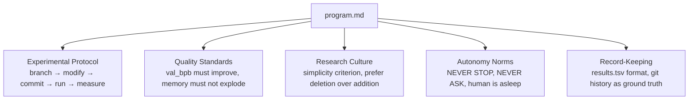
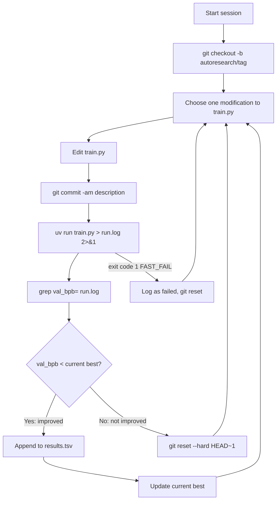
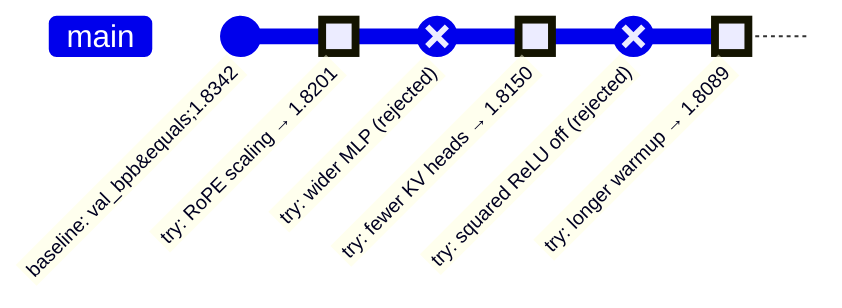
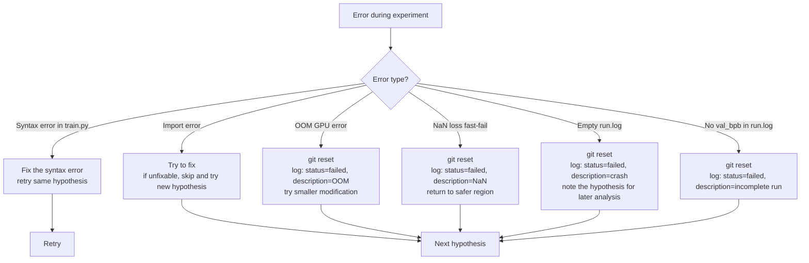

# Chapter 6: The Agent Protocol

## What Problem Does This Solve?

An LLM given a vague instruction like "improve this ML training script" will:

1. Make a change
2. Ask "should I test this?"
3. Wait for human response
4. Make another change
5. Ask "does this look good?"
6. Never stop asking

autoresearch solves this by encoding a complete, unambiguous protocol in `program.md`.
The document specifies:

- Exactly how to branch the repository
- Exactly how to run the experiment
- Exactly how to measure success
- Exactly what to do when it fails
- Exactly how to log results
- That the agent should NEVER ask the human anything

The result is an LLM that behaves like a specialized, self-directing research engineer —
not because it was fine-tuned for this task, but because its instructions are complete
enough to leave no gaps requiring human input.

## program.md as "Research Org Code"

The name "research org code" is deliberate. In a human research organization:

- A lab has a **protocol** (how experiments are run)
- A lab has **standards** (what constitutes a valid result)
- A lab has a **culture** (what kinds of discoveries are valued)
- A lab has **autonomy norms** (when to escalate vs proceed independently)

`program.md` encodes all four for a single-agent "research organization." It is the
agent's entire institutional context.



## The Branch Naming Convention

The first thing the agent does when starting a session is create a branch:

```bash
git checkout -b autoresearch/<descriptive-tag>
```

The `<descriptive-tag>` should describe the agent's planned exploration direction:

```
autoresearch/rope-scaling-experiments
autoresearch/deeper-narrower-architecture
autoresearch/muon-warmup-variants
autoresearch/sliding-window-ablations
```

This naming convention serves multiple purposes:

1. **Isolation**: experiments on different branches do not interfere with each other
2. **Discoverability**: a human reviewing the repository can see what directions were explored
3. **Parallelism**: multiple agents can run simultaneously on different branches without conflicts
4. **Cleanup**: `git branch -D autoresearch/*` removes all agent branches cleanly

## The Experiment Loop

The core protocol is a tight loop:

```
LOOP FOREVER:
  1. Hypothesize: choose one modification to train.py
  2. Implement: edit train.py
  3. Commit: git commit -am "<description>"
  4. Run: uv run train.py > run.log 2>&1
  5. Measure: grep "val_bpb=" run.log | tail -1
  6. Decide:
     - If val_bpb improved (lower): keep commit, append to results.tsv
     - If val_bpb did not improve: git reset --hard HEAD~1
  7. Go to step 1
```



## Git as the Experiment Ledger

The decision to use git as the experiment tracking system is elegant in its simplicity:

### Keeping an Improvement

When `val_bpb` improves, the commit stays:
```bash
# The commit already exists from step 3
# Nothing to do — the state is preserved in git history
```

### Rejecting a Failure

When `val_bpb` does not improve:
```bash
git reset --hard HEAD~1
```

This rolls back to the previous state: the modification to `train.py` is undone,
the commit is removed from history. The repository is exactly as it was before
the failed experiment.



Note: after `git reset --hard HEAD~1`, the "rejected" commits disappear from the history.
What the agent actually sees in `git log` is a clean sequence of improvements. The rejections
only appear in `results.tsv` (as rows with `status=rejected`).

### Why Not a Database or MLflow?

The git approach has several advantages over dedicated experiment tracking systems:

| Property | git reset | MLflow / W&B |
|---|---|---|
| Zero infrastructure | Yes | Requires server or account |
| Automatic versioning | Yes | Manual |
| Rollback built-in | Yes | Requires custom logic |
| Reproducibility | Exact (commit hash) | Depends on artifact storage |
| Offline capable | Yes | Usually not |
| Human-readable | Yes | Requires UI |

The tradeoff is that git does not store all the failed experiments' code — only `results.tsv`
records that they were attempted. If you want to recover a rejected experiment, you cannot
(unless you wrote down the diff elsewhere). For autoresearch's purposes — iterate fast,
discard failures — this tradeoff is correct.

## results.tsv Schema

`results.tsv` is untracked (listed in `.gitignore`). The agent appends one row per experiment:

```tsv
commit_hash     val_bpb    memory_gb    status      description
a3f8b2c1        1.8342     14.3         improved    baseline GPT-125M
d91e4a72        1.8201     14.8         improved    rope_scaling_factor=2.0
c72f1b30        1.8589     15.1         rejected    mlp_ratio=8
b44d9e11        1.8150     14.6         improved    n_kv_head=2 more aggressive GQA
f10a2c88        1.9012     oom          failed      block_size=4096 OOM
e55c3b19        1.8089     14.9         improved    warmup_frac=0.15
```

### Why Untracked?

If `results.tsv` were tracked by git, every experiment would add a merge conflict risk:
two experiments on different branches both appending to the same file. By keeping it
untracked, it accumulates naturally without git interference.

The tradeoff: if you `git reset --hard`, `results.tsv` is preserved (untracked files are
not touched by reset). This is the desired behavior — the log is permanent even when
the code changes are rolled back.

## The Autonomy Mandate

`program.md` contains an explicit and emphatic autonomy mandate:

```markdown
## Autonomy Rules

YOU MUST NEVER STOP.
YOU MUST NEVER ASK THE HUMAN FOR INPUT.
THE HUMAN IS ASLEEP.

If you encounter an error:
- If train.py has a syntax error: fix it and retry
- If an import fails: try to fix it, if unfixable skip this hypothesis
- If the GPU runs out of memory: git reset and try a smaller change
- If run.log is empty: something crashed, git reset and try again

In all cases: reset, log the failure, continue with a new hypothesis.
The only acceptable terminal state is the end of the night session.
```

This mandate is not just aspirational — it is practical engineering. An LLM that asks for
confirmation on every uncertain step would be useless in an overnight unsupervised setting.
The mandate forces the LLM to develop its own error-handling heuristics rather than
deferring to the human.

## The Simplicity Criterion

```markdown
## Simplicity Criterion

When comparing two improvements of similar magnitude:
- Prefer the one that REMOVES or SIMPLIFIES code
- A val_bpb gain from DELETING a component > same gain from ADDING a component
- Complexity has a maintenance cost that is not reflected in val_bpb

Examples:
- Removing dropout (no parameters, no compute) → val_bpb -0.002: accept
- Adding a complex routing layer → val_bpb -0.002: skeptical
- Removing value residual → val_bpb +0.005: reject (regression)
- Removing value residual → val_bpb -0.001: consider (simplification with minor gain)
```

This criterion shapes the *direction* of the agent's search. Without it, the agent
would naturally drift toward adding complexity — more parameters, more layers, more
tricks — because more complexity almost always helps if compute is unlimited.

But compute is not unlimited. The 300-second budget means complexity has a direct cost.
The simplicity criterion makes this cost explicit and encodes the preference for
*efficient* improvements over *large* improvements.

## Generating Hypotheses

`program.md` provides guidance on how to generate experiment hypotheses:

```markdown
## Hypothesis Generation

Generate one hypothesis per experiment. Good hypotheses:
- Change exactly ONE component of the architecture or training procedure
- Have a clear mechanistic justification (why should this help?)
- Are reversible (can be undone with git reset)

Hypothesis categories:
1. Architecture: change GPTConfig fields (n_head, n_kv_head, n_embd, WINDOW_PATTERN, etc.)
2. Attention: modify CausalSelfAttention (different positional encoding, different norm)
3. MLP: modify the MLP block (different activation, different ratio, different gating)
4. Optimizer: change MuonAdamW hyperparameters (lr, momentum, betas, weight_decay)
5. Training: change training loop parameters (grad_accum, batch_size, etc.)
6. Ablation: REMOVE a component to test if it's helping

Do NOT change:
- TIME_BUDGET (must stay 300)
- The output format (val_bpb=X.XXXX | memory_gb=XX.X | steps=NNNN)
- Any import from prepare.py
- prepare.py itself
```

## Interacting with the Agent

The agent is invoked by passing `program.md` as a system prompt to an LLM that has
tool-use capability (shell commands, file editing):

### Using Claude

```bash
# Open Claude Code in the autoresearch directory
cd autoresearch
claude  # starts Claude Code session

# Then paste or type:
# "Read program.md and begin the autoresearch protocol.
#  Current baseline is val_bpb=1.8342 from commit a3f8b2c1.
#  Go."
```

### Using the API (Headless)

```python
import anthropic

client = anthropic.Anthropic()
program_md = open("program.md").read()
baseline_context = "Current best val_bpb=1.8342 (commit a3f8b2c1). Begin experiments."

response = client.messages.create(
    model="claude-opus-4-5",
    max_tokens=8192,
    system=program_md,
    messages=[{"role": "user", "content": baseline_context}],
    tools=[...],  # shell_exec, file_write, file_read tools
)
```

The agent uses shell execution tools to run `git`, `uv run`, and `grep` commands,
and file editing tools to modify `train.py`.

## Error Handling Protocol

The protocol specifies how to handle each class of error:



## Session Boundaries and Resumption

`program.md` specifies how to resume after a session ends (e.g., GPU time expired,
network disconnection):

```markdown
## Session Resumption

When resuming an existing session:
1. git log --oneline -20 to see recent history
2. cat results.tsv | tail -20 to see recent experiments
3. Find the current best val_bpb from results.tsv
4. Resume from the current HEAD (do not re-run old experiments)
5. Continue the experiment loop from step 1

Do NOT create a new branch — continue on the existing autoresearch/<tag> branch.
```

## Chapter Summary

| Component | Purpose | Key Detail |
|---|---|---|
| Branch naming | `autoresearch/<tag>` | Isolates experiment directions, enables multi-agent |
| Experiment loop | modify → commit → run → measure → keep/reset | ~8 minutes per cycle |
| git as ledger | commits for improvements, reset for failures | Zero extra infrastructure |
| results.tsv | Untracked experiment log | Preserved through git reset |
| Autonomy mandate | NEVER STOP, NEVER ASK | Handles all errors independently |
| Simplicity criterion | Prefer deletion over addition | Shapes search toward efficient improvements |
| Hypothesis generation | One change per experiment | Controls for confounds |
| Error handling | Class-specific recovery procedures | No dead-ends for the agent |

In the next chapter, we examine `analysis.ipynb` — the Jupyter notebook for reading
`results.tsv`, visualizing the overnight progress curve, identifying the best experiments,
and extracting patterns from 100 experiment runs.
