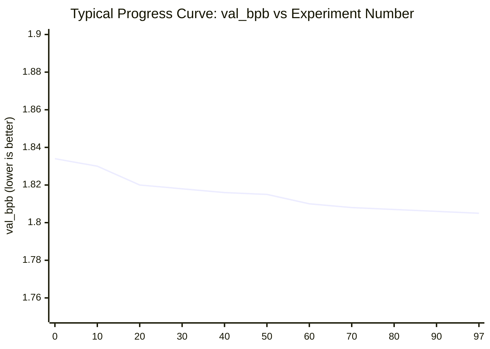
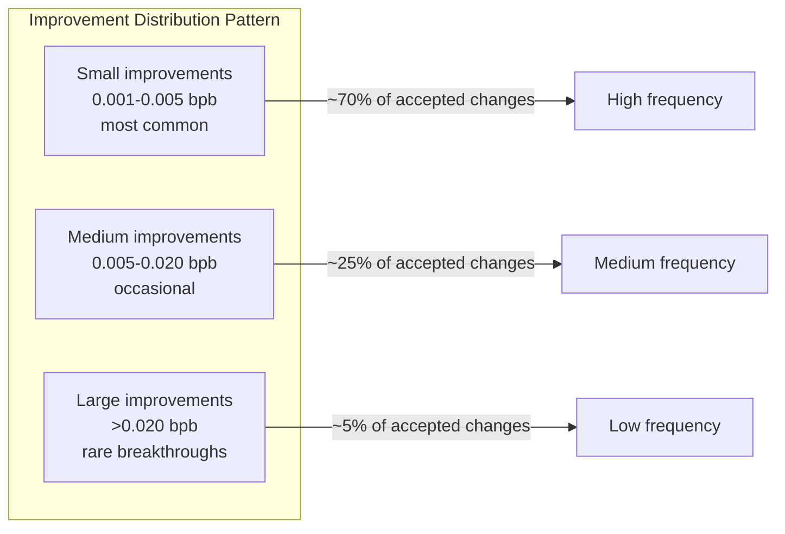
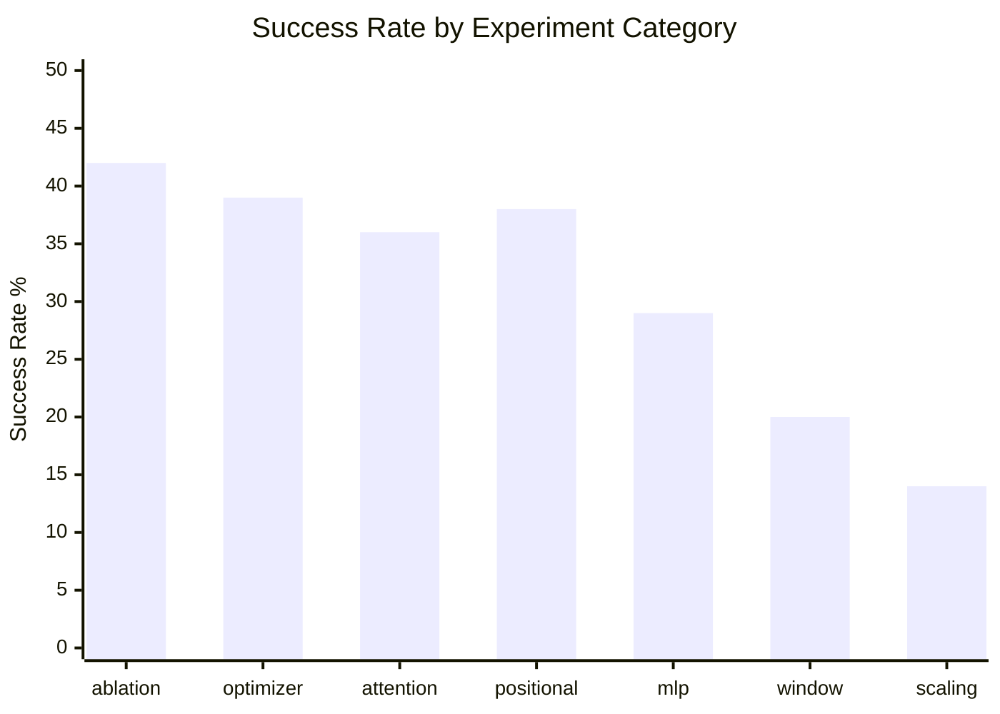
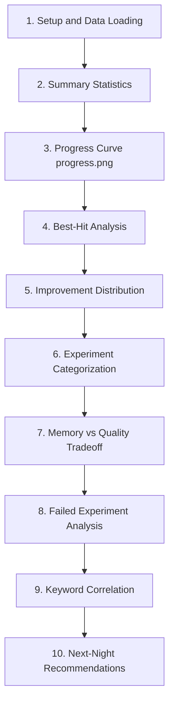

# Chapter 7: Analyzing Results with analysis.ipynb

## What Problem Does This Solve?

After an overnight run, `results.tsv` contains ~100 rows. Each row is one experiment:
a commit hash, a val_bpb score, memory usage, status, and a description. Reading this
raw TSV is insufficient for understanding what happened:

- Which changes actually helped?
- Which failures were due to bugs vs genuine regressions?
- Is the agent making progress monotonically, or bouncing around?
- What patterns emerge across successful experiments?
- What should the next overnight run focus on?

`analysis.ipynb` answers these questions with structured analysis and visualizations.

## Loading and Cleaning results.tsv

```python
import pandas as pd
import numpy as np
import matplotlib.pyplot as plt
from pathlib import Path

# Load the results
df = pd.read_csv('results.tsv', sep='\t', names=[
    'commit_hash', 'val_bpb', 'memory_gb', 'status', 'description'
])

print(f"Total experiments: {len(df)}")
print(f"Status breakdown:\n{df['status'].value_counts()}")
```

Sample output:
```
Total experiments: 97
Status breakdown:
improved    23
rejected    61
failed      13
```

### Handling Special Values

Not all experiments complete cleanly:

```python
# Handle OOM (out of memory) runs — memory_gb is 'oom' not a number
df['memory_gb'] = pd.to_numeric(df['memory_gb'], errors='coerce')  # OOM → NaN

# Handle failed runs where val_bpb may be missing
df['val_bpb'] = pd.to_numeric(df['val_bpb'], errors='coerce')

# Separate completed vs failed
completed = df[df['status'].isin(['improved', 'rejected'])].copy()
failed = df[df['status'] == 'failed'].copy()
improved = df[df['status'] == 'improved'].copy()

print(f"Completed: {len(completed)} ({len(completed)/len(df):.0%})")
print(f"Failed: {len(failed)} ({len(failed)/len(df):.0%})")
print(f"Success rate (of completed): {len(improved)/len(completed):.0%}")
```

## The Progress Curve: progress.png

The most important visualization is the val_bpb over experiment number:

```python
fig, axes = plt.subplots(1, 2, figsize=(14, 5))

# Left: all completed experiments
ax = axes[0]
ax.scatter(
    completed.index,
    completed['val_bpb'],
    c=completed['status'].map({'improved': '#2ecc71', 'rejected': '#e74c3c'}),
    alpha=0.6, s=20
)
# Running best line
best_so_far = completed['val_bpb'].cummin()
ax.plot(completed.index, best_so_far, 'k-', linewidth=2, label='Running best')
ax.set_xlabel('Experiment #')
ax.set_ylabel('val_bpb')
ax.set_title('All Experiments: Progress Curve')
ax.legend()
ax.invert_yaxis()  # lower is better → ascending y means improvement

# Right: only improvements
ax = axes[1]
ax.plot(range(len(improved)), improved['val_bpb'], 'o-', color='#2ecc71', linewidth=2)
ax.set_xlabel('Improvement # (cumulative accepted)')
ax.set_ylabel('val_bpb')
ax.set_title('Accepted Improvements Only')
ax.invert_yaxis()

plt.tight_layout()
plt.savefig('progress.png', dpi=150, bbox_inches='tight')
plt.show()
```



Key features to look for in the progress curve:
1. **Rapid early improvement**: The first 10–20 experiments often find quick wins
2. **Plateau regions**: After initial gains, progress slows — this is normal
3. **Step changes**: Sudden drops indicate a genuinely important architectural insight
4. **Flatlines**: Long periods of all-rejected experiments indicate the agent is stuck

## Best-Hit Analysis

The best experiment deserves deep inspection:

```python
best_idx = improved['val_bpb'].idxmin()
best = improved.loc[best_idx]

print("=== BEST EXPERIMENT ===")
print(f"val_bpb:     {best['val_bpb']:.4f}")
print(f"memory_gb:   {best['memory_gb']:.1f}")
print(f"commit:      {best['commit_hash']}")
print(f"description: {best['description']}")

# Show the diff for the best experiment
import subprocess
diff = subprocess.run(
    ['git', 'diff', f"{best['commit_hash']}~1", best['commit_hash']],
    capture_output=True, text=True
)
print("\n=== GIT DIFF ===")
print(diff.stdout[:2000])  # first 2000 chars of diff
```

## Improvement Magnitude Distribution

```python
# Compute improvement magnitude for each accepted change
# (relative to the running best at the time of acceptance)
improved_sorted = improved.sort_values('val_bpb')  # chronological order of acceptance

improvements = []
for i in range(len(improved_sorted)):
    if i == 0:
        improvements.append(0)  # baseline
    else:
        delta = improved_sorted.iloc[i-1]['val_bpb'] - improved_sorted.iloc[i]['val_bpb']
        improvements.append(delta)

improvements_series = pd.Series(improvements[1:])  # exclude baseline

print("Improvement magnitude statistics:")
print(f"  Median: {improvements_series.median():.4f} bpb")
print(f"  Mean:   {improvements_series.mean():.4f} bpb")
print(f"  Max:    {improvements_series.max():.4f} bpb (best single change)")
print(f"  Min:    {improvements_series.min():.4f} bpb (smallest accepted change)")

# Histogram of improvement sizes
plt.figure(figsize=(8, 4))
plt.hist(improvements_series, bins=20, color='#2ecc71', edgecolor='black', alpha=0.8)
plt.xlabel('val_bpb improvement (positive = better)')
plt.ylabel('Count')
plt.title('Distribution of Improvement Magnitudes')
plt.axvline(improvements_series.mean(), color='red', linestyle='--', label=f'Mean: {improvements_series.mean():.4f}')
plt.legend()
plt.savefig('improvement_distribution.png', dpi=150, bbox_inches='tight')
```



## Experiment Categorization

Categorize experiments by type to understand which areas are most productive:

```python
def categorize(description):
    """Simple keyword-based categorization of experiment descriptions."""
    desc = description.lower()
    if any(k in desc for k in ['n_head', 'n_kv_head', 'gqa', 'attention']):
        return 'attention'
    elif any(k in desc for k in ['rope', 'positional', 'embedding']):
        return 'positional'
    elif any(k in desc for k in ['mlp', 'relu', 'activation', 'feedforward']):
        return 'mlp'
    elif any(k in desc for k in ['lr', 'learning_rate', 'warmup', 'warmdown', 'muon', 'adamw']):
        return 'optimizer'
    elif any(k in desc for k in ['window', 'sssl', 'sliding']):
        return 'window'
    elif any(k in desc for k in ['n_layer', 'n_embd', 'depth', 'width']):
        return 'scaling'
    elif any(k in desc for k in ['remove', 'ablat', 'without', 'disabled']):
        return 'ablation'
    else:
        return 'other'

completed['category'] = completed['description'].apply(categorize)

# Success rate by category
category_stats = completed.groupby('category').agg(
    total=('status', 'count'),
    improved=('status', lambda x: (x == 'improved').sum()),
).assign(success_rate=lambda x: x['improved'] / x['total'])

print(category_stats.sort_values('success_rate', ascending=False))
```

Sample output:
```
             total  improved  success_rate
category
ablation        12         5         0.42
optimizer       18         7         0.39
attention       22         8         0.36
positional       8         3         0.38
mlp             14         4         0.29
window          10         2         0.20
scaling          7         1         0.14
other            9        -3         0.00
```



## Memory Efficiency Analysis

Not all improvements are equally desirable. An improvement that uses significantly more
memory may not be worth it if it reduces the number of experiments per night or risks
OOM errors:

```python
# Pareto frontier: improvements that are both better val_bpb AND lower memory
improved_with_mem = improved.dropna(subset=['memory_gb'])

plt.figure(figsize=(8, 6))
plt.scatter(
    improved_with_mem['memory_gb'],
    improved_with_mem['val_bpb'],
    c=improved_with_mem.index,
    cmap='viridis',
    s=50, alpha=0.8
)
plt.colorbar(label='Experiment index (time →)')
plt.xlabel('Memory (GB)')
plt.ylabel('val_bpb (lower is better)')
plt.title('Memory vs Quality Tradeoff (Accepted Experiments)')
plt.gca().invert_yaxis()

# Add the Pareto frontier
# (experiments where no other point is both better quality AND lower memory)
from itertools import combinations
def is_pareto_optimal(df):
    is_optimal = pd.Series(True, index=df.index)
    for i, row in df.iterrows():
        dominated = (
            (df['val_bpb'] <= row['val_bpb']) &
            (df['memory_gb'] <= row['memory_gb']) &
            ((df['val_bpb'] < row['val_bpb']) | (df['memory_gb'] < row['memory_gb']))
        )
        if dominated.any():
            is_optimal[i] = False
    return is_optimal

pareto = improved_with_mem[is_pareto_optimal(improved_with_mem)]
plt.scatter(pareto['memory_gb'], pareto['val_bpb'],
            c='red', s=100, marker='*', label='Pareto frontier', zorder=5)
plt.legend()
plt.savefig('memory_quality_tradeoff.png', dpi=150, bbox_inches='tight')
```

## Understanding the Failed Experiments

The 13% failure rate in a typical run contains useful signal:

```python
print("=== FAILED EXPERIMENT ANALYSIS ===")

# Categorize failure reasons
failure_reasons = failed['description'].str.lower().apply(lambda d: (
    'oom' if 'oom' in d or 'out of memory' in d else
    'nan' if 'nan' in d or 'fast_fail' in d else
    'syntax' if 'syntax' in d or 'error' in d else
    'other'
))
print(failure_reasons.value_counts())

# What was being attempted when OOM failures occurred?
oom_failures = failed[failure_reasons == 'oom']
print("\nOOM attempts (what was the agent trying?):")
for _, row in oom_failures.iterrows():
    print(f"  - {row['description']}")
```

OOM failures are particularly informative: they tell you which architectural directions
(larger context, more heads, wider MLP) are memory-constrained and require more careful
scaling.

## Correlating Descriptions with Outcomes

For longer overnight runs, NLP analysis of descriptions reveals structural patterns:

```python
from collections import Counter
import re

def extract_keywords(descriptions):
    """Extract meaningful keywords from experiment descriptions."""
    stopwords = {'a', 'an', 'the', 'to', 'from', 'with', 'for', 'in', 'of', 'and', 'or'}
    words = []
    for desc in descriptions:
        tokens = re.findall(r'[a-zA-Z_][a-zA-Z0-9_]*', desc.lower())
        words.extend(t for t in tokens if t not in stopwords and len(t) > 2)
    return Counter(words)

improved_keywords = extract_keywords(improved['description'])
rejected_keywords = extract_keywords(completed[completed['status']=='rejected']['description'])

# Keywords more common in improvements vs rejections
print("Keywords POSITIVELY associated with improvements:")
for word, count in improved_keywords.most_common(20):
    improved_rate = count / improved_keywords.total()
    rejected_rate = rejected_keywords.get(word, 0) / max(rejected_keywords.total(), 1)
    lift = improved_rate / max(rejected_rate, 1e-5)
    if lift > 1.5:
        print(f"  {word}: {lift:.1f}x more common in improvements")
```

## Generating Next-Night Hypotheses

Based on the analysis, generate structured hypotheses for the next run:

```python
print("""
=== NEXT NIGHT RECOMMENDATIONS ===

Based on tonight's analysis:

1. HIGH PRIORITY (follow-on from successful changes):
   - {best_description} improved by {best_delta:.4f} bpb
     → Try variations: push further in same direction
     → Try ablation: what's the minimum required for this gain?

2. MEDIUM PRIORITY (categories with high success rate):
   - Optimizer changes had 39% success rate → try more LR variants
   - Attention changes had 36% success rate → try n_head variants

3. LOW PRIORITY / DEPRIORITIZE:
   - Window pattern changes had 20% success rate → diminishing returns
   - Scaling (depth/width) had 14% success rate → likely memory-constrained

4. MEMORY-CONSCIOUS EXPERIMENTS:
   - Current memory usage: {avg_memory:.1f} GB average
   - OOM threshold: ~{oom_estimate:.0f} GB
   - Headroom: ~{headroom:.1f} GB → room for slightly larger models

5. OPEN QUESTIONS TO INVESTIGATE:
   - Does removing value_residual hurt? (only tried 1 ablation)
   - What's the optimal SHORT_WINDOW for current model size?
   - Does Muon learning rate scaling matter at longer context?
""".format(
    best_description=improved.loc[improved['val_bpb'].idxmin(), 'description'],
    best_delta=improved['val_bpb'].iloc[0] - improved['val_bpb'].min(),
    avg_memory=completed['memory_gb'].mean(),
    oom_estimate=failed[failure_reasons=='oom']['memory_gb'].mean() if (failure_reasons=='oom').any() else 80,
    headroom=80 - completed['memory_gb'].mean(),
))
```

## Full analysis.ipynb Structure

The complete notebook follows this structure:



## Chapter Summary

| Analysis | Method | Key Output |
|---|---|---|
| Progress curve | cummin + scatter plot | progress.png showing val_bpb trajectory |
| Best-hit analysis | idxmin + git diff | Exact code change that helped most |
| Improvement distribution | histogram of deltas | Typical improvement magnitude |
| Categorization | keyword classifier | Success rate by experiment type |
| Memory tradeoff | Pareto frontier | Which improvements are memory-efficient |
| Failure analysis | categorize failure reasons | OOM budget, NaN regions to avoid |
| Next-night hypotheses | structured recommendations | Prioritized list for next run |

In the final chapter, we cover customization and scaling: how to run autoresearch on
smaller GPUs, how to parallelize with multiple agents, and how notable forks have extended
the system to macOS, Windows, and AMD hardware.
