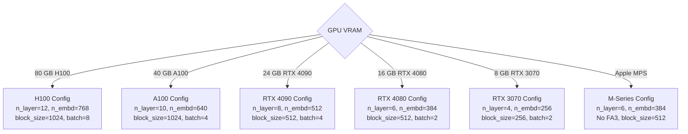
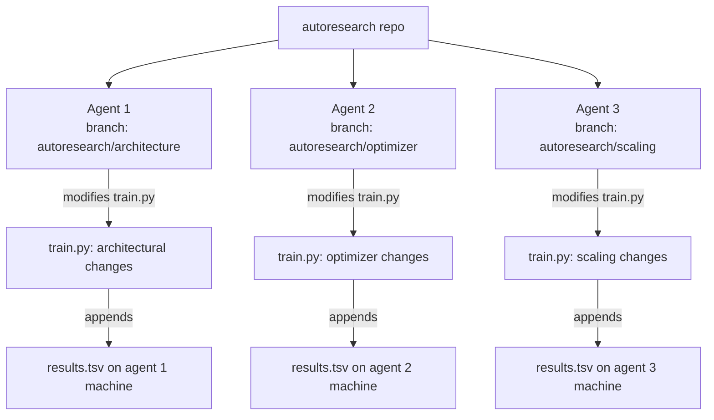
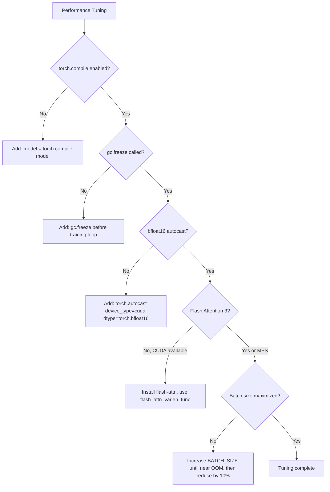

# Chapter 8: Customization and Scaling

## What Problem Does This Solve?

The reference configuration in `train.py` is tuned for a single H100 SXM 80 GB. Running
it as-is on:

- An RTX 3090 (24 GB): runs out of memory immediately
- An A10 (24 GB): runs out of memory immediately
- A MacBook with M3 Max: Flash Attention 3 is not available
- A Windows machine: path and library issues
- Two H100s: only uses one GPU

This chapter provides concrete modifications for each scenario. The guiding principle:
**TIME_BUDGET=300s is sacred. Everything else can be changed.**

## Memory Sizing Guide

GPU memory is the binding constraint. Here is how to calculate the correct configuration
for a given GPU:

```python
def estimate_memory_gb(n_layer, n_embd, n_head, block_size, batch_size, grad_accum):
    """
    Rough estimate of GPU memory for training.
    Accounts for: parameters, optimizer states, activations, KV cache.
    """
    # Parameters (float32 in optimizer, bf16 in forward)
    params = n_layer * (
        4 * n_embd * n_embd +   # Q, K, V, O projections
        8 * n_embd * n_embd      # MLP (4× hidden × 2 matrices)
    ) + n_embd * 50257           # embedding + LM head
    param_gb = params * 4 / 1e9  # float32

    # Optimizer states (AdamW: 2× params, Muon: 1× params)
    optimizer_gb = param_gb * 2.0

    # Activations: roughly 12 * n_layer * batch_size * block_size * n_embd bytes (bf16)
    activation_gb = 12 * n_layer * batch_size * block_size * n_embd * 2 / 1e9

    # KV cache during training: 2 * n_layer * n_kv_head * block_size * head_dim * batch_size
    head_dim = n_embd // n_head
    n_kv_head = max(1, n_head // 3)  # assuming GQA with 3× reduction
    kv_gb = 2 * n_layer * n_kv_head * block_size * head_dim * batch_size * 2 / 1e9

    total = param_gb + optimizer_gb + activation_gb + kv_gb
    return total, {
        'params': param_gb, 'optimizer': optimizer_gb,
        'activations': activation_gb, 'kv_cache': kv_gb
    }

# Example: check if a config fits in 24 GB
total, breakdown = estimate_memory_gb(
    n_layer=8, n_embd=512, n_head=8,
    block_size=512, batch_size=4, grad_accum=4
)
print(f"Estimated memory: {total:.1f} GB")
for k, v in breakdown.items():
    print(f"  {k}: {v:.1f} GB")
```

## Recommended Configurations by GPU



### Complete Configuration for RTX 4090 (24 GB)

```python
# train.py modifications for RTX 4090

@dataclass
class GPTConfig:
    vocab_size: int = 50257
    block_size: int = 512          # ↓ from 1024 (memory)
    n_layer: int = 8               # ↓ from 12
    n_head: int = 8                # ↓ from 12
    n_kv_head: int = 2             # ↓ from 4 (more aggressive GQA)
    n_embd: int = 512              # ↓ from 768
    WINDOW_PATTERN: str = "SSSL"
    SHORT_WINDOW: int = 64         # ↓ from 128 (scales with block_size)
    use_value_residual: bool = True
    dropout: float = 0.0
    logit_softcap: float = 15.0
    use_squared_relu: bool = True

# Training constants for RTX 4090
BATCH_SIZE = 8                     # physical micro-batch
GRAD_ACCUM_STEPS = 8              # logical batch = 64 sequences × 512 tokens = 32768 tokens
TIME_BUDGET = 300                  # NEVER CHANGE THIS
```

### Complete Configuration for Apple M-Series (MPS)

Flash Attention 3 is CUDA-only. For MPS, use PyTorch's built-in `scaled_dot_product_attention`:

```python
# train.py modifications for Apple MPS

import torch

# Detect device
if torch.cuda.is_available():
    device = torch.device('cuda')
elif torch.backends.mps.is_available():
    device = torch.device('mps')
else:
    device = torch.device('cpu')

# Replace Flash Attention 3 with SDPA
class CausalSelfAttentionMPS(nn.Module):
    def forward(self, x, x0, cos, sin):
        # ... (same Q, K, V projection, RoPE, QK-norm as before) ...

        # Use PyTorch SDPA instead of flash_attn
        # MPS supports SDPA with causal mask
        attn_output = torch.nn.functional.scaled_dot_product_attention(
            q, k, v,
            attn_mask=None,
            is_causal=True,
            # Note: sliding window not natively supported on MPS
            # Use full attention for all layers on MPS
        )
        return attn_output
```

MPS-specific changes:
1. Replace `flash_attn_varlen_func` with `F.scaled_dot_product_attention`
2. Remove the sliding window for S-layers (MPS SDPA does not support window_size)
3. Use `torch.float32` instead of `torch.bfloat16` (MPS bfloat16 support is partial)
4. Reduce batch size and model size (MPS unified memory is slower than CUDA HBM)

```python
# pyproject.toml for MPS
[project]
dependencies = [
    "torch>=2.2.0",        # remove ==2.9.1 CUDA requirement
    # remove flash-attn (CUDA only)
    "rustbpe",
    "tiktoken",
    "pyarrow",
    "huggingface-hub",
    "numpy",
]
```

### Windows Configuration

Windows requires a few path and library adjustments:

```python
# Fix path separators in prepare.py
import pathlib
DATA_DIR = pathlib.Path("data")  # not str "data/" — use pathlib throughout

# Fix multiprocessing for Windows
if __name__ == '__main__':
    # Required on Windows to avoid fork issues with multiprocessing
    torch.multiprocessing.set_start_method('spawn', force=True)
    main()
```

Flash Attention 3 on Windows requires WSL2 or a native CUDA build with specific
Visual Studio toolchain. The community has maintained a WSL2 setup guide in the
GitHub discussions.

### AMD ROCm Configuration

For AMD GPUs (MI250X, MI300X, RX 7900 XTX):

```bash
# Install ROCm-compatible PyTorch
pip install torch --index-url https://download.pytorch.org/whl/rocm6.1
```

```python
# train.py: replace flash_attn with hipBLASLt-backed SDPA
# AMD GPUs support torch.nn.functional.scaled_dot_product_attention
# with flash attention implementation via ROCm

# The flash-attn package has a ROCm fork:
# pip install flash-attn-rocm (community maintained)
# Or use SDPA which is automatically accelerated on ROCm:

attn_output = torch.nn.functional.scaled_dot_product_attention(
    q, k, v, is_causal=True
)
```

## Scaling Down: Smaller Models

For learning and experimentation on modest hardware, a "tiny" configuration:

```python
# Tiny configuration — runs on any GPU with 8+ GB
@dataclass
class GPTConfig:
    vocab_size: int = 50257
    block_size: int = 256
    n_layer: int = 4
    n_head: int = 4
    n_kv_head: int = 1             # MQA (multi-query attention)
    n_embd: int = 256
    WINDOW_PATTERN: str = "SL"    # alternating short/full
    SHORT_WINDOW: int = 32
    use_value_residual: bool = False   # disable for very small models
    dropout: float = 0.0
    logit_softcap: float = 15.0
    use_squared_relu: bool = True

BATCH_SIZE = 4
GRAD_ACCUM_STEPS = 4
```

This configuration uses ~2 GB peak memory and runs at ~200k tokens/second on an RTX 3070.
It is suitable for validating experiment ideas before running the full configuration overnight.

## Multi-GPU Training with DDP

For users with multiple GPUs (2× A100, 4× H100, etc.):

```python
# train.py additions for DDP

import torch.distributed as dist
from torch.nn.parallel import DistributedDataParallel as DDP

def setup_distributed():
    """Initialize the distributed process group."""
    dist.init_process_group(backend='nccl')
    rank = dist.get_rank()
    world_size = dist.get_world_size()
    torch.cuda.set_device(rank)
    return rank, world_size

# Launch command:
# torchrun --nproc_per_node=4 train.py

rank, world_size = setup_distributed()
device = torch.device(f'cuda:{rank}')

model = GPT(config).to(device)
model = DDP(model, device_ids=[rank])

# In training loop: data is sharded across GPUs
# Each GPU processes a different micro-batch
# Gradients are automatically reduced across GPUs by DDP

# LR scales linearly with world_size (linear scaling rule)
max_lr = 3e-4 * world_size

# Effective batch size scales with world_size
effective_batch = BATCH_SIZE * GRAD_ACCUM_STEPS * world_size
```

With 4× H100:
- Effective batch size: 4× larger
- Throughput: ~3.8× (some communication overhead)
- Steps per 300s: ~3.8× more
- val_bpb typically 5–10% better than single GPU

## Multi-Agent Parallelism

autoresearch's branch-based design enables multiple agents to run simultaneously without
conflicts:



Because each agent works on its own branch and `results.tsv` is untracked, there are
zero conflicts between agents. In the morning, merge the insights:

```bash
# Collect all results
git fetch origin
git log --oneline origin/autoresearch/architecture | head -20
git log --oneline origin/autoresearch/optimizer | head -20

# Merge the best result into main
git checkout main
git merge origin/autoresearch/architecture  # or whichever branch has the best val_bpb

# Or cherry-pick specific improvements
git cherry-pick <best_commit_from_each_branch>
```

## Customizing program.md for Your Hardware

When running on different hardware, update `program.md` to include hardware-specific
constraints:

```markdown
# autoresearch program

## Hardware Context
- GPU: RTX 4090 (24 GB VRAM)
- Current baseline: val_bpb=1.9234 (24 GB config)
- OOM threshold: memory_gb > 20 (leave 4 GB headroom)

## Hardware-Specific Rules
- If memory_gb > 20: git reset immediately (approaching OOM)
- Batch_size must remain 4 (fixed for this GPU)
- Do NOT increase block_size beyond 512 (OOM risk)
- Flash Attention 3 IS available (RTX 40-series supports it)

## Adjusted Config
Config fields you may change: n_layer (4-10), n_embd (384-640), n_head (4-10),
n_kv_head (1-4), WINDOW_PATTERN, SHORT_WINDOW (32-128), logit_softcap, use_squared_relu

Config fields you MUST NOT change: block_size=512, BATCH_SIZE=4, TIME_BUDGET=300
```

## Custom Datasets

To use a different dataset instead of climbmix-400b:

```python
# In prepare.py: swap the dataset source
# The only requirement: a dataset with a 'text' column in parquet format

from huggingface_hub import snapshot_download

# Instead of climbmix:
DATASET_NAME = "your-org/your-dataset"
snapshot_download(
    repo_id=DATASET_NAME,
    repo_type="dataset",
    local_dir=DATA_DIR,
    allow_patterns=["*.parquet"],
)
```

The tokenizer should be retrained on the new dataset:
```python
# In prepare.py: retrain BPE on your data
# The BPE trainer is dataset-agnostic
train_tokenizer(stream_texts(DATA_DIR), vocab_size=50257)
```

## Notable Community Forks

The autoresearch community has produced several notable extensions:

| Fork / Extension | Target Hardware | Key Changes |
|---|---|---|
| autoresearch-mps | macOS M-series | Replaced FA3 with SDPA, MPS device support |
| autoresearch-windows | Windows + CUDA | WSL2 setup, path fixes, spawn multiprocessing |
| autoresearch-amd | AMD ROCm | ROCm PyTorch, hipBLASLt attention |
| autoresearch-multi | Multi-GPU DDP | torchrun launcher, linear LR scaling |
| autoresearch-small | Consumer GPUs | Tiny/small configs for 8–24 GB GPUs |
| autoresearch-long | Long context | 4k–8k context with full sliding window |

## Extending the Evaluation

The default `evaluate_bpb` uses a single validation set. For more robust evaluation:

```python
# In prepare.py: multiple evaluation domains
def evaluate_bpb_multi(model, device, T):
    """
    Evaluate on multiple domains for a more complete picture.
    Returns a dict of domain -> val_bpb.
    """
    results = {}
    for domain in ['web', 'books', 'code', 'math']:
        val_tokens = load_domain_validation(domain)
        bpb = _evaluate_bpb_on_tokens(model, device, T, val_tokens)
        results[domain] = bpb

    results['average'] = np.mean(list(results.values()))
    return results
```

Modify the output format in `train.py` to match what the agent greps:
```python
# Extended output format
print(
    f"val_bpb={results['average']:.4f} | "
    f"val_bpb_web={results['web']:.4f} | "
    f"val_bpb_code={results['code']:.4f} | "
    f"memory_gb={memory_gb:.1f} | steps={total_steps}"
)
```

Update `program.md` to grep for the composite metric:
```markdown
## Success Criterion
Primary metric: val_bpb (the average across domains)
Also log: val_bpb_web, val_bpb_code for domain-specific tracking
```

## Performance Tuning Checklist



## Chapter Summary

| Scenario | Key Changes | Expected Performance |
|---|---|---|
| H100 80 GB (reference) | None — use defaults | val_bpb ~1.83, ~100 exp/night |
| A100 40 GB | n_embd=640, batch=4 | val_bpb ~1.86, ~95 exp/night |
| RTX 4090 24 GB | n_embd=512, block_size=512 | val_bpb ~1.90, ~90 exp/night |
| RTX 4080 16 GB | n_embd=384, block_size=512, batch=2 | val_bpb ~1.94, ~85 exp/night |
| Apple M3 Max | No FA3, MPS device, float32 | val_bpb ~1.96, ~40 exp/night |
| 4× H100 (DDP) | torchrun, lr×4, batch×4 | val_bpb ~1.78, ~100 exp/night |
| Multi-agent (3×) | Separate branches, separate machines | 3× experiments/night |
| AMD MI300X | ROCm PyTorch, hipBLASLt | val_bpb ~1.83 (comparable to H100) |

## Final Thoughts

autoresearch distills an important insight about ML research: **the bottleneck is not GPU
compute — it is research iteration speed**. By eliminating the human from the experiment
loop, it turns a single GPU into a research engine that can explore 100 architectural
hypotheses overnight.

The design principles that make this work are universal:
1. Fix the evaluation (prepare.py is immutable)
2. Fix the comparison unit (TIME_BUDGET=300s always)
3. Use existing infrastructure (git for versioning, grep for parsing)
4. Encode the protocol completely (program.md leaves no gaps)
5. Prefer simplicity (the simplicity criterion shapes search)

These principles apply beyond autoresearch: any autonomous research agent benefits from
clear evaluation metrics, comparable measurement units, minimal infrastructure, complete
protocols, and a bias toward simplicity.

The ~70,000 GitHub stars suggest the community recognizes something genuine here: a
minimum viable research agent that works, written in ~1000 lines of Python and one
Markdown file.
