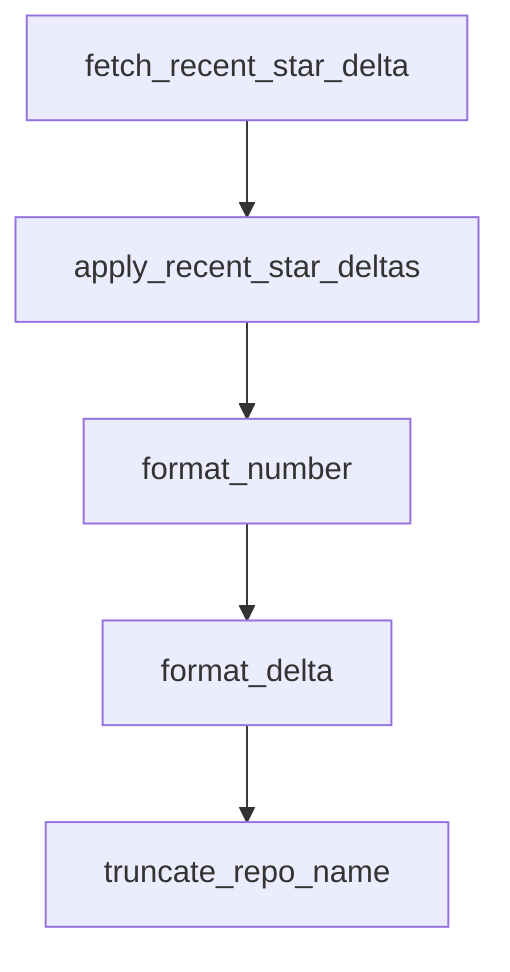

# Chapter 1: Getting Started

Welcome to **Chapter 1: Getting Started**. In this part of **Awesome Claude Code Tutorial: Curated Claude Code Resource Discovery and Evaluation**, you will build an intuitive mental model first, then move into concrete implementation details and practical production tradeoffs.


This chapter sets up a fast, repeatable way to extract value from the list without getting lost in volume.

## Learning Goals

- navigate the list based on your immediate task
- choose the right README style for exploration vs maintenance
- shortlist candidate resources with basic risk checks
- avoid common low-signal adoption mistakes

## 15-Minute Workflow

1. open the root [README](https://github.com/hesreallyhim/awesome-claude-code/blob/main/README.md)
2. identify your task type first: skills, hooks, commands, tooling, or `CLAUDE.md`
3. scan `Latest Additions` for recent high-velocity entries
4. jump to category sections and capture 3-5 candidates
5. run a quick safety/maintainability pass before adoption

## First-Pass Selection Filters

| Filter | What To Check | Why It Matters |
|:-------|:--------------|:---------------|
| maintenance | recent commits/issues activity | lowers abandonment risk |
| documentation | setup clarity, examples, caveats | faster evaluation and safer use |
| interoperability | can it be adapted without full lock-in? | reduces migration cost |
| security posture | clear permissions and risk notes | avoids unsafe defaults |

## Source References

- [README](https://github.com/hesreallyhim/awesome-claude-code/blob/main/README.md)
- [Contributing Guide](https://github.com/hesreallyhim/awesome-claude-code/blob/main/docs/CONTRIBUTING.md)

## Summary

You now have a concrete triage loop for using the list efficiently.

Next: [Chapter 2: List Taxonomy and Navigation](02-list-taxonomy-and-navigation.md)

## Depth Expansion Playbook

## Source Code Walkthrough

### `scripts/ticker/generate_ticker_svg.py`

The `fetch_recent_star_delta` function in [`scripts/ticker/generate_ticker_svg.py`](https://github.com/hesreallyhim/awesome-claude-code/blob/HEAD/scripts/ticker/generate_ticker_svg.py) handles a key part of this chapter's functionality:

```py


def fetch_recent_star_delta(
    full_name: str, token: str, since: datetime, cache: dict[str, int]
) -> int | None:
    """Fetch the number of stars added since the cutoff time."""
    if full_name in cache:
        return cache[full_name]

    owner, repo = full_name.split("/", 1)
    headers = {
        "Accept": "application/vnd.github+json",
        "Authorization": f"Bearer {token}",
        "X-GitHub-Api-Version": "2022-11-28",
    }
    query = """
    query($owner: String!, $name: String!, $cursor: String) {
      repository(owner: $owner, name: $name) {
        stargazers(first: 100, after: $cursor, orderBy: {field: STARRED_AT, direction: DESC}) {
          edges { starredAt }
          pageInfo { hasNextPage endCursor }
        }
      }
    }
    """

    delta = 0
    cursor: str | None = None
    cutoff = since.astimezone(UTC)

    while True:
        payload = {"query": query, "variables": {"owner": owner, "name": repo, "cursor": cursor}}
```

This function is important because it defines how Awesome Claude Code Tutorial: Curated Claude Code Resource Discovery and Evaluation implements the patterns covered in this chapter.

### `scripts/ticker/generate_ticker_svg.py`

The `apply_recent_star_deltas` function in [`scripts/ticker/generate_ticker_svg.py`](https://github.com/hesreallyhim/awesome-claude-code/blob/HEAD/scripts/ticker/generate_ticker_svg.py) handles a key part of this chapter's functionality:

```py


def apply_recent_star_deltas(repos: list[dict[str, Any]]) -> None:
    """Replace stars_delta with counts from the last 24 hours when possible."""
    token = os.getenv("GITHUB_TOKEN", "").strip()
    if not token:
        return

    cutoff = datetime.now(UTC) - timedelta(days=1)
    for repo in repos:
        delta = fetch_recent_star_delta(repo["full_name"], token, cutoff, _STAR_DELTA_CACHE)
        if delta is not None:
            repo["stars_delta"] = delta


def format_number(num: int) -> str:
    """
    Format a number with K/M suffix for display.

    Args:
        num: The number to format

    Returns:
        Formatted string (e.g., "1.2K", "15.3K")
    """
    if num >= 1_000_000:
        return f"{num / 1_000_000:.1f}M"
    elif num >= 1000:
        return f"{num / 1000:.1f}K"
    else:
        return str(num)

```

This function is important because it defines how Awesome Claude Code Tutorial: Curated Claude Code Resource Discovery and Evaluation implements the patterns covered in this chapter.

### `scripts/ticker/generate_ticker_svg.py`

The `format_number` function in [`scripts/ticker/generate_ticker_svg.py`](https://github.com/hesreallyhim/awesome-claude-code/blob/HEAD/scripts/ticker/generate_ticker_svg.py) handles a key part of this chapter's functionality:

```py


def format_number(num: int) -> str:
    """
    Format a number with K/M suffix for display.

    Args:
        num: The number to format

    Returns:
        Formatted string (e.g., "1.2K", "15.3K")
    """
    if num >= 1_000_000:
        return f"{num / 1_000_000:.1f}M"
    elif num >= 1000:
        return f"{num / 1000:.1f}K"
    else:
        return str(num)


def format_delta(delta: int) -> str:
    """
    Format a delta with +/- prefix.

    Args:
        delta: The delta value

    Returns:
        Formatted string (e.g., "+5", "-2", "0")
    """
    if delta > 0:
        return f"+{format_number(delta)}"
```

This function is important because it defines how Awesome Claude Code Tutorial: Curated Claude Code Resource Discovery and Evaluation implements the patterns covered in this chapter.

### `scripts/ticker/generate_ticker_svg.py`

The `format_delta` function in [`scripts/ticker/generate_ticker_svg.py`](https://github.com/hesreallyhim/awesome-claude-code/blob/HEAD/scripts/ticker/generate_ticker_svg.py) handles a key part of this chapter's functionality:

```py


def format_delta(delta: int) -> str:
    """
    Format a delta with +/- prefix.

    Args:
        delta: The delta value

    Returns:
        Formatted string (e.g., "+5", "-2", "0")
    """
    if delta > 0:
        return f"+{format_number(delta)}"
    elif delta < 0:
        return format_number(delta)
    else:
        return "0"


def truncate_repo_name(name: str, max_length: int = 20) -> str:
    """
    Truncate a repository name if it exceeds max_length.

    Args:
        name: The repository name to truncate
        max_length: Maximum length before truncation (default: 20)

    Returns:
        Truncated string with ellipsis if needed (e.g., "very-long-repositor...")
    """
    if len(name) <= max_length:
```

This function is important because it defines how Awesome Claude Code Tutorial: Curated Claude Code Resource Discovery and Evaluation implements the patterns covered in this chapter.


## How These Components Connect


