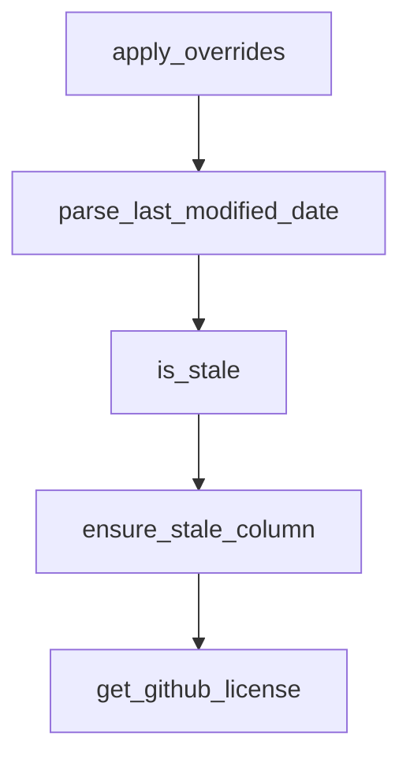

# Chapter 2: List Taxonomy and Navigation

Welcome to **Chapter 2: List Taxonomy and Navigation**. In this part of **Awesome Claude Code Tutorial: Curated Claude Code Resource Discovery and Evaluation**, you will build an intuitive mental model first, then move into concrete implementation details and practical production tradeoffs.


This chapter maps the repository's category system and view modes so navigation remains intentional.

## Learning Goals

- map category intent to concrete user needs
- pick the right list style for your current work
- use flat list views for scanning velocity and freshness
- avoid context-switch overhead while comparing candidates

## Category Map

| Category | Best Used For | Typical Outcome |
|:---------|:--------------|:----------------|
| Agent Skills | reusable capabilities and role specialization | faster task execution quality |
| Hooks | lifecycle enforcement and automation | consistency and policy control |
| Slash-Commands | repeatable task prompts | reduced prompt overhead |
| Tooling | wrappers, integrations, operators | better workflow ergonomics |
| `CLAUDE.md` Files | project-specific operating constraints | stronger local reliability |
| Workflows & Guides | end-to-end process design | better execution strategy |

## Choosing a README Style

| Style | Use Case | Entry Point |
|:------|:---------|:------------|
| Awesome | straightforward curation browsing | [README](https://github.com/hesreallyhim/awesome-claude-code/blob/main/README.md) |
| Classic | minimal visual noise | [README_CLASSIC.md](https://github.com/hesreallyhim/awesome-claude-code/blob/main/README_ALTERNATIVES/README_CLASSIC.md) |
| Extra | richer visual navigation | [README_EXTRA.md](https://github.com/hesreallyhim/awesome-claude-code/blob/main/README_ALTERNATIVES/README_EXTRA.md) |
| Flat | sorting/filtering via generated permutations | [README_FLAT_ALL_UPDATED.md](https://github.com/hesreallyhim/awesome-claude-code/blob/main/README_ALTERNATIVES/README_FLAT_ALL_UPDATED.md) |

## Source References

- [README](https://github.com/hesreallyhim/awesome-claude-code/blob/main/README.md)
- [README Alternatives](https://github.com/hesreallyhim/awesome-claude-code/tree/main/README_ALTERNATIVES)
- [README Generation Guide](https://github.com/hesreallyhim/awesome-claude-code/blob/main/docs/README-GENERATION.md)

## Summary

You now understand how to navigate by intent and choose the right list rendering mode.

Next: [Chapter 3: Resource Quality Evaluation Framework](03-resource-quality-evaluation-framework.md)

## Source Code Walkthrough

### `scripts/validation/validate_links.py`

The `apply_overrides` function in [`scripts/validation/validate_links.py`](https://github.com/hesreallyhim/awesome-claude-code/blob/HEAD/scripts/validation/validate_links.py) handles a key part of this chapter's functionality:

```py


def apply_overrides(row, overrides):
    """Apply overrides to a row if the resource ID has overrides configured.

    Any field set in the override configuration is automatically locked,
    preventing validation scripts from updating it. The skip_validation flag
    has highest precedence - if set, the entire resource is skipped.
    """
    resource_id = row.get(ID_HEADER_NAME, "")
    if not resource_id or resource_id not in overrides:
        return row, set(), False

    override_config = overrides[resource_id]
    locked_fields = set()
    skip_validation = override_config.get("skip_validation", False)

    # Apply each override and auto-lock the field
    for field, value in override_config.items():
        # Skip special control/metadata fields
        if field in ["skip_validation", "notes"]:
            continue

        # Skip any legacy *_locked flags (no longer needed)
        if field.endswith("_locked"):
            continue

        # Apply override value and automatically lock the field
        if field == "license":
            row[LICENSE_HEADER_NAME] = value
            locked_fields.add("license")
        elif field == "active":
```

This function is important because it defines how Awesome Claude Code Tutorial: Curated Claude Code Resource Discovery and Evaluation implements the patterns covered in this chapter.

### `scripts/validation/validate_links.py`

The `parse_last_modified_date` function in [`scripts/validation/validate_links.py`](https://github.com/hesreallyhim/awesome-claude-code/blob/HEAD/scripts/validation/validate_links.py) handles a key part of this chapter's functionality:

```py


def parse_last_modified_date(value: str | None) -> datetime | None:
    """Parse date strings into timezone-aware datetimes (UTC)."""
    if not value:
        return None

    value = str(value).strip()
    if not value:
        return None

    try:
        normalized_value = value.replace("Z", "+00:00")
        parsed = datetime.fromisoformat(normalized_value)
        if parsed.tzinfo is None:
            parsed = parsed.replace(tzinfo=UTC)
        return parsed.astimezone(UTC)
    except ValueError:
        pass

    try:
        parsed = datetime.strptime(value, "%Y-%m-%d:%H-%M-%S")
        return parsed.replace(tzinfo=UTC)
    except ValueError:
        return None


def is_stale(last_modified: datetime | None, stale_days: int = STALE_DAYS) -> bool:
    """Return True if the resource is stale or last_modified is missing."""
    if last_modified is None:
        return True

```

This function is important because it defines how Awesome Claude Code Tutorial: Curated Claude Code Resource Discovery and Evaluation implements the patterns covered in this chapter.

### `scripts/validation/validate_links.py`

The `is_stale` function in [`scripts/validation/validate_links.py`](https://github.com/hesreallyhim/awesome-claude-code/blob/HEAD/scripts/validation/validate_links.py) handles a key part of this chapter's functionality:

```py


def is_stale(last_modified: datetime | None, stale_days: int = STALE_DAYS) -> bool:
    """Return True if the resource is stale or last_modified is missing."""
    if last_modified is None:
        return True

    if last_modified.tzinfo is None:
        last_modified = last_modified.replace(tzinfo=UTC)

    now = datetime.now(UTC)
    return now - last_modified > timedelta(days=stale_days)


def ensure_stale_column(
    fieldnames: list[str] | None, rows: list[dict[str, str]]
) -> tuple[list[str], list[dict[str, str]]]:
    """Ensure the Stale column exists and rows have default values."""
    fieldnames_list = list(fieldnames or [])
    if STALE_HEADER_NAME not in fieldnames_list:
        fieldnames_list.append(STALE_HEADER_NAME)

    for row in rows:
        row.setdefault(STALE_HEADER_NAME, "")

    return fieldnames_list, rows


def get_github_license(owner: str, repo: str) -> str:
    """Fetch license information from GitHub API."""
    api_url = f"https://api.github.com/repos/{owner}/{repo}"
    try:
```

This function is important because it defines how Awesome Claude Code Tutorial: Curated Claude Code Resource Discovery and Evaluation implements the patterns covered in this chapter.

### `scripts/validation/validate_links.py`

The `ensure_stale_column` function in [`scripts/validation/validate_links.py`](https://github.com/hesreallyhim/awesome-claude-code/blob/HEAD/scripts/validation/validate_links.py) handles a key part of this chapter's functionality:

```py


def ensure_stale_column(
    fieldnames: list[str] | None, rows: list[dict[str, str]]
) -> tuple[list[str], list[dict[str, str]]]:
    """Ensure the Stale column exists and rows have default values."""
    fieldnames_list = list(fieldnames or [])
    if STALE_HEADER_NAME not in fieldnames_list:
        fieldnames_list.append(STALE_HEADER_NAME)

    for row in rows:
        row.setdefault(STALE_HEADER_NAME, "")

    return fieldnames_list, rows


def get_github_license(owner: str, repo: str) -> str:
    """Fetch license information from GitHub API."""
    api_url = f"https://api.github.com/repos/{owner}/{repo}"
    try:
        status, _, data = github_request_json_paced(api_url)
        if status == 200 and isinstance(data, dict):
            license_info = data.get("license")
            if license_info and isinstance(license_info, dict):
                spdx_id = license_info.get("spdx_id")
                if spdx_id:
                    return spdx_id
    except Exception:
        pass
    return "NOT_FOUND"


```

This function is important because it defines how Awesome Claude Code Tutorial: Curated Claude Code Resource Discovery and Evaluation implements the patterns covered in this chapter.


## How These Components Connect


