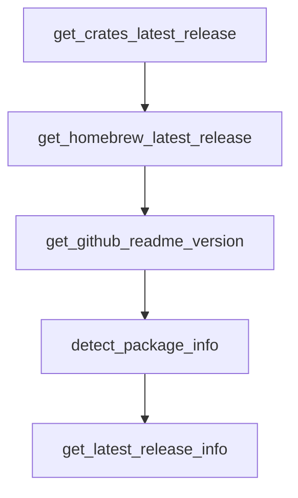

# Chapter 3: Resource Quality Evaluation Framework

Welcome to **Chapter 3: Resource Quality Evaluation Framework**. In this part of **Awesome Claude Code Tutorial: Curated Claude Code Resource Discovery and Evaluation**, you will build an intuitive mental model first, then move into concrete implementation details and practical production tradeoffs.


This chapter turns subjective browsing into a structured quality evaluation process.

## Learning Goals

- apply a consistent rubric before installing third-party assets
- prioritize resources that are practical, testable, and maintainable
- identify risky submissions early
- document adoption decisions for teams

## Recommended Rubric

| Dimension | Strong Signal | Risk Signal |
|:----------|:--------------|:------------|
| safety | explicit permission model and risk notes | hidden or unclear runtime behavior |
| docs quality | clear setup + examples + troubleshooting | sparse or purely promotional docs |
| ease of trial | fast setup and teardown | heavy setup with unclear payoff |
| interoperability | modular and adaptable | full lock-in to one workflow style |
| maintenance | responsive updates and fixes | stale repo with unresolved issues |

## Adoption Gate

1. verify the resource solves a real, current bottleneck
2. run a minimal proof with constrained permissions
3. log objective pros/cons from the trial
4. keep only resources that measurably improve outcomes

## Source References

- [Contributing Guide](https://github.com/hesreallyhim/awesome-claude-code/blob/main/docs/CONTRIBUTING.md)
- [Testing Notes](https://github.com/hesreallyhim/awesome-claude-code/blob/main/docs/TESTING.md)

## Summary

You now have a repeatable quality filter for selecting resources safely.

Next: [Chapter 4: Skills, Hooks, and Slash Command Patterns](04-skills-hooks-and-slash-command-patterns.md)

## Source Code Walkthrough

### `scripts/validation/validate_links.py`

The `get_crates_latest_release` function in [`scripts/validation/validate_links.py`](https://github.com/hesreallyhim/awesome-claude-code/blob/HEAD/scripts/validation/validate_links.py) handles a key part of this chapter's functionality:

```py


def get_crates_latest_release(crate_name: str) -> tuple[str | None, str | None]:
    """Fetch the latest release date and version from crates.io (Rust).

    Args:
        crate_name: Rust crate name

    Returns:
        Tuple of (release_date, version) in (YYYY-MM-DD:HH-MM-SS, version) format,
        or (None, None) if the crate is not found.
    """
    try:
        api_url = f"https://crates.io/api/v1/crates/{crate_name}"
        headers_with_ua = {"User-Agent": USER_AGENT}
        response = requests.get(api_url, headers=headers_with_ua, timeout=10)

        if response.status_code == 200:
            data = response.json()
            crate_info = data.get("crate", {})
            newest_version = crate_info.get("newest_version")
            updated_at = crate_info.get("updated_at")
            if newest_version and updated_at:
                release_date = format_commit_date(updated_at)
                return release_date, newest_version
    except Exception as e:
        print(f"Error fetching crates.io release for {crate_name}: {e}")

    return None, None


def get_homebrew_latest_release(formula_name: str) -> tuple[str | None, str | None]:
```

This function is important because it defines how Awesome Claude Code Tutorial: Curated Claude Code Resource Discovery and Evaluation implements the patterns covered in this chapter.

### `scripts/validation/validate_links.py`

The `get_homebrew_latest_release` function in [`scripts/validation/validate_links.py`](https://github.com/hesreallyhim/awesome-claude-code/blob/HEAD/scripts/validation/validate_links.py) handles a key part of this chapter's functionality:

```py


def get_homebrew_latest_release(formula_name: str) -> tuple[str | None, str | None]:
    """Fetch the latest version from Homebrew Formulae API.

    Note: Homebrew doesn't provide release dates, only version numbers.
    We return the version but no date.

    Args:
        formula_name: Homebrew formula name

    Returns:
        Tuple of (None, version) - no date available from Homebrew API,
        or (None, None) if the formula is not found.
    """
    try:
        api_url = f"https://formulae.brew.sh/api/formula/{formula_name}.json"
        response = requests.get(api_url, timeout=10)

        if response.status_code == 200:
            data = response.json()
            versions = data.get("versions", {})
            stable = versions.get("stable")
            if stable:
                # Homebrew doesn't provide release dates, but we have the version
                return None, stable
    except Exception as e:
        print(f"Error fetching Homebrew release for {formula_name}: {e}")

    return None, None


```

This function is important because it defines how Awesome Claude Code Tutorial: Curated Claude Code Resource Discovery and Evaluation implements the patterns covered in this chapter.

### `scripts/validation/validate_links.py`

The `get_github_readme_version` function in [`scripts/validation/validate_links.py`](https://github.com/hesreallyhim/awesome-claude-code/blob/HEAD/scripts/validation/validate_links.py) handles a key part of this chapter's functionality:

```py


def get_github_readme_version(owner: str, repo: str) -> tuple[str | None, str | None]:
    """Fallback: Try to extract version from GitHub README or CHANGELOG.

    Searches for version patterns like "v1.2.3", "version 1.2.3", etc.

    Args:
        owner: GitHub repository owner
        repo: GitHub repository name

    Returns:
        Tuple of (None, version) - no reliable date from README parsing,
        or (None, None) if no version found.
    """
    try:
        # Try to fetch README
        for readme_name in ["README.md", "README", "readme.md", "Readme.md"]:
            api_url = f"https://api.github.com/repos/{owner}/{repo}/contents/{readme_name}"
            status, _, data = github_request_json_paced(api_url)
            if status == 200 and isinstance(data, dict):
                # README content is base64 encoded
                import base64

                content = base64.b64decode(data.get("content", "")).decode("utf-8", errors="ignore")

                # Search for version patterns
                version_patterns = [
                    r"version[:\s]+[\"']?v?(\d+\.\d+(?:\.\d+)?)[\"']?",
                    r"latest[:\s]+[\"']?v?(\d+\.\d+(?:\.\d+)?)[\"']?",
                    r"\[v?(\d+\.\d+(?:\.\d+)?)\]",  # Badge format
                    r"v(\d+\.\d+(?:\.\d+)?)",  # Simple v1.2.3
```

This function is important because it defines how Awesome Claude Code Tutorial: Curated Claude Code Resource Discovery and Evaluation implements the patterns covered in this chapter.

### `scripts/validation/validate_links.py`

The `detect_package_info` function in [`scripts/validation/validate_links.py`](https://github.com/hesreallyhim/awesome-claude-code/blob/HEAD/scripts/validation/validate_links.py) handles a key part of this chapter's functionality:

```py


def detect_package_info(url: str, display_name: str = "") -> tuple[str | None, str | None]:
    """Detect package registry and name from URL or display name.

    Args:
        url: Primary URL of the resource
        display_name: Display name of the resource (for npm/pypi detection)

    Returns:
        Tuple of (registry_type, package_name) where registry_type is one of:
        'npm', 'pypi', 'crates', 'homebrew', 'github-releases', or None if not detected.
    """
    url_lower = url.lower() if url else ""

    # Check for npm package URL
    npm_patterns = [
        r"npmjs\.com/package/([^/?\s]+)",
        r"npmjs\.org/package/([^/?\s]+)",
    ]
    for pattern in npm_patterns:
        match = re.search(pattern, url_lower)
        if match:
            return "npm", match.group(1)

    # Check for PyPI package URL
    pypi_patterns = [
        r"pypi\.org/project/([^/?\s]+)",
        r"pypi\.python\.org/pypi/([^/?\s]+)",
    ]
    for pattern in pypi_patterns:
        match = re.search(pattern, url_lower)
```

This function is important because it defines how Awesome Claude Code Tutorial: Curated Claude Code Resource Discovery and Evaluation implements the patterns covered in this chapter.


## How These Components Connect


