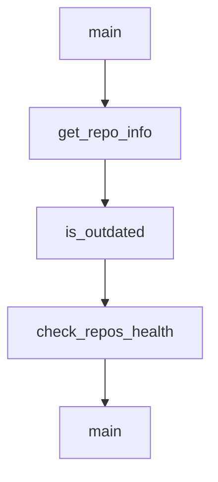

# Chapter 4: Skills, Hooks, and Slash Command Patterns

Welcome to **Chapter 4: Skills, Hooks, and Slash Command Patterns**. In this part of **Awesome Claude Code Tutorial: Curated Claude Code Resource Discovery and Evaluation**, you will build an intuitive mental model first, then move into concrete implementation details and practical production tradeoffs.


This chapter extracts reusable operating patterns from the most practical resource categories.

## Learning Goals

- distinguish when to use skills, hooks, and slash commands
- compose these resource types into one coherent workflow
- avoid over-automation before baseline reliability exists
- create a phased rollout strategy for your project

## Capability Layering

| Resource Type | Primary Role | Good First Use |
|:--------------|:-------------|:---------------|
| skills | domain-specific execution capability | repetitive coding/review tasks |
| hooks | lifecycle enforcement and guardrails | formatting, test checks, notifications |
| slash commands | structured task entrypoints | routine planning, review, deploy flows |

## Rollout Strategy

1. start with one high-value slash command
2. add one hook for quality guardrails
3. introduce skills for specialized workflows
4. measure whether each new layer lowers error rate or cycle time

## Source References

- [Skills Resources](https://github.com/hesreallyhim/awesome-claude-code/tree/main/resources)
- [Slash Commands Resources](https://github.com/hesreallyhim/awesome-claude-code/tree/main/resources/slash-commands)
- [Hooks Resources](https://github.com/hesreallyhim/awesome-claude-code/tree/main/resources)

## Summary

You now have a practical model for composing multiple resource types without adding chaos.

Next: [Chapter 5: `CLAUDE.md` and Project Scaffolding Patterns](05-claude-md-and-project-scaffolding-patterns.md)

## Depth Expansion Playbook

## Source Code Walkthrough

### `scripts/resources/parse_issue_form.py`

The `main` function in [`scripts/resources/parse_issue_form.py`](https://github.com/hesreallyhim/awesome-claude-code/blob/HEAD/scripts/resources/parse_issue_form.py) handles a key part of this chapter's functionality:

```py


def main():
    """Main entry point for the script."""
    # Get issue body from environment variable
    issue_body = os.environ.get("ISSUE_BODY", "")
    if not issue_body:
        print(json.dumps({"valid": False, "errors": ["No issue body provided"], "data": {}}))
        return 1

    # Parse the issue body
    parsed_data = parse_issue_body(issue_body)

    # Check if --validate flag is passed
    validate_mode = "--validate" in sys.argv

    if validate_mode:
        # Full validation mode
        is_valid, errors, warnings = validate_parsed_data(parsed_data)

        # Check for duplicates
        duplicate_warnings = check_for_duplicates(parsed_data)
        warnings.extend(duplicate_warnings)

        # If basic validation passed, do URL validation
        if is_valid and parsed_data.get("primary_link"):
            url_valid, enriched_data, url_errors = validate_single_resource(
                primary_link=parsed_data.get("primary_link", ""),
                secondary_link=parsed_data.get("secondary_link", ""),
                display_name=parsed_data.get("display_name", ""),
                category=parsed_data.get("category", ""),
                license=parsed_data.get("license", "NOT_FOUND"),
```

This function is important because it defines how Awesome Claude Code Tutorial: Curated Claude Code Resource Discovery and Evaluation implements the patterns covered in this chapter.

### `scripts/maintenance/check_repo_health.py`

The `get_repo_info` function in [`scripts/maintenance/check_repo_health.py`](https://github.com/hesreallyhim/awesome-claude-code/blob/HEAD/scripts/maintenance/check_repo_health.py) handles a key part of this chapter's functionality:

```py


def get_repo_info(owner, repo):
    """
    Fetch repository information from GitHub API.
    Returns a dict with:
    - open_issues: number of open issues
    - last_updated: date of last push (ISO format string)
    - exists: whether the repo exists (False if 404)
    Returns None if API call fails for other reasons.
    """
    api_url = f"https://api.github.com/repos/{owner}/{repo}"

    try:
        response = requests.get(api_url, headers=HEADERS, timeout=10)

        if response.status_code == 404:
            logger.warning(f"Repository {owner}/{repo} not found (deleted or private)")
            return {"exists": False, "open_issues": 0, "last_updated": None}

        if response.status_code == 403:
            logger.error(f"Rate limit or forbidden for {owner}/{repo}")
            return None

        if response.status_code != 200:
            logger.error(f"Failed to fetch {owner}/{repo}: HTTP {response.status_code}")
            return None

        data = response.json()

        return {
            "exists": True,
```

This function is important because it defines how Awesome Claude Code Tutorial: Curated Claude Code Resource Discovery and Evaluation implements the patterns covered in this chapter.

### `scripts/maintenance/check_repo_health.py`

The `is_outdated` function in [`scripts/maintenance/check_repo_health.py`](https://github.com/hesreallyhim/awesome-claude-code/blob/HEAD/scripts/maintenance/check_repo_health.py) handles a key part of this chapter's functionality:

```py


def is_outdated(last_updated_str, months_threshold):
    """
    Check if a repository hasn't been updated in more than months_threshold months.
    """
    if not last_updated_str:
        return True  # Consider it outdated if we don't have a date

    try:
        last_updated = datetime.fromisoformat(last_updated_str.replace("Z", "+00:00"))
        now = datetime.now(UTC)
        threshold_date = now - timedelta(days=months_threshold * 30)
        return last_updated < threshold_date
    except (ValueError, AttributeError) as e:
        logger.warning(f"Could not parse date '{last_updated_str}': {e}")
        return True


def check_repos_health(
    csv_file, months_threshold=MONTHS_THRESHOLD, issues_threshold=OPEN_ISSUES_THRESHOLD
):
    """
    Check health of all active GitHub repositories in the CSV.
    Returns a list of problematic repos.
    """
    problematic_repos = []
    checked_repos = 0
    deleted_repos = []

    logger.info(f"Reading repository list from {csv_file}")

```

This function is important because it defines how Awesome Claude Code Tutorial: Curated Claude Code Resource Discovery and Evaluation implements the patterns covered in this chapter.

### `scripts/maintenance/check_repo_health.py`

The `check_repos_health` function in [`scripts/maintenance/check_repo_health.py`](https://github.com/hesreallyhim/awesome-claude-code/blob/HEAD/scripts/maintenance/check_repo_health.py) handles a key part of this chapter's functionality:

```py


def check_repos_health(
    csv_file, months_threshold=MONTHS_THRESHOLD, issues_threshold=OPEN_ISSUES_THRESHOLD
):
    """
    Check health of all active GitHub repositories in the CSV.
    Returns a list of problematic repos.
    """
    problematic_repos = []
    checked_repos = 0
    deleted_repos = []

    logger.info(f"Reading repository list from {csv_file}")

    try:
        with open(csv_file, encoding="utf-8") as f:
            reader = csv.DictReader(f)

            for row in reader:
                # Check if Active is TRUE
                active = row.get("Active", "").strip().upper()
                if active != "TRUE":
                    continue

                primary_link = row.get("Primary Link", "").strip()
                if not primary_link:
                    continue

                # Extract owner and repo from GitHub URL
                _, is_github, owner, repo = parse_github_url(primary_link)
                if not is_github or not owner or not repo:
```

This function is important because it defines how Awesome Claude Code Tutorial: Curated Claude Code Resource Discovery and Evaluation implements the patterns covered in this chapter.


## How These Components Connect


