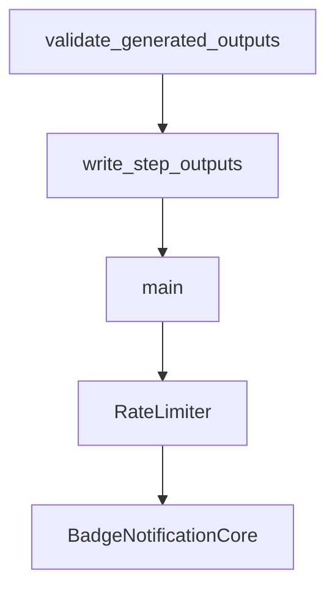

# Chapter 4: Skills, Hooks, and Slash Command Patterns

Welcome to **Chapter 4: Skills, Hooks, and Slash Command Patterns**. In this part of **Awesome Claude Code Tutorial: Curated Claude Code Resource Discovery and Evaluation**, you will build an intuitive mental model first, then move into concrete implementation details and practical production tradeoffs.


This chapter extracts reusable operating patterns from the most practical resource categories.

## Learning Goals

- distinguish when to use skills, hooks, and slash commands
- compose these resource types into one coherent workflow
- avoid over-automation before baseline reliability exists
- create a phased rollout strategy for your project

## Capability Layering

| Resource Type | Primary Role | Good First Use |
|:--------------|:-------------|:---------------|
| skills | domain-specific execution capability | repetitive coding/review tasks |
| hooks | lifecycle enforcement and guardrails | formatting, test checks, notifications |
| slash commands | structured task entrypoints | routine planning, review, deploy flows |

## Rollout Strategy

1. start with one high-value slash command
2. add one hook for quality guardrails
3. introduce skills for specialized workflows
4. measure whether each new layer lowers error rate or cycle time

## Source References

- [Skills Resources](https://github.com/hesreallyhim/awesome-claude-code/tree/main/resources)
- [Slash Commands Resources](https://github.com/hesreallyhim/awesome-claude-code/tree/main/resources/slash-commands)
- [Hooks Resources](https://github.com/hesreallyhim/awesome-claude-code/tree/main/resources)

## Summary

You now have a practical model for composing multiple resource types without adding chaos.

Next: [Chapter 5: `CLAUDE.md` and Project Scaffolding Patterns](05-claude-md-and-project-scaffolding-patterns.md)

## Source Code Walkthrough

### `scripts/resources/create_resource_pr.py`

The `validate_generated_outputs` function in [`scripts/resources/create_resource_pr.py`](https://github.com/hesreallyhim/awesome-claude-code/blob/HEAD/scripts/resources/create_resource_pr.py) handles a key part of this chapter's functionality:

```py


def validate_generated_outputs(status_stdout: str, repo_root: str) -> None:
    """Verify expected outputs exist and no unexpected files are changed."""
    expected_readme = os.path.join(repo_root, "README.md")
    expected_csv = os.path.join(repo_root, "THE_RESOURCES_TABLE.csv")
    expected_readme_dir = os.path.join(repo_root, "README_ALTERNATIVES")

    if not os.path.isfile(expected_readme):
        raise Exception(f"Missing generated README: {expected_readme}")
    if not os.path.isfile(expected_csv):
        raise Exception(f"Missing CSV: {expected_csv}")
    if not os.path.isdir(expected_readme_dir):
        raise Exception(f"Missing README directory: {expected_readme_dir}")
    if not glob.glob(os.path.join(expected_readme_dir, "*.md")):
        raise Exception(f"No README alternatives found in {expected_readme_dir}")

    changed_paths = []
    for line in status_stdout.splitlines():
        if not line.strip():
            continue
        path = line[3:]
        if " -> " in path:
            path = path.split(" -> ", 1)[1]
        changed_paths.append(path)

    allowed_files = {"README.md", "THE_RESOURCES_TABLE.csv"}
    allowed_prefixes = ("README_ALTERNATIVES/", "assets/")
    ignored_files = {"resource_data.json", "pr_result.json"}
    unexpected = [
        path
        for path in changed_paths
```

This function is important because it defines how Awesome Claude Code Tutorial: Curated Claude Code Resource Discovery and Evaluation implements the patterns covered in this chapter.

### `scripts/resources/create_resource_pr.py`

The `write_step_outputs` function in [`scripts/resources/create_resource_pr.py`](https://github.com/hesreallyhim/awesome-claude-code/blob/HEAD/scripts/resources/create_resource_pr.py) handles a key part of this chapter's functionality:

```py


def write_step_outputs(outputs: dict[str, str]) -> None:
    """Write outputs for GitHub Actions, if available."""
    output_path = os.environ.get("GITHUB_OUTPUT")
    if not output_path:
        return

    try:
        with open(output_path, "a", encoding="utf-8") as f:
            for key, value in outputs.items():
                if value is None:
                    value = ""
                value_str = str(value)
                if "\n" in value_str or "\r" in value_str:
                    f.write(f"{key}<<EOF\n{value_str}\nEOF\n")
                else:
                    f.write(f"{key}={value_str}\n")
    except Exception as e:
        print(f"Warning: failed to write step outputs: {e}", file=sys.stderr)


def main():
    """Main entry point."""
    parser = argparse.ArgumentParser(description="Create PR from approved resource submission")
    parser.add_argument("--issue-number", required=True, help="Issue number")
    parser.add_argument("--resource-data", required=True, help="Path to resource data JSON file")
    args = parser.parse_args()

    # Load resource data
    with open(args.resource_data) as f:
        resource_data = json.load(f)
```

This function is important because it defines how Awesome Claude Code Tutorial: Curated Claude Code Resource Discovery and Evaluation implements the patterns covered in this chapter.

### `scripts/resources/create_resource_pr.py`

The `main` function in [`scripts/resources/create_resource_pr.py`](https://github.com/hesreallyhim/awesome-claude-code/blob/HEAD/scripts/resources/create_resource_pr.py) handles a key part of this chapter's functionality:

```py

from scripts.ids.resource_id import generate_resource_id
from scripts.readme.generate_readme import main as generate_readmes
from scripts.resources.resource_utils import append_to_csv, generate_pr_content
from scripts.validation.validate_links import (
    get_github_commit_dates_from_url,
    get_latest_release_info,
)


def run_command(cmd: list[str], check: bool = True) -> subprocess.CompletedProcess:
    """Run a command and return the result."""
    return subprocess.run(cmd, capture_output=True, text=True, check=check)


def create_unique_branch_name(base_name: str) -> str:
    """Create a unique branch name with timestamp."""
    timestamp = datetime.now().strftime("%Y%m%d-%H%M%S")
    return f"{base_name}-{timestamp}"


def get_badge_filename(display_name: str) -> str:
    """Compute the badge filename for a resource.

    Uses the same logic as save_resource_badge_svg in generate_readme.py.
    """
    safe_name = re.sub(r"[^a-zA-Z0-9]", "-", display_name.lower())
    safe_name = re.sub(r"-+", "-", safe_name).strip("-")
    return f"badge-{safe_name}.svg"


def validate_generated_outputs(status_stdout: str, repo_root: str) -> None:
```

This function is important because it defines how Awesome Claude Code Tutorial: Curated Claude Code Resource Discovery and Evaluation implements the patterns covered in this chapter.

### `scripts/badges/badge_notification_core.py`

The `RateLimiter` class in [`scripts/badges/badge_notification_core.py`](https://github.com/hesreallyhim/awesome-claude-code/blob/HEAD/scripts/badges/badge_notification_core.py) handles a key part of this chapter's functionality:

```py


class RateLimiter:
    """Handle GitHub API rate limiting with exponential backoff"""

    def __init__(self):
        self.last_request_time = 0
        self.request_count = 0
        self.backoff_seconds = 1
        self.max_backoff = 60

    def check_rate_limit(self, github_client: Github) -> dict:
        """Check current rate limit status"""
        try:
            rate_limit = github_client.get_rate_limit()
            core = rate_limit.resources.core
            return {
                "remaining": core.remaining,
                "limit": core.limit,
                "reset_time": core.reset.timestamp(),
                "should_pause": core.remaining < 100,
                "should_stop": core.remaining < 10,
            }
        except Exception as e:
            logger.warning(f"Could not check rate limit: {e}")
            return {
                "remaining": -1,
                "limit": -1,
                "reset_time": 0,
                "should_pause": False,
                "should_stop": False,
            }
```

This class is important because it defines how Awesome Claude Code Tutorial: Curated Claude Code Resource Discovery and Evaluation implements the patterns covered in this chapter.


## How These Components Connect


