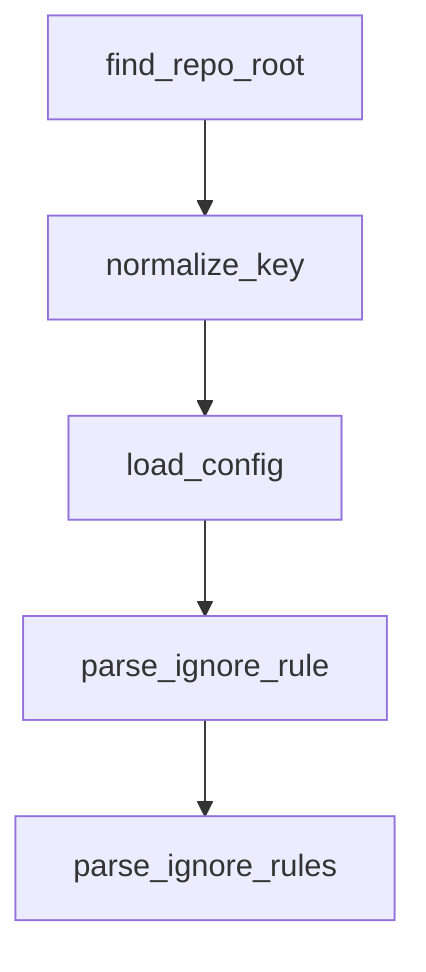

# Chapter 5: `CLAUDE.md` and Project Scaffolding Patterns

Welcome to **Chapter 5: `CLAUDE.md` and Project Scaffolding Patterns**. In this part of **Awesome Claude Code Tutorial: Curated Claude Code Resource Discovery and Evaluation**, you will build an intuitive mental model first, then move into concrete implementation details and practical production tradeoffs.


This chapter covers how to adapt shared `CLAUDE.md` patterns into your local project standards.

## Learning Goals

- identify reusable sections in existing `CLAUDE.md` examples
- separate universal guidance from project-specific constraints
- avoid brittle all-caps policy files that drift from reality
- evolve a living `CLAUDE.md` backed by real workflow evidence

## Practical Template Pattern

| Section | Purpose | Keep It Tight |
|:--------|:--------|:--------------|
| coding standards | style, architecture, naming | only rules you enforce |
| test workflow | command set + pass criteria | exact commands |
| safety constraints | forbidden operations, data boundaries | explicit and auditable |
| contribution flow | branch/PR and verification expectations | aligned to real process |

## Source References

- [`CLAUDE.md` Resources](https://github.com/hesreallyhim/awesome-claude-code/tree/main/resources/claude.md-files)
- [Official Documentation Resources](https://github.com/hesreallyhim/awesome-claude-code/tree/main/resources/official-documentation)

## Summary

You now have a pattern for building maintainable `CLAUDE.md` guidance from curated examples.

Next: [Chapter 6: Automation Pipeline and README Generation](06-automation-pipeline-and-readme-generation.md)

## Depth Expansion Playbook

## Source Code Walkthrough

### `tools/readme_tree/update_readme_tree.py`

The `find_repo_root` function in [`tools/readme_tree/update_readme_tree.py`](https://github.com/hesreallyhim/awesome-claude-code/blob/HEAD/tools/readme_tree/update_readme_tree.py) handles a key part of this chapter's functionality:

```py


def find_repo_root(start: Path) -> Path:
    """Locate the repo root.

    Prefer git to identify the VCS root; fall back to walking upward for pyproject.toml.

    Args:
        start: Path inside the repo.

    Returns:
        The repo root path.
    """
    p = start.resolve()
    # Prefer git root if available.
    try:
        result = subprocess.run(
            ["git", "-C", str(p), "rev-parse", "--show-toplevel"],
            check=False,
            capture_output=True,
            text=True,
        )
        if result.returncode == 0:
            git_root = result.stdout.strip()
            if git_root:
                return Path(git_root)
    except FileNotFoundError:
        pass

    # Fallback: walk upward until pyproject.toml exists.
    while not (p / "pyproject.toml").exists():
        if p.parent == p:
```

This function is important because it defines how Awesome Claude Code Tutorial: Curated Claude Code Resource Discovery and Evaluation implements the patterns covered in this chapter.

### `tools/readme_tree/update_readme_tree.py`

The `normalize_key` function in [`tools/readme_tree/update_readme_tree.py`](https://github.com/hesreallyhim/awesome-claude-code/blob/HEAD/tools/readme_tree/update_readme_tree.py) handles a key part of this chapter's functionality:

```py


def normalize_key(path: str | Path | None) -> str:
    """Normalize a path-like key into a repo-relative POSIX string."""
    if path is None:
        return ""
    s = str(path).strip()
    if s in {".", "./", ""}:
        return ""
    s = s.replace("\\", "/").strip("/")
    return s


def load_config(config_path: Path) -> dict:
    """Load the YAML configuration for tree generation."""
    data = yaml.safe_load(config_path.read_text(encoding="utf-8"))
    if not isinstance(data, dict):
        raise RuntimeError("Invalid config format")
    return data


def parse_ignore_rule(pattern: str | Path | None) -> IgnoreRule | None:
    """Parse a raw ignore pattern into a structured rule."""
    if pattern is None:
        return None
    line = str(pattern).strip()
    if not line or line.startswith("#"):
        return None

    negated = line.startswith("!")
    if negated:
        line = line[1:]
```

This function is important because it defines how Awesome Claude Code Tutorial: Curated Claude Code Resource Discovery and Evaluation implements the patterns covered in this chapter.

### `tools/readme_tree/update_readme_tree.py`

The `load_config` function in [`tools/readme_tree/update_readme_tree.py`](https://github.com/hesreallyhim/awesome-claude-code/blob/HEAD/tools/readme_tree/update_readme_tree.py) handles a key part of this chapter's functionality:

```py


def load_config(config_path: Path) -> dict:
    """Load the YAML configuration for tree generation."""
    data = yaml.safe_load(config_path.read_text(encoding="utf-8"))
    if not isinstance(data, dict):
        raise RuntimeError("Invalid config format")
    return data


def parse_ignore_rule(pattern: str | Path | None) -> IgnoreRule | None:
    """Parse a raw ignore pattern into a structured rule."""
    if pattern is None:
        return None
    line = str(pattern).strip()
    if not line or line.startswith("#"):
        return None

    negated = line.startswith("!")
    if negated:
        line = line[1:]

    anchored = line.startswith("/")
    if anchored:
        line = line[1:]

    dir_only = line.endswith("/")
    if dir_only:
        line = line[:-1]

    line = line.replace("\\", "/").strip()
    if not line:
```

This function is important because it defines how Awesome Claude Code Tutorial: Curated Claude Code Resource Discovery and Evaluation implements the patterns covered in this chapter.

### `tools/readme_tree/update_readme_tree.py`

The `parse_ignore_rule` function in [`tools/readme_tree/update_readme_tree.py`](https://github.com/hesreallyhim/awesome-claude-code/blob/HEAD/tools/readme_tree/update_readme_tree.py) handles a key part of this chapter's functionality:

```py


def parse_ignore_rule(pattern: str | Path | None) -> IgnoreRule | None:
    """Parse a raw ignore pattern into a structured rule."""
    if pattern is None:
        return None
    line = str(pattern).strip()
    if not line or line.startswith("#"):
        return None

    negated = line.startswith("!")
    if negated:
        line = line[1:]

    anchored = line.startswith("/")
    if anchored:
        line = line[1:]

    dir_only = line.endswith("/")
    if dir_only:
        line = line[:-1]

    line = line.replace("\\", "/").strip()
    if not line:
        return None

    return IgnoreRule(pattern=line, negated=negated, dir_only=dir_only, anchored=anchored)


def parse_ignore_rules(patterns: list[str | Path]) -> list[IgnoreRule]:
    """Parse a list of ignore patterns into IgnoreRule entries."""
    rules: list[IgnoreRule] = []
```

This function is important because it defines how Awesome Claude Code Tutorial: Curated Claude Code Resource Discovery and Evaluation implements the patterns covered in this chapter.


## How These Components Connect


