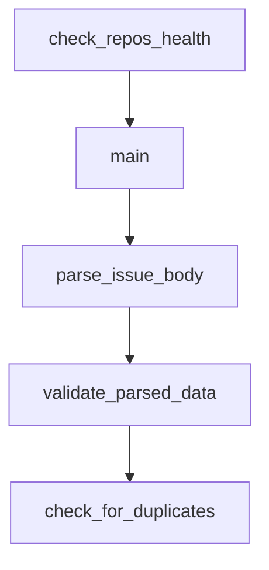

# Chapter 5: `CLAUDE.md` and Project Scaffolding Patterns

Welcome to **Chapter 5: `CLAUDE.md` and Project Scaffolding Patterns**. In this part of **Awesome Claude Code Tutorial: Curated Claude Code Resource Discovery and Evaluation**, you will build an intuitive mental model first, then move into concrete implementation details and practical production tradeoffs.


This chapter covers how to adapt shared `CLAUDE.md` patterns into your local project standards.

## Learning Goals

- identify reusable sections in existing `CLAUDE.md` examples
- separate universal guidance from project-specific constraints
- avoid brittle all-caps policy files that drift from reality
- evolve a living `CLAUDE.md` backed by real workflow evidence

## Practical Template Pattern

| Section | Purpose | Keep It Tight |
|:--------|:--------|:--------------|
| coding standards | style, architecture, naming | only rules you enforce |
| test workflow | command set + pass criteria | exact commands |
| safety constraints | forbidden operations, data boundaries | explicit and auditable |
| contribution flow | branch/PR and verification expectations | aligned to real process |

## Source References

- [`CLAUDE.md` Resources](https://github.com/hesreallyhim/awesome-claude-code/tree/main/resources/claude.md-files)
- [Official Documentation Resources](https://github.com/hesreallyhim/awesome-claude-code/tree/main/resources/official-documentation)

## Summary

You now have a pattern for building maintainable `CLAUDE.md` guidance from curated examples.

Next: [Chapter 6: Automation Pipeline and README Generation](06-automation-pipeline-and-readme-generation.md)

## Source Code Walkthrough

### `scripts/maintenance/check_repo_health.py`

The `check_repos_health` function in [`scripts/maintenance/check_repo_health.py`](https://github.com/hesreallyhim/awesome-claude-code/blob/HEAD/scripts/maintenance/check_repo_health.py) handles a key part of this chapter's functionality:

```py


def check_repos_health(
    csv_file, months_threshold=MONTHS_THRESHOLD, issues_threshold=OPEN_ISSUES_THRESHOLD
):
    """
    Check health of all active GitHub repositories in the CSV.
    Returns a list of problematic repos.
    """
    problematic_repos = []
    checked_repos = 0
    deleted_repos = []

    logger.info(f"Reading repository list from {csv_file}")

    try:
        with open(csv_file, encoding="utf-8") as f:
            reader = csv.DictReader(f)

            for row in reader:
                # Check if Active is TRUE
                active = row.get("Active", "").strip().upper()
                if active != "TRUE":
                    continue

                primary_link = row.get("Primary Link", "").strip()
                if not primary_link:
                    continue

                # Extract owner and repo from GitHub URL
                _, is_github, owner, repo = parse_github_url(primary_link)
                if not is_github or not owner or not repo:
```

This function is important because it defines how Awesome Claude Code Tutorial: Curated Claude Code Resource Discovery and Evaluation implements the patterns covered in this chapter.

### `scripts/maintenance/check_repo_health.py`

The `main` function in [`scripts/maintenance/check_repo_health.py`](https://github.com/hesreallyhim/awesome-claude-code/blob/HEAD/scripts/maintenance/check_repo_health.py) handles a key part of this chapter's functionality:

```py


def main():
    parser = argparse.ArgumentParser(
        description="Check health of GitHub repositories in THE_RESOURCES_TABLE.csv"
    )
    parser.add_argument(
        "--csv-file",
        default=INPUT_FILE,
        help=f"Path to CSV file (default: {INPUT_FILE})",
    )
    parser.add_argument(
        "--months",
        type=int,
        default=MONTHS_THRESHOLD,
        help=f"Months threshold for outdated repos (default: {MONTHS_THRESHOLD})",
    )
    parser.add_argument(
        "--issues",
        type=int,
        default=OPEN_ISSUES_THRESHOLD,
        help=f"Open issues threshold (default: {OPEN_ISSUES_THRESHOLD})",
    )

    args = parser.parse_args()

    problematic_repos = check_repos_health(args.csv_file, args.months, args.issues)

    if problematic_repos:
        logger.error(f"\n{'=' * 60}")
        logger.error("❌ HEALTH CHECK FAILED")
        logger.error(
```

This function is important because it defines how Awesome Claude Code Tutorial: Curated Claude Code Resource Discovery and Evaluation implements the patterns covered in this chapter.

### `scripts/resources/parse_issue_form.py`

The `parse_issue_body` function in [`scripts/resources/parse_issue_form.py`](https://github.com/hesreallyhim/awesome-claude-code/blob/HEAD/scripts/resources/parse_issue_form.py) handles a key part of this chapter's functionality:

```py


def parse_issue_body(issue_body: str) -> dict[str, str]:
    """
    Parse GitHub issue form body into structured data.

    GitHub issue forms are rendered as markdown with specific patterns:
    - Headers (###) indicate field labels
    - Values follow the headers
    - Checkboxes are rendered as - [x] or - [ ]
    """
    data = {}

    # Split into sections by ### headers
    sections = re.split(r"###\s+", issue_body)

    for section in sections:
        if not section.strip():
            continue

        lines = section.strip().split("\n")
        if not lines:
            continue

        # First line is the field label
        label = lines[0].strip()

        # Rest is the value (skip empty lines)
        value_lines = [
            line
            for line in lines[1:]
            if line.strip() and not line.strip().startswith("_No response_")
```

This function is important because it defines how Awesome Claude Code Tutorial: Curated Claude Code Resource Discovery and Evaluation implements the patterns covered in this chapter.

### `scripts/resources/parse_issue_form.py`

The `validate_parsed_data` function in [`scripts/resources/parse_issue_form.py`](https://github.com/hesreallyhim/awesome-claude-code/blob/HEAD/scripts/resources/parse_issue_form.py) handles a key part of this chapter's functionality:

```py


def validate_parsed_data(data: dict[str, str]) -> tuple[bool, list[str], list[str]]:
    """
    Validate the parsed data meets all requirements.
    Returns (is_valid, errors, warnings)
    """
    errors = []
    warnings = []

    # Check required fields
    required_fields = [
        "display_name",
        "category",
        "primary_link",
        "author_name",
        "author_link",
        "description",
    ]

    for field in required_fields:
        if not data.get(field, "").strip():
            errors.append(f"Required field '{field}' is missing or empty")

    # Validate category
    valid_categories = category_manager.get_all_categories()
    if data.get("category") not in valid_categories:
        errors.append(
            f"Invalid category: {data.get('category')}. "
            f"Must be one of: {', '.join(valid_categories)}"
        )

```

This function is important because it defines how Awesome Claude Code Tutorial: Curated Claude Code Resource Discovery and Evaluation implements the patterns covered in this chapter.


## How These Components Connect


