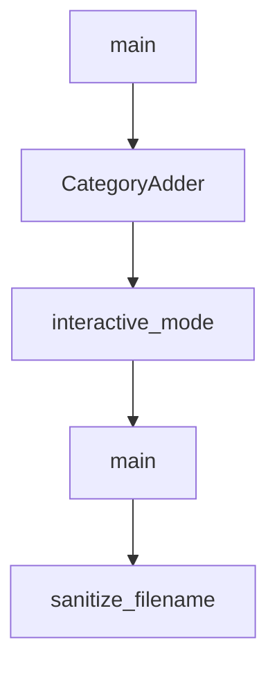

# Chapter 6: Automation Pipeline and README Generation

Welcome to **Chapter 6: Automation Pipeline and README Generation**. In this part of **Awesome Claude Code Tutorial: Curated Claude Code Resource Discovery and Evaluation**, you will build an intuitive mental model first, then move into concrete implementation details and practical production tradeoffs.


This chapter explains how the repository stays maintainable as resource volume grows.

## Learning Goals

- understand the single-source-of-truth model
- know which commands regenerate list views and assets
- validate that generated outputs remain deterministic
- avoid accidental drift between source data and rendered docs

## Pipeline Core

- `THE_RESOURCES_TABLE.csv` is the source of truth
- `make generate` sorts data and regenerates README views/assets
- style-specific generators produce multiple README variants
- docs tree and regeneration checks protect maintainability

## High-Value Maintainer Commands

```bash
make generate
make validate
make test
make ci
make docs-tree-check
make test-regenerate
```

## Source References

- [README Generation Guide](https://github.com/hesreallyhim/awesome-claude-code/blob/main/docs/README-GENERATION.md)
- [Makefile](https://github.com/hesreallyhim/awesome-claude-code/blob/main/Makefile)
- [Generator Entrypoint](https://github.com/hesreallyhim/awesome-claude-code/blob/main/scripts/readme/generate_readme.py)

## Summary

You now understand the maintenance pipeline that keeps the list coherent at scale.

Next: [Chapter 7: Link Health, Validation, and Drift Control](07-link-health-validation-and-drift-control.md)

## Depth Expansion Playbook

## Source Code Walkthrough

### `tools/readme_tree/update_readme_tree.py`

The `main` function in [`tools/readme_tree/update_readme_tree.py`](https://github.com/hesreallyhim/awesome-claude-code/blob/HEAD/tools/readme_tree/update_readme_tree.py) handles a key part of this chapter's functionality:

```py


def main() -> int:
    """CLI entry point for updating the README tree block."""
    parser = argparse.ArgumentParser(description="Update README tree block.")
    parser.add_argument(
        "--config",
        default="tools/readme_tree/config.yaml",
        help="Path to the tree config file.",
    )
    parser.add_argument("--check", action="store_true", help="Fail if updates are needed.")
    parser.add_argument("--debug", action="store_true", help="Print debug info on mismatch.")

    args = parser.parse_args()

    config_path = Path(args.config)
    if not config_path.exists():
        print(f"Config not found: {config_path}", file=sys.stderr)
        return 1

    repo_root = find_repo_root(config_path)
    config = load_config(config_path)

    doc_path = repo_root / config.get("doc_path", "docs/README-GENERATION.md")
    if not doc_path.exists():
        print(f"Doc not found: {doc_path}", file=sys.stderr)
        return 1

    tree = build_tree(config, repo_root)

    comments = {normalize_key(k): v for k, v in config.get("entries", {}).items()}
    virtual_comments = config.get("virtual_entries", {})
```

This function is important because it defines how Awesome Claude Code Tutorial: Curated Claude Code Resource Discovery and Evaluation implements the patterns covered in this chapter.

### `scripts/categories/add_category.py`

The `CategoryAdder` class in [`scripts/categories/add_category.py`](https://github.com/hesreallyhim/awesome-claude-code/blob/HEAD/scripts/categories/add_category.py) handles a key part of this chapter's functionality:

```py


class CategoryAdder:
    """Handles the process of adding a new category to the repository."""

    def __init__(self, repo_root: Path):
        """Initialize the CategoryAdder with the repository root path."""
        self.repo_root = repo_root
        self.templates_dir = repo_root / "templates"
        self.github_dir = repo_root / ".github" / "ISSUE_TEMPLATE"

    def get_max_order(self) -> int:
        """Get the maximum order value from existing categories."""
        categories = category_manager.get_categories_for_readme()
        if not categories:
            return 0
        return max(cat.get("order", 0) for cat in categories)

    def add_category_to_yaml(
        self,
        category_id: str,
        name: str,
        prefix: str,
        icon: str,
        description: str,
        order: int | None = None,
        subcategories: list[str] | None = None,
    ) -> bool:
        """
        Add a new category to categories.yaml.

        Args:
```

This class is important because it defines how Awesome Claude Code Tutorial: Curated Claude Code Resource Discovery and Evaluation implements the patterns covered in this chapter.

### `scripts/categories/add_category.py`

The `interactive_mode` function in [`scripts/categories/add_category.py`](https://github.com/hesreallyhim/awesome-claude-code/blob/HEAD/scripts/categories/add_category.py) handles a key part of this chapter's functionality:

```py


def interactive_mode(adder: CategoryAdder) -> None:
    """Run the script in interactive mode, prompting for all inputs."""
    print("=" * 60)
    print("ADD NEW CATEGORY TO AWESOME CLAUDE CODE")
    print("=" * 60)
    print()

    # Get category details
    name = input("Enter category display name (e.g., 'Alternative Clients'): ").strip()
    if not name:
        print("Error: Name is required")
        sys.exit(1)

    # Generate ID from name
    category_id = name.lower().replace(" ", "-").replace("&", "and")
    suggested_id = category_id
    category_id = input(f"Enter category ID (default: '{suggested_id}'): ").strip() or suggested_id

    # Generate prefix from name
    suggested_prefix = name.lower().split()[0][:6]
    prefix = input(f"Enter ID prefix (default: '{suggested_prefix}'): ").strip() or suggested_prefix

    # Get icon
    icon = input("Enter emoji icon (e.g., 🔌): ").strip() or "📦"

    # Get description
    print("\nEnter description (can be multiline, enter '---' on a new line to finish):")
    description_lines = []
    while True:
        line = input()
```

This function is important because it defines how Awesome Claude Code Tutorial: Curated Claude Code Resource Discovery and Evaluation implements the patterns covered in this chapter.

### `scripts/categories/add_category.py`

The `main` function in [`scripts/categories/add_category.py`](https://github.com/hesreallyhim/awesome-claude-code/blob/HEAD/scripts/categories/add_category.py) handles a key part of this chapter's functionality:

```py


def main():
    """Main entry point for the script."""
    parser = argparse.ArgumentParser(
        description="Add a new category to awesome-claude-code",
        formatter_class=argparse.RawDescriptionHelpFormatter,
        epilog="""
Examples:
  %(prog)s                           # Interactive mode
  %(prog)s --name "My Category" --prefix "mycat" --icon "🎯"
  %(prog)s --name "Tools" --order 5 --subcategories "CLI,GUI,Web"
        """,
    )

    parser.add_argument("--name", help="Display name for the category")
    parser.add_argument("--id", help="Category ID (defaults to slugified name)")
    parser.add_argument("--prefix", help="ID prefix for resources")
    parser.add_argument("--icon", default="📦", help="Emoji icon for the category")
    parser.add_argument(
        "--description", help="Description of the category (will be prefixed with '>')"
    )
    parser.add_argument("--order", type=int, help="Order position in the list")
    parser.add_argument(
        "--subcategories",
        help="Comma-separated list of subcategories (default: General)",
    )
    parser.add_argument(
        "--no-commit", action="store_true", help="Don't create a commit after adding"
    )

    args = parser.parse_args()
```

This function is important because it defines how Awesome Claude Code Tutorial: Curated Claude Code Resource Discovery and Evaluation implements the patterns covered in this chapter.


## How These Components Connect


