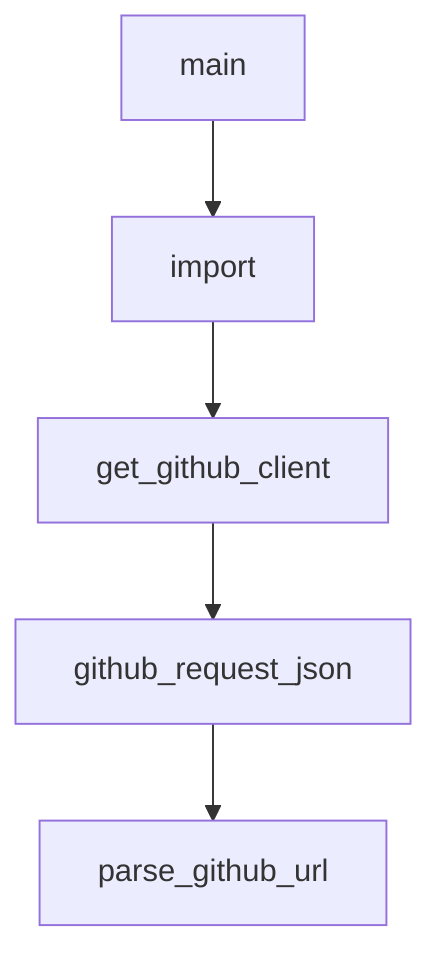

# Chapter 6: Automation Pipeline and README Generation

Welcome to **Chapter 6: Automation Pipeline and README Generation**. In this part of **Awesome Claude Code Tutorial: Curated Claude Code Resource Discovery and Evaluation**, you will build an intuitive mental model first, then move into concrete implementation details and practical production tradeoffs.


This chapter explains how the repository stays maintainable as resource volume grows.

## Learning Goals

- understand the single-source-of-truth model
- know which commands regenerate list views and assets
- validate that generated outputs remain deterministic
- avoid accidental drift between source data and rendered docs

## Pipeline Core

- `THE_RESOURCES_TABLE.csv` is the source of truth
- `make generate` sorts data and regenerates README views/assets
- style-specific generators produce multiple README variants
- docs tree and regeneration checks protect maintainability

## High-Value Maintainer Commands

```bash
make generate
make validate
make test
make ci
make docs-tree-check
make test-regenerate
```

## Source References

- [README Generation Guide](https://github.com/hesreallyhim/awesome-claude-code/blob/main/docs/README-GENERATION.md)
- [Makefile](https://github.com/hesreallyhim/awesome-claude-code/blob/main/Makefile)
- [Generator Entrypoint](https://github.com/hesreallyhim/awesome-claude-code/blob/main/scripts/readme/generate_readme.py)

## Summary

You now understand the maintenance pipeline that keeps the list coherent at scale.

Next: [Chapter 7: Link Health, Validation, and Drift Control](07-link-health-validation-and-drift-control.md)

## Source Code Walkthrough

### `scripts/resources/detect_informal_submission.py`

The `main` function in [`scripts/resources/detect_informal_submission.py`](https://github.com/hesreallyhim/awesome-claude-code/blob/HEAD/scripts/resources/detect_informal_submission.py) handles a key part of this chapter's functionality:

```py


def main() -> None:
    """Entry point for GitHub Actions."""
    title = os.environ.get("ISSUE_TITLE", "")
    body = os.environ.get("ISSUE_BODY", "")

    result = calculate_confidence(title, body)

    # Output results for GitHub Actions
    set_github_output("action", result.action.value)
    set_github_output("confidence", f"{result.confidence:.0%}")
    set_github_output("matched_signals", ", ".join(result.matched_signals))

    # Also print for logging
    print(f"Confidence: {result.confidence:.2%}")
    print(f"Action: {result.action.value}")
    print(f"Matched signals: {result.matched_signals}")


if __name__ == "__main__":
    main()

```

This function is important because it defines how Awesome Claude Code Tutorial: Curated Claude Code Resource Discovery and Evaluation implements the patterns covered in this chapter.

### `scripts/resources/detect_informal_submission.py`

The `import` interface in [`scripts/resources/detect_informal_submission.py`](https://github.com/hesreallyhim/awesome-claude-code/blob/HEAD/scripts/resources/detect_informal_submission.py) handles a key part of this chapter's functionality:

```py
"""

from __future__ import annotations

import os
import re
from dataclasses import dataclass
from enum import Enum


class Action(Enum):
    NONE = "none"
    WARN = "warn"  # Medium confidence: warn but don't close
    CLOSE = "close"  # High confidence: warn and close


@dataclass
class DetectionResult:
    confidence: float
    action: Action
    matched_signals: list[str]


# Template field labels - VERY strong indicator (from the issue form)
# Matching 3+ of these is almost certainly a copy-paste from template without using form
TEMPLATE_FIELD_LABELS = [
    "display name:",
    "category:",
    "sub-category:",
    "primary link:",
    "author name:",
    "author link:",
```

This interface is important because it defines how Awesome Claude Code Tutorial: Curated Claude Code Resource Discovery and Evaluation implements the patterns covered in this chapter.

### `scripts/utils/github_utils.py`

The `get_github_client` function in [`scripts/utils/github_utils.py`](https://github.com/hesreallyhim/awesome-claude-code/blob/HEAD/scripts/utils/github_utils.py) handles a key part of this chapter's functionality:

```py


def get_github_client(
    token: str | None = None,
    user_agent: str = _DEFAULT_GITHUB_USER_AGENT,
    seconds_between_requests: float = _DEFAULT_SECONDS_BETWEEN_REQUESTS,
) -> Github:
    """Return a cached PyGithub client with optional pacing."""
    key = (token, user_agent, seconds_between_requests)
    if key not in _GITHUB_CLIENTS:
        auth = Auth.Token(token) if token else None
        _GITHUB_CLIENTS[key] = Github(
            auth=auth,
            user_agent=user_agent,
            seconds_between_requests=seconds_between_requests,
        )
    return _GITHUB_CLIENTS[key]


def github_request_json(
    api_url: str,
    params: dict[str, object] | None = None,
    token: str | None = None,
    user_agent: str = _DEFAULT_GITHUB_USER_AGENT,
    seconds_between_requests: float = _DEFAULT_SECONDS_BETWEEN_REQUESTS,
) -> tuple[int, dict[str, object], object | None]:
    """Request JSON from the GitHub API using PyGithub's requester."""
    if token is None:
        token = os.getenv("GITHUB_TOKEN") or None
    client = get_github_client(
        token=token,
        user_agent=user_agent,
```

This function is important because it defines how Awesome Claude Code Tutorial: Curated Claude Code Resource Discovery and Evaluation implements the patterns covered in this chapter.

### `scripts/utils/github_utils.py`

The `github_request_json` function in [`scripts/utils/github_utils.py`](https://github.com/hesreallyhim/awesome-claude-code/blob/HEAD/scripts/utils/github_utils.py) handles a key part of this chapter's functionality:

```py


def github_request_json(
    api_url: str,
    params: dict[str, object] | None = None,
    token: str | None = None,
    user_agent: str = _DEFAULT_GITHUB_USER_AGENT,
    seconds_between_requests: float = _DEFAULT_SECONDS_BETWEEN_REQUESTS,
) -> tuple[int, dict[str, object], object | None]:
    """Request JSON from the GitHub API using PyGithub's requester."""
    if token is None:
        token = os.getenv("GITHUB_TOKEN") or None
    client = get_github_client(
        token=token,
        user_agent=user_agent,
        seconds_between_requests=seconds_between_requests,
    )
    status, headers, body = client.requester.requestJson(
        "GET",
        api_url,
        parameters=params,
        headers={"Accept": "application/vnd.github+json"},
    )
    if not body:
        return status, headers, None
    try:
        data = json.loads(body)
    except json.JSONDecodeError:
        data = body
    return status, headers, data


```

This function is important because it defines how Awesome Claude Code Tutorial: Curated Claude Code Resource Discovery and Evaluation implements the patterns covered in this chapter.


## How These Components Connect


