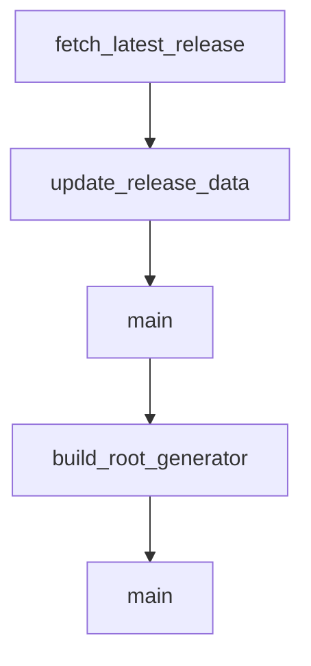

# Chapter 7: Link Health, Validation, and Drift Control

Welcome to **Chapter 7: Link Health, Validation, and Drift Control**. In this part of **Awesome Claude Code Tutorial: Curated Claude Code Resource Discovery and Evaluation**, you will build an intuitive mental model first, then move into concrete implementation details and practical production tradeoffs.


This chapter focuses on operational checks that keep a fast-moving curated list trustworthy.

## Learning Goals

- run link and structure checks before merging changes
- understand automation labels and state transitions
- detect generation drift early
- recover quickly when resources go stale or break

## Verification Stack

| Check | Command | Failure Signal |
|:------|:--------|:---------------|
| link validation | `make validate` | inaccessible or invalid URLs |
| unit and integration checks | `make test` | parser/generator regressions |
| full CI gate | `make ci` | formatting/types/tests/docs-tree mismatch |
| regeneration determinism | `make test-regenerate` | generated output drift |

## Source References

- [How It Works](https://github.com/hesreallyhim/awesome-claude-code/blob/main/docs/HOW_IT_WORKS.md)
- [Testing Guide](https://github.com/hesreallyhim/awesome-claude-code/blob/main/docs/TESTING.md)
- [Makefile Checks](https://github.com/hesreallyhim/awesome-claude-code/blob/main/Makefile)

## Summary

You now have the operational health model for keeping curated docs accurate over time.

Next: [Chapter 8: Contribution Workflow and Governance](08-contribution-workflow-and-governance.md)

## Source Code Walkthrough

### `scripts/maintenance/update_github_release_data.py`

The `fetch_latest_release` function in [`scripts/maintenance/update_github_release_data.py`](https://github.com/hesreallyhim/awesome-claude-code/blob/HEAD/scripts/maintenance/update_github_release_data.py) handles a key part of this chapter's functionality:

```py


def fetch_latest_release(owner: str, repo: str) -> tuple[str | None, str | None, str]:
    api_url = f"https://api.github.com/repos/{owner}/{repo}/releases/latest"
    response = github_get(api_url)

    if response.status_code == 200:
        data = response.json()
        published_at = data.get("published_at") or data.get("created_at")
        return format_commit_date(published_at), data.get("tag_name"), "ok"
    if response.status_code == 404:
        return None, None, "no_release"
    return None, None, f"http_{response.status_code}"


def update_release_data(csv_path: str, max_rows: int | None = None, dry_run: bool = False) -> None:
    with open(csv_path, encoding="utf-8") as f:
        reader = csv.DictReader(f)
        rows = list(reader)
        fieldnames = list(reader.fieldnames or [])

    required_columns = ["Last Modified", "Latest Release", "Release Version", "Release Source"]
    for column in required_columns:
        if column not in fieldnames:
            fieldnames.append(column)

    processed = 0
    skipped = 0
    updated = 0
    errors = 0

    for _, row in enumerate(rows):
```

This function is important because it defines how Awesome Claude Code Tutorial: Curated Claude Code Resource Discovery and Evaluation implements the patterns covered in this chapter.

### `scripts/maintenance/update_github_release_data.py`

The `update_release_data` function in [`scripts/maintenance/update_github_release_data.py`](https://github.com/hesreallyhim/awesome-claude-code/blob/HEAD/scripts/maintenance/update_github_release_data.py) handles a key part of this chapter's functionality:

```py


def update_release_data(csv_path: str, max_rows: int | None = None, dry_run: bool = False) -> None:
    with open(csv_path, encoding="utf-8") as f:
        reader = csv.DictReader(f)
        rows = list(reader)
        fieldnames = list(reader.fieldnames or [])

    required_columns = ["Last Modified", "Latest Release", "Release Version", "Release Source"]
    for column in required_columns:
        if column not in fieldnames:
            fieldnames.append(column)

    processed = 0
    skipped = 0
    updated = 0
    errors = 0

    for _, row in enumerate(rows):
        if max_rows and processed >= max_rows:
            logger.info("Reached max limit (%s). Stopping.", max_rows)
            break

        if row.get("Active", "").strip().upper() != "TRUE":
            skipped += 1
            continue

        primary_link = (row.get("Primary Link") or "").strip()
        owner, repo = parse_github_repo(primary_link)
        if not owner or not repo:
            skipped += 1
            continue
```

This function is important because it defines how Awesome Claude Code Tutorial: Curated Claude Code Resource Discovery and Evaluation implements the patterns covered in this chapter.

### `scripts/maintenance/update_github_release_data.py`

The `main` function in [`scripts/maintenance/update_github_release_data.py`](https://github.com/hesreallyhim/awesome-claude-code/blob/HEAD/scripts/maintenance/update_github_release_data.py) handles a key part of this chapter's functionality:

```py
def github_get(url: str, params: dict | None = None) -> requests.Response:
    response = requests.get(url, headers=HEADERS, params=params, timeout=10)
    if response.status_code == 403 and response.headers.get("X-RateLimit-Remaining") == "0":
        reset_time = int(response.headers.get("X-RateLimit-Reset", 0))
        sleep_time = max(reset_time - int(time.time()), 0) + 1
        logger.warning("GitHub rate limit hit. Sleeping for %s seconds.", sleep_time)
        time.sleep(sleep_time)
        response = requests.get(url, headers=HEADERS, params=params, timeout=10)
    return response


def fetch_last_commit_date(owner: str, repo: str) -> tuple[str | None, str]:
    api_url = f"https://api.github.com/repos/{owner}/{repo}/commits"
    response = github_get(api_url, params={"per_page": 1})

    if response.status_code == 200:
        data = response.json()
        if isinstance(data, list) and data:
            commit = data[0]
            commit_date = (
                commit.get("commit", {}).get("committer", {}).get("date")
                or commit.get("commit", {}).get("author", {}).get("date")
                or commit.get("committer", {}).get("date")
                or commit.get("author", {}).get("date")
            )
            return format_commit_date(commit_date), "ok"
        return None, "empty"
    if response.status_code == 404:
        return None, "not_found"
    return None, f"http_{response.status_code}"


```

This function is important because it defines how Awesome Claude Code Tutorial: Curated Claude Code Resource Discovery and Evaluation implements the patterns covered in this chapter.

### `scripts/readme/generate_readme.py`

The `build_root_generator` function in [`scripts/readme/generate_readme.py`](https://github.com/hesreallyhim/awesome-claude-code/blob/HEAD/scripts/readme/generate_readme.py) handles a key part of this chapter's functionality:

```py


def build_root_generator(
    style_id: str,
    csv_path: str,
    template_dir: str,
    assets_dir: str,
    repo_root: str,
) -> ReadmeGenerator:
    """Return the generator instance for a root style."""
    style_id = style_id.lower()
    generator_cls = STYLE_GENERATORS.get(style_id)
    if generator_cls is None:
        raise ValueError(f"Unknown root style: {style_id}")
    if generator_cls is ParameterizedFlatListGenerator:
        return ParameterizedFlatListGenerator(
            csv_path,
            template_dir,
            assets_dir,
            repo_root,
            category_slug="all",
            sort_type="az",
        )
    return generator_cls(csv_path, template_dir, assets_dir, repo_root)


def main():
    """Main entry point - generates all README versions."""
    repo_root = REPO_ROOT

    csv_path = str(repo_root / "THE_RESOURCES_TABLE.csv")
    template_dir = str(repo_root / "templates")
```

This function is important because it defines how Awesome Claude Code Tutorial: Curated Claude Code Resource Discovery and Evaluation implements the patterns covered in this chapter.


## How These Components Connect


