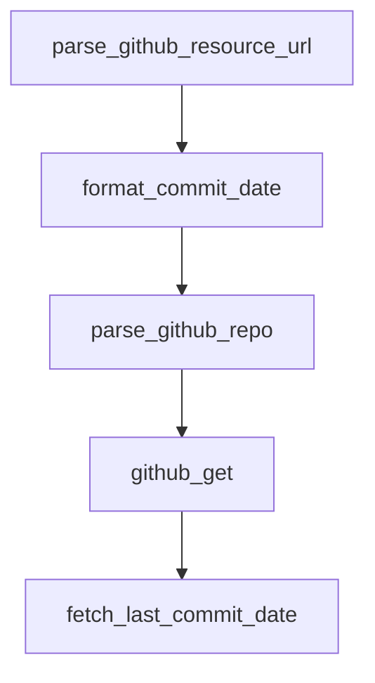

# Chapter 7: Link Health, Validation, and Drift Control

Welcome to **Chapter 7: Link Health, Validation, and Drift Control**. In this part of **Awesome Claude Code Tutorial: Curated Claude Code Resource Discovery and Evaluation**, you will build an intuitive mental model first, then move into concrete implementation details and practical production tradeoffs.


This chapter focuses on operational checks that keep a fast-moving curated list trustworthy.

## Learning Goals

- run link and structure checks before merging changes
- understand automation labels and state transitions
- detect generation drift early
- recover quickly when resources go stale or break

## Verification Stack

| Check | Command | Failure Signal |
|:------|:--------|:---------------|
| link validation | `make validate` | inaccessible or invalid URLs |
| unit and integration checks | `make test` | parser/generator regressions |
| full CI gate | `make ci` | formatting/types/tests/docs-tree mismatch |
| regeneration determinism | `make test-regenerate` | generated output drift |

## Source References

- [How It Works](https://github.com/hesreallyhim/awesome-claude-code/blob/main/docs/HOW_IT_WORKS.md)
- [Testing Guide](https://github.com/hesreallyhim/awesome-claude-code/blob/main/docs/TESTING.md)
- [Makefile Checks](https://github.com/hesreallyhim/awesome-claude-code/blob/main/Makefile)

## Summary

You now have the operational health model for keeping curated docs accurate over time.

Next: [Chapter 8: Contribution Workflow and Governance](08-contribution-workflow-and-governance.md)

## Depth Expansion Playbook

## Source Code Walkthrough

### `scripts/utils/github_utils.py`

The `parse_github_resource_url` function in [`scripts/utils/github_utils.py`](https://github.com/hesreallyhim/awesome-claude-code/blob/HEAD/scripts/utils/github_utils.py) handles a key part of this chapter's functionality:

```py


def parse_github_resource_url(url: str) -> dict[str, str] | None:
    """
    Parse GitHub URL and extract owner, repo, branch, and path.
    Returns a dict with keys: owner, repo, branch, path, type.
    """
    patterns = {
        # File in repository
        "file": r"https://github\.com/([^/]+)/([^/]+)/(?:blob|raw)/([^/]+)/(.+)",
        # Directory in repository
        "dir": r"https://github\.com/([^/]+)/([^/]+)/tree/([^/]+)/(.+)",
        # Repository root
        "repo": r"https://github\.com/([^/]+)/([^/]+)/?$",
        # Gist
        "gist": r"https://gist\.github\.com/([^/]+)/([^/#]+)",
    }

    for url_type, pattern in patterns.items():
        match = re.match(pattern, url)
        if match:
            if url_type == "gist":
                return {
                    "type": "gist",
                    "owner": match.group(1),
                    "gist_id": match.group(2),
                }
            elif url_type == "repo":
                return {
                    "type": "repo",
                    "owner": match.group(1),
                    "repo": _normalize_repo_name(match.group(2)),
```

This function is important because it defines how Awesome Claude Code Tutorial: Curated Claude Code Resource Discovery and Evaluation implements the patterns covered in this chapter.

### `scripts/maintenance/update_github_release_data.py`

The `format_commit_date` function in [`scripts/maintenance/update_github_release_data.py`](https://github.com/hesreallyhim/awesome-claude-code/blob/HEAD/scripts/maintenance/update_github_release_data.py) handles a key part of this chapter's functionality:

```py


def format_commit_date(commit_date: str | None) -> str | None:
    if not commit_date:
        return None
    try:
        dt = datetime.fromisoformat(commit_date.replace("Z", "+00:00"))
        return dt.strftime("%Y-%m-%d:%H-%M-%S")
    except ValueError:
        return None


def parse_github_repo(url: str | None) -> tuple[str | None, str | None]:
    if not url or not isinstance(url, str):
        return None, None
    match = re.match(r"https?://github\.com/([^/]+)/([^/]+)", url.strip())
    if not match:
        return None, None
    owner, repo = match.groups()
    repo = repo.split("?", 1)[0].split("#", 1)[0]
    repo = repo.removesuffix(".git")
    return owner, repo


def github_get(url: str, params: dict | None = None) -> requests.Response:
    response = requests.get(url, headers=HEADERS, params=params, timeout=10)
    if response.status_code == 403 and response.headers.get("X-RateLimit-Remaining") == "0":
        reset_time = int(response.headers.get("X-RateLimit-Reset", 0))
        sleep_time = max(reset_time - int(time.time()), 0) + 1
        logger.warning("GitHub rate limit hit. Sleeping for %s seconds.", sleep_time)
        time.sleep(sleep_time)
        response = requests.get(url, headers=HEADERS, params=params, timeout=10)
```

This function is important because it defines how Awesome Claude Code Tutorial: Curated Claude Code Resource Discovery and Evaluation implements the patterns covered in this chapter.

### `scripts/maintenance/update_github_release_data.py`

The `parse_github_repo` function in [`scripts/maintenance/update_github_release_data.py`](https://github.com/hesreallyhim/awesome-claude-code/blob/HEAD/scripts/maintenance/update_github_release_data.py) handles a key part of this chapter's functionality:

```py


def parse_github_repo(url: str | None) -> tuple[str | None, str | None]:
    if not url or not isinstance(url, str):
        return None, None
    match = re.match(r"https?://github\.com/([^/]+)/([^/]+)", url.strip())
    if not match:
        return None, None
    owner, repo = match.groups()
    repo = repo.split("?", 1)[0].split("#", 1)[0]
    repo = repo.removesuffix(".git")
    return owner, repo


def github_get(url: str, params: dict | None = None) -> requests.Response:
    response = requests.get(url, headers=HEADERS, params=params, timeout=10)
    if response.status_code == 403 and response.headers.get("X-RateLimit-Remaining") == "0":
        reset_time = int(response.headers.get("X-RateLimit-Reset", 0))
        sleep_time = max(reset_time - int(time.time()), 0) + 1
        logger.warning("GitHub rate limit hit. Sleeping for %s seconds.", sleep_time)
        time.sleep(sleep_time)
        response = requests.get(url, headers=HEADERS, params=params, timeout=10)
    return response


def fetch_last_commit_date(owner: str, repo: str) -> tuple[str | None, str]:
    api_url = f"https://api.github.com/repos/{owner}/{repo}/commits"
    response = github_get(api_url, params={"per_page": 1})

    if response.status_code == 200:
        data = response.json()
        if isinstance(data, list) and data:
```

This function is important because it defines how Awesome Claude Code Tutorial: Curated Claude Code Resource Discovery and Evaluation implements the patterns covered in this chapter.

### `scripts/maintenance/update_github_release_data.py`

The `github_get` function in [`scripts/maintenance/update_github_release_data.py`](https://github.com/hesreallyhim/awesome-claude-code/blob/HEAD/scripts/maintenance/update_github_release_data.py) handles a key part of this chapter's functionality:

```py


def github_get(url: str, params: dict | None = None) -> requests.Response:
    response = requests.get(url, headers=HEADERS, params=params, timeout=10)
    if response.status_code == 403 and response.headers.get("X-RateLimit-Remaining") == "0":
        reset_time = int(response.headers.get("X-RateLimit-Reset", 0))
        sleep_time = max(reset_time - int(time.time()), 0) + 1
        logger.warning("GitHub rate limit hit. Sleeping for %s seconds.", sleep_time)
        time.sleep(sleep_time)
        response = requests.get(url, headers=HEADERS, params=params, timeout=10)
    return response


def fetch_last_commit_date(owner: str, repo: str) -> tuple[str | None, str]:
    api_url = f"https://api.github.com/repos/{owner}/{repo}/commits"
    response = github_get(api_url, params={"per_page": 1})

    if response.status_code == 200:
        data = response.json()
        if isinstance(data, list) and data:
            commit = data[0]
            commit_date = (
                commit.get("commit", {}).get("committer", {}).get("date")
                or commit.get("commit", {}).get("author", {}).get("date")
                or commit.get("committer", {}).get("date")
                or commit.get("author", {}).get("date")
            )
            return format_commit_date(commit_date), "ok"
        return None, "empty"
    if response.status_code == 404:
        return None, "not_found"
    return None, f"http_{response.status_code}"
```

This function is important because it defines how Awesome Claude Code Tutorial: Curated Claude Code Resource Discovery and Evaluation implements the patterns covered in this chapter.


## How These Components Connect


