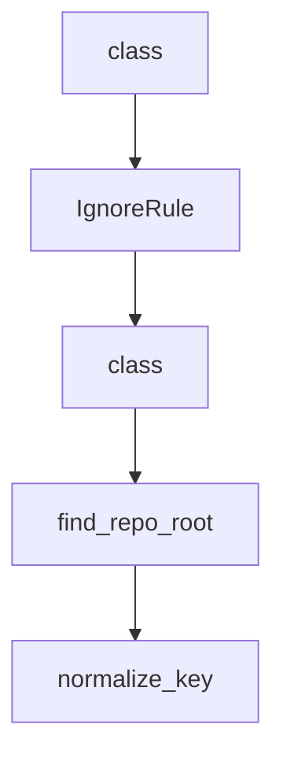

# Chapter 8: Contribution Workflow and Governance

Welcome to **Chapter 8: Contribution Workflow and Governance**. In this part of **Awesome Claude Code Tutorial: Curated Claude Code Resource Discovery and Evaluation**, you will build an intuitive mental model first, then move into concrete implementation details and practical production tradeoffs.


This chapter covers how to contribute responsibly to a curated repository with automated workflows.

## Learning Goals

- follow the recommendation and review process correctly
- frame submissions around user value instead of promotion
- align with safety and maintenance expectations
- make contributions that are easy to validate and merge

## Contribution Workflow

1. use the official recommendation issue flow
2. provide concrete value evidence and setup clarity
3. respond quickly to validation failures or change requests
4. keep scope narrow and verifiable per submission

## Governance Priorities

- user safety over growth metrics
- selective curation over raw volume
- strong documentation and reproducibility
- explicit constraints and transparent maintenance policies

## Source References

- [Contributing Guide](https://github.com/hesreallyhim/awesome-claude-code/blob/main/docs/CONTRIBUTING.md)
- [Code of Conduct](https://github.com/hesreallyhim/awesome-claude-code/blob/main/docs/CODE_OF_CONDUCT.md)
- [Security Policy](https://github.com/hesreallyhim/awesome-claude-code/blob/main/docs/SECURITY.md)

## Summary

You now have an end-to-end model for discovering, evaluating, and contributing Claude Code resources through Awesome Claude Code.

Next steps:

- build a private shortlist tailored to your current project stack
- trial one skill, one hook, and one slash command with strict validation
- contribute one high-signal recommendation with clear evidence

## Source Code Walkthrough

### `tools/readme_tree/update_readme_tree.py`

The `class` class in [`tools/readme_tree/update_readme_tree.py`](https://github.com/hesreallyhim/awesome-claude-code/blob/HEAD/tools/readme_tree/update_readme_tree.py) handles a key part of this chapter's functionality:

```py
import subprocess
import sys
from dataclasses import dataclass, field
from pathlib import Path

import yaml


@dataclass
class Node:
    """Tree node representing a file or directory."""

    name: str
    is_dir: bool
    children: dict[str, Node] = field(default_factory=dict)


@dataclass(frozen=True)
class IgnoreRule:
    """Parsed ignore rule from config patterns."""

    pattern: str
    negated: bool
    dir_only: bool
    anchored: bool


@dataclass
class GitIgnoreChecker:
    """Check paths against gitignore using `git check-ignore`."""

    repo_root: Path
```

This class is important because it defines how Awesome Claude Code Tutorial: Curated Claude Code Resource Discovery and Evaluation implements the patterns covered in this chapter.

### `tools/readme_tree/update_readme_tree.py`

The `IgnoreRule` class in [`tools/readme_tree/update_readme_tree.py`](https://github.com/hesreallyhim/awesome-claude-code/blob/HEAD/tools/readme_tree/update_readme_tree.py) handles a key part of this chapter's functionality:

```py

@dataclass(frozen=True)
class IgnoreRule:
    """Parsed ignore rule from config patterns."""

    pattern: str
    negated: bool
    dir_only: bool
    anchored: bool


@dataclass
class GitIgnoreChecker:
    """Check paths against gitignore using `git check-ignore`."""

    repo_root: Path
    enabled: bool = True
    _cache: dict[str, bool] = field(default_factory=dict)

    def __post_init__(self) -> None:
        """Disable checking when git is unavailable."""
        if not self._git_available():
            self.enabled = False

    def _git_available(self) -> bool:
        """Return True if git is available and repo_root is a git work tree."""
        try:
            result = subprocess.run(
                [
                    "git",
                    "-C",
                    str(self.repo_root),
```

This class is important because it defines how Awesome Claude Code Tutorial: Curated Claude Code Resource Discovery and Evaluation implements the patterns covered in this chapter.

### `tools/readme_tree/update_readme_tree.py`

The `class` class in [`tools/readme_tree/update_readme_tree.py`](https://github.com/hesreallyhim/awesome-claude-code/blob/HEAD/tools/readme_tree/update_readme_tree.py) handles a key part of this chapter's functionality:

```py
import subprocess
import sys
from dataclasses import dataclass, field
from pathlib import Path

import yaml


@dataclass
class Node:
    """Tree node representing a file or directory."""

    name: str
    is_dir: bool
    children: dict[str, Node] = field(default_factory=dict)


@dataclass(frozen=True)
class IgnoreRule:
    """Parsed ignore rule from config patterns."""

    pattern: str
    negated: bool
    dir_only: bool
    anchored: bool


@dataclass
class GitIgnoreChecker:
    """Check paths against gitignore using `git check-ignore`."""

    repo_root: Path
```

This class is important because it defines how Awesome Claude Code Tutorial: Curated Claude Code Resource Discovery and Evaluation implements the patterns covered in this chapter.

### `tools/readme_tree/update_readme_tree.py`

The `find_repo_root` function in [`tools/readme_tree/update_readme_tree.py`](https://github.com/hesreallyhim/awesome-claude-code/blob/HEAD/tools/readme_tree/update_readme_tree.py) handles a key part of this chapter's functionality:

```py


def find_repo_root(start: Path) -> Path:
    """Locate the repo root.

    Prefer git to identify the VCS root; fall back to walking upward for pyproject.toml.

    Args:
        start: Path inside the repo.

    Returns:
        The repo root path.
    """
    p = start.resolve()
    # Prefer git root if available.
    try:
        result = subprocess.run(
            ["git", "-C", str(p), "rev-parse", "--show-toplevel"],
            check=False,
            capture_output=True,
            text=True,
        )
        if result.returncode == 0:
            git_root = result.stdout.strip()
            if git_root:
                return Path(git_root)
    except FileNotFoundError:
        pass

    # Fallback: walk upward until pyproject.toml exists.
    while not (p / "pyproject.toml").exists():
        if p.parent == p:
```

This function is important because it defines how Awesome Claude Code Tutorial: Curated Claude Code Resource Discovery and Evaluation implements the patterns covered in this chapter.


## How These Components Connect


