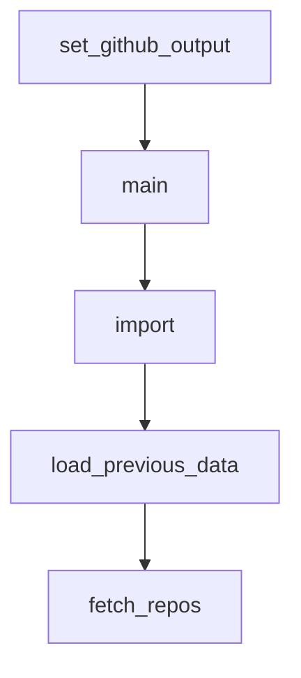

# Chapter 8: Contribution Workflow and Governance

Welcome to **Chapter 8: Contribution Workflow and Governance**. In this part of **Awesome Claude Code Tutorial: Curated Claude Code Resource Discovery and Evaluation**, you will build an intuitive mental model first, then move into concrete implementation details and practical production tradeoffs.


This chapter covers how to contribute responsibly to a curated repository with automated workflows.

## Learning Goals

- follow the recommendation and review process correctly
- frame submissions around user value instead of promotion
- align with safety and maintenance expectations
- make contributions that are easy to validate and merge

## Contribution Workflow

1. use the official recommendation issue flow
2. provide concrete value evidence and setup clarity
3. respond quickly to validation failures or change requests
4. keep scope narrow and verifiable per submission

## Governance Priorities

- user safety over growth metrics
- selective curation over raw volume
- strong documentation and reproducibility
- explicit constraints and transparent maintenance policies

## Source References

- [Contributing Guide](https://github.com/hesreallyhim/awesome-claude-code/blob/main/docs/CONTRIBUTING.md)
- [Code of Conduct](https://github.com/hesreallyhim/awesome-claude-code/blob/main/docs/CODE_OF_CONDUCT.md)
- [Security Policy](https://github.com/hesreallyhim/awesome-claude-code/blob/main/docs/SECURITY.md)

## Summary

You now have an end-to-end model for discovering, evaluating, and contributing Claude Code resources through Awesome Claude Code.

Next steps:

- build a private shortlist tailored to your current project stack
- trial one skill, one hook, and one slash command with strict validation
- contribute one high-signal recommendation with clear evidence

## Depth Expansion Playbook

## Source Code Walkthrough

### `scripts/resources/detect_informal_submission.py`

The `set_github_output` function in [`scripts/resources/detect_informal_submission.py`](https://github.com/hesreallyhim/awesome-claude-code/blob/HEAD/scripts/resources/detect_informal_submission.py) handles a key part of this chapter's functionality:

```py


def set_github_output(name: str, value: str) -> None:
    """Set a GitHub Actions output variable safely."""
    # Sanitize both name and value to prevent injection attacks
    safe_name = sanitize_output(name)
    safe_value = sanitize_output(value)

    github_output = os.environ.get("GITHUB_OUTPUT")
    if github_output:
        with open(github_output, "a") as f:
            f.write(f"{safe_name}={safe_value}\n")
    else:
        # For local testing, just print
        print(f"::set-output name={safe_name}::{safe_value}")


def main() -> None:
    """Entry point for GitHub Actions."""
    title = os.environ.get("ISSUE_TITLE", "")
    body = os.environ.get("ISSUE_BODY", "")

    result = calculate_confidence(title, body)

    # Output results for GitHub Actions
    set_github_output("action", result.action.value)
    set_github_output("confidence", f"{result.confidence:.0%}")
    set_github_output("matched_signals", ", ".join(result.matched_signals))

    # Also print for logging
    print(f"Confidence: {result.confidence:.2%}")
    print(f"Action: {result.action.value}")
```

This function is important because it defines how Awesome Claude Code Tutorial: Curated Claude Code Resource Discovery and Evaluation implements the patterns covered in this chapter.

### `scripts/resources/detect_informal_submission.py`

The `main` function in [`scripts/resources/detect_informal_submission.py`](https://github.com/hesreallyhim/awesome-claude-code/blob/HEAD/scripts/resources/detect_informal_submission.py) handles a key part of this chapter's functionality:

```py


def main() -> None:
    """Entry point for GitHub Actions."""
    title = os.environ.get("ISSUE_TITLE", "")
    body = os.environ.get("ISSUE_BODY", "")

    result = calculate_confidence(title, body)

    # Output results for GitHub Actions
    set_github_output("action", result.action.value)
    set_github_output("confidence", f"{result.confidence:.0%}")
    set_github_output("matched_signals", ", ".join(result.matched_signals))

    # Also print for logging
    print(f"Confidence: {result.confidence:.2%}")
    print(f"Action: {result.action.value}")
    print(f"Matched signals: {result.matched_signals}")


if __name__ == "__main__":
    main()

```

This function is important because it defines how Awesome Claude Code Tutorial: Curated Claude Code Resource Discovery and Evaluation implements the patterns covered in this chapter.

### `scripts/resources/detect_informal_submission.py`

The `import` interface in [`scripts/resources/detect_informal_submission.py`](https://github.com/hesreallyhim/awesome-claude-code/blob/HEAD/scripts/resources/detect_informal_submission.py) handles a key part of this chapter's functionality:

```py
"""

from __future__ import annotations

import os
import re
from dataclasses import dataclass
from enum import Enum


class Action(Enum):
    NONE = "none"
    WARN = "warn"  # Medium confidence: warn but don't close
    CLOSE = "close"  # High confidence: warn and close


@dataclass
class DetectionResult:
    confidence: float
    action: Action
    matched_signals: list[str]


# Template field labels - VERY strong indicator (from the issue form)
# Matching 3+ of these is almost certainly a copy-paste from template without using form
TEMPLATE_FIELD_LABELS = [
    "display name:",
    "category:",
    "sub-category:",
    "primary link:",
    "author name:",
    "author link:",
```

This interface is important because it defines how Awesome Claude Code Tutorial: Curated Claude Code Resource Discovery and Evaluation implements the patterns covered in this chapter.

### `scripts/ticker/fetch_repo_ticker_data.py`

The `load_previous_data` function in [`scripts/ticker/fetch_repo_ticker_data.py`](https://github.com/hesreallyhim/awesome-claude-code/blob/HEAD/scripts/ticker/fetch_repo_ticker_data.py) handles a key part of this chapter's functionality:

```py


def load_previous_data(csv_path: Path) -> dict[str, dict[str, int]]:
    """
    Load previous repository data from CSV file.

    Args:
        csv_path: Path to previous CSV file

    Returns:
        Dictionary mapping full_name to metrics dict
    """
    if not csv_path.exists():
        return {}

    previous = {}
    with csv_path.open("r", encoding="utf-8") as f:
        reader = csv.DictReader(f)
        for row in reader:
            previous[row["full_name"]] = {
                "stars": int(row["stars"]),
                "watchers": int(row["watchers"]),
                "forks": int(row["forks"]),
            }

    print(f"✓ Loaded {len(previous)} repositories from previous data")
    return previous


def fetch_repos(token: str) -> list[dict[str, Any]]:
    """
    Fetch repositories from GitHub Search API.
```

This function is important because it defines how Awesome Claude Code Tutorial: Curated Claude Code Resource Discovery and Evaluation implements the patterns covered in this chapter.


## How These Components Connect


