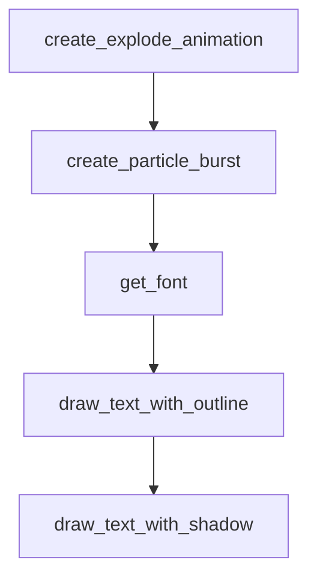

# Chapter 1: Getting Started

Welcome to **Chapter 1: Getting Started**. In this part of **Awesome Claude Skills Tutorial: High-Signal Skill Discovery and Reuse for Claude Workflows**, you will build an intuitive mental model first, then move into concrete implementation details and practical production tradeoffs.


This chapter establishes a fast process for getting value from the skills catalog without overwhelming exploration.

## Learning Goals

- identify 3-5 candidate skills relevant to your current bottleneck
- validate skill clarity before installing anything
- run a minimal proof in your Claude environment
- avoid adopting overlapping or stale skills

## Fast Start Loop

1. start from the [README](https://github.com/ComposioHQ/awesome-claude-skills/blob/master/README.md)
2. choose one category aligned to current work
3. shortlist candidate skills with clear docs and examples
4. test one skill in a constrained task
5. keep only skills with measurable outcome improvement

## Source References

- [README](https://github.com/ComposioHQ/awesome-claude-skills/blob/master/README.md)

## Summary

You now have a simple onboarding loop for skill discovery and initial validation.

Next: [Chapter 2: Catalog Taxonomy and Navigation](02-catalog-taxonomy-and-navigation.md)

## Source Code Walkthrough

### `slack-gif-creator/templates/explode.py`

The `create_explode_animation` function in [`slack-gif-creator/templates/explode.py`](https://github.com/ComposioHQ/awesome-claude-skills/blob/HEAD/slack-gif-creator/templates/explode.py) handles a key part of this chapter's functionality:

```py


def create_explode_animation(
    object_type: str = 'emoji',
    object_data: dict | None = None,
    num_frames: int = 30,
    explode_type: str = 'burst',  # 'burst', 'shatter', 'dissolve', 'implode'
    num_pieces: int = 20,
    explosion_speed: float = 5.0,
    center_pos: tuple[int, int] = (240, 240),
    frame_width: int = 480,
    frame_height: int = 480,
    bg_color: tuple[int, int, int] = (255, 255, 255)
) -> list[Image.Image]:
    """
    Create explosion animation.

    Args:
        object_type: 'emoji', 'circle', 'text'
        object_data: Object configuration
        num_frames: Number of frames
        explode_type: Type of explosion
        num_pieces: Number of pieces/particles
        explosion_speed: Speed of explosion
        center_pos: Center position
        frame_width: Frame width
        frame_height: Frame height
        bg_color: Background color

    Returns:
        List of frames
    """
```

This function is important because it defines how Awesome Claude Skills Tutorial: High-Signal Skill Discovery and Reuse for Claude Workflows implements the patterns covered in this chapter.

### `slack-gif-creator/templates/explode.py`

The `create_particle_burst` function in [`slack-gif-creator/templates/explode.py`](https://github.com/ComposioHQ/awesome-claude-skills/blob/HEAD/slack-gif-creator/templates/explode.py) handles a key part of this chapter's functionality:

```py


def create_particle_burst(
    num_frames: int = 25,
    particle_count: int = 30,
    center_pos: tuple[int, int] = (240, 240),
    colors: list[tuple[int, int, int]] | None = None,
    frame_width: int = 480,
    frame_height: int = 480,
    bg_color: tuple[int, int, int] = (255, 255, 255)
) -> list[Image.Image]:
    """
    Create simple particle burst effect.

    Args:
        num_frames: Number of frames
        particle_count: Number of particles
        center_pos: Burst center
        colors: Particle colors (None for random)
        frame_width: Frame width
        frame_height: Frame height
        bg_color: Background color

    Returns:
        List of frames
    """
    particles = ParticleSystem()

    # Emit particles
    if colors is None:
        from core.color_palettes import get_palette
        palette = get_palette('vibrant')
```

This function is important because it defines how Awesome Claude Skills Tutorial: High-Signal Skill Discovery and Reuse for Claude Workflows implements the patterns covered in this chapter.

### `slack-gif-creator/core/typography.py`

The `get_font` function in [`slack-gif-creator/core/typography.py`](https://github.com/ComposioHQ/awesome-claude-skills/blob/HEAD/slack-gif-creator/core/typography.py) handles a key part of this chapter's functionality:

```py


def get_font(size: int, bold: bool = False) -> ImageFont.FreeTypeFont:
    """
    Get a font with fallback support.

    Args:
        size: Font size in pixels
        bold: Use bold variant if available

    Returns:
        ImageFont object
    """
    # Try multiple font paths for cross-platform support
    font_paths = [
        # macOS fonts
        "/System/Library/Fonts/Helvetica.ttc",
        "/System/Library/Fonts/SF-Pro.ttf",
        "/Library/Fonts/Arial Bold.ttf" if bold else "/Library/Fonts/Arial.ttf",
        # Linux fonts
        "/usr/share/fonts/truetype/dejavu/DejaVuSans-Bold.ttf" if bold else "/usr/share/fonts/truetype/dejavu/DejaVuSans.ttf",
        # Windows fonts
        "C:\\Windows\\Fonts\\arialbd.ttf" if bold else "C:\\Windows\\Fonts\\arial.ttf",
    ]

    for font_path in font_paths:
        try:
            return ImageFont.truetype(font_path, size)
        except:
            continue

    # Ultimate fallback
```

This function is important because it defines how Awesome Claude Skills Tutorial: High-Signal Skill Discovery and Reuse for Claude Workflows implements the patterns covered in this chapter.

### `slack-gif-creator/core/typography.py`

The `draw_text_with_outline` function in [`slack-gif-creator/core/typography.py`](https://github.com/ComposioHQ/awesome-claude-skills/blob/HEAD/slack-gif-creator/core/typography.py) handles a key part of this chapter's functionality:

```py


def draw_text_with_outline(
    frame: Image.Image,
    text: str,
    position: tuple[int, int],
    font_size: int = 40,
    text_color: tuple[int, int, int] = (255, 255, 255),
    outline_color: tuple[int, int, int] = (0, 0, 0),
    outline_width: int = 3,
    centered: bool = False,
    bold: bool = True
) -> Image.Image:
    """
    Draw text with outline for maximum readability.

    This is THE most important function for professional-looking text in GIFs.
    The outline ensures text is readable on any background.

    Args:
        frame: PIL Image to draw on
        text: Text to draw
        position: (x, y) position
        font_size: Font size in pixels
        text_color: RGB color for text fill
        outline_color: RGB color for outline
        outline_width: Width of outline in pixels (2-4 recommended)
        centered: If True, center text at position
        bold: Use bold font variant

    Returns:
        Modified frame
```

This function is important because it defines how Awesome Claude Skills Tutorial: High-Signal Skill Discovery and Reuse for Claude Workflows implements the patterns covered in this chapter.


## How These Components Connect


