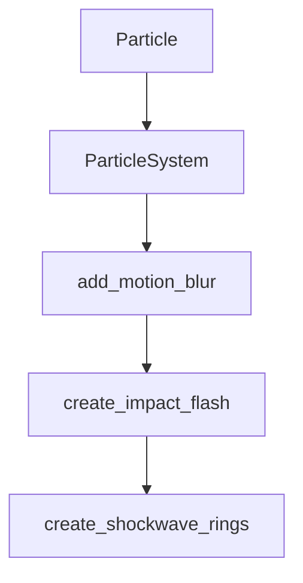

# Chapter 1: Getting Started

Welcome to **Chapter 1: Getting Started**. In this part of **Awesome Claude Skills Tutorial: High-Signal Skill Discovery and Reuse for Claude Workflows**, you will build an intuitive mental model first, then move into concrete implementation details and practical production tradeoffs.


This chapter establishes a fast process for getting value from the skills catalog without overwhelming exploration.

## Learning Goals

- identify 3-5 candidate skills relevant to your current bottleneck
- validate skill clarity before installing anything
- run a minimal proof in your Claude environment
- avoid adopting overlapping or stale skills

## Fast Start Loop

1. start from the [README](https://github.com/ComposioHQ/awesome-claude-skills/blob/master/README.md)
2. choose one category aligned to current work
3. shortlist candidate skills with clear docs and examples
4. test one skill in a constrained task
5. keep only skills with measurable outcome improvement

## Source References

- [README](https://github.com/ComposioHQ/awesome-claude-skills/blob/master/README.md)

## Summary

You now have a simple onboarding loop for skill discovery and initial validation.

Next: [Chapter 2: Catalog Taxonomy and Navigation](02-catalog-taxonomy-and-navigation.md)

## Depth Expansion Playbook

## Source Code Walkthrough

### `slack-gif-creator/core/visual_effects.py`

The `Particle` class in [`slack-gif-creator/core/visual_effects.py`](https://github.com/ComposioHQ/awesome-claude-skills/blob/HEAD/slack-gif-creator/core/visual_effects.py) handles a key part of this chapter's functionality:

```py
#!/usr/bin/env python3
"""
Visual Effects - Particles, motion blur, impacts, and other effects for GIFs.

This module provides high-impact visual effects that make animations feel
professional and dynamic while keeping file sizes reasonable.
"""

from PIL import Image, ImageDraw, ImageFilter
import numpy as np
import math
import random
from typing import Optional


class Particle:
    """A single particle in a particle system."""

    def __init__(self, x: float, y: float, vx: float, vy: float,
                 lifetime: float, color: tuple[int, int, int],
                 size: int = 3, shape: str = 'circle'):
        """
        Initialize a particle.

        Args:
            x, y: Starting position
            vx, vy: Velocity
            lifetime: How long particle lives (in frames)
            color: RGB color
            size: Particle size in pixels
            shape: 'circle', 'square', or 'star'
        """
```

This class is important because it defines how Awesome Claude Skills Tutorial: High-Signal Skill Discovery and Reuse for Claude Workflows implements the patterns covered in this chapter.

### `slack-gif-creator/core/visual_effects.py`

The `ParticleSystem` class in [`slack-gif-creator/core/visual_effects.py`](https://github.com/ComposioHQ/awesome-claude-skills/blob/HEAD/slack-gif-creator/core/visual_effects.py) handles a key part of this chapter's functionality:

```py


class ParticleSystem:
    """Manages a collection of particles."""

    def __init__(self):
        """Initialize particle system."""
        self.particles: list[Particle] = []

    def emit(self, x: int, y: int, count: int = 10,
             spread: float = 2.0, speed: float = 5.0,
             color: tuple[int, int, int] = (255, 200, 0),
             lifetime: float = 20.0, size: int = 3, shape: str = 'circle'):
        """
        Emit a burst of particles.

        Args:
            x, y: Emission position
            count: Number of particles to emit
            spread: Angle spread (radians)
            speed: Initial speed
            color: Particle color
            lifetime: Particle lifetime in frames
            size: Particle size
            shape: Particle shape
        """
        for _ in range(count):
            # Random angle and speed
            angle = random.uniform(0, 2 * math.pi)
            vel_mag = random.uniform(speed * 0.5, speed * 1.5)
            vx = math.cos(angle) * vel_mag
            vy = math.sin(angle) * vel_mag
```

This class is important because it defines how Awesome Claude Skills Tutorial: High-Signal Skill Discovery and Reuse for Claude Workflows implements the patterns covered in this chapter.

### `slack-gif-creator/core/visual_effects.py`

The `add_motion_blur` function in [`slack-gif-creator/core/visual_effects.py`](https://github.com/ComposioHQ/awesome-claude-skills/blob/HEAD/slack-gif-creator/core/visual_effects.py) handles a key part of this chapter's functionality:

```py


def add_motion_blur(frame: Image.Image, prev_frame: Optional[Image.Image],
                    blur_amount: float = 0.5) -> Image.Image:
    """
    Add motion blur by blending with previous frame.

    Args:
        frame: Current frame
        prev_frame: Previous frame (None for first frame)
        blur_amount: Amount of blur (0.0-1.0)

    Returns:
        Frame with motion blur applied
    """
    if prev_frame is None:
        return frame

    # Blend current frame with previous frame
    frame_array = np.array(frame, dtype=np.float32)
    prev_array = np.array(prev_frame, dtype=np.float32)

    blended = frame_array * (1 - blur_amount) + prev_array * blur_amount
    blended = np.clip(blended, 0, 255).astype(np.uint8)

    return Image.fromarray(blended)


def create_impact_flash(frame: Image.Image, position: tuple[int, int],
                        radius: int = 100, intensity: float = 0.7) -> Image.Image:
    """
    Create a bright flash effect at impact point.
```

This function is important because it defines how Awesome Claude Skills Tutorial: High-Signal Skill Discovery and Reuse for Claude Workflows implements the patterns covered in this chapter.

### `slack-gif-creator/core/visual_effects.py`

The `create_impact_flash` function in [`slack-gif-creator/core/visual_effects.py`](https://github.com/ComposioHQ/awesome-claude-skills/blob/HEAD/slack-gif-creator/core/visual_effects.py) handles a key part of this chapter's functionality:

```py


def create_impact_flash(frame: Image.Image, position: tuple[int, int],
                        radius: int = 100, intensity: float = 0.7) -> Image.Image:
    """
    Create a bright flash effect at impact point.

    Args:
        frame: PIL Image to draw on
        position: Center of flash
        radius: Flash radius
        intensity: Flash intensity (0.0-1.0)

    Returns:
        Modified frame
    """
    # Create overlay
    overlay = Image.new('RGBA', frame.size, (0, 0, 0, 0))
    draw = ImageDraw.Draw(overlay)

    x, y = position

    # Draw concentric circles with decreasing opacity
    num_circles = 5
    for i in range(num_circles):
        alpha = int(255 * intensity * (1 - i / num_circles))
        r = radius * (1 - i / num_circles)
        color = (255, 255, 240, alpha)  # Warm white

        bbox = [x - r, y - r, x + r, y + r]
        draw.ellipse(bbox, fill=color)

```

This function is important because it defines how Awesome Claude Skills Tutorial: High-Signal Skill Discovery and Reuse for Claude Workflows implements the patterns covered in this chapter.


## How These Components Connect


