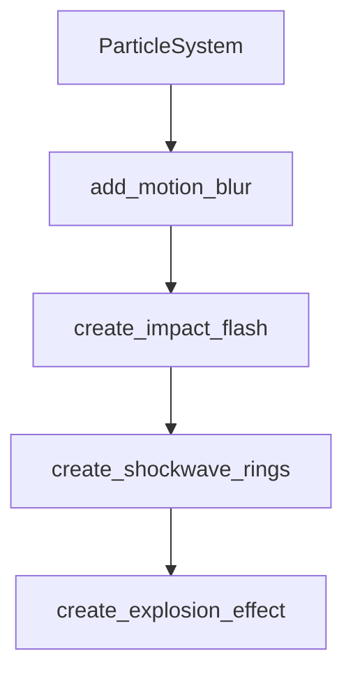

# Chapter 2: Catalog Taxonomy and Navigation

Welcome to **Chapter 2: Catalog Taxonomy and Navigation**. In this part of **Awesome Claude Skills Tutorial: High-Signal Skill Discovery and Reuse for Claude Workflows**, you will build an intuitive mental model first, then move into concrete implementation details and practical production tradeoffs.


This chapter helps you navigate the catalog by intent and workflow type.

## Learning Goals

- map category families to concrete task profiles
- separate general skills from app-specific automation packs
- scan quickly for high-value entries in each category
- reduce evaluation time through structured navigation

## Category Navigation Map

| Category Family | Typical Use |
|:----------------|:------------|
| development/code | implementation, testing, refactoring, review |
| data/analysis | research, summarization, query/insight workflows |
| productivity/writing | planning, docs, communication, personal ops |
| app automation | concrete SaaS task execution via tool integrations |

## Source References

- [README: Skills Sections](https://github.com/ComposioHQ/awesome-claude-skills/blob/master/README.md#skills)
- [README: App Automation via Composio](https://github.com/ComposioHQ/awesome-claude-skills/blob/master/README.md#app-automation-via-composio)

## Summary

You now know how to navigate the catalog with less noise and faster relevance.

Next: [Chapter 3: Installation Paths: Claude.ai, Claude Code, API](03-installation-paths-claude-ai-claude-code-api.md)

## Source Code Walkthrough

### `slack-gif-creator/core/visual_effects.py`

The `ParticleSystem` class in [`slack-gif-creator/core/visual_effects.py`](https://github.com/ComposioHQ/awesome-claude-skills/blob/HEAD/slack-gif-creator/core/visual_effects.py) handles a key part of this chapter's functionality:

```py


class ParticleSystem:
    """Manages a collection of particles."""

    def __init__(self):
        """Initialize particle system."""
        self.particles: list[Particle] = []

    def emit(self, x: int, y: int, count: int = 10,
             spread: float = 2.0, speed: float = 5.0,
             color: tuple[int, int, int] = (255, 200, 0),
             lifetime: float = 20.0, size: int = 3, shape: str = 'circle'):
        """
        Emit a burst of particles.

        Args:
            x, y: Emission position
            count: Number of particles to emit
            spread: Angle spread (radians)
            speed: Initial speed
            color: Particle color
            lifetime: Particle lifetime in frames
            size: Particle size
            shape: Particle shape
        """
        for _ in range(count):
            # Random angle and speed
            angle = random.uniform(0, 2 * math.pi)
            vel_mag = random.uniform(speed * 0.5, speed * 1.5)
            vx = math.cos(angle) * vel_mag
            vy = math.sin(angle) * vel_mag
```

This class is important because it defines how Awesome Claude Skills Tutorial: High-Signal Skill Discovery and Reuse for Claude Workflows implements the patterns covered in this chapter.

### `slack-gif-creator/core/visual_effects.py`

The `add_motion_blur` function in [`slack-gif-creator/core/visual_effects.py`](https://github.com/ComposioHQ/awesome-claude-skills/blob/HEAD/slack-gif-creator/core/visual_effects.py) handles a key part of this chapter's functionality:

```py


def add_motion_blur(frame: Image.Image, prev_frame: Optional[Image.Image],
                    blur_amount: float = 0.5) -> Image.Image:
    """
    Add motion blur by blending with previous frame.

    Args:
        frame: Current frame
        prev_frame: Previous frame (None for first frame)
        blur_amount: Amount of blur (0.0-1.0)

    Returns:
        Frame with motion blur applied
    """
    if prev_frame is None:
        return frame

    # Blend current frame with previous frame
    frame_array = np.array(frame, dtype=np.float32)
    prev_array = np.array(prev_frame, dtype=np.float32)

    blended = frame_array * (1 - blur_amount) + prev_array * blur_amount
    blended = np.clip(blended, 0, 255).astype(np.uint8)

    return Image.fromarray(blended)


def create_impact_flash(frame: Image.Image, position: tuple[int, int],
                        radius: int = 100, intensity: float = 0.7) -> Image.Image:
    """
    Create a bright flash effect at impact point.
```

This function is important because it defines how Awesome Claude Skills Tutorial: High-Signal Skill Discovery and Reuse for Claude Workflows implements the patterns covered in this chapter.

### `slack-gif-creator/core/visual_effects.py`

The `create_impact_flash` function in [`slack-gif-creator/core/visual_effects.py`](https://github.com/ComposioHQ/awesome-claude-skills/blob/HEAD/slack-gif-creator/core/visual_effects.py) handles a key part of this chapter's functionality:

```py


def create_impact_flash(frame: Image.Image, position: tuple[int, int],
                        radius: int = 100, intensity: float = 0.7) -> Image.Image:
    """
    Create a bright flash effect at impact point.

    Args:
        frame: PIL Image to draw on
        position: Center of flash
        radius: Flash radius
        intensity: Flash intensity (0.0-1.0)

    Returns:
        Modified frame
    """
    # Create overlay
    overlay = Image.new('RGBA', frame.size, (0, 0, 0, 0))
    draw = ImageDraw.Draw(overlay)

    x, y = position

    # Draw concentric circles with decreasing opacity
    num_circles = 5
    for i in range(num_circles):
        alpha = int(255 * intensity * (1 - i / num_circles))
        r = radius * (1 - i / num_circles)
        color = (255, 255, 240, alpha)  # Warm white

        bbox = [x - r, y - r, x + r, y + r]
        draw.ellipse(bbox, fill=color)

```

This function is important because it defines how Awesome Claude Skills Tutorial: High-Signal Skill Discovery and Reuse for Claude Workflows implements the patterns covered in this chapter.

### `slack-gif-creator/core/visual_effects.py`

The `create_shockwave_rings` function in [`slack-gif-creator/core/visual_effects.py`](https://github.com/ComposioHQ/awesome-claude-skills/blob/HEAD/slack-gif-creator/core/visual_effects.py) handles a key part of this chapter's functionality:

```py


def create_shockwave_rings(frame: Image.Image, position: tuple[int, int],
                           radii: list[int], color: tuple[int, int, int] = (255, 200, 0),
                           width: int = 3) -> Image.Image:
    """
    Create expanding ring effects.

    Args:
        frame: PIL Image to draw on
        position: Center of rings
        radii: List of ring radii
        color: Ring color
        width: Ring width

    Returns:
        Modified frame
    """
    draw = ImageDraw.Draw(frame)
    x, y = position

    for radius in radii:
        bbox = [x - radius, y - radius, x + radius, y + radius]
        draw.ellipse(bbox, outline=color, width=width)

    return frame


def create_explosion_effect(frame: Image.Image, position: tuple[int, int],
                            radius: int, progress: float,
                            color: tuple[int, int, int] = (255, 150, 0)) -> Image.Image:
    """
```

This function is important because it defines how Awesome Claude Skills Tutorial: High-Signal Skill Discovery and Reuse for Claude Workflows implements the patterns covered in this chapter.


## How These Components Connect


