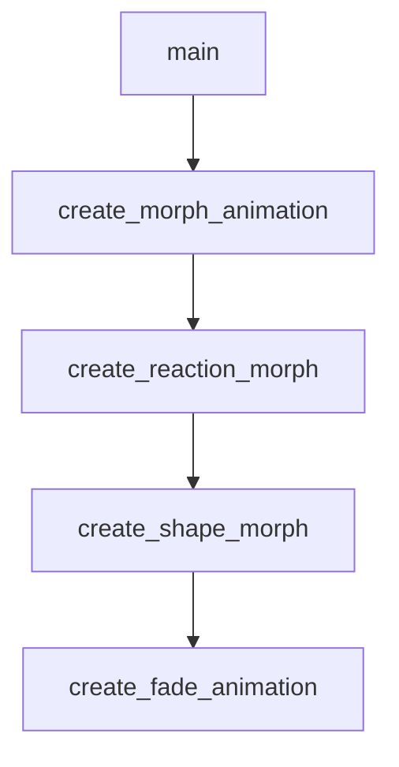

# Chapter 2: Catalog Taxonomy and Navigation

Welcome to **Chapter 2: Catalog Taxonomy and Navigation**. In this part of **Awesome Claude Skills Tutorial: High-Signal Skill Discovery and Reuse for Claude Workflows**, you will build an intuitive mental model first, then move into concrete implementation details and practical production tradeoffs.


This chapter helps you navigate the catalog by intent and workflow type.

## Learning Goals

- map category families to concrete task profiles
- separate general skills from app-specific automation packs
- scan quickly for high-value entries in each category
- reduce evaluation time through structured navigation

## Category Navigation Map

| Category Family | Typical Use |
|:----------------|:------------|
| development/code | implementation, testing, refactoring, review |
| data/analysis | research, summarization, query/insight workflows |
| productivity/writing | planning, docs, communication, personal ops |
| app automation | concrete SaaS task execution via tool integrations |

## Source References

- [README: Skills Sections](https://github.com/ComposioHQ/awesome-claude-skills/blob/master/README.md#skills)
- [README: App Automation via Composio](https://github.com/ComposioHQ/awesome-claude-skills/blob/master/README.md#app-automation-via-composio)

## Summary

You now know how to navigate the catalog with less noise and faster relevance.

Next: [Chapter 3: Installation Paths: Claude.ai, Claude Code, API](03-installation-paths-claude-ai-claude-code-api.md)

## Depth Expansion Playbook

## Source Code Walkthrough

### `skill-creator/scripts/init_skill.py`

The `main` function in [`skill-creator/scripts/init_skill.py`](https://github.com/ComposioHQ/awesome-claude-skills/blob/HEAD/skill-creator/scripts/init_skill.py) handles a key part of this chapter's functionality:

```py
Delete this entire "Structuring This Skill" section when done - it's just guidance.]

## [TODO: Replace with the first main section based on chosen structure]

[TODO: Add content here. See examples in existing skills:
- Code samples for technical skills
- Decision trees for complex workflows
- Concrete examples with realistic user requests
- References to scripts/templates/references as needed]

## Resources

This skill includes example resource directories that demonstrate how to organize different types of bundled resources:

### scripts/
Executable code (Python/Bash/etc.) that can be run directly to perform specific operations.

**Examples from other skills:**
- PDF skill: `fill_fillable_fields.py`, `extract_form_field_info.py` - utilities for PDF manipulation
- DOCX skill: `document.py`, `utilities.py` - Python modules for document processing

**Appropriate for:** Python scripts, shell scripts, or any executable code that performs automation, data processing, or specific operations.

**Note:** Scripts may be executed without loading into context, but can still be read by Claude for patching or environment adjustments.

### references/
Documentation and reference material intended to be loaded into context to inform Claude's process and thinking.

**Examples from other skills:**
- Product management: `communication.md`, `context_building.md` - detailed workflow guides
- BigQuery: API reference documentation and query examples
- Finance: Schema documentation, company policies
```

This function is important because it defines how Awesome Claude Skills Tutorial: High-Signal Skill Discovery and Reuse for Claude Workflows implements the patterns covered in this chapter.

### `slack-gif-creator/templates/morph.py`

The `create_morph_animation` function in [`slack-gif-creator/templates/morph.py`](https://github.com/ComposioHQ/awesome-claude-skills/blob/HEAD/slack-gif-creator/templates/morph.py) handles a key part of this chapter's functionality:

```py


def create_morph_animation(
    object1_data: dict,
    object2_data: dict,
    num_frames: int = 30,
    morph_type: str = 'crossfade',  # 'crossfade', 'scale', 'spin_morph'
    easing: str = 'ease_in_out',
    object_type: str = 'emoji',
    center_pos: tuple[int, int] = (240, 240),
    frame_width: int = 480,
    frame_height: int = 480,
    bg_color: tuple[int, int, int] = (255, 255, 255)
) -> list[Image.Image]:
    """
    Create morphing animation between two objects.

    Args:
        object1_data: First object configuration
        object2_data: Second object configuration
        num_frames: Number of frames
        morph_type: Type of morph effect
        easing: Easing function
        object_type: Type of objects
        center_pos: Center position
        frame_width: Frame width
        frame_height: Frame height
        bg_color: Background color

    Returns:
        List of frames
    """
```

This function is important because it defines how Awesome Claude Skills Tutorial: High-Signal Skill Discovery and Reuse for Claude Workflows implements the patterns covered in this chapter.

### `slack-gif-creator/templates/morph.py`

The `create_reaction_morph` function in [`slack-gif-creator/templates/morph.py`](https://github.com/ComposioHQ/awesome-claude-skills/blob/HEAD/slack-gif-creator/templates/morph.py) handles a key part of this chapter's functionality:

```py


def create_reaction_morph(
    emoji_start: str,
    emoji_end: str,
    num_frames: int = 20,
    frame_size: int = 128
) -> list[Image.Image]:
    """
    Create quick emoji reaction morph (for emoji GIFs).

    Args:
        emoji_start: Starting emoji
        emoji_end: Ending emoji
        num_frames: Number of frames
        frame_size: Frame size (square)

    Returns:
        List of frames
    """
    return create_morph_animation(
        object1_data={'emoji': emoji_start, 'size': 80},
        object2_data={'emoji': emoji_end, 'size': 80},
        num_frames=num_frames,
        morph_type='crossfade',
        easing='ease_in_out',
        object_type='emoji',
        center_pos=(frame_size // 2, frame_size // 2),
        frame_width=frame_size,
        frame_height=frame_size,
        bg_color=(255, 255, 255)
    )
```

This function is important because it defines how Awesome Claude Skills Tutorial: High-Signal Skill Discovery and Reuse for Claude Workflows implements the patterns covered in this chapter.

### `slack-gif-creator/templates/morph.py`

The `create_shape_morph` function in [`slack-gif-creator/templates/morph.py`](https://github.com/ComposioHQ/awesome-claude-skills/blob/HEAD/slack-gif-creator/templates/morph.py) handles a key part of this chapter's functionality:

```py


def create_shape_morph(
    shapes: list[dict],
    num_frames: int = 60,
    frames_per_shape: int = 20,
    frame_width: int = 480,
    frame_height: int = 480,
    bg_color: tuple[int, int, int] = (255, 255, 255)
) -> list[Image.Image]:
    """
    Morph through a sequence of shapes.

    Args:
        shapes: List of shape dicts with 'radius' and 'color'
        num_frames: Total number of frames
        frames_per_shape: Frames to spend on each morph
        frame_width: Frame width
        frame_height: Frame height
        bg_color: Background color

    Returns:
        List of frames
    """
    frames = []
    center = (frame_width // 2, frame_height // 2)

    for i in range(num_frames):
        # Determine which shapes we're morphing between
        cycle_progress = (i % (frames_per_shape * len(shapes))) / frames_per_shape
        shape_idx = int(cycle_progress) % len(shapes)
        next_shape_idx = (shape_idx + 1) % len(shapes)
```

This function is important because it defines how Awesome Claude Skills Tutorial: High-Signal Skill Discovery and Reuse for Claude Workflows implements the patterns covered in this chapter.


## How These Components Connect


