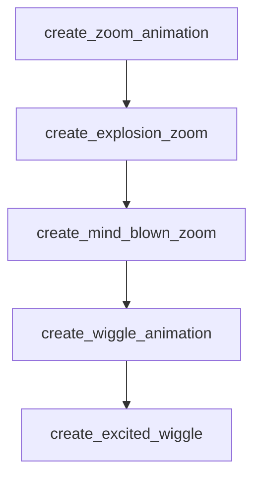

# Chapter 3: Installation Paths: Claude.ai, Claude Code, API

Welcome to **Chapter 3: Installation Paths: Claude.ai, Claude Code, API**. In this part of **Awesome Claude Skills Tutorial: High-Signal Skill Discovery and Reuse for Claude Workflows**, you will build an intuitive mental model first, then move into concrete implementation details and practical production tradeoffs.


This chapter covers installation patterns across the three main usage contexts.

## Learning Goals

- choose install path by runtime environment
- verify skill placement and activation quickly
- avoid environment-specific misconfiguration
- align local and team setup patterns

## Path Comparison

| Path | Typical Pattern | Best For |
|:-----|:----------------|:---------|
| Claude.ai marketplace/custom upload | UI-managed skill activation | non-terminal workflows |
| Claude Code local filesystem | place skill folders under local skill directory | terminal-native engineering loops |
| API skill loading | configure skills in API call flow | programmatic orchestration |

## Source References

- [README: Getting Started](https://github.com/ComposioHQ/awesome-claude-skills/blob/master/README.md#getting-started)
- [README: Skills API Documentation Link](https://github.com/ComposioHQ/awesome-claude-skills/blob/master/README.md#using-skills-via-api)

## Summary

You now understand runtime-specific install patterns and validation points.

Next: [Chapter 4: Skill Authoring Template and Quality Standards](04-skill-authoring-template-and-quality-standards.md)

## Source Code Walkthrough

### `slack-gif-creator/templates/zoom.py`

The `create_zoom_animation` function in [`slack-gif-creator/templates/zoom.py`](https://github.com/ComposioHQ/awesome-claude-skills/blob/HEAD/slack-gif-creator/templates/zoom.py) handles a key part of this chapter's functionality:

```py


def create_zoom_animation(
    object_type: str = 'emoji',
    object_data: dict | None = None,
    num_frames: int = 30,
    zoom_type: str = 'in',  # 'in', 'out', 'in_out', 'punch'
    scale_range: tuple[float, float] = (0.1, 2.0),
    easing: str = 'ease_out',
    add_motion_blur: bool = False,
    center_pos: tuple[int, int] = (240, 240),
    frame_width: int = 480,
    frame_height: int = 480,
    bg_color: tuple[int, int, int] = (255, 255, 255)
) -> list[Image.Image]:
    """
    Create zoom animation.

    Args:
        object_type: 'emoji', 'text', 'image'
        object_data: Object configuration
        num_frames: Number of frames
        zoom_type: Type of zoom effect
        scale_range: (start_scale, end_scale) tuple
        easing: Easing function
        add_motion_blur: Add blur for speed effect
        center_pos: Center position
        frame_width: Frame width
        frame_height: Frame height
        bg_color: Background color

    Returns:
```

This function is important because it defines how Awesome Claude Skills Tutorial: High-Signal Skill Discovery and Reuse for Claude Workflows implements the patterns covered in this chapter.

### `slack-gif-creator/templates/zoom.py`

The `create_explosion_zoom` function in [`slack-gif-creator/templates/zoom.py`](https://github.com/ComposioHQ/awesome-claude-skills/blob/HEAD/slack-gif-creator/templates/zoom.py) handles a key part of this chapter's functionality:

```py


def create_explosion_zoom(
    emoji: str = '💥',
    num_frames: int = 20,
    frame_width: int = 480,
    frame_height: int = 480,
    bg_color: tuple[int, int, int] = (255, 255, 255)
) -> list[Image.Image]:
    """
    Create dramatic explosion zoom effect.

    Args:
        emoji: Emoji to explode
        num_frames: Number of frames
        frame_width: Frame width
        frame_height: Frame height
        bg_color: Background color

    Returns:
        List of frames
    """
    frames = []

    for i in range(num_frames):
        t = i / (num_frames - 1) if num_frames > 1 else 0

        # Exponential zoom
        scale = 0.1 * math.exp(t * 5)

        # Add rotation for drama
        angle = t * 360 * 2
```

This function is important because it defines how Awesome Claude Skills Tutorial: High-Signal Skill Discovery and Reuse for Claude Workflows implements the patterns covered in this chapter.

### `slack-gif-creator/templates/zoom.py`

The `create_mind_blown_zoom` function in [`slack-gif-creator/templates/zoom.py`](https://github.com/ComposioHQ/awesome-claude-skills/blob/HEAD/slack-gif-creator/templates/zoom.py) handles a key part of this chapter's functionality:

```py


def create_mind_blown_zoom(
    emoji: str = '🤯',
    num_frames: int = 30,
    frame_width: int = 480,
    frame_height: int = 480,
    bg_color: tuple[int, int, int] = (255, 255, 255)
) -> list[Image.Image]:
    """
    Create "mind blown" dramatic zoom with shake.

    Args:
        emoji: Emoji to use
        num_frames: Number of frames
        frame_width: Frame width
        frame_height: Frame height
        bg_color: Background color

    Returns:
        List of frames
    """
    frames = []

    for i in range(num_frames):
        t = i / (num_frames - 1) if num_frames > 1 else 0

        # Zoom in then shake
        if t < 0.5:
            scale = interpolate(0.3, 1.2, t * 2, 'ease_out')
            shake_x = 0
            shake_y = 0
```

This function is important because it defines how Awesome Claude Skills Tutorial: High-Signal Skill Discovery and Reuse for Claude Workflows implements the patterns covered in this chapter.

### `slack-gif-creator/templates/wiggle.py`

The `create_wiggle_animation` function in [`slack-gif-creator/templates/wiggle.py`](https://github.com/ComposioHQ/awesome-claude-skills/blob/HEAD/slack-gif-creator/templates/wiggle.py) handles a key part of this chapter's functionality:

```py


def create_wiggle_animation(
    object_type: str = 'emoji',
    object_data: dict | None = None,
    num_frames: int = 30,
    wiggle_type: str = 'jello',  # 'jello', 'wave', 'bounce', 'sway'
    intensity: float = 1.0,
    cycles: float = 2.0,
    center_pos: tuple[int, int] = (240, 240),
    frame_width: int = 480,
    frame_height: int = 480,
    bg_color: tuple[int, int, int] = (255, 255, 255)
) -> list[Image.Image]:
    """
    Create wiggle/wobble animation.

    Args:
        object_type: 'emoji', 'text'
        object_data: Object configuration
        num_frames: Number of frames
        wiggle_type: Type of wiggle motion
        intensity: Wiggle intensity multiplier
        cycles: Number of wiggle cycles
        center_pos: Center position
        frame_width: Frame width
        frame_height: Frame height
        bg_color: Background color

    Returns:
        List of frames
    """
```

This function is important because it defines how Awesome Claude Skills Tutorial: High-Signal Skill Discovery and Reuse for Claude Workflows implements the patterns covered in this chapter.


## How These Components Connect


