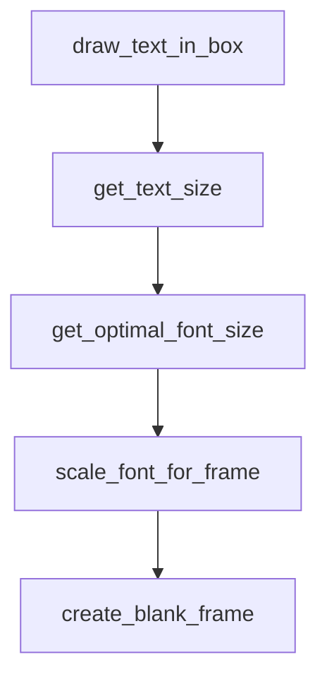

# Chapter 3: Installation Paths: Claude.ai, Claude Code, API

Welcome to **Chapter 3: Installation Paths: Claude.ai, Claude Code, API**. In this part of **Awesome Claude Skills Tutorial: High-Signal Skill Discovery and Reuse for Claude Workflows**, you will build an intuitive mental model first, then move into concrete implementation details and practical production tradeoffs.


This chapter covers installation patterns across the three main usage contexts.

## Learning Goals

- choose install path by runtime environment
- verify skill placement and activation quickly
- avoid environment-specific misconfiguration
- align local and team setup patterns

## Path Comparison

| Path | Typical Pattern | Best For |
|:-----|:----------------|:---------|
| Claude.ai marketplace/custom upload | UI-managed skill activation | non-terminal workflows |
| Claude Code local filesystem | place skill folders under local skill directory | terminal-native engineering loops |
| API skill loading | configure skills in API call flow | programmatic orchestration |

## Source References

- [README: Getting Started](https://github.com/ComposioHQ/awesome-claude-skills/blob/master/README.md#getting-started)
- [README: Skills API Documentation Link](https://github.com/ComposioHQ/awesome-claude-skills/blob/master/README.md#using-skills-via-api)

## Summary

You now understand runtime-specific install patterns and validation points.

Next: [Chapter 4: Skill Authoring Template and Quality Standards](04-skill-authoring-template-and-quality-standards.md)

## Depth Expansion Playbook

## Source Code Walkthrough

### `slack-gif-creator/core/typography.py`

The `draw_text_in_box` function in [`slack-gif-creator/core/typography.py`](https://github.com/ComposioHQ/awesome-claude-skills/blob/HEAD/slack-gif-creator/core/typography.py) handles a key part of this chapter's functionality:

```py


def draw_text_in_box(
    frame: Image.Image,
    text: str,
    position: tuple[int, int],
    font_size: int = 40,
    text_color: tuple[int, int, int] = (255, 255, 255),
    box_color: tuple[int, int, int] = (0, 0, 0),
    box_alpha: float = 0.7,
    padding: int = 10,
    centered: bool = True,
    bold: bool = True
) -> Image.Image:
    """
    Draw text in a semi-transparent box for guaranteed readability.

    Args:
        frame: PIL Image to draw on
        text: Text to draw
        position: (x, y) position
        font_size: Font size in pixels
        text_color: RGB color for text
        box_color: RGB color for background box
        box_alpha: Opacity of box (0.0-1.0)
        padding: Padding around text in pixels
        centered: If True, center at position
        bold: Use bold font variant

    Returns:
        Modified frame
    """
```

This function is important because it defines how Awesome Claude Skills Tutorial: High-Signal Skill Discovery and Reuse for Claude Workflows implements the patterns covered in this chapter.

### `slack-gif-creator/core/typography.py`

The `get_text_size` function in [`slack-gif-creator/core/typography.py`](https://github.com/ComposioHQ/awesome-claude-skills/blob/HEAD/slack-gif-creator/core/typography.py) handles a key part of this chapter's functionality:

```py


def get_text_size(text: str, font_size: int, bold: bool = True) -> tuple[int, int]:
    """
    Get the dimensions of text without drawing it.

    Args:
        text: Text to measure
        font_size: Font size in pixels
        bold: Use bold font variant

    Returns:
        (width, height) tuple
    """
    font = get_font(font_size, bold=bold)
    # Create temporary image to measure
    temp_img = Image.new('RGB', (1, 1))
    draw = ImageDraw.Draw(temp_img)
    bbox = draw.textbbox((0, 0), text, font=font)
    width = bbox[2] - bbox[0]
    height = bbox[3] - bbox[1]
    return (width, height)


def get_optimal_font_size(text: str, max_width: int, max_height: int,
                          start_size: int = 60) -> int:
    """
    Find the largest font size that fits within given dimensions.

    Args:
        text: Text to size
        max_width: Maximum width in pixels
```

This function is important because it defines how Awesome Claude Skills Tutorial: High-Signal Skill Discovery and Reuse for Claude Workflows implements the patterns covered in this chapter.

### `slack-gif-creator/core/typography.py`

The `get_optimal_font_size` function in [`slack-gif-creator/core/typography.py`](https://github.com/ComposioHQ/awesome-claude-skills/blob/HEAD/slack-gif-creator/core/typography.py) handles a key part of this chapter's functionality:

```py


def get_optimal_font_size(text: str, max_width: int, max_height: int,
                          start_size: int = 60) -> int:
    """
    Find the largest font size that fits within given dimensions.

    Args:
        text: Text to size
        max_width: Maximum width in pixels
        max_height: Maximum height in pixels
        start_size: Starting font size to try

    Returns:
        Optimal font size
    """
    font_size = start_size
    while font_size > 10:
        width, height = get_text_size(text, font_size)
        if width <= max_width and height <= max_height:
            return font_size
        font_size -= 2
    return 10  # Minimum font size


def scale_font_for_frame(base_size: int, frame_width: int, frame_height: int) -> int:
    """
    Scale font size proportionally to frame dimensions.

    Useful for maintaining relative text size across different GIF dimensions.

    Args:
```

This function is important because it defines how Awesome Claude Skills Tutorial: High-Signal Skill Discovery and Reuse for Claude Workflows implements the patterns covered in this chapter.

### `slack-gif-creator/core/typography.py`

The `scale_font_for_frame` function in [`slack-gif-creator/core/typography.py`](https://github.com/ComposioHQ/awesome-claude-skills/blob/HEAD/slack-gif-creator/core/typography.py) handles a key part of this chapter's functionality:

```py


def scale_font_for_frame(base_size: int, frame_width: int, frame_height: int) -> int:
    """
    Scale font size proportionally to frame dimensions.

    Useful for maintaining relative text size across different GIF dimensions.

    Args:
        base_size: Base font size for 480x480 frame
        frame_width: Actual frame width
        frame_height: Actual frame height

    Returns:
        Scaled font size
    """
    # Use average dimension for scaling
    avg_dimension = (frame_width + frame_height) / 2
    base_dimension = 480  # Reference dimension
    scale_factor = avg_dimension / base_dimension
    return max(10, int(base_size * scale_factor))
```

This function is important because it defines how Awesome Claude Skills Tutorial: High-Signal Skill Discovery and Reuse for Claude Workflows implements the patterns covered in this chapter.


## How These Components Connect


