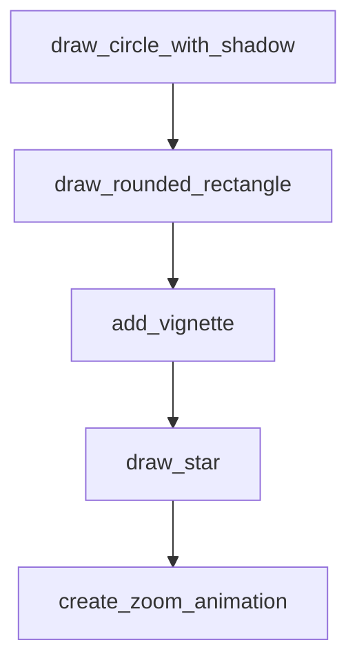

# Chapter 4: Skill Authoring Template and Quality Standards

Welcome to **Chapter 4: Skill Authoring Template and Quality Standards**. In this part of **Awesome Claude Skills Tutorial: High-Signal Skill Discovery and Reuse for Claude Workflows**, you will build an intuitive mental model first, then move into concrete implementation details and practical production tradeoffs.


This chapter explains what separates reusable production skills from prompt fragments.

## Learning Goals

- apply the repository's recommended skill structure
- document usage boundaries and examples clearly
- design skills for composability, not one-off demos
- prepare submissions that pass quality expectations

## Strong Skill Structure

| Component | Purpose |
|:----------|:--------|
| `SKILL.md` | core intent, usage guidance, examples |
| optional scripts/resources | support deterministic execution where needed |
| scoped instructions | explicit when-to-use and when-not-to-use boundaries |

## Source References

- [Contributing: Skill Requirements](https://github.com/ComposioHQ/awesome-claude-skills/blob/master/CONTRIBUTING.md#skill-requirements)
- [Contributing: SKILL.md Template](https://github.com/ComposioHQ/awesome-claude-skills/blob/master/CONTRIBUTING.md#skillmd-template)
- [README: Creating Skills](https://github.com/ComposioHQ/awesome-claude-skills/blob/master/README.md#creating-skills)

## Summary

You now have a rubric for authoring skills with stronger reuse and maintainability.

Next: [Chapter 5: App Automation via Composio Skill Packs](05-app-automation-via-composio-skill-packs.md)

## Depth Expansion Playbook

## Source Code Walkthrough

### `slack-gif-creator/core/frame_composer.py`

The `draw_circle_with_shadow` function in [`slack-gif-creator/core/frame_composer.py`](https://github.com/ComposioHQ/awesome-claude-skills/blob/HEAD/slack-gif-creator/core/frame_composer.py) handles a key part of this chapter's functionality:

```py


def draw_circle_with_shadow(frame: Image.Image, center: tuple[int, int], radius: int,
                            fill_color: tuple[int, int, int],
                            shadow_offset: tuple[int, int] = (3, 3),
                            shadow_color: tuple[int, int, int] = (0, 0, 0)) -> Image.Image:
    """
    Draw a circle with drop shadow.

    Args:
        frame: PIL Image to draw on
        center: (x, y) center position
        radius: Circle radius
        fill_color: RGB fill color
        shadow_offset: (x, y) shadow offset
        shadow_color: RGB shadow color

    Returns:
        Modified frame
    """
    draw = ImageDraw.Draw(frame)
    x, y = center

    # Draw shadow
    shadow_center = (x + shadow_offset[0], y + shadow_offset[1])
    shadow_bbox = [
        shadow_center[0] - radius,
        shadow_center[1] - radius,
        shadow_center[0] + radius,
        shadow_center[1] + radius
    ]
    draw.ellipse(shadow_bbox, fill=shadow_color)
```

This function is important because it defines how Awesome Claude Skills Tutorial: High-Signal Skill Discovery and Reuse for Claude Workflows implements the patterns covered in this chapter.

### `slack-gif-creator/core/frame_composer.py`

The `draw_rounded_rectangle` function in [`slack-gif-creator/core/frame_composer.py`](https://github.com/ComposioHQ/awesome-claude-skills/blob/HEAD/slack-gif-creator/core/frame_composer.py) handles a key part of this chapter's functionality:

```py


def draw_rounded_rectangle(frame: Image.Image, top_left: tuple[int, int],
                          bottom_right: tuple[int, int], radius: int,
                          fill_color: Optional[tuple[int, int, int]] = None,
                          outline_color: Optional[tuple[int, int, int]] = None,
                          outline_width: int = 1) -> Image.Image:
    """
    Draw a rectangle with rounded corners.

    Args:
        frame: PIL Image to draw on
        top_left: (x, y) top-left corner
        bottom_right: (x, y) bottom-right corner
        radius: Corner radius
        fill_color: RGB fill color (None for no fill)
        outline_color: RGB outline color (None for no outline)
        outline_width: Outline width

    Returns:
        Modified frame
    """
    draw = ImageDraw.Draw(frame)
    x1, y1 = top_left
    x2, y2 = bottom_right

    # Draw rounded rectangle using PIL's built-in method
    draw.rounded_rectangle([x1, y1, x2, y2], radius=radius,
                          fill=fill_color, outline=outline_color, width=outline_width)

    return frame

```

This function is important because it defines how Awesome Claude Skills Tutorial: High-Signal Skill Discovery and Reuse for Claude Workflows implements the patterns covered in this chapter.

### `slack-gif-creator/core/frame_composer.py`

The `add_vignette` function in [`slack-gif-creator/core/frame_composer.py`](https://github.com/ComposioHQ/awesome-claude-skills/blob/HEAD/slack-gif-creator/core/frame_composer.py) handles a key part of this chapter's functionality:

```py


def add_vignette(frame: Image.Image, strength: float = 0.5) -> Image.Image:
    """
    Add a vignette effect (darkened edges) to frame.

    Args:
        frame: PIL Image
        strength: Vignette strength (0.0-1.0)

    Returns:
        Frame with vignette
    """
    width, height = frame.size

    # Create radial gradient mask
    center_x, center_y = width // 2, height // 2
    max_dist = ((width / 2) ** 2 + (height / 2) ** 2) ** 0.5

    # Create overlay
    overlay = Image.new('RGB', (width, height), (0, 0, 0))
    pixels = overlay.load()

    for y in range(height):
        for x in range(width):
            # Calculate distance from center
            dx = x - center_x
            dy = y - center_y
            dist = (dx ** 2 + dy ** 2) ** 0.5

            # Calculate vignette value
            vignette = min(1, (dist / max_dist) * strength)
```

This function is important because it defines how Awesome Claude Skills Tutorial: High-Signal Skill Discovery and Reuse for Claude Workflows implements the patterns covered in this chapter.

### `slack-gif-creator/core/frame_composer.py`

The `draw_star` function in [`slack-gif-creator/core/frame_composer.py`](https://github.com/ComposioHQ/awesome-claude-skills/blob/HEAD/slack-gif-creator/core/frame_composer.py) handles a key part of this chapter's functionality:

```py


def draw_star(frame: Image.Image, center: tuple[int, int], size: int,
             fill_color: tuple[int, int, int],
             outline_color: Optional[tuple[int, int, int]] = None,
             outline_width: int = 1) -> Image.Image:
    """
    Draw a 5-pointed star.

    Args:
        frame: PIL Image to draw on
        center: (x, y) center position
        size: Star size (outer radius)
        fill_color: RGB fill color
        outline_color: RGB outline color (None for no outline)
        outline_width: Outline width

    Returns:
        Modified frame
    """
    import math
    draw = ImageDraw.Draw(frame)
    x, y = center

    # Calculate star points
    points = []
    for i in range(10):
        angle = (i * 36 - 90) * math.pi / 180  # 36 degrees per point, start at top
        radius = size if i % 2 == 0 else size * 0.4  # Alternate between outer and inner
        px = x + radius * math.cos(angle)
        py = y + radius * math.sin(angle)
        points.append((px, py))
```

This function is important because it defines how Awesome Claude Skills Tutorial: High-Signal Skill Discovery and Reuse for Claude Workflows implements the patterns covered in this chapter.


## How These Components Connect


