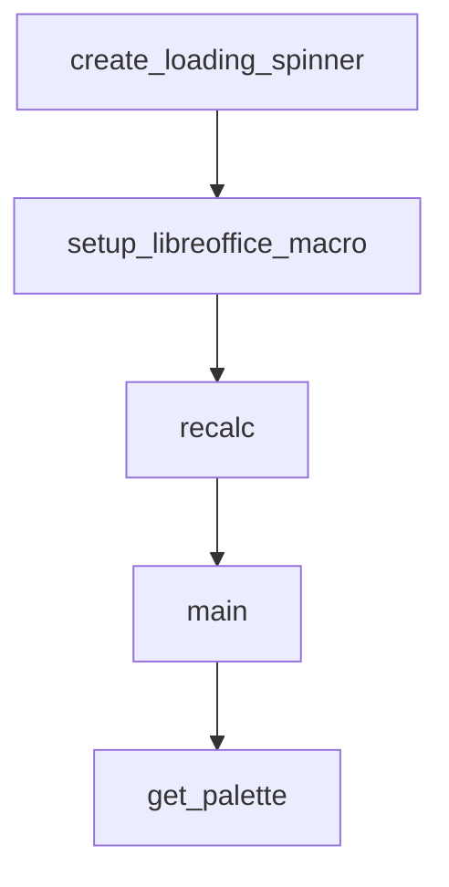

# Chapter 4: Skill Authoring Template and Quality Standards

Welcome to **Chapter 4: Skill Authoring Template and Quality Standards**. In this part of **Awesome Claude Skills Tutorial: High-Signal Skill Discovery and Reuse for Claude Workflows**, you will build an intuitive mental model first, then move into concrete implementation details and practical production tradeoffs.


This chapter explains what separates reusable production skills from prompt fragments.

## Learning Goals

- apply the repository's recommended skill structure
- document usage boundaries and examples clearly
- design skills for composability, not one-off demos
- prepare submissions that pass quality expectations

## Strong Skill Structure

| Component | Purpose |
|:----------|:--------|
| `SKILL.md` | core intent, usage guidance, examples |
| optional scripts/resources | support deterministic execution where needed |
| scoped instructions | explicit when-to-use and when-not-to-use boundaries |

## Source References

- [Contributing: Skill Requirements](https://github.com/ComposioHQ/awesome-claude-skills/blob/master/CONTRIBUTING.md#skill-requirements)
- [Contributing: SKILL.md Template](https://github.com/ComposioHQ/awesome-claude-skills/blob/master/CONTRIBUTING.md#skillmd-template)
- [README: Creating Skills](https://github.com/ComposioHQ/awesome-claude-skills/blob/master/README.md#creating-skills)

## Summary

You now have a rubric for authoring skills with stronger reuse and maintainability.

Next: [Chapter 5: App Automation via Composio Skill Packs](05-app-automation-via-composio-skill-packs.md)

## Source Code Walkthrough

### `slack-gif-creator/templates/spin.py`

The `create_loading_spinner` function in [`slack-gif-creator/templates/spin.py`](https://github.com/ComposioHQ/awesome-claude-skills/blob/HEAD/slack-gif-creator/templates/spin.py) handles a key part of this chapter's functionality:

```py


def create_loading_spinner(
    num_frames: int = 20,
    spinner_type: str = 'dots',  # 'dots', 'arc', 'emoji'
    size: int = 100,
    color: tuple[int, int, int] = (100, 150, 255),
    frame_width: int = 128,
    frame_height: int = 128,
    bg_color: tuple[int, int, int] = (255, 255, 255)
) -> list[Image.Image]:
    """
    Create a loading spinner animation.

    Args:
        num_frames: Number of frames
        spinner_type: Type of spinner
        size: Spinner size
        color: Spinner color
        frame_width: Frame width
        frame_height: Frame height
        bg_color: Background color

    Returns:
        List of frames
    """
    from PIL import ImageDraw
    frames = []
    center = (frame_width // 2, frame_height // 2)

    for i in range(num_frames):
        frame = create_blank_frame(frame_width, frame_height, bg_color)
```

This function is important because it defines how Awesome Claude Skills Tutorial: High-Signal Skill Discovery and Reuse for Claude Workflows implements the patterns covered in this chapter.

### `document-skills/xlsx/recalc.py`

The `setup_libreoffice_macro` function in [`document-skills/xlsx/recalc.py`](https://github.com/ComposioHQ/awesome-claude-skills/blob/HEAD/document-skills/xlsx/recalc.py) handles a key part of this chapter's functionality:

```py


def setup_libreoffice_macro():
    """Setup LibreOffice macro for recalculation if not already configured"""
    if platform.system() == 'Darwin':
        macro_dir = os.path.expanduser('~/Library/Application Support/LibreOffice/4/user/basic/Standard')
    else:
        macro_dir = os.path.expanduser('~/.config/libreoffice/4/user/basic/Standard')
    
    macro_file = os.path.join(macro_dir, 'Module1.xba')
    
    if os.path.exists(macro_file):
        with open(macro_file, 'r') as f:
            if 'RecalculateAndSave' in f.read():
                return True
    
    if not os.path.exists(macro_dir):
        subprocess.run(['soffice', '--headless', '--terminate_after_init'], 
                      capture_output=True, timeout=10)
        os.makedirs(macro_dir, exist_ok=True)
    
    macro_content = '''<?xml version="1.0" encoding="UTF-8"?>
<!DOCTYPE script:module PUBLIC "-//OpenOffice.org//DTD OfficeDocument 1.0//EN" "module.dtd">
<script:module xmlns:script="http://openoffice.org/2000/script" script:name="Module1" script:language="StarBasic">
    Sub RecalculateAndSave()
      ThisComponent.calculateAll()
      ThisComponent.store()
      ThisComponent.close(True)
    End Sub
</script:module>'''
    
    try:
```

This function is important because it defines how Awesome Claude Skills Tutorial: High-Signal Skill Discovery and Reuse for Claude Workflows implements the patterns covered in this chapter.

### `document-skills/xlsx/recalc.py`

The `recalc` function in [`document-skills/xlsx/recalc.py`](https://github.com/ComposioHQ/awesome-claude-skills/blob/HEAD/document-skills/xlsx/recalc.py) handles a key part of this chapter's functionality:

```py

def setup_libreoffice_macro():
    """Setup LibreOffice macro for recalculation if not already configured"""
    if platform.system() == 'Darwin':
        macro_dir = os.path.expanduser('~/Library/Application Support/LibreOffice/4/user/basic/Standard')
    else:
        macro_dir = os.path.expanduser('~/.config/libreoffice/4/user/basic/Standard')
    
    macro_file = os.path.join(macro_dir, 'Module1.xba')
    
    if os.path.exists(macro_file):
        with open(macro_file, 'r') as f:
            if 'RecalculateAndSave' in f.read():
                return True
    
    if not os.path.exists(macro_dir):
        subprocess.run(['soffice', '--headless', '--terminate_after_init'], 
                      capture_output=True, timeout=10)
        os.makedirs(macro_dir, exist_ok=True)
    
    macro_content = '''<?xml version="1.0" encoding="UTF-8"?>
<!DOCTYPE script:module PUBLIC "-//OpenOffice.org//DTD OfficeDocument 1.0//EN" "module.dtd">
<script:module xmlns:script="http://openoffice.org/2000/script" script:name="Module1" script:language="StarBasic">
    Sub RecalculateAndSave()
      ThisComponent.calculateAll()
      ThisComponent.store()
      ThisComponent.close(True)
    End Sub
</script:module>'''
    
    try:
        with open(macro_file, 'w') as f:
```

This function is important because it defines how Awesome Claude Skills Tutorial: High-Signal Skill Discovery and Reuse for Claude Workflows implements the patterns covered in this chapter.

### `document-skills/xlsx/recalc.py`

The `main` function in [`document-skills/xlsx/recalc.py`](https://github.com/ComposioHQ/awesome-claude-skills/blob/HEAD/document-skills/xlsx/recalc.py) handles a key part of this chapter's functionality:

```py


def main():
    if len(sys.argv) < 2:
        print("Usage: python recalc.py <excel_file> [timeout_seconds]")
        print("\nRecalculates all formulas in an Excel file using LibreOffice")
        print("\nReturns JSON with error details:")
        print("  - status: 'success' or 'errors_found'")
        print("  - total_errors: Total number of Excel errors found")
        print("  - total_formulas: Number of formulas in the file")
        print("  - error_summary: Breakdown by error type with locations")
        print("    - #VALUE!, #DIV/0!, #REF!, #NAME?, #NULL!, #NUM!, #N/A")
        sys.exit(1)
    
    filename = sys.argv[1]
    timeout = int(sys.argv[2]) if len(sys.argv) > 2 else 30
    
    result = recalc(filename, timeout)
    print(json.dumps(result, indent=2))


if __name__ == '__main__':
    main()
```

This function is important because it defines how Awesome Claude Skills Tutorial: High-Signal Skill Discovery and Reuse for Claude Workflows implements the patterns covered in this chapter.


## How These Components Connect


