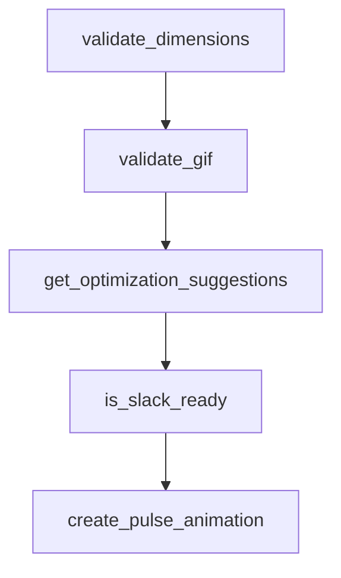

# Chapter 5: App Automation via Composio Skill Packs

Welcome to **Chapter 5: App Automation via Composio Skill Packs**. In this part of **Awesome Claude Skills Tutorial: High-Signal Skill Discovery and Reuse for Claude Workflows**, you will build an intuitive mental model first, then move into concrete implementation details and practical production tradeoffs.


This chapter covers the app-automation side of the ecosystem, where skills connect to operational systems.

## Learning Goals

- understand plugin-based app integration flow
- evaluate automation skills by action safety and reliability
- avoid broad, unsafe tool exposure during early adoption
- choose low-risk app domains for first rollout

## Practical Adoption Pattern

1. start with one non-destructive app domain
2. validate auth/connectivity with sample operations
3. verify logging and reversibility for key actions
4. expand scope only after repeatable success

## Source References

- [README: Quickstart Connect Claude to Apps](https://github.com/ComposioHQ/awesome-claude-skills/blob/master/README.md#quickstart-connect-claude-to-500-apps)
- [Connect Apps Plugin](https://github.com/ComposioHQ/awesome-claude-skills/tree/master/connect-apps-plugin)
- [App Automation Section](https://github.com/ComposioHQ/awesome-claude-skills/blob/master/README.md#app-automation-via-composio)

## Summary

You now have a safer rollout model for app-connected skill automation.

Next: [Chapter 6: Contribution Workflow and Repository Governance](06-contribution-workflow-and-repository-governance.md)

## Source Code Walkthrough

### `slack-gif-creator/core/validators.py`

The `validate_dimensions` function in [`slack-gif-creator/core/validators.py`](https://github.com/ComposioHQ/awesome-claude-skills/blob/HEAD/slack-gif-creator/core/validators.py) handles a key part of this chapter's functionality:

```py


def validate_dimensions(width: int, height: int, is_emoji: bool = True) -> tuple[bool, dict]:
    """
    Check if dimensions are suitable for Slack.

    Args:
        width: Frame width in pixels
        height: Frame height in pixels
        is_emoji: True for emoji GIF, False for message GIF

    Returns:
        Tuple of (passes: bool, info: dict with details)
    """
    info = {
        'width': width,
        'height': height,
        'is_square': width == height,
        'type': 'emoji' if is_emoji else 'message'
    }

    if is_emoji:
        # Emoji GIFs should be 128x128
        optimal = width == height == 128
        acceptable = width == height and 64 <= width <= 128

        info['optimal'] = optimal
        info['acceptable'] = acceptable

        if optimal:
            print(f"✓ {width}x{height} - optimal for emoji")
            passes = True
```

This function is important because it defines how Awesome Claude Skills Tutorial: High-Signal Skill Discovery and Reuse for Claude Workflows implements the patterns covered in this chapter.

### `slack-gif-creator/core/validators.py`

The `validate_gif` function in [`slack-gif-creator/core/validators.py`](https://github.com/ComposioHQ/awesome-claude-skills/blob/HEAD/slack-gif-creator/core/validators.py) handles a key part of this chapter's functionality:

```py


def validate_gif(gif_path: str | Path, is_emoji: bool = True) -> tuple[bool, dict]:
    """
    Run all validations on a GIF file.

    Args:
        gif_path: Path to GIF file
        is_emoji: True for emoji GIF, False for message GIF

    Returns:
        Tuple of (all_pass: bool, results: dict)
    """
    from PIL import Image

    gif_path = Path(gif_path)

    if not gif_path.exists():
        return False, {'error': f'File not found: {gif_path}'}

    print(f"\nValidating {gif_path.name} as {'emoji' if is_emoji else 'message'} GIF:")
    print("=" * 60)

    # Check file size
    size_pass, size_info = check_slack_size(gif_path, is_emoji)

    # Check dimensions
    try:
        with Image.open(gif_path) as img:
            width, height = img.size
            dim_pass, dim_info = validate_dimensions(width, height, is_emoji)

```

This function is important because it defines how Awesome Claude Skills Tutorial: High-Signal Skill Discovery and Reuse for Claude Workflows implements the patterns covered in this chapter.

### `slack-gif-creator/core/validators.py`

The `get_optimization_suggestions` function in [`slack-gif-creator/core/validators.py`](https://github.com/ComposioHQ/awesome-claude-skills/blob/HEAD/slack-gif-creator/core/validators.py) handles a key part of this chapter's functionality:

```py


def get_optimization_suggestions(results: dict) -> list[str]:
    """
    Get suggestions for optimizing a GIF based on validation results.

    Args:
        results: Results dict from validate_gif()

    Returns:
        List of suggestion strings
    """
    suggestions = []

    if not results.get('passes', False):
        size_info = results.get('size', {})
        dim_info = results.get('dimensions', {})

        # Size suggestions
        if not size_info.get('passes', True):
            overage = size_info['size_kb'] - size_info['limit_kb']
            if size_info['type'] == 'emoji':
                suggestions.append(f"Reduce file size by {overage:.1f} KB:")
                suggestions.append("  - Limit to 10-12 frames")
                suggestions.append("  - Use 32-40 colors maximum")
                suggestions.append("  - Remove gradients (solid colors compress better)")
                suggestions.append("  - Simplify design")
            else:
                suggestions.append(f"Reduce file size by {overage:.1f} KB:")
                suggestions.append("  - Reduce frame count or FPS")
                suggestions.append("  - Use fewer colors (128 → 64)")
                suggestions.append("  - Reduce dimensions")
```

This function is important because it defines how Awesome Claude Skills Tutorial: High-Signal Skill Discovery and Reuse for Claude Workflows implements the patterns covered in this chapter.

### `slack-gif-creator/core/validators.py`

The `is_slack_ready` function in [`slack-gif-creator/core/validators.py`](https://github.com/ComposioHQ/awesome-claude-skills/blob/HEAD/slack-gif-creator/core/validators.py) handles a key part of this chapter's functionality:

```py

# Convenience function for quick checks
def is_slack_ready(gif_path: str | Path, is_emoji: bool = True, verbose: bool = True) -> bool:
    """
    Quick check if GIF is ready for Slack.

    Args:
        gif_path: Path to GIF file
        is_emoji: True for emoji GIF, False for message GIF
        verbose: Print detailed feedback

    Returns:
        True if ready, False otherwise
    """
    if verbose:
        passes, results = validate_gif(gif_path, is_emoji)
        if not passes:
            suggestions = get_optimization_suggestions(results)
            if suggestions:
                print("\nSuggestions:")
                for suggestion in suggestions:
                    print(suggestion)
        return passes
    else:
        size_pass, _ = check_slack_size(gif_path, is_emoji)
        return size_pass

```

This function is important because it defines how Awesome Claude Skills Tutorial: High-Signal Skill Discovery and Reuse for Claude Workflows implements the patterns covered in this chapter.


## How These Components Connect


