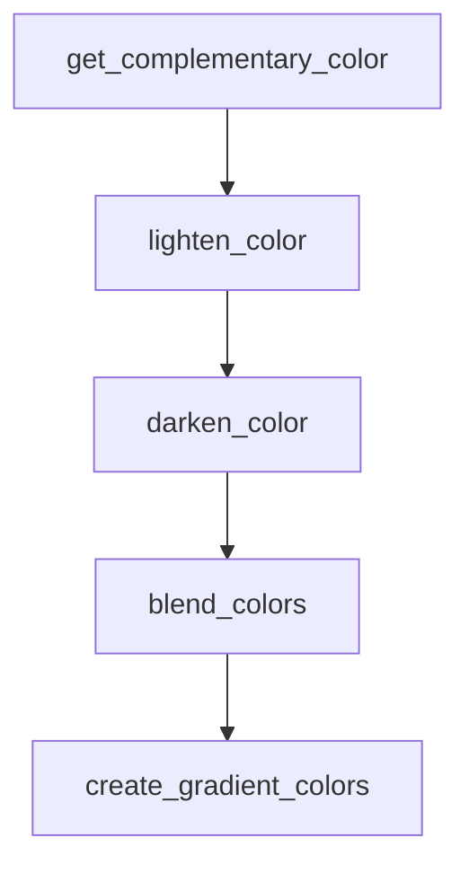

# Chapter 5: App Automation via Composio Skill Packs

Welcome to **Chapter 5: App Automation via Composio Skill Packs**. In this part of **Awesome Claude Skills Tutorial: High-Signal Skill Discovery and Reuse for Claude Workflows**, you will build an intuitive mental model first, then move into concrete implementation details and practical production tradeoffs.


This chapter covers the app-automation side of the ecosystem, where skills connect to operational systems.

## Learning Goals

- understand plugin-based app integration flow
- evaluate automation skills by action safety and reliability
- avoid broad, unsafe tool exposure during early adoption
- choose low-risk app domains for first rollout

## Practical Adoption Pattern

1. start with one non-destructive app domain
2. validate auth/connectivity with sample operations
3. verify logging and reversibility for key actions
4. expand scope only after repeatable success

## Source References

- [README: Quickstart Connect Claude to Apps](https://github.com/ComposioHQ/awesome-claude-skills/blob/master/README.md#quickstart-connect-claude-to-500-apps)
- [Connect Apps Plugin](https://github.com/ComposioHQ/awesome-claude-skills/tree/master/connect-apps-plugin)
- [App Automation Section](https://github.com/ComposioHQ/awesome-claude-skills/blob/master/README.md#app-automation-via-composio)

## Summary

You now have a safer rollout model for app-connected skill automation.

Next: [Chapter 6: Contribution Workflow and Repository Governance](06-contribution-workflow-and-repository-governance.md)

## Depth Expansion Playbook

## Source Code Walkthrough

### `slack-gif-creator/core/color_palettes.py`

The `get_complementary_color` function in [`slack-gif-creator/core/color_palettes.py`](https://github.com/ComposioHQ/awesome-claude-skills/blob/HEAD/slack-gif-creator/core/color_palettes.py) handles a key part of this chapter's functionality:

```py


def get_complementary_color(color: tuple[int, int, int]) -> tuple[int, int, int]:
    """
    Get the complementary (opposite) color on the color wheel.

    Args:
        color: RGB color tuple

    Returns:
        Complementary RGB color
    """
    # Convert to HSV
    r, g, b = [x / 255.0 for x in color]
    h, s, v = colorsys.rgb_to_hsv(r, g, b)

    # Rotate hue by 180 degrees (0.5 in 0-1 scale)
    h_comp = (h + 0.5) % 1.0

    # Convert back to RGB
    r_comp, g_comp, b_comp = colorsys.hsv_to_rgb(h_comp, s, v)
    return (int(r_comp * 255), int(g_comp * 255), int(b_comp * 255))


def lighten_color(color: tuple[int, int, int], amount: float = 0.3) -> tuple[int, int, int]:
    """
    Lighten a color by a given amount.

    Args:
        color: RGB color tuple
        amount: Amount to lighten (0.0-1.0)

```

This function is important because it defines how Awesome Claude Skills Tutorial: High-Signal Skill Discovery and Reuse for Claude Workflows implements the patterns covered in this chapter.

### `slack-gif-creator/core/color_palettes.py`

The `lighten_color` function in [`slack-gif-creator/core/color_palettes.py`](https://github.com/ComposioHQ/awesome-claude-skills/blob/HEAD/slack-gif-creator/core/color_palettes.py) handles a key part of this chapter's functionality:

```py


def lighten_color(color: tuple[int, int, int], amount: float = 0.3) -> tuple[int, int, int]:
    """
    Lighten a color by a given amount.

    Args:
        color: RGB color tuple
        amount: Amount to lighten (0.0-1.0)

    Returns:
        Lightened RGB color
    """
    r, g, b = color
    r = min(255, int(r + (255 - r) * amount))
    g = min(255, int(g + (255 - g) * amount))
    b = min(255, int(b + (255 - b) * amount))
    return (r, g, b)


def darken_color(color: tuple[int, int, int], amount: float = 0.3) -> tuple[int, int, int]:
    """
    Darken a color by a given amount.

    Args:
        color: RGB color tuple
        amount: Amount to darken (0.0-1.0)

    Returns:
        Darkened RGB color
    """
    r, g, b = color
```

This function is important because it defines how Awesome Claude Skills Tutorial: High-Signal Skill Discovery and Reuse for Claude Workflows implements the patterns covered in this chapter.

### `slack-gif-creator/core/color_palettes.py`

The `darken_color` function in [`slack-gif-creator/core/color_palettes.py`](https://github.com/ComposioHQ/awesome-claude-skills/blob/HEAD/slack-gif-creator/core/color_palettes.py) handles a key part of this chapter's functionality:

```py


def darken_color(color: tuple[int, int, int], amount: float = 0.3) -> tuple[int, int, int]:
    """
    Darken a color by a given amount.

    Args:
        color: RGB color tuple
        amount: Amount to darken (0.0-1.0)

    Returns:
        Darkened RGB color
    """
    r, g, b = color
    r = max(0, int(r * (1 - amount)))
    g = max(0, int(g * (1 - amount)))
    b = max(0, int(b * (1 - amount)))
    return (r, g, b)


def blend_colors(color1: tuple[int, int, int], color2: tuple[int, int, int],
                 ratio: float = 0.5) -> tuple[int, int, int]:
    """
    Blend two colors together.

    Args:
        color1: First RGB color
        color2: Second RGB color
        ratio: Blend ratio (0.0 = all color1, 1.0 = all color2)

    Returns:
        Blended RGB color
```

This function is important because it defines how Awesome Claude Skills Tutorial: High-Signal Skill Discovery and Reuse for Claude Workflows implements the patterns covered in this chapter.

### `slack-gif-creator/core/color_palettes.py`

The `blend_colors` function in [`slack-gif-creator/core/color_palettes.py`](https://github.com/ComposioHQ/awesome-claude-skills/blob/HEAD/slack-gif-creator/core/color_palettes.py) handles a key part of this chapter's functionality:

```py


def blend_colors(color1: tuple[int, int, int], color2: tuple[int, int, int],
                 ratio: float = 0.5) -> tuple[int, int, int]:
    """
    Blend two colors together.

    Args:
        color1: First RGB color
        color2: Second RGB color
        ratio: Blend ratio (0.0 = all color1, 1.0 = all color2)

    Returns:
        Blended RGB color
    """
    r1, g1, b1 = color1
    r2, g2, b2 = color2

    r = int(r1 * (1 - ratio) + r2 * ratio)
    g = int(g1 * (1 - ratio) + g2 * ratio)
    b = int(b1 * (1 - ratio) + b2 * ratio)

    return (r, g, b)


def create_gradient_colors(start_color: tuple[int, int, int],
                           end_color: tuple[int, int, int],
                           steps: int) -> list[tuple[int, int, int]]:
    """
    Create a gradient of colors between two colors.

    Args:
```

This function is important because it defines how Awesome Claude Skills Tutorial: High-Signal Skill Discovery and Reuse for Claude Workflows implements the patterns covered in this chapter.


## How These Components Connect


