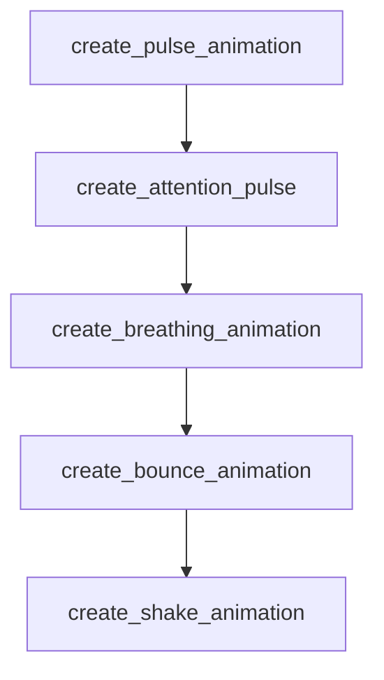

# Chapter 6: Contribution Workflow and Repository Governance

Welcome to **Chapter 6: Contribution Workflow and Repository Governance**. In this part of **Awesome Claude Skills Tutorial: High-Signal Skill Discovery and Reuse for Claude Workflows**, you will build an intuitive mental model first, then move into concrete implementation details and practical production tradeoffs.


This chapter explains how to contribute while preserving list quality.

## Learning Goals

- follow repo expectations for new skill submissions
- prevent duplicate and low-quality entries
- prepare PRs that are easy to review and merge
- align submissions with practical user value

## Contribution Sequence

1. check for duplicate skills first
2. follow required skill structure and template
3. add entry in correct category and order
4. open focused PR with clear usage evidence

## Source References

- [Contributing Guide](https://github.com/ComposioHQ/awesome-claude-skills/blob/master/CONTRIBUTING.md)
- [README: Contributing](https://github.com/ComposioHQ/awesome-claude-skills/blob/master/README.md#contributing)

## Summary

You now understand how to contribute without increasing curation noise.

Next: [Chapter 7: Risk Management and Skill Selection Rubric](07-risk-management-and-skill-selection-rubric.md)

## Depth Expansion Playbook

## Source Code Walkthrough

### `slack-gif-creator/templates/pulse.py`

The `create_pulse_animation` function in [`slack-gif-creator/templates/pulse.py`](https://github.com/ComposioHQ/awesome-claude-skills/blob/HEAD/slack-gif-creator/templates/pulse.py) handles a key part of this chapter's functionality:

```py


def create_pulse_animation(
    object_type: str = 'emoji',
    object_data: dict | None = None,
    num_frames: int = 30,
    pulse_type: str = 'smooth',  # 'smooth', 'heartbeat', 'throb', 'pop'
    scale_range: tuple[float, float] = (0.8, 1.2),
    pulses: float = 2.0,
    center_pos: tuple[int, int] = (240, 240),
    frame_width: int = 480,
    frame_height: int = 480,
    bg_color: tuple[int, int, int] = (255, 255, 255)
) -> list[Image.Image]:
    """
    Create pulsing/scaling animation.

    Args:
        object_type: 'emoji', 'circle', 'text'
        object_data: Object configuration
        num_frames: Number of frames
        pulse_type: Type of pulsing motion
        scale_range: (min_scale, max_scale) tuple
        pulses: Number of pulses in animation
        center_pos: Center position
        frame_width: Frame width
        frame_height: Frame height
        bg_color: Background color

    Returns:
        List of frames
    """
```

This function is important because it defines how Awesome Claude Skills Tutorial: High-Signal Skill Discovery and Reuse for Claude Workflows implements the patterns covered in this chapter.

### `slack-gif-creator/templates/pulse.py`

The `create_attention_pulse` function in [`slack-gif-creator/templates/pulse.py`](https://github.com/ComposioHQ/awesome-claude-skills/blob/HEAD/slack-gif-creator/templates/pulse.py) handles a key part of this chapter's functionality:

```py


def create_attention_pulse(
    emoji: str = '⚠️',
    num_frames: int = 20,
    frame_size: int = 128,
    bg_color: tuple[int, int, int] = (255, 255, 255)
) -> list[Image.Image]:
    """
    Create attention-grabbing pulse (good for emoji GIFs).

    Args:
        emoji: Emoji to pulse
        num_frames: Number of frames
        frame_size: Frame size (square)
        bg_color: Background color

    Returns:
        List of frames optimized for emoji size
    """
    return create_pulse_animation(
        object_type='emoji',
        object_data={'emoji': emoji, 'size': 80, 'shadow': False},
        num_frames=num_frames,
        pulse_type='throb',
        scale_range=(0.85, 1.15),
        pulses=2,
        center_pos=(frame_size // 2, frame_size // 2),
        frame_width=frame_size,
        frame_height=frame_size,
        bg_color=bg_color
    )
```

This function is important because it defines how Awesome Claude Skills Tutorial: High-Signal Skill Discovery and Reuse for Claude Workflows implements the patterns covered in this chapter.

### `slack-gif-creator/templates/pulse.py`

The `create_breathing_animation` function in [`slack-gif-creator/templates/pulse.py`](https://github.com/ComposioHQ/awesome-claude-skills/blob/HEAD/slack-gif-creator/templates/pulse.py) handles a key part of this chapter's functionality:

```py


def create_breathing_animation(
    object_type: str = 'emoji',
    object_data: dict | None = None,
    num_frames: int = 60,
    breaths: float = 2.0,
    scale_range: tuple[float, float] = (0.9, 1.1),
    frame_width: int = 480,
    frame_height: int = 480,
    bg_color: tuple[int, int, int] = (240, 248, 255)
) -> list[Image.Image]:
    """
    Create slow, calming breathing animation (in and out).

    Args:
        object_type: Type of object
        object_data: Object configuration
        num_frames: Number of frames
        breaths: Number of breathing cycles
        scale_range: Min/max scale
        frame_width: Frame width
        frame_height: Frame height
        bg_color: Background color

    Returns:
        List of frames
    """
    if object_data is None:
        object_data = {'emoji': '😌', 'size': 100}

    return create_pulse_animation(
```

This function is important because it defines how Awesome Claude Skills Tutorial: High-Signal Skill Discovery and Reuse for Claude Workflows implements the patterns covered in this chapter.

### `slack-gif-creator/templates/bounce.py`

The `create_bounce_animation` function in [`slack-gif-creator/templates/bounce.py`](https://github.com/ComposioHQ/awesome-claude-skills/blob/HEAD/slack-gif-creator/templates/bounce.py) handles a key part of this chapter's functionality:

```py


def create_bounce_animation(
    object_type: str = 'circle',
    object_data: dict = None,
    num_frames: int = 30,
    bounce_height: int = 150,
    ground_y: int = 350,
    start_x: int = 240,
    frame_width: int = 480,
    frame_height: int = 480,
    bg_color: tuple[int, int, int] = (255, 255, 255)
) -> list:
    """
    Create frames for a bouncing animation.

    Args:
        object_type: 'circle', 'emoji', or 'custom'
        object_data: Data for the object (e.g., {'radius': 30, 'color': (255, 0, 0)})
        num_frames: Number of frames in the animation
        bounce_height: Maximum height of bounce
        ground_y: Y position of ground
        start_x: X position (or starting X if moving horizontally)
        frame_width: Frame width
        frame_height: Frame height
        bg_color: Background color

    Returns:
        List of frames
    """
    frames = []

```

This function is important because it defines how Awesome Claude Skills Tutorial: High-Signal Skill Discovery and Reuse for Claude Workflows implements the patterns covered in this chapter.


## How These Components Connect


