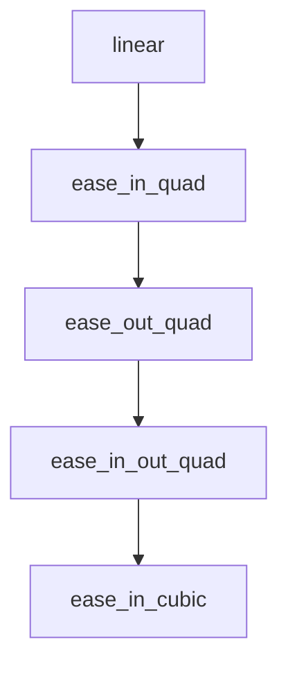

# Chapter 6: Contribution Workflow and Repository Governance

Welcome to **Chapter 6: Contribution Workflow and Repository Governance**. In this part of **Awesome Claude Skills Tutorial: High-Signal Skill Discovery and Reuse for Claude Workflows**, you will build an intuitive mental model first, then move into concrete implementation details and practical production tradeoffs.


This chapter explains how to contribute while preserving list quality.

## Learning Goals

- follow repo expectations for new skill submissions
- prevent duplicate and low-quality entries
- prepare PRs that are easy to review and merge
- align submissions with practical user value

## Contribution Sequence

1. check for duplicate skills first
2. follow required skill structure and template
3. add entry in correct category and order
4. open focused PR with clear usage evidence

## Source References

- [Contributing Guide](https://github.com/ComposioHQ/awesome-claude-skills/blob/master/CONTRIBUTING.md)
- [README: Contributing](https://github.com/ComposioHQ/awesome-claude-skills/blob/master/README.md#contributing)

## Summary

You now understand how to contribute without increasing curation noise.

Next: [Chapter 7: Risk Management and Skill Selection Rubric](07-risk-management-and-skill-selection-rubric.md)

## Source Code Walkthrough

### `slack-gif-creator/core/easing.py`

The `linear` function in [`slack-gif-creator/core/easing.py`](https://github.com/ComposioHQ/awesome-claude-skills/blob/HEAD/slack-gif-creator/core/easing.py) handles a key part of this chapter's functionality:

```py


def linear(t: float) -> float:
    """Linear interpolation (no easing)."""
    return t


def ease_in_quad(t: float) -> float:
    """Quadratic ease-in (slow start, accelerating)."""
    return t * t


def ease_out_quad(t: float) -> float:
    """Quadratic ease-out (fast start, decelerating)."""
    return t * (2 - t)


def ease_in_out_quad(t: float) -> float:
    """Quadratic ease-in-out (slow start and end)."""
    if t < 0.5:
        return 2 * t * t
    return -1 + (4 - 2 * t) * t


def ease_in_cubic(t: float) -> float:
    """Cubic ease-in (slow start)."""
    return t * t * t


def ease_out_cubic(t: float) -> float:
    """Cubic ease-out (fast start)."""
    return (t - 1) * (t - 1) * (t - 1) + 1
```

This function is important because it defines how Awesome Claude Skills Tutorial: High-Signal Skill Discovery and Reuse for Claude Workflows implements the patterns covered in this chapter.

### `slack-gif-creator/core/easing.py`

The `ease_in_quad` function in [`slack-gif-creator/core/easing.py`](https://github.com/ComposioHQ/awesome-claude-skills/blob/HEAD/slack-gif-creator/core/easing.py) handles a key part of this chapter's functionality:

```py


def ease_in_quad(t: float) -> float:
    """Quadratic ease-in (slow start, accelerating)."""
    return t * t


def ease_out_quad(t: float) -> float:
    """Quadratic ease-out (fast start, decelerating)."""
    return t * (2 - t)


def ease_in_out_quad(t: float) -> float:
    """Quadratic ease-in-out (slow start and end)."""
    if t < 0.5:
        return 2 * t * t
    return -1 + (4 - 2 * t) * t


def ease_in_cubic(t: float) -> float:
    """Cubic ease-in (slow start)."""
    return t * t * t


def ease_out_cubic(t: float) -> float:
    """Cubic ease-out (fast start)."""
    return (t - 1) * (t - 1) * (t - 1) + 1


def ease_in_out_cubic(t: float) -> float:
    """Cubic ease-in-out."""
    if t < 0.5:
```

This function is important because it defines how Awesome Claude Skills Tutorial: High-Signal Skill Discovery and Reuse for Claude Workflows implements the patterns covered in this chapter.

### `slack-gif-creator/core/easing.py`

The `ease_out_quad` function in [`slack-gif-creator/core/easing.py`](https://github.com/ComposioHQ/awesome-claude-skills/blob/HEAD/slack-gif-creator/core/easing.py) handles a key part of this chapter's functionality:

```py


def ease_out_quad(t: float) -> float:
    """Quadratic ease-out (fast start, decelerating)."""
    return t * (2 - t)


def ease_in_out_quad(t: float) -> float:
    """Quadratic ease-in-out (slow start and end)."""
    if t < 0.5:
        return 2 * t * t
    return -1 + (4 - 2 * t) * t


def ease_in_cubic(t: float) -> float:
    """Cubic ease-in (slow start)."""
    return t * t * t


def ease_out_cubic(t: float) -> float:
    """Cubic ease-out (fast start)."""
    return (t - 1) * (t - 1) * (t - 1) + 1


def ease_in_out_cubic(t: float) -> float:
    """Cubic ease-in-out."""
    if t < 0.5:
        return 4 * t * t * t
    return (t - 1) * (2 * t - 2) * (2 * t - 2) + 1


def ease_in_bounce(t: float) -> float:
```

This function is important because it defines how Awesome Claude Skills Tutorial: High-Signal Skill Discovery and Reuse for Claude Workflows implements the patterns covered in this chapter.

### `slack-gif-creator/core/easing.py`

The `ease_in_out_quad` function in [`slack-gif-creator/core/easing.py`](https://github.com/ComposioHQ/awesome-claude-skills/blob/HEAD/slack-gif-creator/core/easing.py) handles a key part of this chapter's functionality:

```py


def ease_in_out_quad(t: float) -> float:
    """Quadratic ease-in-out (slow start and end)."""
    if t < 0.5:
        return 2 * t * t
    return -1 + (4 - 2 * t) * t


def ease_in_cubic(t: float) -> float:
    """Cubic ease-in (slow start)."""
    return t * t * t


def ease_out_cubic(t: float) -> float:
    """Cubic ease-out (fast start)."""
    return (t - 1) * (t - 1) * (t - 1) + 1


def ease_in_out_cubic(t: float) -> float:
    """Cubic ease-in-out."""
    if t < 0.5:
        return 4 * t * t * t
    return (t - 1) * (2 * t - 2) * (2 * t - 2) + 1


def ease_in_bounce(t: float) -> float:
    """Bounce ease-in (bouncy start)."""
    return 1 - ease_out_bounce(1 - t)


def ease_out_bounce(t: float) -> float:
```

This function is important because it defines how Awesome Claude Skills Tutorial: High-Signal Skill Discovery and Reuse for Claude Workflows implements the patterns covered in this chapter.


## How These Components Connect


